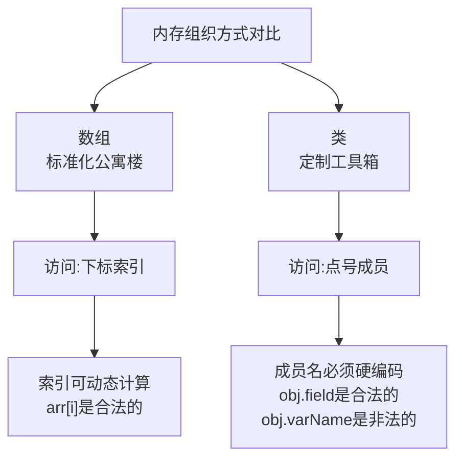

# 数组本质、双向链表与泛型入门

## 一、数组与类的深层对比：两种组织内存的方式

### 1.1 核心类比：公寓楼 vs. 定制工具箱

想象一下计算机的内存是一片空地，数组和类是在这片空地上组织“数据盒子”的两种不同规划方案。

- **数组 (Array)** 就像一栋标准的**公寓楼**。
    
    - **统一规划**：所有房间（元素）大小和结构完全相同。
        
    - **编号访问**：每个房间有一个数字编号（索引，如 `0`, `1`, `2`），你可以通过 `大楼[编号]` 快速找到具体房间。
        
    - **一次性建成**：楼有多少房间，在建造（初始化）时就固定了。
        
    - **示例**：`int[] numbers = {10, 23, 7};` 就像一栋有3个完全相同单间的公寓楼。
        
- **类 (Class)** 就像一套**定制工具箱**。
    
    - **个性定制**：每个格子（成员变量）可以存放不同类型的工具，大小形状各异。
        
    - **标签访问**：每个格子有明确的标签（变量名），如“锤子”、“螺丝刀”。你通过 `工具箱.锤子` 来取用。
        
    - **固定布局**：工具箱设计好有几个格子、叫什么名字后，就固定了。
        
    - **示例**：`Planet` 类可能有 `double mass`（质量）、`String name`（名字）等不同类型的成员。
        

为了更直观地理解这两种组织方式的根本区别，下图展示了它们从访问方式到内在特性的核心差异：



### 1.2 关键差异：动态索引 vs. 静态成员名

这是数组和类一个**极其重要**且容易被忽略的区别，直接影响了它们的用法和灵活性。

**数组索引是“动态”的：**


```java

int[] scores = {90, 85, 88, 92, 78};
int index = 2; // 索引可以在程序运行时计算、从用户输入读取、或从函数返回
System.out.println(scores[index]); // 输出：88
// 甚至可以用循环变量动态访问所有元素
for (int i = 0; i < scores.length; i++) {
    System.out.println(scores[i]); // i 在运行时变化
}
```
**数组的方括号 `[]` 是一个“运算符”**，它要求先计算出括号内索引表达式的值，然后根据这个值去定位元素。这个计算过程发生在**程序运行时**。

**类成员名是“静态”的：**

```java

class Student {
    public String name;
    public int id;
}
Student s = new Student();
s.name = "Alice"; // 正确：直接、明确地使用成员名“name”
```
```java
// ---- 以下是错误想法和代码 ----
String fieldName = "name"; // 假设我们想把成员名存到变量里
s.fieldName = "Bob"; // 编译错误！Java不会把 `fieldName` 当作变量求值
```
**Java编译器在处理点号 `.` 时，不会将其右侧的内容当作一个需要计算的表达式。** 它直接将 `.name` 中的 `"name"` 识别为一个固定的标识符，在编译期就确定其含义。这意味着你**无法**通过字符串变量来动态决定要访问类的哪个成员。

**这种设计差异的根源**在于编译器的工作方式，更深层的内容会在编译原理课程中探讨。现阶段只需牢记：**数组提供了通过运行时计算的数字进行批量、统一访问的能力；而类提供了通过编译时确定的名称进行精确、类型安全访问的能力。**

## 二、从单链表到双链表：解决效率瓶颈

### 2.1 SLList 的遗留问题：缓慢的 `addLast`

上一讲的 `SLList` 虽然通过哨兵节点和 `size` 缓存优化了很多操作，但 `addLast` 方法仍然有一个性能痛点：

```java

public void addLast(int x) {
    IntNode p = sentinel;
    while (p.next != null) { // 必须从头（哨兵）开始，一步步走到最后一个节点
        p = p.next;
    }
    p.next = new IntNode(x, null);
    size++;
}
```
这个方法的时间复杂度是 **O(N)**。如果链表很长，在末尾添加元素会非常慢。SLList 的“单向性”决定了它只能从头到尾单向遍历。

### 2.2 DLList 的救赎：双向链表

为了在链表末尾也能实现快速添加（和删除），我们引入**双向链表**。其核心思想是：每个节点不仅能指向下一个，还能指向前一个。

**IntNode 的升级版：IntDNode**

```java

public class IntDNode {
    public int item;
    public IntDNode prev; // 新增：指向前一个节点的引用
    public IntDNode next; // 指向下一个节点的引用

    public IntDNode(int i, IntDNode p, IntDNode n) {
        item = i;
        prev = p;
        next = n;
    }
}
```
**带哨兵的双向循环链表设计**  
最优雅的双向链表实现是使用一个**哨兵节点**，并让链表**首尾相连**形成一个环。

- **空链表**：只有一个哨兵节点，其 `next` 和 `prev` 都指向自己。
    
- **非空链表**：哨兵的 `next` 指向第一个真实节点，哨兵的 `prev` 指向最后一个真实节点；同时，第一个节点的 `prev` 指向哨兵，最后一个节点的 `next` 也指向哨兵。
    

```java

public class DLList {
    private IntDNode sentinel;
    private int size;

    /** 创建空双向链表 */
    public DLList() {
        sentinel = new IntDNode(0, null, null);
        sentinel.next = sentinel; // 初始化时自己指向自己
        sentinel.prev = sentinel;
        size = 0;
    }

    /** 在链表末尾快速添加元素 O(1) */
    public void addLast(int x) {
        IntDNode lastNode = sentinel.prev; // 通过哨兵直接拿到最后一个节点！
        IntDNode newNode = new IntDNode(x, lastNode, sentinel);
        lastNode.next = newNode;
        sentinel.prev = newNode; // 更新哨兵的前驱指针
        size++;
    }

    /** 在链表头部快速添加元素 O(1) */
    public void addFirst(int x) {
        IntDNode firstNode = sentinel.next; // 通过哨兵直接拿到第一个节点！
        IntDNode newNode = new IntDNode(x, sentinel, firstNode);
        sentinel.next = newNode;
        firstNode.prev = newNode;
        size++;
    }
}
```
**双向链表的威力**：

- `addLast` 和 `addFirst` 时间复杂度都降为 **O(1)**，因为我们通过哨兵可以**直接访问**到首尾节点，无需遍历。
    
- 删除任意已知节点也变得高效（O(1)），因为可以通过该节点的 `prev` 和 `next` 直接调整前后节点的链接。
    
- 可以双向遍历。
    

## 三、迈向通用：泛型链表

到目前为止，我们的链表只能存储 `int` 类型数据。如果想存 `String`、`Planet` 对象呢？我们需要为每种类型重写一个链表类吗？答案是否定的，我们使用**泛型**。

### 3.1 泛型的基本概念

泛型允许我们在定义类或方法时使用一个**类型参数**，这个参数在使用时再指定具体类型。

**将 DLList 改造成泛型类**

```java

// 在类名后声明一个类型参数 T (Type的缩写，可用其他字母)
public class DLList<T> {
    // 将节点类也改为泛型，并嵌套定义。T 会从外部类传递进来。
    private class Node {
        public T item;
        public Node prev;
        public Node next;
        public Node(T i, Node p, Node n) {
            item = i;
            prev = p;
            next = n;
        }
    }

    private Node sentinel;
    private int size;

    public DLList() {
        sentinel = new Node(null, null, null); // item 可以为 null
        sentinel.next = sentinel;
        sentinel.prev = sentinel;
        size = 0;
    }

    public void addLast(T x) { // 参数类型变为 T
        Node lastNode = sentinel.prev;
        Node newNode = new Node(x, lastNode, sentinel);
        lastNode.next = newNode;
        sentinel.prev = newNode;
        size++;
    }

    public T getFirst() { // 返回类型变为 T
        return sentinel.next.item;
    }
}
```
### 3.2 使用泛型链表

```java

// 存储字符串
DLList<String> stringList = new DLList<>();
stringList.addLast("Hello");
stringList.addLast("World");
String firstWord = stringList.getFirst(); // 类型安全，不需要强制转换

// 存储自定义的 Planet 对象
DLList<Planet> planetList = new DLList<>();
planetList.addLast(new Planet(5.97e24, "Earth"));
Planet p = planetList.getFirst();
```
**泛型的优势**：

1. **类型安全**：编译器会进行类型检查。你不能把 `Planet` 对象加入 `DLList<String>`，从而避免了运行时类型转换错误。

2. **代码复用**：只需编写和维护一套链表代码，就可以用于任何数据类型。

3. **清晰明了**：代码明确指出了容器中存储的元素类型。


## 四、知识小结与思维提升

| 核心知识点       | 关键内容与理解                                                                                                     | 初学难点与常见误区                                                                                                 |
| ----------- | ----------------------------------------------------------------------------------------------------------- | --------------------------------------------------------------------------------------------------------- |
| **数组 vs 类** | **数组**：同质、索引访问、索引可动态计算。  <br>**类**：异质、名称访问、成员名必须硬编码。                                                        | 混淆访问方式。试图用变量动态生成类成员名（`obj.varName`），这是语法错误。理解为何数组索引可计算而成员名不能，是理解两者设计哲学差异的关键。                              |
| **双向链表**    | 节点包含前驱(`prev`)和后继(`next`)引用。常与**哨兵节点**结合，形成双向循环结构，使首尾操作均达到 **O(1)**。                                        | 指针修改顺序错误，容易造成链表断裂。建议画图辅助。理解哨兵在双向循环链表中的“连接器”作用：`sentinel.next` 是头，`sentinel.prev` 是尾。                      |
| **泛型编程**    | 使用类型参数（如 `<T>`）创建可操作多种类型的通用数据结构和算法。提高了代码的**复用性**和**类型安全**。                                                  | 不熟悉语法（类名后的`<>`）。混淆**泛型类型参数**与**实际类型参数**。记住：`DLList<T>` 是定义，`DLList<String>` 是使用。泛型只存在于编译期，用于检查，运行时会被“擦除”。 |
| **复杂度优化**   | `SLList` 的 `addLast` 是 O(N) 瓶颈。  <br>`DLList` 通过双向引用 + 哨兵，将 `addLast` 优化为 O(1)。这是典型的**通过改变数据结构来优化算法性能**的案例。 | 不理解为何单向链表尾插是 O(N)。关键在于：单向链表只有从头开始的单向链接，无法直接“跳转”到尾部。                                                       |
| **不变式的维护**  | 在双向链表中，不变式更复杂，例如：“哨兵的 `prev` 总指向最后一个节点”，“最后一个节点的 `next` 总指向哨兵”。每个方法执行后都必须维护这些不变式。                           | 在实现 `addFirst`, `remove` 等方法时，忘记更新所有受影响节点的 `prev` 和 `next` 指针，从而破坏不变式。必须按步骤仔细绘制指针变化图。                     |

**学习建议**：

1. **动手实现**：务必亲手实现一遍 `DLList` 的基本操作（`addFirst`, `addLast`, `removeLast`），在纸上画出每次操作前后指针的变化。
    
2. **理解权衡**：思考双向链表用更多的内存（每个节点多一个 `prev` 指针）换取了更快的尾插操作，这是一种典型的时空权衡。
    
3. **泛型实践**：尝试将之前学过的 `SLList` 也改写成泛型版本，加深对泛型语法和作用的理解。
    
4. **对比思考**：将数组、`SLList`、`DLList` 在内存布局、访问方式、各种操作复杂度上进行系统对比，理解“没有完美的数据结构，只有最适合场景的数据结构”。