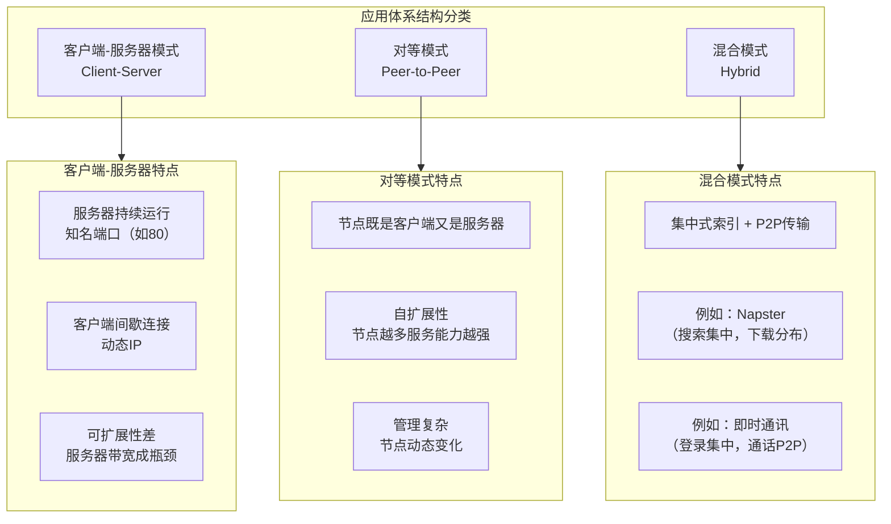
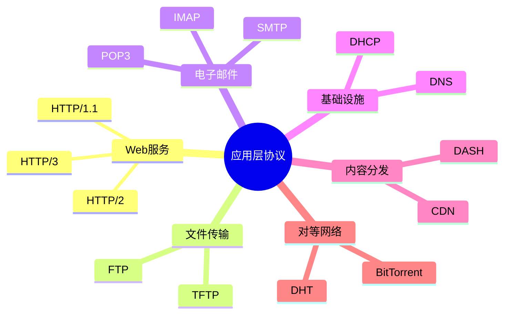
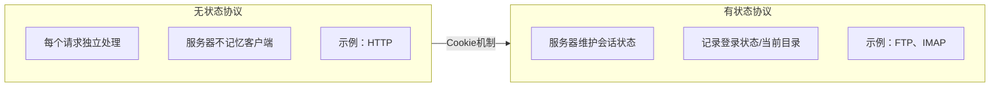
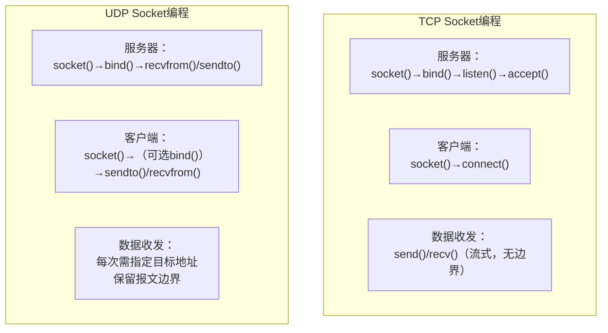

# 第2章 小结 —— 应用层核心概念回顾

---

## 一、应用程序体系结构

网络应用主要采用三种体系结构，各有其特点和适用场景。

| 体系结构        | 代表应用                | 核心特点                 | 优缺点                           |
| ----------- | ------------------- | -------------------- | ----------------------------- |
| **客户端-服务器** | Web、FTP、Email       | 服务器固定IP+知名端口，客户端主动请求 | ✅ 易于管理  <br>❌ 可扩展性差，单点故障      |
| **P2P**     | BitTorrent、迅雷、Skype | 节点对等，自扩展             | ✅ 可扩展性好，抗毁性强  <br>❌ 管理困难，安全挑战 |
| **混合模式**    | Napster、微信、QQ       | 集中索引 + P2P传输         | ✅ 结合两者优势  <br>❌ 仍存在部分集中点      |

---

## 二、应用层对传输层的服务需求

应用层必须依赖传输层提供的服务，不同的应用对服务质量有不同要求。

### 1. 服务质量四维指标

| 指标      | 含义           | 高要求应用          | 低要求应用     |
| ------- | ------------ | -------------- | --------- |
| **可靠性** | 数据是否100%正确送达 | 文件传输、邮件、电子交易   | 实时音视频、直播  |
| **延迟**  | 端到端传输时间      | 在线游戏、VoIP、远程控制 | 邮件、文件下载   |
| **带宽**  | 单位时间传输数据量    | 视频会议、高清直播      | 网页浏览、即时消息 |
| **安全性** | 加密、认证、完整性    | 支付、网银、登录       | 公开信息浏览    |

### 2. 传输层提供的服务模型

| 服务模型        | 代表协议    | 核心特性              | 适用场景              |
| ----------- | ------- | ----------------- | ----------------- |
| **面向连接、可靠** | **TCP** | 可靠传输、流量控制、拥塞控制、保序 | HTTP、FTP、SMTP、SSH |
| **无连接、不可靠** | **UDP** | 尽力而为、无连接、低延迟      | DNS、DHCP、RTP、在线游戏 |

**选择依据**：

- **TCP**：当数据完整性高于实时性时（如文件下载、网页浏览）
    
- **UDP**：当实时性高于完整性时（如视频通话、在线游戏），或单次事务场景（如DNS查询）
    

---

## 三、应用层核心协议概览

### 1. 协议分类


### 2. 关键协议速查表

| 协议       | 全称        | 传输层            | 端口     | 核心功能    | 特点              |
| -------- | --------- | -------------- | ------ | ------- | --------------- |
| **HTTP** | 超文本传输协议   | TCP            | 80/443 | Web页面传输 | 无状态，C/S模式       |
| **FTP**  | 文件传输协议    | TCP            | 21/20  | 文件上传下载  | **双连接**（控制+数据）  |
| **SMTP** | 简单邮件传输协议  | TCP            | 25     | 邮件发送    | **推协议**，ASCII命令 |
| **POP3** | 邮局协议v3    | TCP            | 110    | 邮件接收    | **下载并删除/保留**    |
| **IMAP** | 互联网邮件访问协议 | TCP            | 143    | 邮件管理    | **有状态**，远程文件夹   |
| **DNS**  | 域名系统      | **UDP**（主）/TCP | 53     | 域名→IP   | 层次化、分布式数据库      |
| **DHCP** | 动态主机配置协议  | UDP            | 67/68  | 自动分配IP  | 事务型，广播通信        |
| **RTP**  | 实时传输协议    | UDP            | 动态     | 音视频传输   | 配合RTCP使用        |

---

## 四、报文结构与传输方式

### 1. 报文分类

|分类维度|类型|描述|示例|
|---|---|---|---|
|**功能**|请求报文|客户端向服务器发起请求|HTTP请求行|
||响应报文|服务器返回处理结果|HTTP状态行|
|**内容**|控制报文|携带控制信息（命令、参数）|FTP的`USER`/`PASS`|
||数据报文|携带实际数据|文件内容、视频流|

### 2. 报文通用结构

```text

+------------------+
|      首部        | 元数据（协议类型、地址、长度、时间戳等）
+------------------+
|      空行        | 分隔首部与数据（如HTTP）
+------------------+
|      数据        | 实际传输的内容
+------------------+
```
### 3. 信令传输方式

|方式|定义|特点|代表协议|
|---|---|---|---|
|**带内信令**|控制信息与数据在同一连接中传输|简单，无需额外连接|HTTP、SMTP|
|**带外信令**|控制信息与数据通过不同连接传输|控制与数据分离，可并行处理|**FTP**（21控制 + 20数据）|

---

## 五、状态管理：有状态 vs 无状态

### 1. 核心区别


### 2. 对比分析

|对比维度|无状态（Stateless）|有状态（Stateful）|
|---|---|---|
|**服务器设计**|简单，无需维护会话|复杂，需管理会话数据|
|**可扩展性**|高（请求可分发到任意服务器）|低（需会话粘滞）|
|**资源消耗**|低|高（内存/存储开销）|
|**容错性**|高（服务器故障不影响其他请求）|低（会话信息丢失）|
|**典型协议**|HTTP、DNS|FTP、IMAP、TCP本身|

**补丁机制**：无状态协议可通过额外机制添加状态，如HTTP的**Cookie**、URL重写。

---

## 六、Socket编程对比

### 1. TCP vs UDP 套接字编程


### 2. 关键差异速查表

|维度|TCP Socket|UDP Socket|
|---|---|---|
|**套接字类型**|`SOCK_STREAM`|`SOCK_DGRAM`|
|**连接建立**|需`connect()`/`accept()`，三次握手|**无连接**，直接发数据|
|**地址绑定**|服务器必须`bind()`，客户端可选|服务器必须`bind()`，客户端可选|
|**数据边界**|**无边界**（字节流，可能粘包）|**有边界**（一个报文一次读取）|
|**收发函数**|`send()`/`recv()`（无需指定对方）|`sendto()`/`recvfrom()`（需指定/获取对方地址）|
|**并发处理**|需多线程/多进程处理多个客户端|单套接字可服务所有客户端|
|**可靠性**|由内核保证|应用层自行处理|

---

## 七、网络边缘的复杂性处理

### 1. 端到端原则

- **核心思想**：将复杂功能推到网络边缘（端系统），保持网络核心简单。
    
- **体现**：
    
    - TCP的可靠传输、拥塞控制在端系统实现。
        
    - 应用层协议（HTTP、FTP等）在端系统定义。
        
    - CDN在边缘节点缓存内容。
        

### 2. 应用层的“智能”

- **内容感知**：HTTP理解请求的资源类型。
    
- **动态适应**：DASH根据带宽调整视频码率。
    
- **安全增强**：SSL/TLS在应用层提供加密。
    
- **服务发现**：DNS将域名解析为IP。
    

---

## 八、综合知识小结

|知识点|核心内容|考试重点/易混淆点|难度|
|---|---|---|---|
|**应用体系结构**|C/S、P2P、混合模式|三种模式的特点及典型应用|★★★|
|**服务质量指标**|可靠性、延迟、带宽、安全性|不同应用对四维指标的侧重|★★★|
|**TCP vs UDP**|可靠连接 vs 不可靠无连接|**本质区别**：连接、可靠、边界|★★★★|
|**核心协议**|HTTP、FTP、SMTP、POP3、IMAP、DNS|各协议的**端口、传输层、核心功能**|★★★★|
|**报文结构**|首部 + 数据；请求/响应|控制报文与数据报文的区分|★★★|
|**信令方式**|带内信令（HTTP） vs 带外信令（FTP）|FTP双连接的原理|★★★★|
|**状态管理**|无状态（HTTP） vs 有状态（FTP）|Cookie如何为HTTP添加状态|★★★★|
|**Socket编程**|TCP流式 vs UDP数据报|`SOCK_STREAM`与`SOCK_DGRAM`的API差异|★★★★★|
|**网络边缘复杂性**|端到端原则，智能在边缘|理解“核心简单，边缘智能”的设计哲学|★★★|

---

## 九、学习路径展望

完成第2章后，你应当能够：

1. **设计**：根据应用需求选择合适的体系结构（C/S、P2P、混合）。
    
2. **选择**：在TCP和UDP之间做出合理决策。
    
3. **分析**：理解主流应用层协议（HTTP、FTP、Email、DNS）的工作机制。
    
4. **实现**：使用Socket API编写基础的TCP/UDP网络程序。
    
5. **优化**：理解缓存、CDN等加速技术的原理。
    

**下一步**：第3章将深入**传输层**，探索TCP如何实现可靠传输、流量控制、拥塞控制，以及UDP如何在简洁中保持高效。这将为你揭开“端到端通信”的神秘面纱。