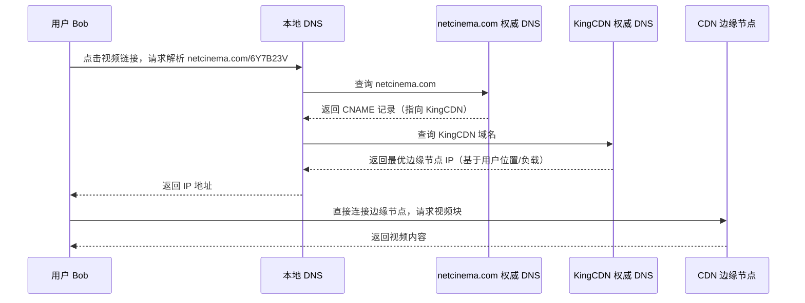
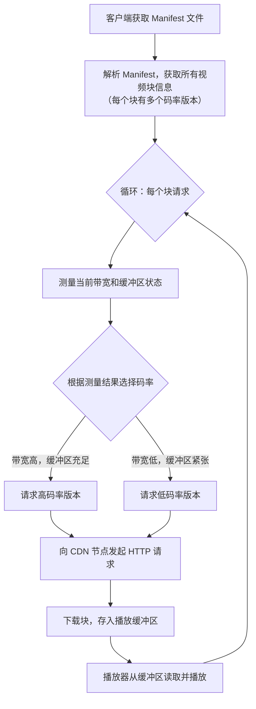

# 2.7 内容分发网络 —— CDN

---
## 1. CDN DNS 重定向流程

**流程说明**：

1. 用户点击视频链接，本地 DNS 向内容提供商的权威 DNS 查询。
    
2. 权威 DNS 返回一个 **CNAME**（别名），指向 CDN 运营商的域名。
    
3. 本地 DNS 继续向 CDN 的权威 DNS 查询。
    
4. CDN 的权威 DNS 根据用户 IP 地理位置、节点负载、网络状况，返回**最优的边缘节点 IP**。
    
5. 用户直接与该边缘节点建立连接，获取视频内容。

## 2. DASH 客户端自适应流程


**流程说明**：

1. 客户端首先下载 Manifest 文件（如 .mpd 或 .m3u8）。
    
2. 解析得到每个视频块的 URL 列表（同一块有不同码率的版本）。
    
3. 针对每一个要请求的块：
    
    - 测量当前可用带宽和播放缓冲区填充情况。
        
    - 决策：带宽高且缓冲区充裕时选择高码率，否则降级。
        
    - 向 CDN 节点发送 HTTP GET 请求获取该块。
        
4. 下载的块存入播放缓冲区，播放器持续从缓冲区取出解码播放。
    
5. 循环进行下一个块的请求，实现码率动态自适应。
## 一、视频：驱动 CDN 的“杀手级应用”

### 1. 视频的本质与数字化

- **视觉暂留效应**：视频由一系列图像以固定速率（如 24 帧/秒、60 帧/秒）连续显示，利用人眼视觉暂留（约几十毫秒）产生运动感知。
    
- **数字化表示**：每帧图像由像素阵列构成，每个像素用若干比特表示颜色。例如，可通过“颜色值 + 重复次数”的行程编码压缩大面积同色区域。
    
- **压缩的必要性**：原始未压缩视频带宽需求极高（例如 1080p@60fps 约需 3 Gbps），而视频已占互联网流量的 **70%~80%**，必须通过编码大幅降低传输量。
    

### 2. 视频压缩原理

|冗余类型|原理|示例|
|---|---|---|
|**空间冗余**|单帧内相邻像素相似|蓝天背景只需记录“蓝色 + 区域范围”|
|**时间冗余**|相邻帧间内容相似|静态背景只需传输变化部分（如运动物体）|

**典型压缩率**：从原始 3 Gbps 压缩至 10 Mbps 以下，压缩比超过 90%。

### 3. 编码标准与码率控制

- **MPEG 系列**：
    
    - MPEG-1：CD-ROM 质量，约 1.5 Mbps
        
    - MPEG-2：DVD 质量，3~6 Mbps
        
    - MPEG-4：网络视频，< 1 Mbps
        
- **中国 AVS 标准**：由高文院士团队主导，广泛应用于国内数字电视和网络视频。
    
- **可伸缩编码**：科大李卫平教授团队的核心贡献，支持根据终端能力（手机/PC/电视）动态调整分辨率/帧率。
    

**码率控制模式**：

|模式|特点|适用场景|
|---|---|---|
|**CBR**（恒定码率）|码率固定，输出平稳|CD-ROM、早期流媒体|
|**VBR**（可变码率）|静态场景低码率（<100 kbps），动态场景高码率（>5 Mbps）|网络视频，带宽自适应|

---

## 二、流媒体技术：从“下载后播放”到“边下边播”

### 1. 传统方式：Download-and-Play

- 必须完整下载文件后才能开始播放。
    
- 缺点：等待时间长（例如数 GB 文件需数小时），用户体验差。
    

### 2. 流式传输：Streaming

- **边下载边播放**，缓冲数秒即可开始。
    
- 关键机制：客户端维护播放缓冲区，避免“饥饿”（缓冲耗尽导致卡顿）或“溢出”（浪费带宽）。
    

### 3. DASH —— 动态自适应流化

**DASH（Dynamic Adaptive Streaming over HTTP）** 已成为现代流媒体的主流标准。

**工作原理**：

1. **服务器端准备**：
    
    - 将视频切分为 **8~10 秒** 的独立块（chunk）。
        
    - 每个块编码为 **多种码率版本**（如 240p、480p、720p、1080p）。
        
    - 生成 **Manifest 文件**（如 .mpd 或 .m3u8），记录所有块的 URL、时长、分辨率、码率等信息。
        
2. **客户端决策**：
    
    - 下载 Manifest 文件，解析内容分布。
        
    - 持续测量当前带宽和缓冲区状态。
        
    - **动态选择**最适合当前网络条件的块版本（带宽高时选高码率，变差时自动降级）。
        
    - 可同时向多个服务器请求不同块，实现并行下载。
        

**DASH 的优势**：

- **网络自适应**：应对带宽波动，避免卡顿。
    
- **多服务器协同**：块可分布在不同的 CDN 节点，提升并发能力。
    
- **客户端智能**：可根据屏幕尺寸、电池状态等个性化选择。
    

---

## 三、单一服务器的局限：为什么需要 CDN？

假设所有用户都直接从单一源服务器获取视频，将面临以下问题：

|问题|描述|后果|
|---|---|---|
|**路径跳数多**|客户端到服务器经过大量路由器，累积延迟大|播放启动慢，易卡顿|
|**瓶颈链路**|某段链路带宽有限，成为吞吐量瓶颈|视频码率被迫降低|
|**流量冗余**|“二八定律”导致热门内容（如《纸牌屋》）被重复传输|浪费骨干网带宽|
|**单点故障**|服务器宕机或接入网拥塞，服务中断|可靠性差|
|**周边拥塞**|服务器所在网络出口易过载|影响同一区域所有用户|

**根本矛盾**：服务器能力有限，而用户规模巨大且分布全球。

---

## 四、CDN 核心思想：让内容靠近用户

### 1. 什么是 CDN？

**内容分发网络**（Content Distribution Network）通过在网络边缘部署大量缓存服务器，将内容预先分发到离用户最近的位置，由这些节点直接为用户提供服务。

**参与角色**：

- **ICP**（内容提供商）：如 Netflix、CCTV、百度，提供原始内容。
    
- **CDN 运营商**：如 Akamai、ChinaCache（蓝汛）、Cloudflare，建设并维护分布式缓存节点。
    
- **最终用户**：从最近的 CDN 节点获取内容，获得低延迟、高吞吐体验。
    

### 2. CDN 的两种部署策略

|策略|方法|优点|缺点|代表厂商|
|---|---|---|---|---|
|**Enter Deep**|将服务器深入部署到大量接入网（ISP 局端），如在全球 1700+ 位置建节点|**跳数最少，延迟最低**|节点数量巨大，运维成本高|Akamai|
|**Bring Home**|在少数关键位置（如 ISP 核心 POP 点）部署大型集群，节点间用专线互联|**节点少，成本低**|用户访问跳数相对较多|Limelight|

现代 CDN 通常混合使用两种策略，在成本和性能间取得平衡。

---

## 五、CDN 工作原理：以视频点播为例

### 1. 内容预部署

ICP 将热门内容（如 Netflix 的《纸牌屋》）通过专线或互联网推送到 CDN 的各个边缘节点。内容以 **分块 + 多版本** 形式存储。

### 2. 用户请求流程（DNS 重定向）


```text

[用户 Bob] 点击视频链接 → http://netcinema.com/6Y7B23V
   ↓
本地 DNS 解析 netcinema.com
   ↓（迭代查询）
netcinema.com 的权威 DNS 服务器
   ↓（返回 CNAME 或 NS 记录）
指向 CDN 运营商（如 KingCDN）的域名
   ↓
CDN 的权威 DNS 服务器
   ↓（根据用户 IP 地理位置、节点负载等）
返回最优边缘节点 IP（如 203.0.113.10）
   ↓
Bob 直接连接该 IP，请求视频块
   ↓
边缘节点返回内容，Bob 开始播放
```
**关键点**：

- **透明性**：整个过程对用户完全透明，浏览器无需任何修改。
    
- **动态调度**：CDN 的 DNS 服务器可根据实时网络状况、节点负载、用户位置，返回最佳节点 IP。
    
- **DASH 集成**：客户端获取 Manifest 文件后，可直接从该节点请求各视频块，也可在节点故障时切换到备用节点。
    

### 3. CDN 节点选择策略

CDN 调度系统需综合考虑：

- **地理位置**：RTT 最短（通常以本地 DNS 的 IP 作为用户位置的近似）。
    
- **节点负载**：避免将流量集中到过载节点。
    
- **网络健康状况**：避开拥塞或故障链路。
    
- **内容热度**：热门内容可能被推送到更多节点。
    

---

## 六、CDN 面临的挑战

| 挑战         | 描述                     | 解决方案                             |
| ---------- | ---------------------- | -------------------------------- |
| **节点选择算法** | 如何为每个用户快速、准确地选择最优节点    | 基于 DNS 的全局负载均衡 + 实时监控数据 + 机器学习预测 |
| **拥塞切换**   | 当前服务节点突然变慢，如何无缝切换到备用节点 | 客户端主动测量，或 CDN 通过 HTTP 重定向引导      |
| **内容部署策略** | 决定哪些内容应被推送到哪些节点，何时推送   | 基于历史访问模式、热点预测的运筹优化算法             |
| **成本控制**   | 节点数量、带宽租赁、内容推送均产生巨大成本  | 混合部署策略 + 流量调度优化 + 与 ISP 合作对等互联   |

---

## 七、经典案例：Netflix 的 CDN 架构

Netflix 作为全球最大的流媒体服务商之一，其 CDN 架构极具代表性。

### 1. 总体架构

```text

[用户] → [CDN 边缘节点] ← [Netflix 的 Open Connect 设备] ← [AWS 云]
```
- **AWS 云**：托管所有核心业务，包括：
    
    - 视频制作与编码
        
    - Web 服务前端
        
    - 内容存储（原始多版本视频）
        
- **Open Connect**：Netflix 自建的 CDN 设备，部署在全球 ISP 机房，缓存热门内容。
    
- **第三方 CDN**：补充覆盖，如 Akamai、Limelight，用于长尾内容或突发流量。
    

### 2. 工作流程

1. 用户登录 Netflix，认证请求由 AWS 上的认证服务器处理（**独立于 CDN**）。
    
2. 认证通过后，用户浏览网页，获取视频的 Manifest 文件（来自 AWS）。
    
3. 客户端解析 Manifest，其中包含指向不同 CDN 节点的 URL。
    
4. 客户端根据自身网络状况，通过 DNS 解析选择**最优的 Open Connect 节点**（或第三方 CDN）。
    
5. 采用 DASH 协议动态请求视频块，实现自适应码率播放。
    

### 3. 技术创新点

- **成本控制**：通过自建 Open Connect 大幅降低对商业 CDN 的依赖，与 ISP 建立对等互联，节省带宽费用。
    
- **智能调度**：客户端可同时从多个 CDN 获取不同块，实现带宽聚合和故障容灾。
    
- **大数据驱动**：分析用户观看行为，预测热点内容，提前推送到边缘节点。
    

---

## 八、CDN 与互联网架构的启示

- **应用层智能**：CDN 是“端到端原则”的典范——网络核心保持简单（IP 尽力而为），复杂功能（内容加速、负载均衡）在应用层实现。
    
- **边缘计算**：CDN 节点不仅是缓存，还可执行转码、加密、日志分析等任务，成为边缘计算的雏形。
    
- **互联网的“分层”再思考**：虽然 CDN 工作在应用层，但它深刻影响了网络层路由决策（通过 Anycast、BGP 策略），体现了现代网络“层间渗透”的趋势。
    

---

## 九、知识小结

|知识点|核心内容|考试重点/易混淆点|难度|
|---|---|---|---|
|**CDN 概念**|内容分发网络，通过分布式缓存节点加速内容传输|与 P2P 的区别：CDN 是商业托管，P2P 是用户自组织|★★★|
|**视频编码基础**|空间冗余 + 时间冗余；CBR vs VBR|典型压缩率 > 90%；可伸缩编码适应异构终端|★★★★★|
|**DASH 协议**|视频分块（8-10s） + 多版本编码 + 客户端自适应|Manifest 文件的作用；与普通 HTTP 流媒体的区别|★★★★★|
|**流化技术**|边下边播，缓冲区管理|Download-and-Play 与 Streaming 的等待时间对比|★★★|
|**CDN 工作原理**|内容预部署 → DNS 重定向 → 客户端从最近节点获取|权威 DNS 返回 CNAME 指向 CDN 域名是关键步骤|★★★★|
|**部署策略**|Enter Deep（深入本地） vs Bring Home（关键节点）|成本与延迟的权衡；Akamai vs Limelight 对比|★★★★|
|**节点选择算法**|基于用户位置、节点负载、网络状况的动态调度|全局负载均衡（GSLB）的实现方式|★★★★★|
|**实际案例**|Netflix（AWS + OpenConnect + 第三方 CDN）、央视春晚（ChinaCache）|CDN 在超大规模并发下的价值|★★★★|
|**技术挑战**|内容部署策略、拥塞切换、成本优化|涉及运筹学和机器学习的优化问题|★★★★★|

---

> **📘 本章心法**：
> 
> 1. **视频是“杀手级应用”**：理解视频编码是理解 CDN 为何重要的基础。
>     
> 2. **DASH 是流媒体的“操作系统”**：它把控制权交给了客户端，实现了真正的网络自适应。
>     
> 3. **CDN 是“地理级负载均衡”**：它的核心不是“加速”，而是“缩短距离”——把内容放到离用户最近的地方。
>     
> 
> 当你流畅观看 4K 视频时，请记住：这背后是 CDN 成千上万节点的协同，是 DNS 毫秒级的智能调度，是 DASH 协议对网络波动的优雅适应。互联网的“平滑”体验，正是这些“看不见的技术”堆叠而成的奇迹。