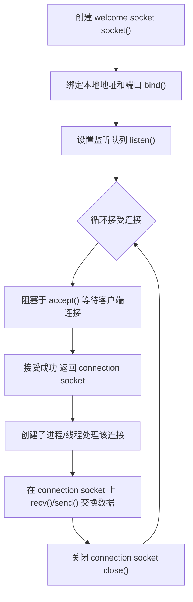
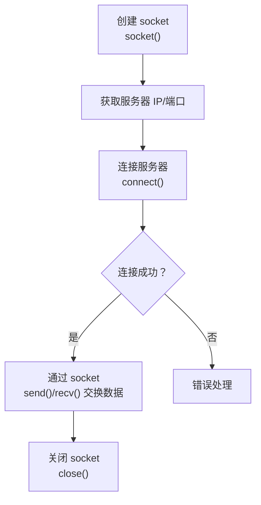
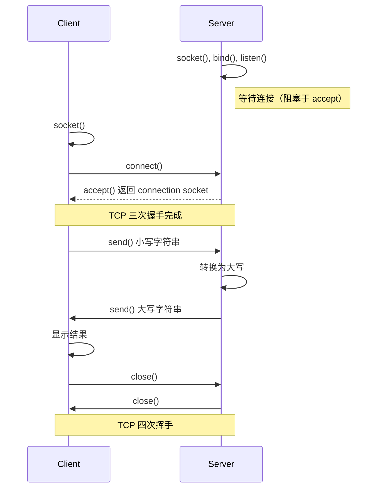

# 2.8 TCP 套接字编程 —— 应用层与传输层的桥梁

---

## 一、套接字编程概述

**套接字（Socket）** 是应用层与传输层之间的**抽象接口**，它像一个“门户”，应用进程通过它向内核协议栈发送或接收数据。在 TCP/IP 体系中，套接字是网络编程的基础。

---

## 二、TCP 套接字基础

### 1. 什么是 TCP 套接字？

- **本质**：一个整数（描述符），类似于文件句柄，代表进程与内核中 TCP 协议实体之间的约定关系。
    
- **唯一标识**：每个 TCP 连接由 **四元组** 唯一确定：
    
    text
    
    （本地 IP， 本地端口， 对方 IP， 对方端口）
    
- **流式特性**：
    
    - 提供 **可靠的字节流** 服务，不维护报文边界。
        
    - 例如，两次 15KB 的 `send()` 可能被合并为 30KB 的块由 `recv()` 一次读出。
        

### 2. TCP 套接字类型

|套接字类型|作用|产生方式|生命周期|
|---|---|---|---|
|**欢迎套接字**（Welcome Socket）|监听连接请求，不用于数据传输|`socket()` → `bind()` → `listen()`|服务器整个运行期间一直存在|
|**连接套接字**（Connection Socket）|与特定客户端进行数据传输|`accept()` 返回|对应客户端会话期间存在，会话结束关闭|

---

## 三、TCP 套接字编程模型

### 1. 服务器端流程


**关键步骤**：

- `socket()`：创建一个 TCP 套接字（指定 `SOCK_STREAM`）。
    
- `bind()`：将套接字与服务器的 IP 地址和端口号绑定。若不绑定，系统自动分配临时端口（服务器通常需要知名端口）。
    
- `listen()`：将套接字转为被动监听模式，参数指定已完成队列的最大长度（如 10）。
    
- `accept()`：从已完成连接队列中取出一个连接，返回一个新的 **连接套接字**。此后的数据收发都通过该连接套接字。
    
- 数据交换：使用 `read()` / `write()` 或 `recv()` / `send()`。
    
- `close()`：关闭连接套接字（释放资源）；欢迎套接字通常继续存在。
    

> 💡 **注意**：`accept()` 是 **阻塞** 的，若无连接请求，进程会挂起等待。

---

### 2. 客户端流程


**关键步骤**：

- `socket()`：创建一个 TCP 套接字。
    
- 获取服务器地址：通常通过域名解析（`gethostbyname()`）获得 IP，端口由用户指定。
    
- `connect()`：向服务器发起连接请求，触发 TCP 三次握手。此函数也是阻塞的，直到连接建立成功或超时失败。
    
- 数据交换：使用 `send()` / `recv()` 进行通信。
    
- `close()`：关闭套接字，发起 TCP 四次挥手。
    

> 💡 客户端一般不需要 `bind()`，系统会自动分配临时端口。

---

### 3. 典型交互时序（以“大小写转换”服务为例）


---

## 四、关键数据结构

### 1. `struct sockaddr_in` —— IPv4 地址结构

```c

struct sockaddr_in {
    sa_family_t    sin_family;   // 地址族，AF_INET（IPv4）
    in_port_t      sin_port;     // 端口号（16位，网络字节序）
    struct in_addr sin_addr;     // IPv4 地址（32位）
    char           sin_zero[8];  // 填充字段，使与 sockaddr 大小一致
};
```
**用途**：存储 IP 地址和端口号的捆绑信息，在 `bind()`、`connect()` 等函数中传递。

**关键点**：

- `sin_port` 和 `sin_addr` 必须使用 **网络字节序**（大端）。
    
- `sin_zero` 仅用于对齐，必须全部置零（通常用 `memset` 清零）。
    
- 使用时需强制转换为 `struct sockaddr *`。
    

---

### 2. `struct hostent` —— 主机信息结构

```c

struct hostent {
    char  *h_name;            // 主机的规范名
    char **h_aliases;         // 别名列表（字符串数组）
    int    h_addrtype;        // 地址类型，AF_INET
    int    h_length;          // 地址长度，IPv4 为 4
    char **h_addr_list;       // IP 地址列表（网络字节序）
};
```
**用途**：`gethostbyname()` 等域名解析函数的返回值，存储解析出的 IP 地址等信息。

**使用示例**：

```c

struct hostent *p = gethostbyname("www.example.com");
if (p != NULL) {
    memcpy(&sad.sin_addr, p->h_addr, p->h_length);
}
```
---

## 五、网络字节序转换

不同主机可能采用 **大端**（Big-Endian）或 **小端**（Little-Endian）字节序，为保证网络传输一致性，规定使用 **大端字节序**（网络字节序）。

|函数|作用|
|---|---|
|`htons()`|将 16 位整数从 **主机字节序** 转换为 **网络字节序**（host to network short）|
|`htonl()`|将 32 位整数从主机字节序转换为网络字节序|
|`ntohs()`|将 16 位整数从网络字节序转换为主机字节序|
|`ntohl()`|将 32 位整数从网络字节序转换为主机字节序|

**必须使用场景**：

- 向 `sin_port` 赋值时（如 `sad.sin_port = htons(8080);`）
    
- 从 `sin_addr` 读取 IP 地址时（通常解析函数已返回网络字节序，不需转换）
    

---

## 六、代码示例解析

### 1. TCP 客户端示例（简化）

```c

#include <stdio.h>
#include <stdlib.h>
#include <string.h>
#include <unistd.h>
#include <sys/socket.h>
#include <netinet/in.h>
#include <netdb.h>
int main(int argc, char *argv[]) {
    int clientSocket;
    struct sockaddr_in serverAddr;
    struct hostent *server;
    char sentence[128], modifiedSentence[128];
    if (argc != 3) {
        fprintf(stderr, "用法: %s <服务器域名> <端口号>\n", argv[0]);
        exit(1);
    }
    // 1. 创建 socket
    clientSocket = socket(PF_INET, SOCK_STREAM, 0);
    if (clientSocket < 0) {
        perror("socket 创建失败");
        exit(1);
    }
    // 2. 解析服务器域名
    server = gethostbyname(argv[1]);
    if (server == NULL) {
        fprintf(stderr, "无法解析域名\n");
        exit(1);
    }
    // 3. 填充服务器地址结构
    memset(&serverAddr, 0, sizeof(serverAddr));
    serverAddr.sin_family = AF_INET;
    memcpy(&serverAddr.sin_addr, server->h_addr, server->h_length);
    serverAddr.sin_port = htons(atoi(argv[2]));
    // 4. 连接服务器
    if (connect(clientSocket, (struct sockaddr *)&serverAddr, sizeof(serverAddr)) < 0) {
        perror("连接失败");
        exit(1);
    }
    // 5. 获取用户输入并发送
    printf("请输入小写句子: ");
    fgets(sentence, sizeof(sentence), stdin);
    send(clientSocket, sentence, strlen(sentence), 0);
    // 6. 接收服务器返回的大写结果
    recv(clientSocket, modifiedSentence, sizeof(modifiedSentence), 0);
    printf("从服务器收到: %s\n", modifiedSentence);
    // 7. 关闭连接
    close(clientSocket);
    return 0;
}
```
**关键点**：

- 使用 `gethostbyname()` 将域名转为 IP。
    
- 端口号从命令行参数获取，并用 `atoi()` 转为整数，再用 `htons()` 转换。
    
- `connect()` 后即完成三次握手，之后可直接收发数据。
    

---

### 2. TCP 服务器示例（简化）


```c

#include <stdio.h>
#include <stdlib.h>
#include <string.h>
#include <unistd.h>
#include <ctype.h>
#include <sys/socket.h>
#include <netinet/in.h>
int main(int argc, char *argv[]) {
    int welcomeSocket, connectionSocket;
    struct sockaddr_in serverAddr, clientAddr;
    socklen_t clientLen;
    char clientSentence[128], capitalizedSentence[128];
    int i;
    if (argc != 2) {
        fprintf(stderr, "用法: %s <端口号>\n", argv[0]);
        exit(1);
    }
    // 1. 创建 welcome socket
    welcomeSocket = socket(PF_INET, SOCK_STREAM, 0);
    if (welcomeSocket < 0) {
        perror("socket 创建失败");
        exit(1);
    }
    // 2. 绑定本地地址
    memset(&serverAddr, 0, sizeof(serverAddr));
    serverAddr.sin_family = AF_INET;
    serverAddr.sin_addr.s_addr = htonl(INADDR_ANY);  // 监听所有网络接口
    serverAddr.sin_port = htons(atoi(argv[1]));
    if (bind(welcomeSocket, (struct sockaddr *)&serverAddr, sizeof(serverAddr)) < 0) {
        perror("bind 失败");
        exit(1);
    }
    // 3. 监听
    if (listen(welcomeSocket, 10) < 0) {
        perror("listen 失败");
        exit(1);
    }
    printf("服务器正在监听端口 %s...\n", argv[1]);
    while (1) {
        // 4. 接受连接
        clientLen = sizeof(clientAddr);
        connectionSocket = accept(welcomeSocket, (struct sockaddr *)&clientAddr, &clientLen);
        if (connectionSocket < 0) {
            perror("accept 失败");
            continue;
        }
        // 5. 处理该连接（此处可 fork 子进程）
        memset(clientSentence, 0, sizeof(clientSentence));
        read(connectionSocket, clientSentence, sizeof(clientSentence) - 1);
        // 转换为大写
        for (i = 0; clientSentence[i]; i++) {
            capitalizedSentence[i] = toupper(clientSentence[i]);
        }
        capitalizedSentence[i] = '\0';
        // 发送回客户端
        write(connectionSocket, capitalizedSentence, strlen(capitalizedSentence) + 1);
        // 6. 关闭连接套接字
        close(connectionSocket);
    }
    // 理论上不会执行到这里
    close(welcomeSocket);
    return 0;
}
```
**关键点**：

- `INADDR_ANY` 表示监听所有本地 IP 地址（如果有多个网卡）。
    
- `accept()` 会阻塞，直到有连接到达，返回新的连接套接字。
    
- 处理完一个客户端后关闭连接套接字，但 welcome socket 保持打开，继续接受新连接。
    

---

## 七、多进程并发服务器

单线程串行处理客户端时，如果一个客户端的请求耗时较长，后续客户端必须等待。常见改进是 **每个连接创建一个子进程**。

```c

while (1) {
    connectionSocket = accept(welcomeSocket, ...);
    if (fork() == 0) {          // 子进程
        close(welcomeSocket);    // 子进程关闭欢迎套接字
        // 处理 connectionSocket 上的数据交换...
        close(connectionSocket);
        exit(0);                 // 子进程结束
    }
    close(connectionSocket);     // 父进程关闭连接套接字
}
```
**要点**：

- 子进程继承父进程的所有打开文件描述符，因此需要关闭自己不需要的套接字（子进程关闭 welcomeSocket，父进程关闭 connectionSocket）。
    
- 多个进程可以共享同一个监听端口，每个连接由不同的 connection socket 标识。
    

---

## 八、常见错误与注意事项

|错误|后果|解决方法|
|---|---|---|
|未进行字节序转换|连接失败（端口/IP 错误）|使用 `htons()`、`htonl()` 转换|
|未清零 `sockaddr_in`|包含随机填充值，可能绑定失败|使用 `memset(&addr, 0, sizeof(addr))`|
|`gethostbyname()` 返回 NULL|域名解析失败|检查域名是否正确，网络是否连通|
|`listen()` 队列过短|高并发时新连接被拒绝|适当增大 backlog（如 128）|
|多进程服务中未关闭多余套接字|文件描述符泄漏|严格管理子进程/父进程的套接字关闭|

---

## 九、知识小结

|知识点|核心内容|考试重点/易混淆点|难度|
|---|---|---|---|
|**Socket 本质**|整数描述符，代表进程与协议栈的接口|类似文件句柄，`read()`/`write()` 操作|★★★|
|**TCP 套接字类型**|**欢迎套接字**（监听）与 **连接套接字**（数据）|`accept()` 返回新套接字，原套接字继续监听|★★★★|
|**服务器流程**|`socket()` → `bind()` → `listen()` → `accept()` → `read()/write()` → `close()`|`bind()` 固定知名端口，`listen()` 设置队列|★★★★|
|**客户端流程**|`socket()` → `connect()` → `read()/write()` → `close()`|无需 `bind()`，系统自动分配临时端口|★★★★|
|**数据结构**|`sockaddr_in`（IP+端口）、`hostent`（域名解析结果）|`sin_port`/`sin_addr` 需网络字节序；`gethostbyname()` 返回的 IP 直接使用|★★★|
|**字节序转换**|大端网络字节序 vs 主机字节序|`htons()`、`htonl()`、`ntohs()`、`ntohl()`|★★★|
|**多进程模型**|主进程监听，子进程处理连接|子进程需关闭 welcome socket，父进程需关闭 connection socket|★★★★|
|**流式边界**|TCP 不维护报文边界，可能粘包|应用层需自己定义消息边界（如长度字段、定界符）|★★★★★|

---

## 十、总结

TCP 套接字编程是网络应用开发的核心技能。通过本章的学习，你应当：

- 理解 **欢迎套接字** 与 **连接套接字** 的职责分离。
    
- 掌握 `socket()`、`bind()`、`listen()`、`accept()`、`connect()`、`close()` 的完整流程。
    
- 熟悉 `sockaddr_in` 和 `hostent` 结构体的使用。
    
- 牢记 **网络字节序转换** 的必要性。
    
- 能够编写简单的 **并发服务器**（多进程或多线程）。
    

这些知识将为你后续学习 HTTP 服务器、代理服务器、自定义应用层协议等奠定坚实基础。