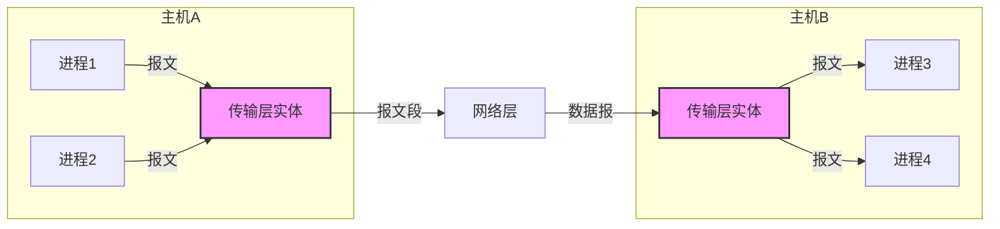
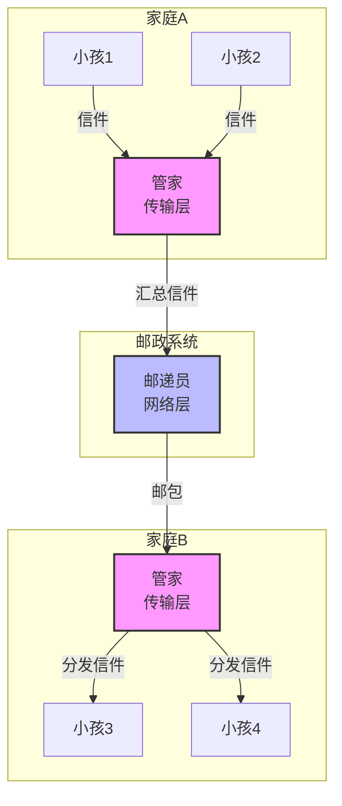
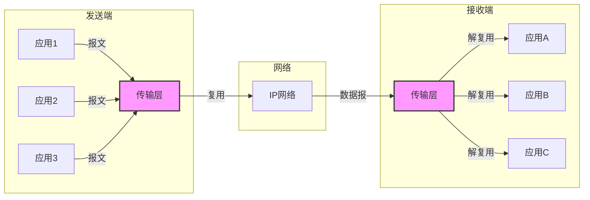
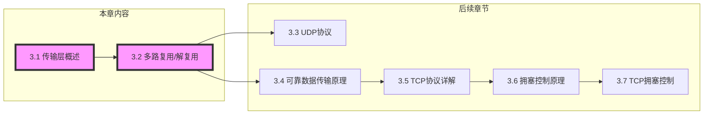

# 3.1 传输层概述与传输层服务

---

## 一、传输层核心目标

传输层位于应用层和网络层之间，是**端到端通信**的关键一层。本章的核心目标是：

1. **理解传输层工作原理**：如何在不可靠的网络层之上提供可靠的进程间通信。
    
2. **掌握Internet传输层协议**：UDP（无连接、不可靠但轻量）和TCP（面向连接、可靠、流量/拥塞控制）的核心机制。
    

---

## 二、传输层提供的服务

### 1. 进程间通信

|特性|描述|
|---|---|
|**逻辑通信**|为不同主机的**应用进程**提供直接的逻辑通信服务（而非主机到主机）|
|**报文处理**|将应用层报文分段传输，接收端重组后交付给正确的应用进程|
|**服务增强**|在不可靠的网络层（IP）基础上，提供可靠性保障（TCP）|

> 💡 **理解关键**：传输层让应用进程感觉彼此直接连接，仿佛中间的网络不存在。

### 2. TCP与UDP的服务特性对比

|特性|TCP|UDP|
|---|---|---|
|**连接性**|面向连接（需建立/维持/释放连接）|无连接（直接发送数据报）|
|**可靠性**|**可靠**：保证不丢失、不重复、按序到达|**不可靠**：不保证交付，不保证顺序|
|**数据边界**|**字节流**：不保留报文边界（可能粘包）|**数据报**：保留报文边界|
|**流量控制**|✅ 防止发送方淹没接收方|❌|
|**拥塞控制**|✅ 动态调整发送速率|❌|
|**首部开销**|20-60字节|8字节|
|**适用场景**|文件传输、网页浏览、邮件|实时音视频、DNS、在线游戏|

**共同基础**：

- 都构建在**IP协议**之上
    
- 都实现**多路复用/解复用**（通过端口号）
    
- 都无法提供**延迟保证**和**带宽保证**（受底层网络限制）
    

> 📌 **服务增强边界**：
> 
> - **可增强**：可靠性（丢包/乱序/错误）、安全性（如TCP+TLS）
>     
> - **不可增强**：延迟、带宽（受物理网络限制）
>     

---

## 三、传输层 vs 网络层：经典类比

### 1. 家庭通信模型

|角色|对应网络层次|功能|
|---|---|---|
|**家庭**|主机|通信的端点|
|**小孩**|应用进程|实际发送/接收信息的实体|
|**管家**|**传输层**|聚合家庭信件（复用）、分发信件（解复用）|
|**邮递员**|**网络层**|负责家庭到家庭的邮包传输（主机到主机）|
|**信件**|报文|应用层的数据单元|

### 2. 核心差异

|维度|网络层|传输层|
|---|---|---|
|**通信单位**|主机到主机|**进程到进程**|
|**地址标识**|IP地址|**端口号**|
|**服务对象**|所有上层协议|应用进程|
|**可靠性**|尽力而为（不可靠）|TCP提供可靠，UDP保持不可靠|
|**复用/解复用**|无|**核心功能**|

---

## 四、多路复用与解复用

### 1. 基本概念

|功能|描述|实现机制|
|---|---|---|
|**复用**|源端多个应用进程共享同一传输层实体发送数据|传输层从多个Socket接收数据，封装成报文段|
|**解复用**|目的端将接收到的报文段正确交付给对应应用进程|根据报文段中的**端口号**进行分发|

### 2. 端口号的作用

- **16位无符号整数**（0-65535）
    
- 分类：
    
    - **知名端口**（0-1023）：HTTP(80)、FTP(21)、SSH(22)
        
    - **注册端口**（1024-49151）：应用程序可注册使用
        
    - **动态/私有端口**（49152-65535）：客户端临时使用
        

### 3. TCP与UDP的标识方式

|协议|连接标识|解复用依据|
|---|---|---|
|**UDP**|二元组 `(目的IP， 目的端口)`|只要目的IP和目的端口相同，就送到同一个Socket|
|**TCP**|**四元组** `(源IP， 源端口， 目的IP， 目的端口)`|四元组唯一标识一个连接，不同源即使目的端口相同也送到不同Socket|

> 💡 **TCP的并发原理**：服务器监听80端口（欢迎套接字），每个新连接由不同的**连接套接字**处理，四元组保证了唯一性。

---

## 五、可靠数据传输的基本挑战

传输层（尤其是TCP）需要在不可靠的IP服务上实现可靠传输，面临的主要挑战：

|挑战|描述|TCP应对机制|
|---|---|---|
|**比特错误**|数据在传输过程中可能发生位翻转|**校验和**检测错误，**确认+重传**恢复|
|**分组丢失**|网络拥塞导致分组被丢弃|**超时重传**|
|**乱序到达**|不同分组可能走不同路径，导致后发先至|**序列号**排序重组|
|**重复分组**|重传可能导致接收方收到重复数据|**序列号**去重|
|**接收方能力**|接收方处理速度可能慢于发送方|**流量控制**（滑动窗口）|
|**网络拥塞**|过多数据注入导致网络性能下降|**拥塞控制**（慢启动、拥塞避免）|

> 📌 **可靠数据传输（RDT）** 是3.4节的核心内容，将在后续详细展开。

---

## 六、服务质量的可增强与不可增强

|服务品质|TCP|UDP|可增强性|增强方式|
|---|---|---|---|---|
|**可靠性**|✅ 内置|❌ 无|**可大幅增强**|应用层实现确认/重传|
|**安全性**|明文传输|明文传输|**可增强**|SSL/TLS（在应用层实现）|
|**数据边界**|无（字节流）|有（数据报）|部分可处理|应用层添加长度字段|
|**流量控制**|✅ 内置|❌ 无|**可增强**|应用层实现反馈机制|
|**拥塞控制**|✅ 内置|❌ 无|**可增强**|应用层自适应码率|
|**延迟保证**|❌ 无|❌ 无|**不可增强**|受物理网络限制|
|**带宽保证**|❌ 无|❌ 无|**不可增强**|受链路容量限制|

**核心启示**：

- TCP在**可靠性、流量控制、拥塞控制**方面提供了强大支持
    
- UDP将这些问题留给**应用层**处理，换取了**低延迟和简单性**
    
- **延迟和带宽**是传输层**无法保证**的，只能尽力而为
    

---

## 七、本章知识小结

|知识点|核心内容|考试重点/易混淆点|难度|
|---|---|---|---|
|**传输层概述**|为应用进程提供逻辑通信服务，实现进程到进程的报文传输|**逻辑通信** vs 物理通信|★★★|
|**多路复用/解复用**|源端复用多个应用数据，目的端解复用至对应进程|**端口号**的作用|★★★|
|**TCP vs UDP**|TCP：可靠、连接、流量/拥塞控制；UDP：不可靠、无连接、轻量|**核心特性对比表**|★★★★|
|**与网络层对比**|网络层：主机到主机；传输层：**进程到进程**|家庭通信类比|★★★|
|**可靠数据传输挑战**|比特错误、丢包、乱序、重复、接收方能力、网络拥塞|**六大挑战**|★★★★|
|**流量控制**|发送方动态调整速率匹配接收方处理能力|**滑动窗口机制**|★★★|
|**拥塞控制**|避免网络过载（慢启动、拥塞避免、快速重传/恢复）|TCP特有机制|★★★★|
|**服务品质可增强性**|可靠性、安全性可增强；延迟、带宽不可增强|SSL/TLS增强安全性案例|★★★|

---

## 八、学习路径图

> 🚀 **学习提示**：
> 
> 1. 理解**进程间通信**是传输层的核心价值
>     
> 2. 掌握**端口号**在多路复用/解复用中的作用
>     
> 3. 牢记TCP与UDP的**本质差异**（连接、可靠、边界）
>     
> 4. 为后续学习可靠数据传输（RDT）和TCP细节打下基础
>