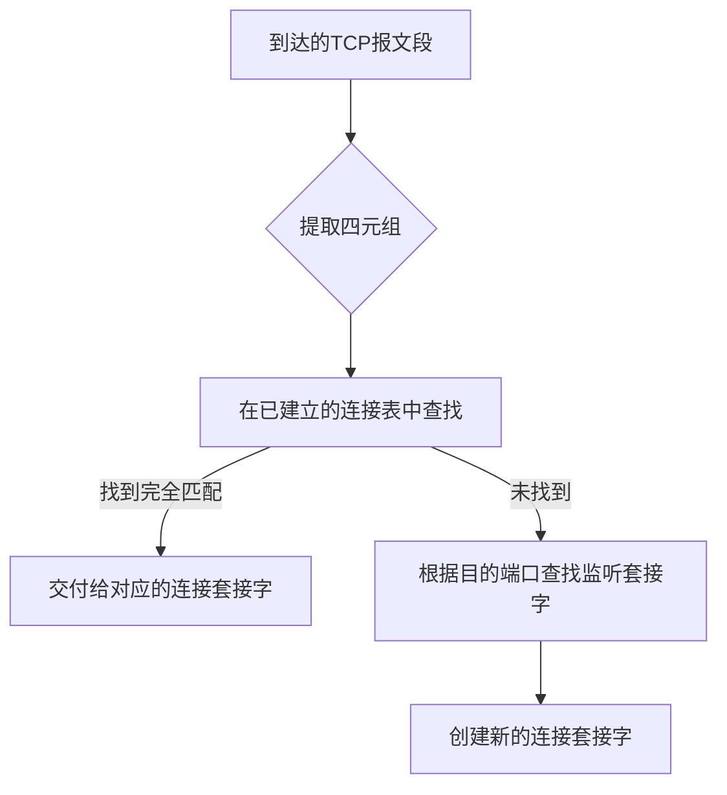
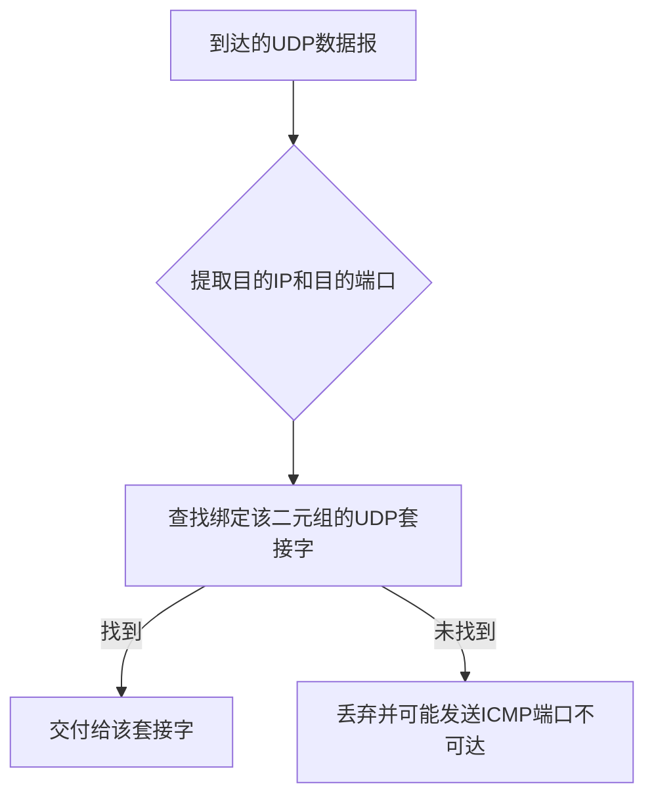

# 3.2 多路复用与解复用 —— 传输层的“分发器”

---

## 一、为什么需要多路复用与解复用？

传输层位于应用层和网络层之间，其核心任务之一就是**为多个应用进程提供通信服务**。但网络层只负责将数据报从一台主机送到另一台主机，并不知道这个数据报应该交给主机上的哪个应用进程。

**多路复用与解复用**就是解决这个问题的机制：

- **多路复用**：发送端传输层从多个套接字（Socket）收集数据，用头部信息封装后，交给网络层。
    
- **解复用**：接收端传输层根据头部信息，将数据正确交付给对应的套接字（进而交给应用进程）。
    

这个机制的关键在于 **端口号** 和 **IP 地址** 的组合。

---

## 二、TCP 的多路复用与解复用

### 1. 四元组 —— TCP 连接的“身份证”

TCP 是面向连接的协议，每个连接由 **四元组** 唯一标识：


```text

（源IP地址， 源端口号， 目的IP地址， 目的端口号）
```
- **源IP** 和 **源端口** 标识发送端的进程
    
- **目的IP** 和 **目的端口** 标识接收端的进程
    

### 2. 解复用规则

**接收端 TCP 实体**根据报文段中的四元组信息，将其交付给 **完全匹配** 的套接字。  
也就是说，只要四元组中任何一个元素不同，就会被定位到不同的套接字。


### 3. 例子：Web 服务器的并发处理

假设一个 Web 服务器运行在主机 `B`（IP `130.0.0.1`）的 80 端口，同时与多个客户端通信：

|连接|源IP|源端口|目的IP|目的端口|交付给|
|---|---|---|---|---|---|
|1|`A` (120.0.0.1)|9157|`B` (130.0.0.1)|80|进程 P4|
|2|`C` (140.0.0.1)|9157|`B` (130.0.0.1)|80|进程 P5|
|3|`C` (140.0.0.1)|5775|`B` (130.0.0.1)|80|进程 P6|

虽然目的端口都是 80，但 **源IP** 或 **源端口** 不同，所以被分到不同的套接字（可能对应不同的线程/进程）。这正是 TCP 支持高并发的原理。

> 💡 **编程视角**：在服务器端，`accept()` 返回的每个连接套接字都隐含了一个唯一的四元组。后续的数据收发只需通过该套接字即可，操作系统会自动关联四元组。

---

## 三、UDP 的多路复用与解复用

### 1. 二元组 —— UDP 的“模糊匹配”

UDP 是无连接的，一个 UDP 套接字只绑定 **本地二元组**：


```text

（目的IP地址， 目的端口号）
```
发送端可以指定任意目标地址，但接收端仅根据 **目的IP** 和 **目的端口** 将数据报交付给对应的套接字。

### 2. 解复用规则

**接收端 UDP 实体**只检查报文段中的 **目的IP** 和 **目的端口**。  
只要这两个字段与某个套接字绑定的本地信息一致，就将数据报交给该套接字，**完全不关心源地址**。

### 3. 例子：DNS 服务器

一个 DNS 服务器运行在 `53` 端口，它只需要一个 UDP 套接字就能服务所有客户端：

- 客户端 A（IP `1.1.1.1`，端口 `12345`）发送查询 → 目的（`服务器IP`，`53`）
    
- 客户端 B（IP `2.2.2.2`，端口 `54321`）发送查询 → 目的（`服务器IP`，`53`）
    

两个数据报到达后，都被同一个 UDP 套接字接收。服务器通过 `recvfrom()` 获取数据报的同时，也会得到源地址信息，从而可以用 `sendto()` 将响应发回正确的客户端。

> ⚠️ **注意**：UDP 服务器无法通过套接字区分不同客户端，必须在应用层根据源地址进行会话管理。

---

## 四、TCP 与 UDP 复用解复用对比

|对比维度|TCP|UDP|
|---|---|---|
|**绑定信息**|**四元组**（源IP、源端口、目的IP、目的端口）|**二元组**（目的IP、目的端口）|
|**解复用依据**|四元组必须**完全匹配**|只匹配目的二元组|
|**套接字与连接**|每个连接一个套接字|一个套接字可服务所有客户端|
|**并发处理**|多线程/多进程处理不同连接|单套接字接收所有数据，需应用层区分|
|**服务器实现**|主线程监听，子线程处理连接|一个 recvfrom/sendto 循环|
|**典型应用**|Web、FTP、邮件|DNS、DHCP、音视频|

---

## 五、端口号的分配

端口号是 16 位无符号整数（0~65535），分为三类：

|范围|类型|描述|示例|
|---|---|---|---|
|0–1023|**知名端口**|固定分配给系统服务，需要 root/管理员权限绑定|HTTP(80)、FTP(21)、SSH(22)|
|1024–49151|**注册端口**|可供应用程序注册使用|MySQL(3306)、RDP(3389)|
|49152–65535|**动态/私有端口**|客户端临时使用，由操作系统自动分配|浏览器随机端口|

### 客户端端口分配

- **TCP 客户端**：通常不显式 `bind()`，由操作系统从动态端口范围选取一个空闲端口。
    
- **UDP 客户端**：同样可自动分配，但若需固定端口（如 P2P 应用），可手动 `bind()`。
    

---

## 六、编程中的关键点

### 1. TCP 服务器

```c

// 创建欢迎套接字
int welcome = socket(AF_INET, SOCK_STREAM, 0);
// 绑定知名端口（如 80）
bind(welcome, ...);
listen(welcome, 10);
while (1) {
    // accept 返回新的连接套接字，对应一个唯一的四元组
    int conn = accept(welcome, (struct sockaddr *)&client_addr, &client_len);
    // 可以创建线程处理 conn
}
```
### 2. UDP 服务器

```c

int sock = socket(AF_INET, SOCK_DGRAM, 0);
// 绑定知名端口（如 53）
bind(sock, ...);
struct sockaddr_in client_addr;
socklen_t addr_len = sizeof(client_addr);
char buffer[1024];
while (1) {
    // recvfrom 获得数据及客户端地址
    int n = recvfrom(sock, buffer, sizeof(buffer), 0,
                     (struct sockaddr *)&client_addr, &addr_len);
    // 处理请求
    // 用 sendto 通过同样的 client_addr 回复
    sendto(sock, response, resp_len, 0,
           (struct sockaddr *)&client_addr, addr_len);
}
```
### 3. 关键 API 参数含义

- `sendto()` 需要指定目标地址，因为 UDP 套接字没有绑定远端。
    
- `recvfrom()` 会填充源地址，用于后续回复。
    
- TCP 的 `send()`/`recv()` 不需要指定地址，因为套接字已绑定四元组。
    

---

## 七、知识小结

|知识点|核心内容|考试重点/易混淆点|难度|
|---|---|---|---|
|**复用**|发送端传输层从多个套接字收集数据，封装后交给网络层|与解复用的方向对应关系|★★★|
|**解复用**|接收端根据头部信息将数据交付给正确套接字|依赖端口号和 IP 地址|★★★|
|**TCP 解复用**|**四元组完全匹配**（源IP、源端口、目的IP、目的端口）|同一端口可对应多个连接套接字|★★★★★|
|**UDP 解复用**|**仅匹配目的二元组**（目的IP、目的端口）|一个套接字接收所有客户端数据|★★★★|
|**端口号分类**|知名(0-1023)、注册(1024-49151)、动态(49152-65535)|客户端使用动态端口|★★★|
|**多线程服务器**|主线程 accept，子线程处理连接套接字|四元组保证了连接的唯一性|★★★★|

---

> 📖 **核心启示**：
> 
> - TCP 的**四元组严格匹配**使其能够精确管理大量并发连接，是实现可靠通信的基础。
>     
> - UDP 的**二元组宽松匹配**使其非常简洁，适合无状态、低延迟的场景，但也将多路分离的复杂性交给了应用层。
>     
> 
> 理解这两种不同的解复用机制，是掌握传输层工作原理的关键一步。下一节我们将深入 UDP 协议本身，看看它在简洁中如何高效工作。