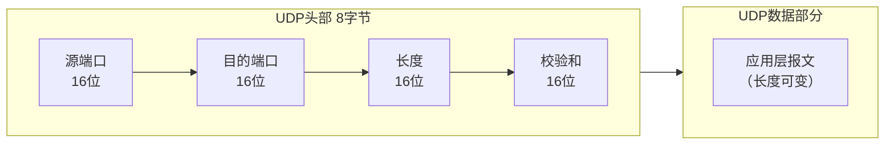
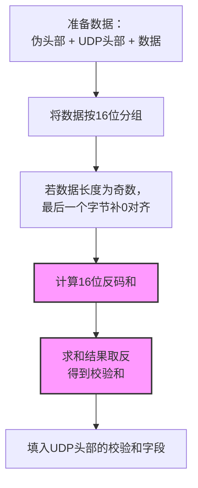
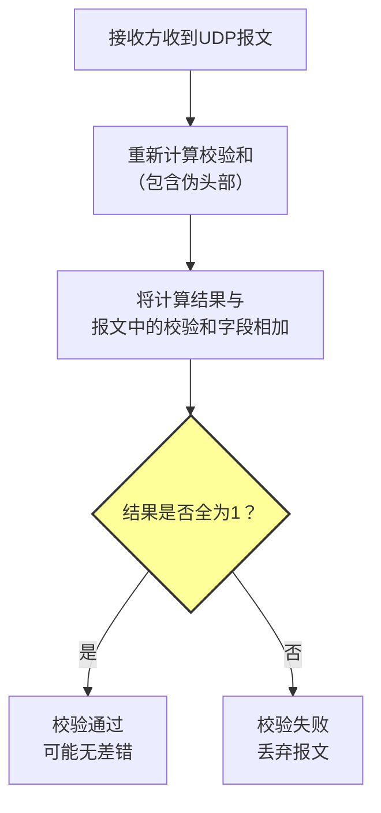
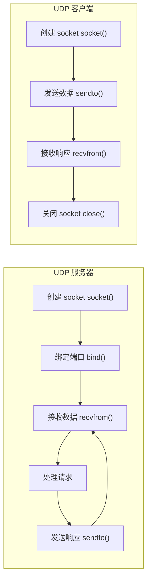

# 3.3 无连接传输 UDP —— 简单而高效的“快递员”

---

## 一、UDP 协议概述

### 1. 什么是 UDP？

**UDP（User Datagram Protocol，用户数据报协议）** 是传输层另一种核心协议，它在 IP 的“主机到主机”服务基础上，仅增加了**进程到进程的通信**（通过端口号）和**可选的差错检测**（校验和），除此之外完全继承了 IP 的“尽力而为”服务模型。

### 2. UDP 的核心特性

|特性|描述|与 TCP 对比|
|---|---|---|
|**无连接**|通信前无需握手，直接发送数据|TCP 需要三次握手|
|**不可靠**|不保证交付，可能丢包、乱序、重复|TCP 提供可靠、保序传输|
|**面向报文**|保留报文边界，一次发送对应一次接收|TCP 是字节流，无边界|
|**轻量级**|头部仅 8 字节，无状态维护|TCP 头部 20-60 字节|
|**无控制**|无流量控制、无拥塞控制|TCP 有滑动窗口和拥塞控制|

> 💡 **理解关键**：UDP 像一个“快递员”——把包裹扔进邮筒就不管了，不确认收件人是否收到，不跟踪包裹去向。而 TCP 像“专车送货”——先电话确认收件人在家，然后亲自送达并请对方签字确认。

---

## 二、UDP 报文段格式

### 1. 报文结构



|字段|长度|描述|作用|
|---|---|---|---|
|**源端口**|16位|发送端进程的端口号|用于接收方回复时定位发送进程|
|**目的端口**|16位|接收端进程的端口号|用于接收端解复用|
|**长度**|16位|UDP 报文总长度（头部+数据），最小 8 字节|标识报文边界|
|**校验和**|16位|检测传输错误|可选（IPv4 中若为 0 表示不校验，IPv6 强制校验）|
|**数据**|可变|应用层交付的报文内容|实际传输的数据|

---

## 三、UDP 校验和 —— 唯一的差错检测机制

UDP 校验和是协议中**唯一**的可靠性增强机制（尽管是可选且简单的）。

### 1. 校验范围

校验和覆盖三个部分：

1. **UDP 头部**（8 字节）
    
2. **数据部分**（应用层报文）
    
3. **伪头部**（Pseudo Header）—— 不真正传输，仅在计算时使用，用于检查数据报是否被正确交付
    

**伪头部结构**（12 字节）：


```text

+----------------+----------------+----------------+----------------+
|      源IP地址（32位）              |      目的IP地址（32位）             |
+----------------+----------------+----------------+----------------+
|     0（8位）    |   协议（8位）   |       UDP长度（16位）               |
+----------------+----------------+----------------+----------------+
```
- **协议字段**：17（UDP 的协议号）
    
- **UDP 长度**：UDP 报文的总长度（头部+数据）
    

> 📌 **为什么要包含伪头部？**  
> 确保数据报被正确送到了目的主机和传输层。如果 IP 地址错误，校验和会失败，防止将数据交给错误的进程。

### 2. 校验和计算过程


**反码求和规则**：

- 将每个 16 位单元当作无符号整数相加
    
- 若相加过程中产生进位（超过 16 位），则将进位回卷加到最低位（**循环进位**）
    
- 最终结果取反（1 的补码）即为校验和
    

### 3. 校验和验证过程


**验证原理**：

- 如果传输无差错，则（重新计算的校验和 + 原校验和）= 全 1（`1111111111111111`）
    
- 这是因为反码求和的特性：`X + ~X = 全1`
    

### 4. 计算示例

假设我们要发送两个 16 位整数：`0110011001100110` 和 `0101010101010101`。

**发送方计算**：

1. 求和：  
    `0110011001100110`  
    `+ 0101010101010101`  
    `= 1011101110111011`（无进位）
    
2. 取反：`0100010001000100` ← 这就是校验和
    

**接收方验证**：

1. 重新计算数据和 = `0110011001100110 + 0101010101010101 = 1011101110111011`
    
2. 加上校验和：  
    `1011101110111011`  
    `+ 0100010001000100`  
    `= 1111111111111111` ✅ 校验通过
    

### 5. 残存错误

尽管校验和能检测大多数错误，但存在**极低概率**的情况：传输错误恰好使校验关系仍然成立。例如，两个不同位置的比特错误相互抵消，导致最终和不变。这种错误称为**残存错误**，UDP 选择容忍它（TCP 同样存在此问题，但概率极低）。

---

## 四、UDP 的典型应用场景

### 1. 实时流媒体

|应用|为什么选择 UDP|
|---|---|
|视频会议|容忍少量丢包，但**延迟敏感**，TCP 的重传会导致卡顿|
|网络直播|丢包可能造成短暂花屏，但 TCP 的拥塞控制会大幅降低码率|
|IP 语音|语音片段丢失可被插值修复，重传反而破坏实时性|

### 2. 事务性应用

|应用|特点|协议|
|---|---|---|
|**DNS**|单次查询-响应，无需建立连接|UDP 53|
|**DHCP**|客户端配置，广播通信|UDP 67/68|
|**SNMP**|网络管理，简单请求-响应|UDP 161/162|
|**NTP**|时间同步，频繁短报文|UDP 123|

### 3. 需要低延迟的场景

- **在线游戏**：玩家的位置、动作更新必须快速，偶尔丢失一个更新包影响不大，但延迟会严重影响体验。
    
- **物联网传感器数据**：环境温度、湿度等周期性上报，丢一个数据点可被后续数据替代。
    

### 4. 广播/多播通信

UDP 天然支持一对多通信，而 TCP 是点对点的单播协议。

---

## 五、UDP 与 TCP 的架构选择

### 1. 为什么只有 TCP 和 UDP？

传输层为何只提供这两种服务模型？原因是：

- **覆盖 85% 的应用场景**：可靠流式（TCP）和不可靠数据报（UDP）满足了绝大多数需求。
    
- **协议栈复杂度**：增加第三种传输协议会大幅增加操作系统内核的复杂度。
    
- **灵活性**：UDP 之上可以构建各种自定义协议（如 Google 的 QUIC 协议在 UDP 上实现了可靠传输 + 多路复用 + 安全性）。
    

### 2. 何时需要“应用层 TCP”？

如果应用既需要 UDP 的低延迟，又需要 TCP 的可靠性，可以在 UDP 之上自行实现：

- **确认与重传**：接收方收到数据后发送 ACK，发送方超时重传
    
- **序列号**：检测丢包和乱序
    
- **拥塞控制**：动态调整发送速率
    

**典型案例**：

- **QUIC**（Quick UDP Internet Connections）：HTTP/3 的底层传输协议，在 UDP 上实现了类似 TCP 的可靠性 + 多路复用 + 0-RTT 连接。
    
- **RTP/RTCP**：实时传输协议，在 UDP 上传输音视频数据，用 RTCP 提供反馈。
    

---

## 六、UDP 与 TCP 详细对比

|对比维度|UDP|TCP|
|---|---|---|
|**连接性**|无连接|面向连接（三次握手）|
|**可靠性**|不可靠（可能丢包、乱序）|可靠（确认、重传、序号）|
|**数据边界**|保留报文边界|字节流，无边界|
|**头部大小**|8 字节|20-60 字节|
|**流量控制**|无|有（滑动窗口）|
|**拥塞控制**|无|有（慢启动、拥塞避免）|
|**传输速率**|应用层决定，可恒定|受拥塞控制动态调整|
|**适用场景**|实时应用、事务查询|文件传输、网页浏览、邮件|
|**典型协议**|DNS、DHCP、RTP、QUIC|HTTP、FTP、SMTP、SSH|

---

## 七、UDP 编程要点回顾

### 1. UDP 套接字编程模型



### 2. 关键 API

|函数|作用|关键参数|
|---|---|---|
|`socket(AF_INET, SOCK_DGRAM, 0)`|创建 UDP 套接字|`SOCK_DGRAM` 表示数据报|
|`sendto()`|发送数据报|需指定目标地址（IP+端口）|
|`recvfrom()`|接收数据报|返回发送方地址，用于回复|
|`bind()`|绑定本地端口|服务器必须绑定知名端口|

### 3. 代码片段示例

**服务器端**：

```c

int sock = socket(AF_INET, SOCK_DGRAM, 0);
struct sockaddr_in server_addr, client_addr;
server_addr.sin_family = AF_INET;
server_addr.sin_addr.s_addr = htonl(INADDR_ANY);
server_addr.sin_port = htons(8888);
bind(sock, (struct sockaddr *)&server_addr, sizeof(server_addr));
while (1) {
    socklen_t addr_len = sizeof(client_addr);
    recvfrom(sock, buffer, BUFFER_SIZE, 0,
             (struct sockaddr *)&client_addr, &addr_len);
    // 处理数据
    sendto(sock, response, resp_len, 0,
           (struct sockaddr *)&client_addr, addr_len);
}
```
**客户端**：

```c

int sock = socket(AF_INET, SOCK_DGRAM, 0);
struct sockaddr_in server_addr;
server_addr.sin_family = AF_INET;
server_addr.sin_port = htons(8888);
inet_pton(AF_INET, "127.0.0.1", &server_addr.sin_addr);
sendto(sock, message, msg_len, 0,
       (struct sockaddr *)&server_addr, sizeof(server_addr));
recvfrom(sock, buffer, BUFFER_SIZE, 0, NULL, NULL); // 不关心来源
```
---

## 八、知识小结

| 知识点          | 核心内容                       | 考试重点/易混淆点                     | 难度    |
| ------------ | -------------------------- | ----------------------------- | ----- |
| **UDP 协议定义** | 无连接传输层协议，在 IP 基础上增加进程间通信   | UDP 与 TCP 的**核心区别**（连接、可靠、边界） | ★★★   |
| **UDP 服务特性** | 无连接、不可靠、轻量级、无控制            | “尽力而为”服务的具体表现                 | ★★★   |
| **UDP 报文格式** | 8 字节固定头部：源/目的端口 + 长度 + 校验和 | 各字段长度和作用                      | ★★★   |
| **UDP 适用场景** | 实时流媒体、事务型应用、低延迟场景          | 为什么流媒体选 UDP 而非 TCP            | ★★★   |
| **校验和机制**    | 16 位反码求和，覆盖伪头部             | 计算过程、验证逻辑、残存错误                | ★★★★★ |
| **伪头部**      | 源/目的 IP + 协议号 + UDP 长度     | 作用：确保数据报被正确交付                 | ★★★★  |
| **与 TCP 对比** | 连接、可靠、边界、控制、头部大小           | 详细对比表格                        | ★★★★  |
| **应用层可靠性**   | 可在 UDP 之上自行实现可靠传输（如 QUIC）  | UDP 作为“传输层乐高”的灵活性             | ★★★★  |

---

## 九、总结与展望

UDP 是互联网“简约哲学”的完美体现——它只做一件事（进程间通信），并且做得极其轻量。它的“不可靠”不是缺陷，而是为特定应用场景（实时性、低延迟）保留的选择权。

**选择 UDP 的场景**：

- 你能容忍偶尔的丢包
    
- 你不能容忍 TCP 带来的延迟（重传、拥塞控制）
    
- 你需要广播或多播
    
- 你要在应用层实现自定义的传输逻辑
    

**下一步**：我们将进入本章最核心的部分——**可靠数据传输原理（RDT）**，探索 TCP 如何在不可靠的 IP 网络上实现“不丢、不重、不乱”的可靠服务。这正是从 UDP 的“简单”到 TCP 的“复杂”的跨越。