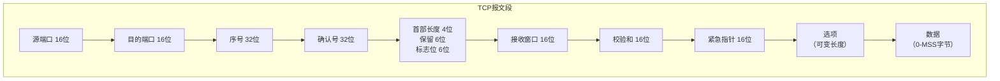
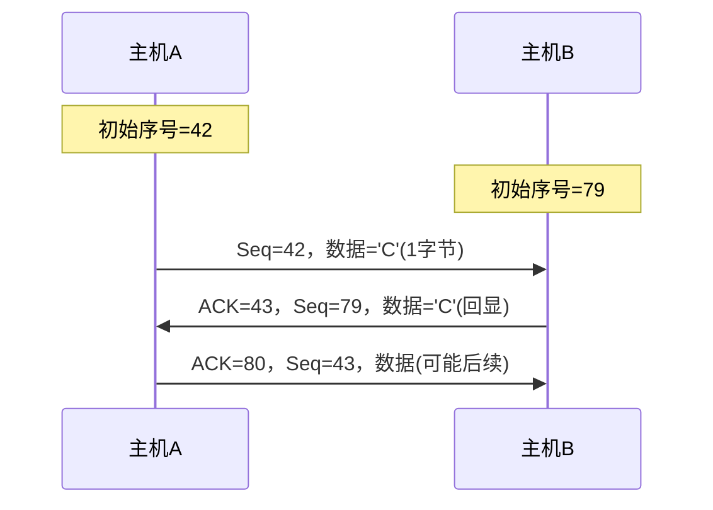
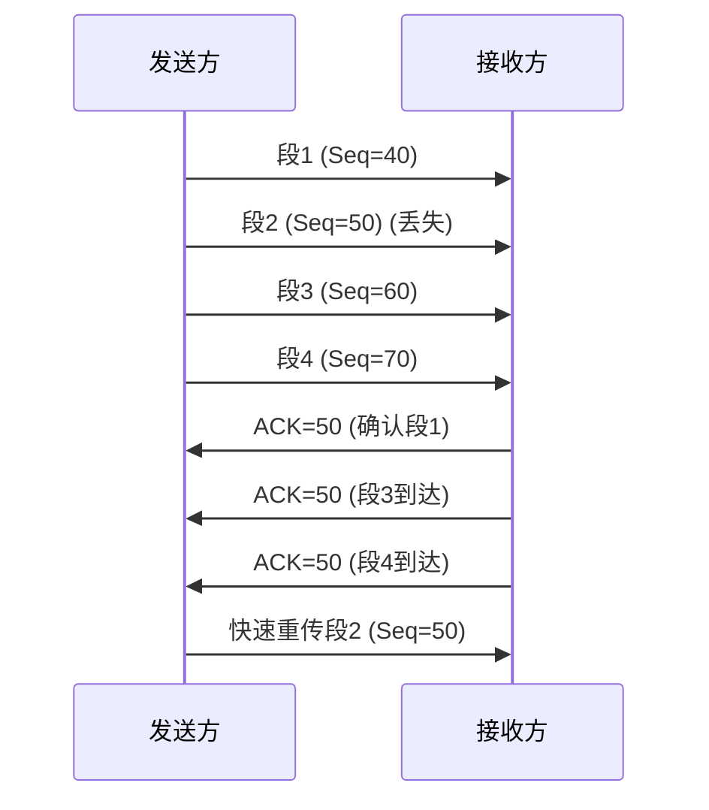
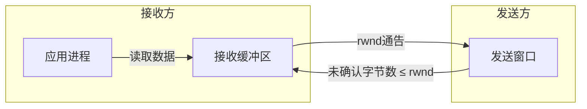
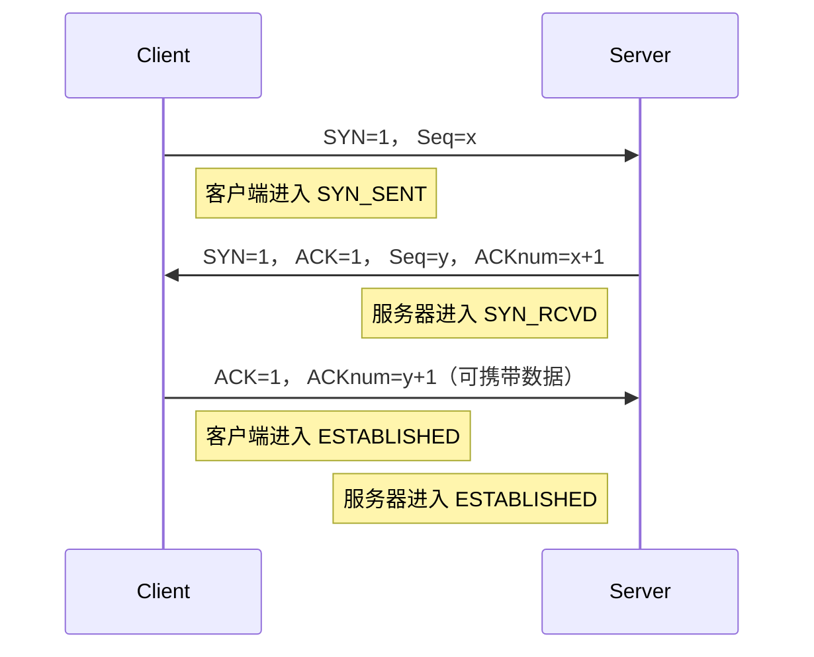
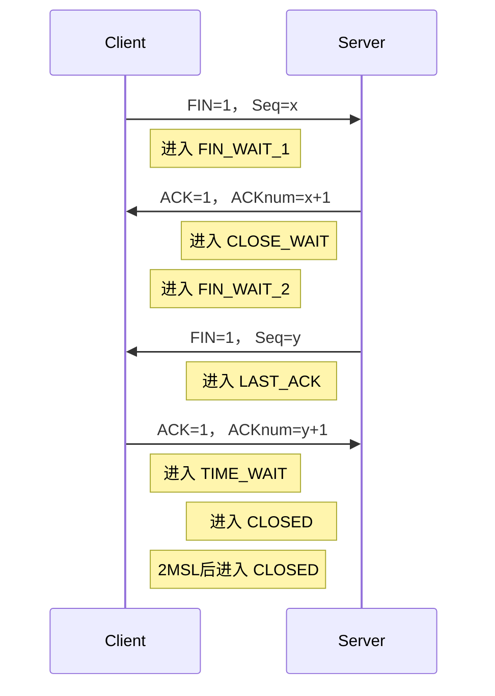
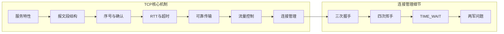

# 3.5 面向连接的传输：TCP —— 可靠字节流的实现

---

## 一、TCP 协议概述

### 1. TCP 的核心特性

|特性|描述|与 UDP 对比|
|---|---|---|
|**点对点**|一个发送方到一个接收方，不支持广播/组播|UDP 支持广播/多播|
|**全双工**|数据流可**双向同时传输**|UDP 可模拟双工但非天然|
|**可靠字节流**|无报文边界，保证**不出错、不重复、不丢失、不失序**|UDP 是报文边界，不可靠|
|**管道化**|可连续发送多个未确认报文段（流水线）|UDP 无确认概念|
|**面向连接**|通信前需建立连接（三次握手）|无连接|
|**流量控制**|防止发送方淹没接收方|无|
|**拥塞控制**|动态调整发送速率适应网络|无|

> 💡 **理解关键**：TCP 在 IP 的“尽力而为”服务之上，通过**序号、确认、重传、窗口**等机制，构建了一个**可靠的、有序的、无边界的字节流管道**。

### 2. 重要概念：MSS 与 MTU

**MTU**（Maximum Transmission Unit）：链路层最大传输单元（以太网为 1500 字节）。

**MSS**（Maximum Segment Size）：TCP 段的最大数据部分长度。


```text

MSS = MTU - IP头部(20) - TCP头部(20-24) 
    = 1500 - 20 - 20 = 1460 字节（典型值）
```
- **意义**：应用层数据按 MSS 切分，避免 IP 层分片，提高效率。
    
- **每个 MSS 段**：应用数据 + TCP 头部（20-60 字节）构成一个 TCP 报文段。
    

---

## 二、TCP 报文段结构

### 1. 关键字段详解



|字段|长度|作用|说明|
|---|---|---|---|
|**源端口/目的端口**|各16位|标识应用进程|与 IP 地址共同构成套接字|
|**序号**|32位|报文段第一个数据字节在整个字节流中的偏移量|**初始序号随机化**，防止旧连接干扰|
|**确认号**|32位|期望接收的下一个字节序号|**累积确认**：ACK=N 表示 N-1 及之前已收|
|**首部长度**|4位|以4字节为单位，最小5（20字节），最大15（60字节）|确定选项结束和数据开始位置|
|**标志位**|6位|URG/ACK/PSH/RST/SYN/FIN|控制连接状态|
|**接收窗口**|16位|接收方可用缓冲区大小|**流量控制**核心，最大65535，可缩放|
|**校验和**|16位|与 UDP 相同，16位反码和（含伪头部）|检测传输错误|
|**紧急指针**|16位|与 URG 标志配合|现代 TCP 很少使用|
|**选项**|可变|窗口缩放、时间戳、SACK 等|扩展功能|

### 2. 累积确认示例

```text

发送方发送：Seq=42，数据 1 字节 ('C')
接收方收到后，期待下一个字节是 43
接收方回复：ACK=43（表示已收到 42）
```
**确认号始终表示“期望收到的下一个字节序号”**，而不是最后一个收到的序号。

---

## 三、序号与确认号机制

### 1. 序号的意义

- TCP 将数据视为**连续的字节流**，每个字节都有唯一的序号。
    
- 初始序号（ISN）在连接建立时随机选择（如主机 A 选择 42，主机 B 选择 79）。
    
- 报文段的序号 = 该段第一个字节的序号。
    

### 2. 确认机制

- **累积确认**：ACK=N 表示序号 N-1 及之前的所有字节都已正确接收。
    
- **确认号始终递增**，除非收到乱序报文（冗余 ACK）。
    

### 3. 例题：Telnet 回显场景

- **A 发 'C'**：序号 42，数据 1 字节 → B 期望下一字节 43
    
- **B 回显 'C'**：序号 79，ACK=43（确认收到 42）→ A 期望下一字节 80
    
- **A 确认回显**：序号 43，ACK=80（确认收到 79）
    

**理解**：序号和确认号始终基于**字节流偏移量**，与报文段边界无关。

---

## 四、往返时间估计与超时计算

### 1. 为什么要自适应？

- 互联网中 RTT 变化范围大（几毫秒到几百毫秒）
    
- 固定超时无法适应动态网络
    

### 2. RTT 估计算法

|变量|含义|更新公式|
|---|---|---|
|**SampleRTT**|某报文段从发出到收到确认的时间|不计重传段的测量|
|**EstimatedRTT**|平滑后的 RTT 估计|`(1-α)*EstimatedRTT + α*SampleRTT`  <br>推荐 α=0.125|
|**DevRTT**|RTT 偏差估计|`(1-β)*DevRTT + β*\|SampleRTT - EstimatedRTT\|`  <br>推荐 β=0.25|
|**TimeoutInterval**|超时时间|`EstimatedRTT + 4*DevRTT`|

### 3. 超时的影响

- **过短**：过早超时 → 不必要重传，浪费带宽
    
- **过长**：对丢包反应迟钝 → 链路利用率下降
    

> **平衡点**：`+4*DevRTT` 保证 99.99% 以上的报文不会因正常延迟而超时。

---

## 五、TCP 的可靠数据传输机制

### 1. 混合设计：GBN + SR

TCP 的可靠传输不是纯粹的 GBN 或 SR，而是两者优点的结合：

|特性|类似 GBN|类似 SR|
|---|---|---|
|**确认方式**|累积确认|—|
|**定时器**|单个定时器（管理最老未确认段）|—|
|**重传范围**|—|**仅重传最早未确认段**（不重传整个窗口）|
|**乱序处理**|规范未规定（实现可缓存或丢弃）|允许缓存（若实现支持）|

### 2. 发送方事件处理

#### (1) 从上层接收数据

- 创建报文段，序号 = `NextSeqNum`
    
- 通过 IP 层发送
    
- `NextSeqNum += length(data)`
    
- 若定时器未运行，启动定时器
    

#### (2) 超时

- 重传**最早未确认的报文段**（序号 = `SendBase`）
    
- 重启定时器
    

#### (3) 收到 ACK

- 若 ACK 确认号 `y > SendBase`：
    
    - `SendBase = y`（窗口后沿滑动）
        
    - 若仍有未确认段，重启定时器；否则停止定时器
        
- 若 ACK 确认号 `y ≤ SendBase`（冗余 ACK）：
    
    - 增加该 ACK 的计数
        
    - 若计数达到 **3**，触发**快速重传**（立即重传序号为 y 的段）
        

### 3. 接收方 ACK 生成策略（RFC 1122 建议）

|事件|接收方行为|
|---|---|
|**按序到达，期望序号**|延迟发送 ACK（最多 500ms），若期间有下一个按序段则合并确认|
|**按序到达，前一个 ACK 被延迟**|立即发送累积 ACK|
|**乱序到达，大于期望序号**|立即发送**重复 ACK**（指明期望序号）|
|**部分/完全填充间隔**|立即发送 ACK（更新连续数据的最高端）|

### 4. 快速重传

**问题**：超时周期可能太长，尤其在高带宽-长延迟网络中。

**解决**：当发送方收到**同一数据的 3 个冗余 ACK** 时，**立即重传**（不等超时）。

**触发条件**：收到 **3 个重复 ACK**（第 1 个是正常 ACK，后 3 个是冗余）。

**效果**：在定时器超时前恢复丢包，显著提高性能。

---

## 六、流量控制

### 1. 问题：发送方 vs 接收方速度不匹配

接收方有**接收缓冲区**，应用进程从缓冲区读取数据。若发送方速度太快，可能淹没接收方缓冲区。

### 2. 解决方案：接收窗口

TCP 头部中的 **接收窗口字段** `rwnd` 通告接收方剩余缓冲区大小。

**计算公式**：


```text

LastByteRead  : 应用进程最后读取的位置
LastByteRcvd  : 最后接收到的位置
RcvBuffer     : 接收缓冲区总大小
空闲空间 = RcvBuffer - (LastByteRcvd - LastByteRead)
rwnd = 空闲空间  （发送到对端）
```
**发送方约束**：已发送未确认的字节数 ≤ `rwnd`。

### 3. 捎带确认

TCP 是全双工的，数据段可同时携带对反向数据的确认（`ACK` 字段）。这减少了纯 ACK 报文的数量，提高效率。

---

## 七、连接管理

### 1. 三次握手 —— 建立连接

**为什么必须三次？**

- **第一次**：客户端告诉服务器“我要连接”
    
- **第二次**：服务器确认收到，并告诉客户端“我也准备好了”
    
- **第三次**：客户端确认收到服务器的准备状态
    

**两次握手的风险**：

- **半连接**：服务器维护虚假连接状态，浪费资源
    
- **旧数据干扰**：延迟的连接请求可能被误认为新连接
    

**序号随机化**：初始序号采用时钟相关值，极大降低新旧连接数据混淆概率。

---

### 2. 四次挥手 —— 释放连接

**为什么四次？**

- TCP 是全双工的，每个方向的连接必须独立关闭。
    
- 一方发送 `FIN` 表示“我发完了”，但仍可接收数据。
    
- 另一方可能还有数据要发送，所以先回复 `ACK`，等自己数据发完后再发 `FIN`。
    

**TIME_WAIT 状态**（2MSL）：

- **MSL**：最大报文段生命周期（典型 2 分钟）
    
- 作用：
    
    1. 确保最后一个 `ACK` 能被对方接收（若丢失，对方会重发 `FIN`）
        
    2. 让网络中所有残留的旧数据包消失，不影响新连接
        

---

## 八、两军问题与 TCP 释放的不完美性

**两军问题**：两支红军需协同攻击，通信可能被截获，任何确认都需要再确认，形成无限递归。

TCP 连接释放面临同样困境：**最后一个 ACK 可能丢失**。

**工程解决方案**：

- **不追求数学完美**，而是通过 **TIME_WAIT** 和定时器降低概率。
    
- 若最后 ACK 丢失，服务器会重发 `FIN`，客户端在 TIME_WAIT 期间可重发 ACK。
    
- 2MSL 后认为对方已收到，直接关闭。
    

**现实影响**：可能出现“半开连接”（一方关闭，另一方不知），需通过保活机制处理。

---

## 九、知识小结

|知识点|核心内容|考试重点/易混淆点|难度|
|---|---|---|---|
|**TCP 服务特性**|点对点、全双工、可靠字节流、管道化|无报文边界（需应用层维护）|★★★★|
|**MSS/MTU**|MSS = MTU - IP头 - TCP头|以太网典型值 1460|★★★|
|**报文段结构**|16位端口、32位序号/确认号、窗口、校验和等|初始序号随机化，累积确认|★★★★★|
|**序号与确认号**|序号=字节流偏移，确认号=期望的下一个|累积确认：ACK=N 表示 N-1 及之前已收|★★★★★|
|**RTT 与超时**|EstimatedRTT + 4×DevRTT|α=0.125， β=0.25|★★★★|
|**可靠传输机制**|超时重传 + 快速重传（3冗余ACK）|混合 GBN（累积确认）和 SR（仅重传最早）|★★★★★|
|**流量控制**|接收窗口 `rwnd` 通告空闲缓冲区|发送方未确认 ≤ rwnd|★★★★|
|**连接建立**|三次握手（SYN， SYN+ACK， ACK）|为什么两次不行（半连接、旧数据）|★★★★★|
|**连接释放**|四次挥手（FIN， ACK， FIN， ACK）|TIME_WAIT 状态（2MSL）的作用|★★★★★|
|**两军问题**|最后一次 ACK 不可靠的哲学难题|工程妥协：TIME_WAIT 降低概率，非完美|★★★★|

---

## 十、学习路径图

> 📖 **核心启示**：TCP 是工程学上的奇迹。它在不可靠的 IP 网络上，通过序号、确认、窗口、定时器等机制，构建了一个近乎完美的可靠字节流服务。理解 TCP，就是理解计算机网络如何从“尽力而为”走向“可靠传输”的完整演化路径。