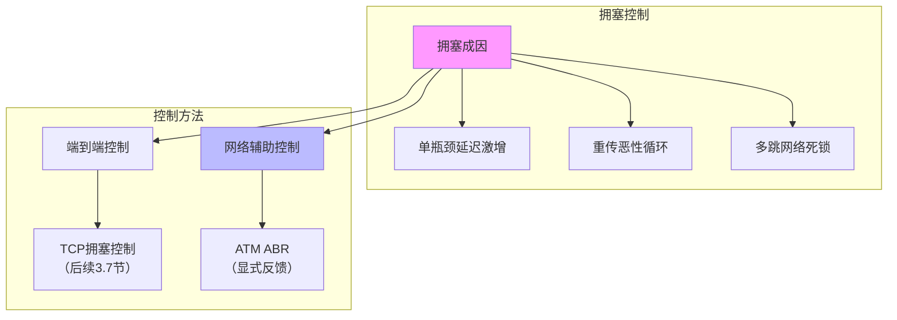

# 3.6 拥塞控制原理 —— 网络拥堵的成因与应对

---

## 一、拥塞控制概述

### 1. 什么是拥塞？

**拥塞**（Congestion）是指网络中**太多发送主机以过高的速率发送数据**，超出了网络路由器的处理能力，导致**分组丢失、延迟急剧增加**的现象。

> 💡 **理解关键**：拥塞控制与流量控制不同：
> 
> - **流量控制**：端到端问题，防止发送方淹没接收方（由接收窗口 rwnd 控制）
>     
> - **拥塞控制**：全局性问题，防止过多数据注入网络导致路由器过载（由拥塞窗口 cwnd 控制）
>     

### 2. 拥塞的直观表现

|表现|原因|类比|
|---|---|---|
|**分组丢失率升高**|路由器队列溢出，丢弃分组|高速公路出口排队溢出，车辆被劝返|
|**延迟显著增加**|分组在队列中长时间等待|堵车时等待时间远大于正常行驶时间|
|**吞吐量下降**|无效重传浪费带宽|堵车时有效通行车辆数反而减少|

---

## 二、拥塞的原因及代价

### 1. 场景一：单路由器，无限缓冲

**假设**：

- 两个发送方（a， b），两个接收方（c， d）
    
- 共享一个路由器，链路带宽均为 R bps
    
- 路由器有**无限缓冲**（不会丢包，但排队延迟可无限大）
    

**吞吐量特性**：

- 当注入速率 λin<R/2λin​<R/2 时：输出速率 λout=λinλout​=λin​（线性增长）
    
- 当 λin≥R/2λin​≥R/2 时：输出速率 λout=R/2λout​=R/2（单连接最大吞吐量）
    

**延迟特性**：

- 当 λin→R/2时，流量强度 I→1 ，**排队延迟急剧增大**（理论趋向无穷大）
    

---

### 2. 场景二：有限缓冲 + 重传

**假设**：

- 路由器有**有限缓冲**
    
- 发送方检测到丢包（通过超时）后进行**重传**
    

**现象**：

- 随着拥塞加剧，重传比例非线性增长
    
- 有效吞吐量 $λout$​ 可能**递减**（为让1单位数据成功到达，可能需要发送2单位或更多）
    

**拥塞代价分析**：

|代价|描述|
|---|---|
|**代价1**|**延迟大幅增加**（排队等待）|
|**代价2**|**需要超额发送保证有效吞吐**（重传开销）|
|**代价3**|**不必要重传进一步加剧拥塞**（恶性循环）|

---

### 3. 场景三：多跳网络死锁

**场景**：

- 发送方 a → 接收方 c（路径：a → R1 → R2 → c）
    
- 发送方 d → 接收方 b（路径：d → R2 → R1 → b）
    
- 两个方向的数据流**交叉**经过 R1 和 R2
    

**死锁过程**：

1. R1 的缓冲区被 a→c 的流量占满
    
2. R2 的缓冲区被 d→b 的流量占满
    
3. 两个方向都无法前进（互相等待对方释放缓冲区）
    
4. 最终导致**全员注入但零输出**的死锁状态
    

**第四重代价**：

- **被丢弃分组的上游传输能力完全浪费**（宝贵资源被无效消耗）
    

> ⚠️ **非线性恶化**：拥塞会自我加速恶化，类似传染病扩散，不加控制将快速导致网络瘫痪。

---

## 三、拥塞控制方法分类

### 1. 端到端拥塞控制（如 TCP）

- **原理**：端系统根据自身观察（丢包、延迟、冗余 ACK）推断拥塞，动态调整发送速率。
    
- **优点**：无需网络设备支持，易于部署。
    
- **缺点**：反应相对滞后，无法做到早期精确控制。
    

### 2. 网络辅助拥塞控制（如 ATM ABR）

- **原理**：路由器提供**显式反馈**，通知发送方当前拥塞状态或建议速率。
    
- **优点**：更精确的早期拥塞检测。
    
- **缺点**：需要全网设备支持，部署成本高。
    

|对比项|端到端控制|网络辅助控制|
|---|---|---|
|反馈来源|丢包/延迟/冗余ACK|路由器显式信令|
|典型协议|TCP（慢启动、拥塞避免）|ATM ABR|
|优点|无需网络改造，部署简单|反应快，控制精确|
|缺点|滞后性，只能事后反应|需全网支持，成本高|

---

## 四、案例学习：ATM ABR 拥塞控制

### 1. ATM 网络基础

**ATM**（Asynchronous Transfer Mode）使用固定长度的**信元**（Cell）作为传输单位：

|信元结构|长度|说明|
|---|---|---|
|头部|5 字节|包含 VPI/VCI 等控制信息|
|载荷|48 字节|实际数据|

**转发特性**：

- 每个节点转发延迟固定（53字节时间），介于线路交换（1比特）和分组交换（整个分组）之间
    
- 主要用于银行等专业领域，因技术复杂未广泛普及
    

### 2. ABR 服务模式

**ABR**（Available Bit Rate）是一种**弹性带宽**服务：

- **轻载时**：可超过最小保障速率，使用全部可用带宽
    
- **拥塞时**：需限制到最小保障速率
    
- **网络辅助**：通过**RM信元**（Resource Management cell）实现状态反馈
    

### 3. RM 信元机制

**RM 信元关键字段**：

|字段|全称|作用|设置方|
|---|---|---|---|
|**NI**|No Increase|轻度拥塞，要求发送方**不要增加速率**|拥塞路由器|
|**CI**|Congestion Indication|明确拥塞，要求发送方**降低速率**|拥塞路由器|
|**ER**|Explicit Rate|显式速率指示，路径上各交换机可提供的最小带宽|所有交换机（取最小值）|
|**EFCI**|Explicit Forward Congestion Indication|数据信元中的拥塞标记，接收方收到后会在返回RM中设CI|拥塞路由器|

**工作流程**：

1. 发送方定期在数据信元流中插入 **RM 信元**
    
2. RM 信元沿途经过的交换机：
    
    - 可根据拥塞情况设置 **NI/CI 比特**
        
    - 可修改 **ER 字段**（与当前值比较，取较小值）
        
3. 接收方收到 RM 信元后**原样返回**给发送方（可能已修改）
    
4. 发送方根据返回 RM 中的信息调整发送速率
    

**ER 计算原则**：

- 路径上每个交换机维护当前可用的带宽值
    
- ER 字段记录沿途**最小值**，确保端到端可用带宽
    

**EFCI 与 CI 联动**：

- 数据信元经过拥塞交换机时，可设置 **EFCI 比特**
    
- 接收方收到带 EFCI 的数据信元后，在返回的 RM 信元中设置 **CI 比特**
    

### 4. ATM ABR 与 TCP 拥塞控制对比

|对比项|ATM ABR|TCP|
|---|---|---|
|**控制方式**|网络辅助（显式反馈）|端到端（隐式推断）|
|**反馈信息**|NI/CI/ER 字段|丢包/延迟/冗余ACK|
|**精度**|高（可获知具体可用带宽）|低（只能感知拥塞程度）|
|**反应速度**|快（可提前预防）|慢（丢包后反应）|
|**部署成本**|高（需全网支持）|低（端系统即可）|
|**适用场景**|专业领域（如银行、运营商骨干）|互联网（通用）|

---

## 五、拥塞控制的核心矛盾与设计目标

### 1. 核心矛盾

- **目标1**：最大化发送速率（充分利用网络资源）
    
- **目标2**：避免网络拥塞（防止网络崩溃）
    

### 2. 理想拥塞控制应具备的特性

- **高效**：尽可能接近可用带宽
    
- **公平**：多个流之间公平分享带宽
    
- **快速响应**：快速感知拥塞并及时降速
    
- **低振荡**：避免速率剧烈波动
    
- **部署友好**：尽可能少依赖网络设备
    

---

## 六、知识小结

|知识点|核心内容|考试重点/易混淆点|难度|
|---|---|---|---|
|**拥塞定义**|过多数据注入导致网络性能下降|区分拥塞控制 vs 流量控制|★★★|
|**拥塞表现**|丢包率升高、延迟显著增加|延迟增加但不丢包（无限缓冲场景）|★★★|
|**拥塞代价**|1. 吞吐量下降 2. 无效重传 3. 资源浪费 4. 死锁风险|非线性恶化（加速崩溃）|★★★★|
|**端到端控制**|端系统根据丢包/延迟推断拥塞|TCP 采用（无网络显式反馈）|★★★★|
|**网络辅助控制**|路由器提供显式反馈（ECN、RM信元）|ATM ABR 典型|★★★★|
|**ATM ABR**|弹性带宽服务，通过 RM 信元反馈|NI/CI/ER/EFCI 字段含义|★★★★★|
|**ER 计算**|路径各交换机取最小值|显式速率指示的核心|★★★★|
|**死锁场景**|多跳网络缓冲区抢占导致全局吞吐归零|理解资源竞争的非线性后果|★★★★★|
|**拥塞场景分析**|单瓶颈（吞吐量 vs 延迟）、多跳（死锁）|会画会分析|★★★★|

---

## 七、学习路径图

> 📖 **核心启示**：拥塞控制是网络**全局性**问题，与端到端的流量控制有本质区别。从单瓶颈的延迟分析，到多跳的死锁风险，再到 ATM 的网络辅助控制，这一章为理解下一节 **TCP 拥塞控制的具体实现**（慢启动、拥塞避免、快速重传/恢复）奠定了理论基础。TCP 的 AIMD 算法，正是基于本章的原理，在端系统上实现的自适应拥塞控制。