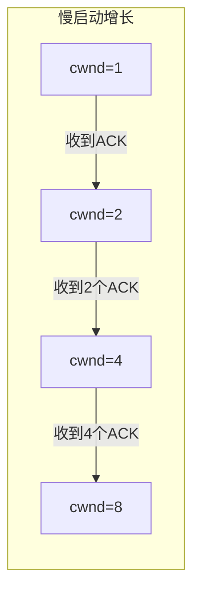
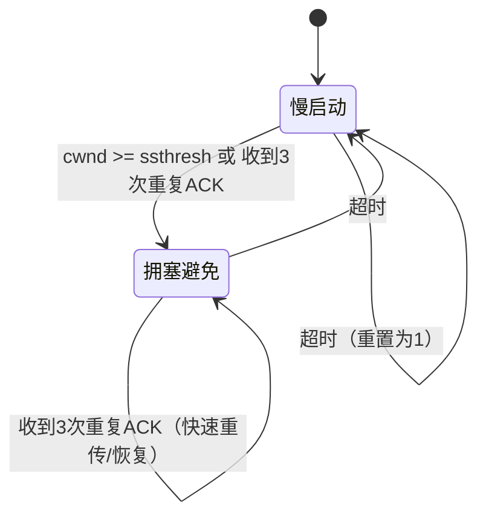

# 3.7 TCP 拥塞控制 —— 端到端的自适应调节

---

## 一、TCP 拥塞控制概述

### 1. 什么是拥塞控制？

拥塞控制是 TCP 为了防止**过多数据注入网络导致路由器过载**而采取的一系列机制。它和流量控制不同：

- **流量控制**：端到端问题，防止发送方淹没接收方（由接收窗口 `rwnd` 控制）
    
- **拥塞控制**：全局性问题，防止网络本身发生拥塞（由拥塞窗口 `cwnd` 控制）
    

> 💡 **核心思想**：TCP 采用**端到端**的方式，不依赖网络核心的显式反馈，而是通过端系统自主感知丢包和延迟来推断拥塞，并动态调整发送速率。

### 2. 如何检测拥塞？

TCP 通过两种事件判断拥塞程度：

|事件|含义|拥塞程度|响应|
|---|---|---|---|
|**超时**|分组可能因路由器缓冲区满被丢弃（概率大）或传输错误（概率小）|**严重拥塞**|`cwnd` 重置为 1 MSS，进入慢启动|
|**3 次重复 ACK**|接收方收到乱序段，重复发送对缺失段的 ACK|**轻微拥塞**|`cwnd` 减半，进入拥塞避免|

> 📌 **注意**：传输错误导致的超时概率很低（约 1%），不影响整体控制效果。

---

## 二、拥塞窗口与发送速率

### 1. 拥塞窗口 `cwnd`

TCP 引入**拥塞窗口**来限制已发送但未确认的数据量。发送窗口的实际大小为：


```text

SendWin = min(cwnd, rwnd)
```
- `cwnd`：拥塞窗口，由 TCP 拥塞控制算法动态调整
    
- `rwnd`：接收窗口，由接收方通告
    

### 2. 发送速率估算

```text

发送速率 ≈ cwnd / RTT （字节/秒）
```
虽然 RTT 波动导致控制不精确，但反馈机制仍能有效调节。正如射击运动员许海峰视力 0.1 却仍能命中目标——**反馈的力量**。

---

## 三、TCP 慢启动

### 1. 初始状态

- 连接建立时，`cwnd` 设为 **1 个 MSS**（通常为 1460 字节）
    
- 初始速率极低（例如 RTT=200ms 时，速率 ≈ 58.4 kbps），远低于可用带宽
    

### 2. 指数增长机制

- 每收到一个 ACK，`cwnd` **增加 1 个 MSS**
    
- 等价于**每个 RTT 窗口翻倍**
    

**效果**：速率呈指数增长，快速逼近网络容量。

### 3. 何时结束慢启动？

- 当发生**超时**：`cwnd` 重置为 1，重新慢启动
    
- 当发生 **3 次重复 ACK**：`cwnd` 减半，进入**拥塞避免**阶段
    
- 当 `cwnd` 达到设定的**慢启动阈值 `ssthresh`** 时，进入拥塞避免
    

---

## 四、拥塞避免与 AIMD

### 1. 加性增乘性减

- **加性增**：每个 RTT 无丢包时，`cwnd` **增加 1 个 MSS**（线性增长）
    
- **乘性减**：发生丢包时，`cwnd` **减半**
    

这种机制使 `cwnd` 随时间呈**锯齿状**变化：

### 2. 对两类丢包事件的响应

|事件|响应|后续阶段|
|---|---|---|
|**超时**|`ssthresh = cwnd / 2`，`cwnd = 1 MSS`|慢启动|
|**3 次重复 ACK**|`ssthresh = cwnd / 2`，`cwnd = ssthresh + 3 MSS`|拥塞避免|

> 📌 **为什么 3 次重复 ACK 响应更温和？**  
> 因为重复 ACK 表明网络仍能传输部分数据，只是出现了轻微拥塞，不必像超时那样“彻底清零”。

---

## 五、TCP 拥塞控制状态机

### 1. 慢启动阶段

- 指数增长，快速探测可用带宽
    
- 通常持续时间很短
    

### 2. 拥塞避免阶段

- 线性增长，缓慢逼近带宽极限
    
- 大多数时间处于此阶段
    

### 3. 快速重传与快速恢复

- 收到 3 次重复 ACK 后立即重传丢失段（不等超时）
    
- 同时执行窗口减半并进入拥塞避免，避免回到慢启动
    

---

## 六、TCP 吞吐量估算

假设窗口在 `W` 和 `W/2` 之间线性变化，平均窗口 ≈ `3W/4`，则平均吞吐量：

```text

平均吞吐量 ≈ (3/4) * W / RTT
```
其中 `W` 是发生丢包时的窗口大小。慢启动阶段因时间极短可忽略。

> 💡 **意义**：该公式给出了 TCP 拥塞控制机制下的理论最大吞吐量上限，受丢包率和 RTT 制约。

---

## 七、TCP 公平性

### 1. 公平性定义

当 K 个 TCP 会话共享带宽为 R 的瓶颈链路时，理想情况下每个会话应获得 **R/K** 的带宽。

### 2. 为什么 TCP 是公平的？

- 拥塞避免阶段，所有连接**线性增加**窗口（每 RTT 加 1）
    
- 发生拥塞时，所有连接**乘性减半**窗口
    

**收敛过程**：

- 初始可能不公平（例如连接 1 窗口大，连接 2 窗口小）
    
- 双方沿 45 度线增加（每 RTT 各 +1）
    
- 超过链路容量时发生丢包，窗口同时减半
    
- 重复此过程，最终收敛到公平点
    
```mermaid
subgraph 公平性收敛
	A[不公平状态] -->|增加| B[超过容量]
	B -->|减半| C[更接近公平]
	C -->|增加| B
end
```
### 3. 影响公平性的因素

- **UDP 的侵略性**：UDP 没有拥塞控制，可以恒定速率发送，会抢占 TCP 带宽，破坏公平性
    
- **多 TCP 连接**：一对主机可打开多个并行 TCP 连接，从而获得更多带宽
    
- **RTT 差异**：RTT 较小的连接能更快增加窗口，抢占更多带宽
    

---

## 八、知识小结

|知识点|核心内容|考试重点/易混淆点|难度|
|---|---|---|---|
|**拥塞控制 vs 流量控制**|拥塞控制防止网络过载；流量控制防止接收方过载|前者全局，后者端到端|★★★|
|**拥塞检测**|超时（严重）和 3 次重复 ACK（轻微）|两种事件的响应差异|★★★★★|
|**拥塞窗口 `cwnd`**|控制发送速率，与 `rwnd` 取最小值|发送窗口 = min(cwnd， rwnd)|★★★★|
|**慢启动**|指数增长（每 RTT 翻倍），快速逼近带宽|初始 cwnd=1，阈值 ssthresh|★★★★|
|**拥塞避免**|线性增长（每 RTT +1），AIMD 核心|加性增乘性减|★★★★★|
|**超时响应**|ssthresh=cwnd/2，cwnd=1，进入慢启动|彻底重置|★★★★★|
|**3 次重复 ACK 响应**|ssthresh=cwnd/2，cwnd=ssthresh+3，进入拥塞避免|快速重传+快速恢复|★★★★★|
|**吞吐量公式**|平均吞吐量 ≈ (3/4)*W/RTT|W 是丢包时的窗口|★★★★|
|**公平性**|TCP 收敛到均分带宽（AIMD 保证）|UDP、多连接、RTT 影响公平性|★★★★|
|**UDP 侵略性**|无拥塞控制，可抢占 TCP 带宽|实时应用常用 UDP|★★★|

---

## 九、总结

TCP 拥塞控制是互联网能够稳定运行的基石之一。它通过**端到端的自主检测**（超时和重复 ACK）和 **AIMD 窗口调整**，实现了：

- **高效**：尽可能利用可用带宽
    
- **公平**：多个连接长期共享带宽
    
- **稳定**：避免拥塞崩溃
    

理解 TCP 拥塞控制，就是理解计算机网络如何在“不可靠”和“共享”的环境下，实现**自适应、自稳定的可靠传输**。