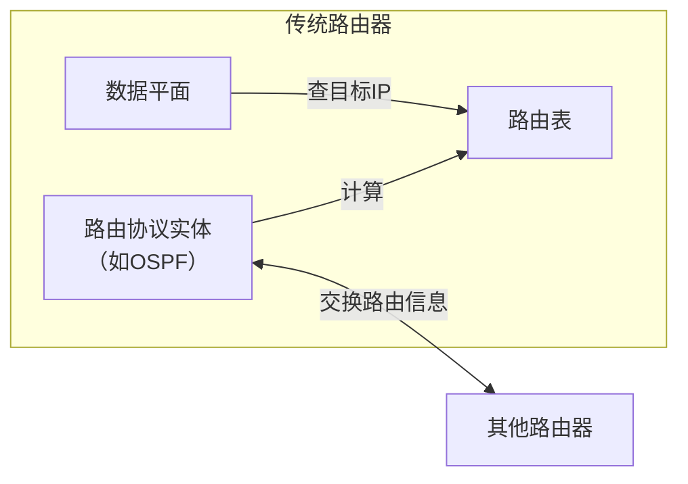
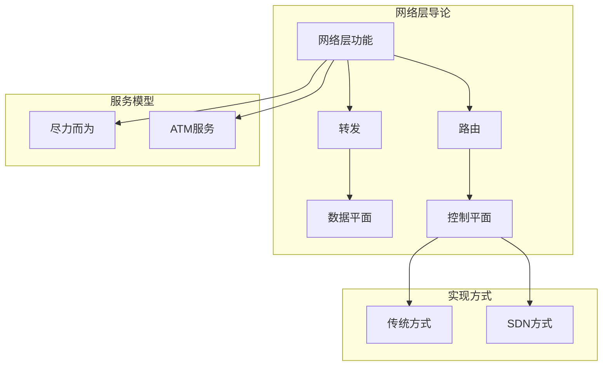

# 4.1 网络层导论 —— 数据平面与控制平面

---

## 一、网络层概述

网络层是 TCP/IP 协议栈的第三层，位于传输层之下，链路层之上。它的核心任务是将传输层的报文段（segment）从源主机**封装成数据报**（datagram），并通过一系列路由器**逐跳转发**，最终送达目标主机。

**关键点**：

- 网络层协议存在于**每一个主机和路由器**中。
    
- 路由器检查经过它的每个 IP 数据报的头部，并做出转发决策。
    
- 网络层提供的是**主机到主机**的服务，不保证可靠性（尽力而为）。
    

---

## 二、网络层两大核心功能：转发 vs 路由

| 维度       | 转发                             | 路由                   |
| -------- | ------------------------------ | -------------------- |
| **定义**   | 将分组从路由器的**输入接口**转移到合适的**输出接口** | 决定分组从源到目的地的**端到端路径** |
| **范围**   | **局部**（单个路由器）                  | **全局**（所有路由器协作）      |
| **执行频率** | 每个分组到达时执行                      | 定期或在网络拓扑变化时更新        |
| **实现位置** | **数据平面**（硬件转发）                 | **控制平面**（软件计算）       |
| **类比**   | 在某个路口选择出口                      | 使用地图规划从出发地到目的地的完整路线  |

**两者配合**：路由协议生成路由表，转发依据路由表进行逐跳决策，共同完成端到端通信。

---

## 三、网络层服务模型

网络层向上层（传输层）提供主机到主机的分组交付服务。不同的网络可能提供不同的服务质量保证。

### 1. 服务指标

|指标|含义|说明|
|---|---|---|
|**可靠性**|分组是否无差错到达|IP 本身不保证，由上层 TCP 保证|
|**延迟**|分组从源到目的的时间|尽力而为网络无保证|
|**保序性**|分组是否按发送顺序到达|IP 可能乱序|
|**带宽保证**|是否保证最小传输速率|需要预留资源|
|**延迟差**|分组间延迟的变化（jitter）|对多媒体应用影响大|

### 2. 两种典型服务模型

#### （1）Internet 的“尽力而为”服务模型

IP 网络提供的是**尽力而为**（Best Effort）服务，意味着：

- 无带宽保证
    
- 可能丢包
    
- 可能乱序
    
- 无延迟保证
    
- 仅通过丢包间接感知拥塞
    

> 💡 **“尽力而为”的委婉说法**：实际上就是**没有任何保障**，但网络会尽力将数据送达。

#### （2）ATM 网络的多种服务模型

ATM（异步传输模式）网络曾定义了更丰富的服务类别：

|服务模型|全称|特点|
|---|---|---|
|**CBR**|Constant Bit Rate|恒定比特率，固定带宽，低延迟，保序|
|**VBR**|Variable Bit Rate|可变比特率，保障最小带宽|
|**ABR**|Available Bit Rate|可用比特率，提供拥塞反馈|
|**UBR**|Unspecified Bit Rate|未指定比特率，类似尽力而为，但保留保序性|

ATM 的复杂服务需要网络层支持连接建立（虚电路），因此未能在 Internet 中普及。

---

## 四、数据平面与控制平面的实现方式

### 1. 传统方式：分布式控制 + 基于目标IP的转发

- **控制平面**：路由器之间运行路由协议（如 OSPF、BGP），**分布式地**计算并维护路由表。
    
- **数据平面**：每个分组到达时，仅根据 IP 头部中的**目标地址**查询路由表，执行转发。
    
- **特点**：
    
    - 紧耦合：控制平面与数据平面在同一设备内。
        
    - 行为僵化：修改转发逻辑需要升级所有路由器。
        
    - 转发依据单一：仅匹配目标 IP。
        

### 2. SDN 方式：集中控制 + 多字段匹配转发

- **控制平面**：集中式控制器（如 ONOS、OpenDaylight）掌握全网视图，计算并下发**流表**。
    
- **数据平面**：SDN 交换机根据流表进行转发，流表可匹配**任意头部字段**（MAC、IP五元组、TCP标志位等），执行多样化动作（转发、阻塞、泛洪、修改字段）。
    
- **优势**：
    
    - **解耦合**：控制平面集中，转发设备简化。
        
    - **可编程性**：通过修改控制器应用即可改变全网行为。
        
    - **灵活性**：支持自定义转发规则，超越传统 IP 转发。
        

> 📌 **传统路由是 SDN 的特例**：如果流表只匹配目标 IP，动作仅为转发，则 SDN 交换机就相当于传统路由器。

---

## 五、网络层连接服务：虚电路 vs 数据报

|对比项|虚电路网络（如 ATM）|数据报网络（如 IP）|
|---|---|---|
|**连接建立**|需要（传输数据前建虚电路）|不需要|
|**路径状态**|路径上所有路由器维护连接状态|路由器无状态（仅路由表）|
|**地址含义**|虚电路号（局部意义）|全球 IP 地址|
|**分组转发**|根据虚电路号查表|根据目的 IP 查表|
|**故障影响**|路径中断需重建连接|可绕行（路由自适应）|
|**典型应用**|早期骨干网、帧中继|Internet|

**重要区别**：

- **网络层连接**：涉及路径上所有路由器（如 ATM 虚电路）。
    
- **传输层连接**：仅体现在端系统（如 TCP 连接），中间路由器无感知。
    

---

## 六、知识小结

|知识点|核心内容|考试重点/易混淆点|难度|
|---|---|---|---|
|**转发 vs 路由**|转发是局部、数据平面；路由是全局、控制平面|转发依赖路由表，路由生成路由表|★★★|
|**传统网络架构**|分布式控制 + 基于目标 IP 转发|紧耦合，行为僵化|★★★|
|**SDN 架构**|集中控制 + 多字段匹配（流表） + 多动作|解耦合，可编程性|★★★★★|
|**尽力而为服务**|无带宽/延迟/保序/可靠性保障|典型 IP 服务|★★★|
|**ATM 服务模型**|CBR/VBR/ABR/UBR 提供不同保障|与尽力而为对比|★★★★|
|**虚电路 vs 数据报**|虚电路需连接建立，数据报无连接|网络层连接 vs 传输层连接|★★★★|
|**服务指标**|可靠性、延迟、保序、带宽、延迟差|延迟差（jitter）的理解|★★★|

---

## 七、学习路径图

---

> 📖 **本章启示**：网络层的核心是**转发与路由的分离**。传统网络将两者紧耦合，SDN 将它们解耦，开启了网络可编程时代。理解这些基础概念，是学习路由协议、SDN、NFV 等高级主题的起点。