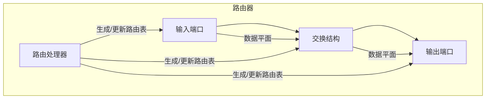
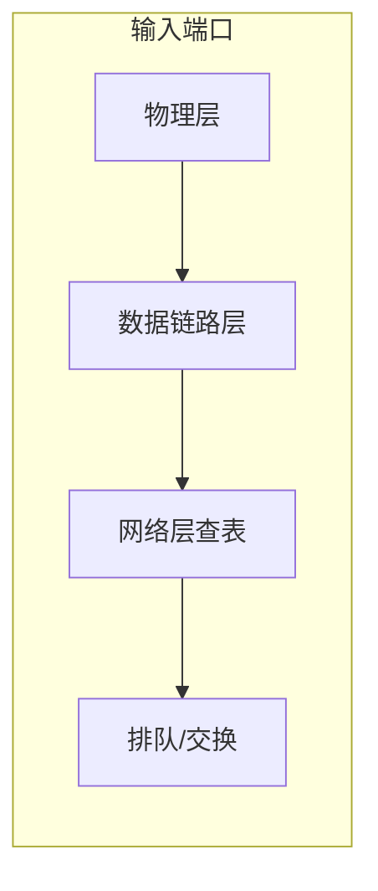
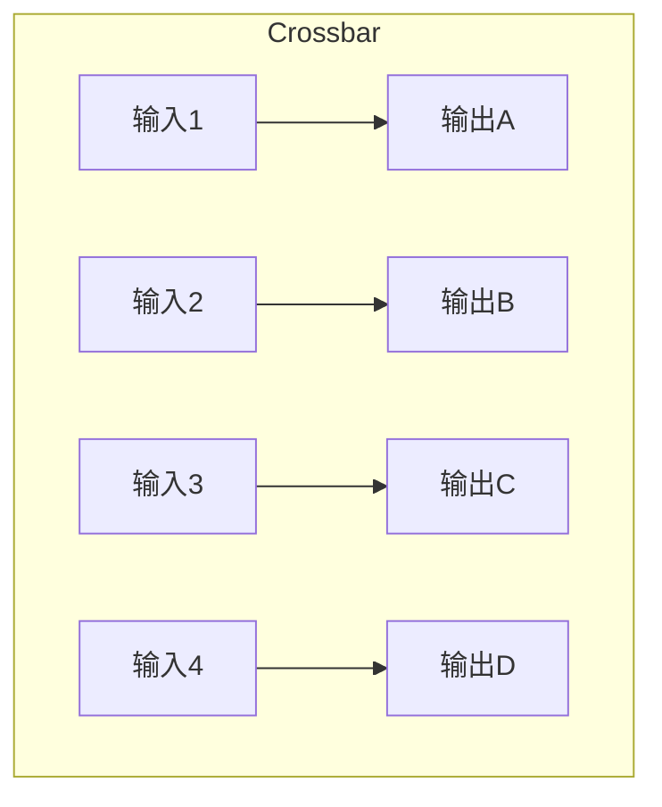
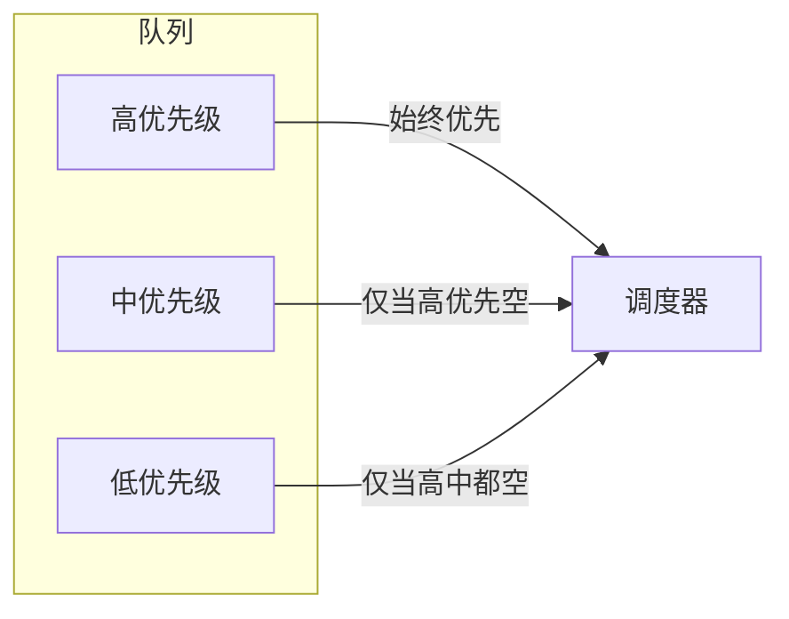
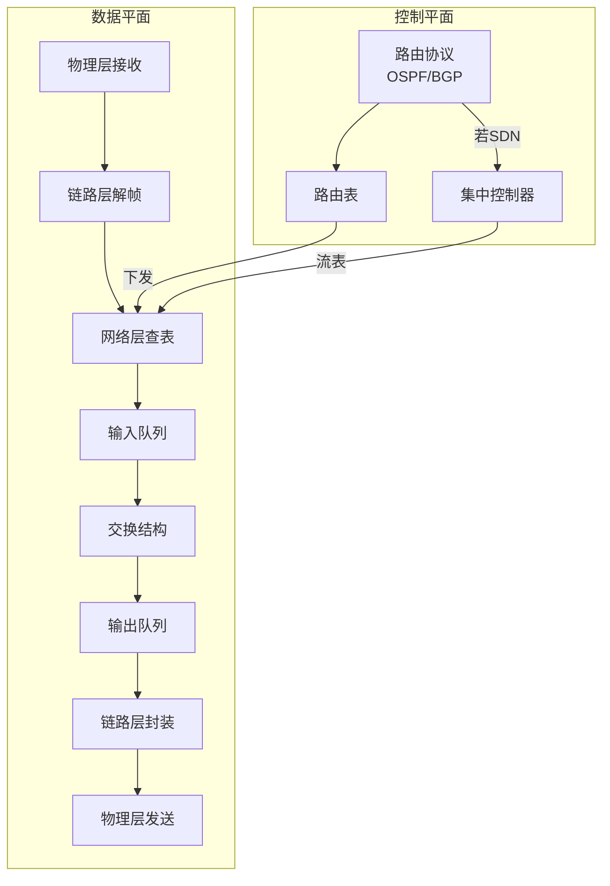

# 4.2 路由器组成 —— 网络层的核心设备

---

## 一、路由器结构概况

### 1. 通用路由器体系架构

路由器是现代互联网的核心设备，其内部结构由四大组件构成：

|组件|功能|时间尺度|
|---|---|---|
|**输入端口**|物理层接收信号、链路层解帧、网络层查表转发|纳秒级|
|**输出端口**|调度排队、链路层封装、物理层发送|纳秒级|
|**交换结构**|将分组从输入端口传送到输出端口|纳秒级|
|**路由处理器**|运行路由协议（OSPF/BGP），计算路由表|毫秒级|

**工作流程**：

1. **控制平面**：路由处理器运行路由协议，生成路由表并下发到各输入端口。
    
2. **数据平面**：输入端口根据路由表（或流表）对到达的分组进行转发决策，通过交换结构送至输出端口。
    

> 💡 **端口双向性**：实际物理端口同时承担输入和输出功能，此处为便于理解分开描述。

### 2. SDN 分组交换机

与传统路由器不同，SDN 交换机采用**控制转发分离**架构：

|对比项|传统路由器|SDN 分组交换机|
|---|---|---|
|**匹配字段**|仅目标 IP|多字段（MAC/IP/端口/TCP标志等）|
|**动作类型**|仅转发|转发/阻塞/泛洪/修改字段等|
|**控制方式**|分布式路由协议|集中式控制器下发流表|
|**可编程性**|固化行为|动态更新流表，灵活可编程|

**工作流程**：

1. 集中式控制器通过南向接口（如 OpenFlow）向交换机下发流表。
    
2. 交换机根据流表项对数据包进行多字段匹配，并执行指定动作。
    

> 📌 **部署现状**：SDN 已在数据中心、运营商网络广泛部署，成为未来网络演进的重要方向。

---

## 二、输入端口功能

输入端口是分组进入路由器的第一站，包含物理层、数据链路层、网络层处理。

### 1. 物理层

- **信号转换**：将接收到的电磁波/光信号转换为数字比特流。
    
- **时间尺度**：毫秒级。
    

### 2. 数据链路层

- **帧定界**：识别帧的起始和结束。
    
- **差错检测**：通过 CRC 校验检测比特错误。
    
- **地址过滤**：比对目标 MAC 地址，决定是否接收该帧。
    
- **解封装**：提取 IP 分组，交给网络层。
    

### 3. 网络层

- **转发决策**：
    
    - 传统方式：根据目标 IP 地址查询路由表（最长前缀匹配）。
        
    - SDN 方式：根据多字段匹配流表，执行相应动作。
        
- **排队机制**：分组可能需要在输入队列中等待交换结构。
    

### 4. 输入端口缓存

**为什么需要缓存？**

- 解决瞬时输入速率 > 交换速率的**速度不匹配**问题。
    
- 当多个输入端口同时向同一输出端口发送时，产生**多对一竞争**。
    

**关键问题**：

- **HOL 阻塞**：队首分组因竞争阻塞，导致后续分组无法转发。
    
- **溢出风险**：缓冲区满时，新到达的分组被丢弃。
    
- **设计权衡**：缓冲区过大 → 延迟增加；过小 → 丢包率上升。
    

---

## 三、交换结构

交换结构负责将分组从输入端口传送到输出端口，有三种主流实现方式。

### 1. 基于内存的交换

- **原理**：早期路由器采用通用计算机架构，分组通过系统总线两次拷贝（输入→内存→输出）。
    
- **瓶颈**：受限于内存带宽，仅适合低速环境。
    

### 2. 基于总线的交换

- **改进**：分组只需一次总线传输（在分组前添加输出端口标记）。
    
- **典型产品**：思科 1900（1 Gbps）、5600（32 Gbps）。
    
- **适用**：企业级/接入路由器，不适合骨干网。
    

### 3. 基于交叉网络的交换

- **并发优势**：支持多对端口同时交换（如 A→Y 和 B→Z 可并行）。
    
- **信元切割**：将变长分组分片为固定长度信元，便于调度。
    
- **典型产品**：思科 12000 系列，交换速率达 60 Gbps。
    
- **适用**：骨干网核心路由器。
    

**三种交换结构对比**：

|类型|并发度|典型带宽|适用场景|
|---|---|---|---|
|基于内存|低（单次）|百兆级|早期路由器|
|基于总线|中（总线带宽共享）|1~32 Gbps|企业/接入|
|基于交叉网络|高（多对并行）|数十~数百 Gbps|骨干网|

---

## 四、输出端口功能

输出端口负责将分组从交换结构取出，发送到链路上。

### 1. 输出端口缓存的必要性

- **多打一现象**：多个输入端口同时向同一输出端口发送数据，瞬时速率可能超过输出链路速率。
    
- **缓冲作用**：队列（Queue）缓存超出部分，匹配速率差异。
    
- **溢出处理**：缓冲区满时，新到达的分组被丢弃（尾部丢弃/优先级丢弃/随机丢弃）。
    

### 2. 调度机制

调度器决定队列中哪个分组优先传输，类似 CPU 进程调度。

|调度策略|原理|特点|
|---|---|---|
|**FIFO**|先进先出|简单，无优先级区分|
|**优先级调度**|高优先级队列始终优先|低优先级可能被饿死|
|**轮询调度**|循环轮流服务各队列|公平，但无权重区分|
|**加权公平队列**|按权重分配带宽|兼顾公平与优先级|

#### 优先级调度

#### 加权公平队列（WFQ）

- **权重分配**：每个队列获得的服务时间比例为 Wi∑Wj×t∑Wj​Wi​​×t。
    
- **带宽分配**：例如 1 Mbps 链路，队列权重 20%、50%、30% 则分别获得 200 Kbps、500 Kbps、300 Kbps。
    
- **优势**：既保证优先级差异，又避免低优先级业务完全被阻塞。
    

### 3. 丢弃策略

|策略|做法|适用|
|---|---|---|
|**尾部丢弃**|丢弃新到达的分组|简单，但可能引发全局同步|
|**优先级丢弃**|先丢弃低优先级分组|需标记优先级（如 DSCP）|
|**随机丢弃**|随机选择分组丢弃|避免同步，用于 RED 算法|

---

## 五、知识小结

| 知识点         | 核心内容                 | 考试重点/易混淆点   | 难度    |
| ----------- | -------------------- | ----------- | ----- |
| **路由器组成**   | 输入端口、输出端口、交换结构、路由处理器 | 输入/输出端口的双向性 | ★★★   |
| **交换结构类型**  | 基于内存、总线、交叉网络         | 并发度与适用场景    | ★★★★  |
| **SDN 交换机** | 控制转发分离，多字段匹配，可编程     | 与传统路由器对比    | ★★★★★ |
| **输入端口缓存**  | 解决速率不匹配，可能 HOL 阻塞    | 队列管理        | ★★★   |
| **输出端口缓存**  | 多打一竞争，需调度            | 与输入端缓存的区别   | ★★★   |
| **调度策略**    | FIFO、优先级、轮询、WFQ      | WFQ 的权重分配   | ★★★★  |
| **丢弃策略**    | 尾部丢弃、优先级丢弃、随机丢弃      | 应用场景        | ★★★   |
| **路由表生成**   | 路由处理器运行协议（OSPF/BGP）  | 控制平面与数据平面分离 | ★★★★  |

---

## 六、路由器工作流程全景

> 📖 **核心启示**：路由器的设计体现了**控制平面与数据平面分离**的思想。数据平面专注快速转发（硬件实现），控制平面负责路由计算（软件实现）。SDN 将这种分离推向极致，实现了网络的集中控制和可编程性。