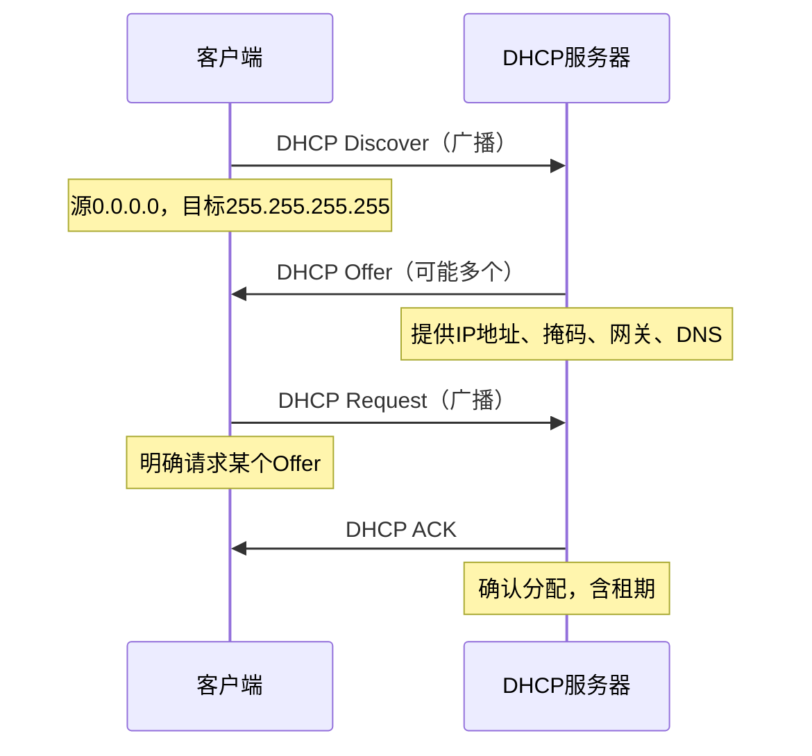

# 4.3 IP协议 —— 互联网的核心“邮递规则”

---

## 一、IP协议概述

IP协议位于**网络层**，是互联网的“核心邮递员”。它的上层是传输层（TCP/UDP），下层是链路层（以太网、Wi-Fi等）。IP协议提供**无连接、不可靠、尽力而为**的服务，不保证数据送达、顺序和正确性——这些由上层TCP负责。

---

## 二、IP数据报格式

IPv4数据报头部通常为20字节（不含选项），各字段如下：

### 关键字段详解

|字段|长度|作用|说明|
|---|---|---|---|
|**版本号**|4位|标识IP协议版本|IPv4为0100（4），IPv6为0110（6）|
|**头部长度**|4位|以4字节为单位，最小5（20字节）|当有选项时，头部长度>5|
|**服务类型**|8位|指示优先级（已废弃）|因无经济激励机制，实际很少使用|
|**总长度**|16位|整个数据报的字节数|最大65535字节|
|**标识符**|16位|标识属于同一原始数据报的所有分片|分片时相同，重组时使用|
|**标志位**|3位|DF（不分片）、MF（更多分片）|MF=1表示还有后续分片|
|**片偏移**|13位|当前分片在原始数据报中的偏移量|**以8字节为单位**|
|**TTL**|8位|生存时间，每跳减1，为0时丢弃|防止数据报无限循环|
|**上层协议**|8位|标识数据部分应交付给哪个上层协议|6=TCP，17=UDP|
|**头部校验和**|16位|仅校验头部（不包括数据）|每跳需重新计算（TTL变化）|
|**源IP地址**|32位|发送方IP地址||
|**目的IP地址**|32位|接收方IP地址||
|**选项**|可变|记录路径、时间戳等特殊功能|很少使用，增加处理开销|

> **注意**：服务类型字段因缺乏经济激励（用户总将数据标记为高优先级）而实际废弃。

---

## 三、IP分片与重组

### 1. 为什么需要分片？

**MTU**（最大传输单元）是链路层能承载的最大数据帧长度。当IP数据报长度超过出口链路的MTU时，必须**分片**。

以太网MTU = 1500字节，IPv4头部通常20字节 → 最大数据部分 = 1500 - 20 = **1480字节**。

### 2. 分片三要素

- **标识符**：所有分片使用相同的16位ID
    
- **标志位**：MF=1表示“还有更多分片”，MF=0表示“最后一个分片”
    
- **片偏移**：当前分片在原始数据报中的位置，**以8字节为单位**
    

### 3. 分片示例

原始数据报：头部20字节 + 数据3980字节 = 总长4000字节，MTU=1500，需分成3片：

|分片|头部|数据长度|偏移量（字节）|偏移量（8字节单位）|MF|
|---|---|---|---|---|---|
|第1片|20|1480|0|0|1|
|第2片|20|1480|1480|185 (1480/8)|1|
|第3片|20|1020|2960|370 (2960/8)|0|

### 4. 重组规则

- **仅在最终目标主机重组**，中间路由器不重组
    
- **相同ID**的所有分片属于同一数据报
    
- **偏移量**确定分片顺序
    
- **MF标志**识别最后一个分片
    
- **超时机制**：启动定时器，超时未收齐全部分片则**丢弃已接收的所有分片**
    

> **重要**：分片可能经不同路径到达，接收顺序可能与发送顺序无关，完全靠偏移量重组。

---

## 四、IP地址基础

### 1. IP地址标识的是接口，而非设备

- **接口**：主机/路由器与物理链路的连接点
    
- 路由器有多个接口 → 至少需要**2个IP地址**
    
- 主机通常1个IP，但可通过多网卡或虚拟接口拥有多个
    

### 2. 传统IP地址分类

|类别|前导比特|网络号位数|主机号位数|网络数|每网络主机数|地址范围|
|---|---|---|---|---|---|---|
|**A类**|0|8位（7位有效）|24位|126|16,777,214|1.0.0.0 - 126.255.255.255|
|**B类**|10|16位（14位有效）|16位|16,382|65,534|128.0.0.0 - 191.255.255.255|
|**C类**|110|24位（21位有效）|8位|约200万|254|192.0.0.0 - 223.255.255.255|
|**D类**|1110|-|-|-|-|224.0.0.0 - 239.255.255.255（组播）|
|**E类**|1111|-|-|-|-|240.0.0.0 - 255.255.255.255（保留）|

### 3. 特殊IP地址

|地址|含义|
|---|---|
|**全0主机号**|代表本网络（如 192.168.1.0）|
|**全1主机号**|子网广播地址（如 192.168.1.255）|
|**255.255.255.255**|本网络所有主机广播（受限广播）|
|**127.0.0.0/8**|回环地址（如 127.0.0.1 测试本机网络栈）|
|**0.0.0.0**|本主机（通常用于DHCP请求）|

### 4. 私有IP地址（内网地址）

这些地址**永远不会在公网路由**，只能用于局域网：

|类别|地址范围|掩码|
|---|---|---|
|A类私有|10.0.0.0 - 10.255.255.255|255.0.0.0 (/8)|
|B类私有|172.16.0.0 - 172.31.255.255|255.240.0.0 (/12)|
|C类私有|192.168.0.0 - 192.168.255.255|255.255.0.0 (/16)|

---

## 五、子网与子网掩码

### 1. 什么是子网？

**子网**是指IP地址高位部分相同的一组节点，且这些节点在IP层面**一跳可达**（无需路由器）。

**判断子网的方法**：将设备与路由器接口断开，形成的“网络孤岛”就是一个子网。

### 2. 子网掩码

子网掩码是32位二进制数，**1对应网络号，0对应主机号**。

|表示法|示例|含义|
|---|---|---|
|点分十进制|255.255.255.0|前24位为网络号|
|CIDR|/24|同上|

### 3. 子网划分示例

一个B类网络 128.10.0.0/16 可划分为多个/24子网：

- 128.10.1.0/24
    
- 128.10.2.0/24
    
- ...
    
- 128.10.255.0/24
    

---

## 六、无类域间路由（CIDR）

### 1. 分类地址的缺陷

|类别|问题|
|---|---|
|A类|过大（1600万主机），浪费严重|
|B类|适中但快速耗尽（6.5万主机）|
|C类|过小（254主机），实用性低|

### 2. CIDR的核心思想

打破固定分类，允许在**任意比特位**划分网络号与主机号。

**表示法**：`a.b.c.d/x`，x为网络前缀长度。

**示例**：`200.23.16.0/23` 表示前23位为网络号，后9位为主机号。

### 3. 路由聚合（路由聚集）

当多个连续子网有共同高位前缀时，可聚合成一个更大的网络通告。

**示例**：

- 子网：200.23.16.0/23、200.23.18.0/23、...、200.23.30.0/23
    
- 聚合：200.23.16.0/20（覆盖前20位相同的所有子网）
    

**优势**：

- 大幅减少路由表条目
    
- 提高路由通告效率
    

---

## 七、转发表与转发算法

### 1. 路由表项构成

每个路由表项包含：

|字段|说明|
|---|---|
|**目的网络**|目标子网号（主机位置零）|
|**子网掩码**|用于提取网络地址|
|**下一跳**|数据包应转发到的下一节点IP|
|**输出接口**|路由器用于转发的物理端口|
|**默认表项**|当不匹配任何具体路由时使用（默认网关）|

### 2. 最长前缀匹配算法

**步骤**：

1. 提取数据包的目标IP地址
    
2. 对每个路由表项，计算：`(目标IP) & (掩码)`
    
3. 若结果等于该表项的“目的网络”，则匹配
    
4. 选择**匹配位数最多**（前缀最长）的表项转发
    

**示例**：  
目标IP `200.23.18.7` 同时匹配：

- `200.23.16.0/20`（匹配20位）
    
- `200.23.18.0/23`（匹配23位）  
    → 选择后者（更长、更精确）
    

### 3. 转发过程

---

## 八、动态主机配置协议（DHCP）

### 1. DHCP的作用

自动分配网络配置参数：

- IP地址
    
- 子网掩码
    
- 默认网关
    
- DNS服务器
    

### 2. DHCP四步交互

### 3. 租用机制

- 每个IP分配有**租用期**（如3600秒）
    
- 到期前可**续租**（renew）保持地址不变
    
- 支持地址资源的循环利用
    

---

## 九、路由信息通告与层次编址

### 1. 路由通告

路由器向外通告：“凡是子网前缀是 X.X.X.X/Y 的，都把分组发给我，我是下一跳。”

### 2. 层次编址示例

假设一个机构从ISP获得地址块 `200.23.16.0/20`，内部划分为多个 `/23` 子网：

```text

200.23.16.0/23
200.23.18.0/23
200.23.20.0/23
...
200.23.30.0/23
```
对外，该机构只需通告 `200.23.16.0/20`，内部路由器再根据 `/23` 精确转发。

### 3. 最长前缀匹配实例

外部路由器收到目标 `200.23.18.7`，匹配 `/20` 后转发到机构边界路由器；边界路由器内部匹配 `/23` 转发到对应子网。

---

## 十、网络地址转换（NAT）

### 1. NAT的核心机制

将内网设备的私有IP转换为公网IP，通过**端口多路复用**支持多个内网设备共享一个公网IP。

**转换表示例**：

|内网IP:端口|NAT公网IP:端口|
|---|---|
|10.0.0.1:3345|138.76.29.7:5001|
|10.0.0.2:3345|138.76.29.7:5002|

### 2. NAT的作用

- **节省公网IP**：一个公网IP可支持6万多个并发连接
    
- **灵活性**：内网设备变更无需通知外界
    
- **安全性**：外部无法直接看到内网拓扑
    

### 3. NAT的争议

- **破坏端到端原则**：中间节点维护会话状态
    
- **协议层冲突**：路由器本应只处理第3层，NAT需修改第4层端口号
    
- **临时方案**：IPv6可彻底解决
    

### 4. NAT穿越

外部设备无法主动发起对内网服务的连接，解决方案：

|方案|说明|
|---|---|
|**静态映射**|手动配置固定端口映射|
|**UPnP/IGD**|动态查询/修改NAT映射|
|**中继服务器**|内网设备主动连接中继|
|**STUN/TURN**|应用层穿透协议，ICE协商|

---

## 十一、IPv6

### 1. IPv6的动机

- **地址空间耗尽**：IPv4 32位地址已分配完毕
    
- **头部处理优化**：移除校验和，减少路由器负担
    
- **分片机制改进**：禁止路由器分片，减轻核心负载
    
- **QoS支持增强**：流标签字段
    

### 2. IPv6数据报格式

**固定头部40字节**，比IPv4更高效：

|字段|长度|说明|
|---|---|---|
|版本号|4位|6（0110）|
|优先级|8位|类似IPv4的TOS|
|流标签|20位|标识数据报所属流|
|载荷长度|16位|数据部分长度|
|下一头部|8位|类似IPv4的协议字段|
|跳数限制|8位|等同于IPv4的TTL|
|源地址|128位|发送方IP|
|目的地址|128位|接收方IP|

**选项处理**：通过“下一头部”链式扩展，采用TLV结构。

### 3. IPv6的分片策略

- **禁止路由器分片**
    
- 当数据报超过出口MTU时：
    
    1. 路由器丢弃数据报
        
    2. 通过ICMPv6发送“Packet Too Big”错误
        
    3. 源主机重新分片发送
        

### 4. IPv6与IPv4的其他变化

- 移除头部校验和（提升处理速度）
    
- ICMPv6增强，整合组播管理功能
    
- 地址长度128位（地球表面每平方米可分配1000多万个地址）
    

---

## 十二、从IPv4到IPv6的过渡

### 1. 为什么不能革命式升级？

1983年NCP→TCP/IP转换仅数千台设备，可设定“标志日”停机升级。  
现在互联网有**40多亿台设备**，无法承受全局停机。

### 2. 平滑升级策略

|策略|说明|
|---|---|
|**双栈**|设备同时运行IPv4和IPv6协议栈|
|**隧道**|将IPv6分组封装在IPv4数据报中传输|
|**翻译**|协议转换（如NAT64）|

### 3. 双栈协议

- 网络边缘设备同时支持两种协议
    
- 内部通信保持协议一致性
    
- 跨协议通信时自动转换
    

### 4. 隧道技术

    A[IPv6主机] --> B[双栈路由器]
    B -->|封装IPv6 in IPv4| C[IPv4网络]
    C --> D[双栈路由器]
    D -->|解封装| E[IPv6主机]

- 将IPv6分组完整封装在IPv4数据报的载荷中
    
- 穿越IPv4网络后解封装恢复
    

### 5. IPv6应用现状

- Google：约8%用户通过IPv6访问
    
- 美国NIST：1/3政府域名支持IPv6
    
- 过渡预计需**20年以上**
    

---

## 十三、知识小结

|知识点|核心内容|考试重点/易混淆点|难度|
|---|---|---|---|
|**IP协议定位**|网络层，上承传输层，下启链路层|与路由协议的区别|★★★|
|**IP数据报格式**|20字节固定头部+选项+数据|各字段长度及作用|★★★★|
|**分片与重组**|ID+标志位+片偏移（8字节单位）|分片计算、重组失败处理|★★★★★|
|**IP地址分类**|A/B/C/D/E类，网络数/主机数计算|A类126网络，B类1.6万，C类200万|★★★★|
|**子网与掩码**|前缀相同+一跳可达；掩码提取网络号|CIDR表示法（/x）|★★★★|
|**CIDR与聚合**|打破分类，任意位划分；最长前缀匹配|路由聚合减少表项|★★★★★|
|**DHCP**|四次交互：Discover-Offer-Request-ACK|租用期、续租机制|★★★★|
|**NAT**|私有IP→公网IP+端口转换|NAT穿越问题|★★★★★|
|**IPv6**|128位地址，固定40字节头，禁止路由器分片|与IPv4头部对比|★★★★|
|**过渡技术**|双栈、隧道、翻译|渐进式升级原因|★★★★|

---

> **核心启示**：IP协议是互联网的“通用语言”。从地址编址、数据报格式，到分片重组、路由转发，再到动态配置、地址转换和下一代IPv6，IP协议的设计始终围绕着**可扩展性**和**兼容性**这两个核心目标。理解IP协议，就是理解互联网如何将全球数十亿设备连接成一个“逻辑网络”。