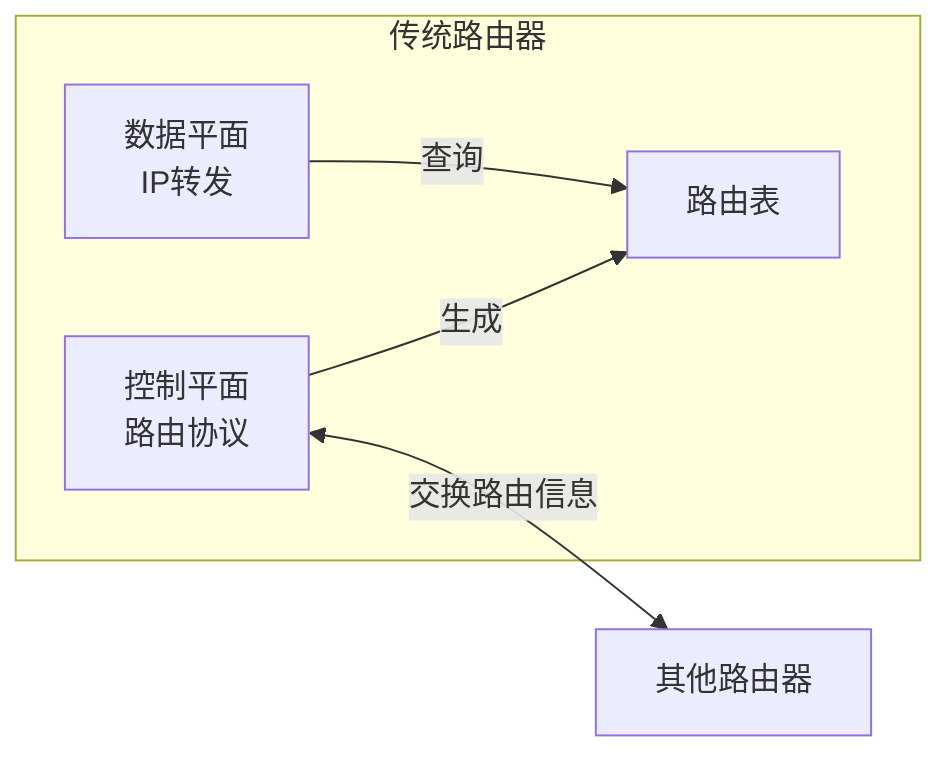
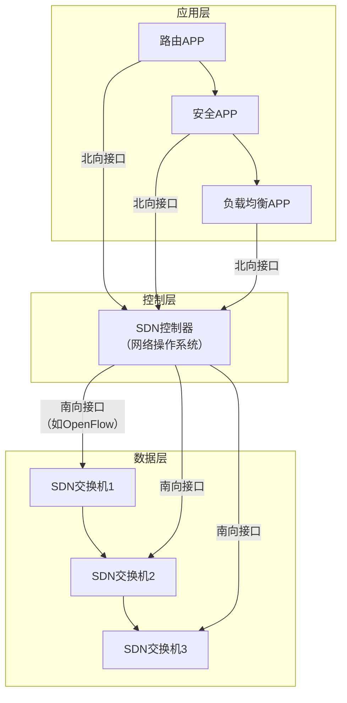

# 4.4 通用转发与SDN —— 网络可编程的革命

---

## 一、网络层的两大功能回顾

网络层分为**数据平面**和**控制平面**：

- **数据平面**：负责**分组转发**，是局部操作。路由器根据转发表将分组从输入接口转发到输出接口。
    
- **控制平面**：负责**路由计算**，是全局功能。通过路由协议（如OSPF、BGP）生成路由表，指导数据平面工作。
    

**传统实现**：每个路由器同时运行控制平面（路由协议）和数据平面（IP转发），两者**垂直集成**，紧密耦合。

---

## 二、传统IP网络的问题

随着网络规模扩大，传统架构暴露出诸多缺陷：

|问题|表现|后果|
|---|---|---|
|**设备异构性**|路由器、防火墙、NAT、负载均衡器等专用设备并存|管理员需掌握多种设备配置，维护复杂|
|**升级困难**|控制平面分布式运行，协议变更需全网升级（如IPv6过渡需数十年）|创新缓慢，成本高昂|
|**厂商锁定**|硬件与软件垂直集成，无法混合使用不同厂商组件|缺乏选择，价格垄断|
|**功能僵化**|转发仅基于目标IP，难以实现细粒度流量控制|无法灵活应对新需求（如负载均衡、安全策略）|

> 💡 **核心根源**：控制平面**分布式实现**，导致网络行为固化，难以编程。

---

## 三、SDN的核心思想：控制与转发分离

**SDN**（Software-Defined Networking）将网络的控制平面从数据平面中分离出来，实现集中控制和可编程性。

### 1. 控制平面与数据平面分离

- **控制平面**：逻辑集中（可物理分布式）的控制器，掌握全网视图，计算并下发**流表**。
    
- **数据平面**：简化的SDN交换机，仅负责执行流表指令（匹配+动作），不再运行复杂路由协议。
    

### 2. 流表匹配与动作

- **匹配字段**：不限于目标IP，可匹配**任意头部字段**（源/目标IP、MAC地址、端口号、VLAN ID、协议类型等）。
    
- **动作**：
    
    - **转发**：到指定端口
        
    - **丢弃**：直接拦截
        
    - **修改**：改写字段值（如NAT）
        
    - **上报**：将分组发送给控制器处理
        

### 3. 标准化接口

- **南向接口**：控制器与交换机通信的协议，如 **OpenFlow**。
    
- **北向接口**：控制器向上层应用提供的API，开发者可编写网络APP。
    

---

## 四、SDN带来的变革

|维度|传统网络|SDN|
|---|---|---|
|**设备角色**|路由器、防火墙等专用设备|**通用交换机**，通过流表实现多种功能|
|**控制方式**|分布式，每台设备独立决策|**集中式**，控制器全局调度|
|**转发依据**|目标IP地址|**多字段匹配**，灵活定义|
|**可编程性**|固化行为，难以更改|**动态下发流表**，快速创新|
|**升级成本**|需替换硬件或升级固件|仅需修改控制器应用，设备无需更换|

**生态效应**：类似PC产业从大型机垄断走向水平集成，SDN促使硬件、控制器、应用分层发展，形成开放竞争的市场。

---

## 五、类比：从大型机到PC的演变

- **大型机时代**（传统网络）：硬件、操作系统、应用垂直集成，厂商锁定，创新缓慢。
    
- **PC时代**（SDN）：硬件（x86）、操作系统（Windows/Linux）、应用分离，多厂商竞争，生态繁荣。
    

SDN将网络从“大型机”模式解放出来，使网络成为可编程的“平台”。

---

## 六、流量工程：SDN的杀手级应用

### 1. 传统网络的局限

假设需要将流量从 u 到 z 平均分配到两条路径：uvwz 和 uxyz。在传统IP网络中，只能通过修改链路代价间接影响路由，**无法实现精确的负载均衡**，更无法基于源端口、应用类型等细粒度分流。

### 2. SDN解决方案

通过控制器下发流表，可轻松实现：

- **多路径负载均衡**：基于源IP、端口等字段，将不同流量导向不同路径。
    
- **动态调整**：实时监控链路负载，动态修改流表，调整分流比例。
    
- **细粒度QoS**：为特定应用（如视频会议）预留带宽或标记优先级。
    

**示例**：在交换机s1上设置流表，将来自H5（10.0.3.0/24）的流量导向端口3，来自H6的流量导向端口4，即使它们目标相同。

---

## 七、OpenFlow流表详解

### 1. 流表项结构

每个流表项包含三个核心部分：

|组件|描述|
|---|---|
|**匹配字段**|分组头部需匹配的条件（支持通配符）|
|**优先级**|当多条条目匹配时，优先级高的生效|
|**动作**|对匹配分组执行的操作（转发、丢弃、修改、上报等）|
|**计数器**|统计匹配的分组数、字节数|

### 2. 匹配字段示例

OpenFlow支持多达40多个匹配字段，包括：

- 链路层：MAC地址、VLAN ID
    
- 网络层：源/目标IP地址、IP协议类型
    
- 传输层：TCP/UDP端口号
    

### 3. 动作类型

- **基础动作**：`output:port`（转发到指定端口）、`drop`（丢弃）
    
- **修改动作**：`set_field`（修改字段值，如NAT）
    
- **复杂动作**：`group`（组表，用于多播、负载均衡）、`controller`（封装并上报控制器）
    

---

## 八、SDN应用案例

### 1. 基于目标的转发（传统路由功能）


```text
匹配：IP目标地址 = 51.6.0.8
动作：转发到端口6
其他字段通配
```
### 2. 防火墙功能

```text
匹配：TCP目标端口 = 22
动作：丢弃
```

```text

匹配：源IP = 128.119.1.1
动作：丢弃
```
### 3. 路径控制

在交换机s1上设置：

```text

匹配：源IP网段 = 10.0.3.0/24，目标IP网段 = 10.0.2.0/24
动作：转发到端口3

实现H5→H3走指定路径，避免默认路由。
```
---

## 九、知识小结

| 知识点              | 核心内容                               | 考试重点/易混淆点       | 难度    |
| ---------------- | ---------------------------------- | --------------- | ----- |
| **传统网络架构**       | 控制平面与数据平面垂直集成，路由器分布式运行路由协议         | 转发 vs 路由；紧耦合    | ★★★   |
| **SDN核心思想**      | 控制与转发分离，集中控制器通过南向接口下发流表            | 逻辑集中，物理可分布      | ★★★★★ |
| **OpenFlow流表**   | 匹配字段（多字段）+ 动作（转发/丢弃/修改）+ 优先级 + 计数器 | 匹配字段的多样性，动作的灵活性 | ★★★★★ |
| **传统网络缺陷**       | 设备异构、升级困难、厂商锁定、功能僵化                | IPv6过渡缓慢的根源     | ★★★★  |
| **SDN优势**        | 可编程性、集中管理、设备标准化、生态开放               | 流量工程、动态策略部署     | ★★★★★ |
| **南向接口 vs 北向接口** | 南向：控制器-交换机通信；北向：控制器-应用交互           | OpenFlow是南向接口典型 | ★★★★  |
| **流量工程**         | 传统难实现多路径，SDN可基于多字段精确控制             | 负载均衡、QoS策略      | ★★★★★ |
| **类比**           | 从大型机（垂直集成）到PC（水平集成）的演变             | SDN重构网络产业       | ★★★   |

---

## 十、总结

SDN并非一种具体协议，而是一种**网络设计范式**。它将网络的控制权从分散的设备中抽离，集中到可编程的控制器上，使得网络能够像软件一样灵活演进。

**未来展望**：随着SDN的普及，网络将变得更加敏捷、智能，成为支撑云计算、大数据、物联网的坚实基础。