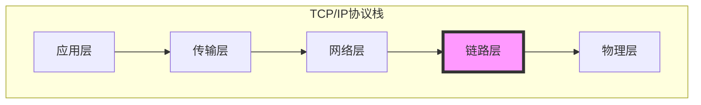
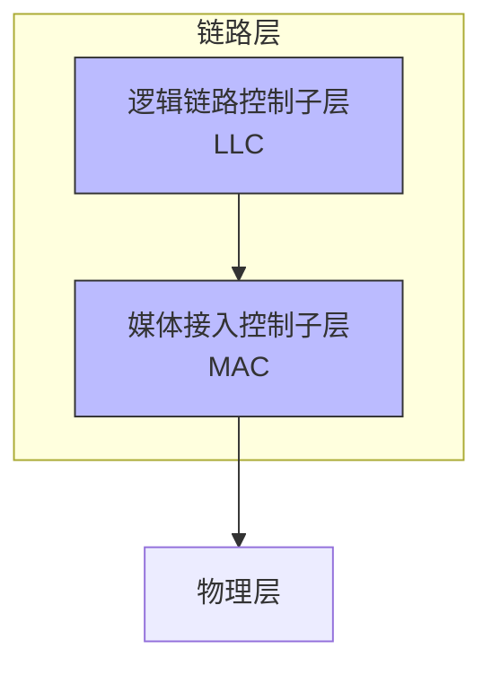
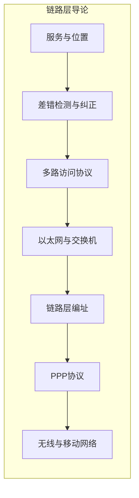

# 5.1 链路层导论 —— 从网络层到物理层的桥梁

---

## 一、链路层在协议栈中的位置

链路层位于**网络层之下，物理层之上**，是TCP/IP协议栈中的**第二层**（网络接口层）。它的核心任务是将网络层的IP数据报**封装成帧**，通过物理链路在相邻节点间传输。


> 💡 **理解关键**：网络层提供**主机到主机**的通信，而链路层提供**节点到节点**（相邻设备）的通信。就像快递从北京寄到上海，网络层规划整体路线，链路层负责“北京→天津”“天津→济南”等每一段的实际运输。

---

## 二、链路层提供的服务

### 1. 核心服务

|服务|描述|实现方式|
|---|---|---|
|**成帧**|将网络层数据报封装成帧，添加头部和尾部|帧定界符、长度字段|
|**链路接入**|控制节点何时在链路上传输帧|MAC协议（如CSMA/CD、CSMA/CA）|
|**可靠交付**|在相邻节点间保证无差错传输（可选）|确认+重传（如无线链路）|
|**差错检测与纠正**|检测比特错误，部分可纠正|CRC校验、校验和|

### 2. 链路层在何处实现？

链路层功能**主要在网络接口卡中实现**，包括：

- **硬件部分**：NIC（网卡）负责成帧、MAC协议、CRC计算等实时任务
    
- **软件部分**：设备驱动程序负责与操作系统交互，处理更高层逻辑
    

---

## 三、链路层的关键概念

### 1. 节点与链路

- **节点**：运行链路层协议的任何设备（主机、路由器、交换机）
    
- **链路**：相邻节点间的通信通道（有线/无线）
    

### 2. 两种链路类型

|类型|特点|典型技术|
|---|---|---|
|**点对点链路**|单一发送方，单一接收方|PPP（点对点协议）|
|**广播链路**|多个节点共享同一信道|以太网、WiFi|

### 3. 链路层帧结构

通用帧结构包含三个部分：

```text

+----------------+------------------+----------------+
| 帧头部         | 数据部分          | 帧尾部         |
| (链路层地址等) | (网络层数据报)     | (差错检测码)   |
+----------------+------------------+----------------+
```
---

## 四、链路层子层划分

IEEE 802标准将链路层分为两个子层：


|子层|功能|典型协议|
|---|---|---|
|**LLC**|向上层提供统一接口，实现复用|802.2|
|**MAC**|控制介质访问，处理帧传输|Ethernet、802.11|

---

## 五、链路层提供的服务类型

### 1. 无确认的无连接服务

- **特点**：发送帧不确认，不重传，适合高可靠链路
    
- **典型**：有线以太网
    

### 2. 有确认的无连接服务

- **特点**：每帧单独确认，超时重传，适合不可靠链路
    
- **典型**：802.11无线网络（WiFi）
    

### 3. 有确认的面向连接服务

- **特点**：建立连接，确认每个帧，保证按序交付
    
- **典型**：某些可靠链路层协议
    

---

## 六、本章学习路径

**本章将依次深入**：

1. 差错检测与纠正技术（CRC、校验和）
    
2. 多路访问协议（CSMA/CD、CSMA/CA）
    
3. 以太网和交换机工作原理
    
4. MAC地址与ARP协议
    
5. 点对点协议（PPP）
    
6. 无线链路与移动网络基础
    

---

## 七、知识小结

|知识点|核心内容|考试重点/易混淆点|难度|
|---|---|---|---|
|**链路层定位**|网络层之下，物理层之上，实现相邻节点通信|与网络层“主机到主机”的区别|★★★|
|**核心服务**|成帧、链路接入、可靠交付、差错检测|可靠交付仅部分链路支持|★★★|
|**实现位置**|网卡硬件 + 驱动程序软件|硬件与软件的职责划分|★★|
|**链路类型**|点对点链路 vs 广播链路|PPP vs 以太网|★★★|
|**子层划分**|LLC（逻辑链路控制）和 MAC（媒体接入控制）|802标准中的分层|★★★|
|**服务类型**|无确认无连接、有确认无连接、有确认面向连接|以太网（无确认）vs WiFi（有确认）|★★★★|
|**帧结构**|头部 + 数据 + 尾部|地址和差错检测字段的位置|★★★|

---

## 八、总结

链路层是网络协议栈中**最贴近硬件**的一层，它负责将数据可靠地从一个节点传送到相邻节点。理解链路层的工作机制，是掌握整个网络通信的基础。接下来的章节将逐一深入每个关键技术点。

> **预习提示**：下一节将学习**差错检测与纠正**技术，包括奇偶校验、校验和、CRC循环冗余校验，以及它们在链路层和更高层的应用。