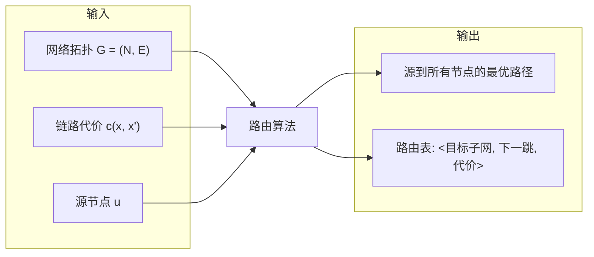
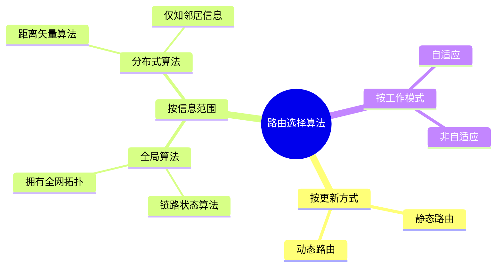
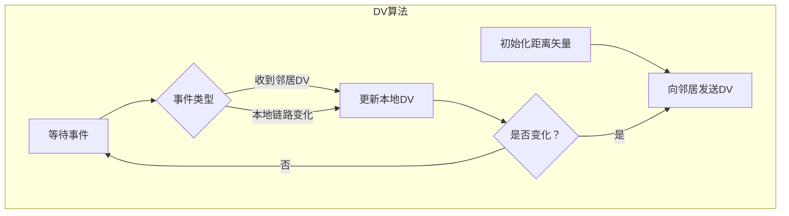

# 5.2 路由选择算法 —— 网络层的“导航系统”

---

## 一、路由选择算法概述

### 1. 什么是路由选择？

路由选择是在网络拓扑中，按照传输延迟、跳数等指标，找到源节点到目标节点的**较优路径**的过程。

- **路径构成**：一系列路由器的序列，分组按此序列从源主机传输到目标主机。
    
- **计算单位**：以**子网**为单位计算路由，通过**子网聚合**大幅降低计算规模。
    
- **指标类型**：
    
    - **基础指标**：跳数（通常设为1）、延迟、费用、队列长度
        
    - **复合指标**：加权平均值，反映网络运营的侧重点
        

### 2. 路由算法的输入与输出

- **网络拓扑**：节点集合 `N`（路由器/子网），边集合 `E`（连接链路）
    
- **代价函数**：`c(x, x')` 表示穿过链路的代价，典型取值包括跳数、延迟倒数、带宽倒数等
    
- **输出内容**：源节点到所有其他节点的最优路径，形成**汇集树**
    

### 3. 最优化原则与汇集树

> **最优化原则**：从所有源节点到所有目标节点的最优路径集合，必然形成一棵以目标节点为根的**树**——称为**汇集树**。

- **汇集树特性**：
    
    - 每个节点到目标节点只有**唯一最优路径**
        
    - 即使物理拓扑存在环路，汇集树也**天然无环**
        
- **路由表映射**：每条路径对应一个表项：`<子网掩码，下一跳地址，输出接口>`
    

### 4. 路由选择算法的六大原则

|原则|含义|类比|
|---|---|---|
|**正确性**|分组必须正确到达目标，路由表需包含所有可达站点|京东包裹不能误发至其他子网|
|**简单性**|避免过度计算消耗资源，平衡最优性与开销|警用通道不应占用2/3道路资源|
|**健壮性**|适应网络拓扑和负载变化|链路断开时能快速切换路径|
|**稳定性**|避免路由频繁摇摆|导航不会每秒重新规划|
|**公平性**|对所有分组一视同仁|符合IP“尽力而为”模型|
|**最优性**|实际采用次优解平衡性能|不追求理论最优，保证实用性|

---

## 二、路由算法分类

### 1. 静态路由 vs 动态路由

|类型|特点|适用场景|
|---|---|---|
|**静态路由**|管理员手动配置，不随网络变化调整|小型稳定网络|
|**动态路由**|自动适应拓扑和负载变化|大型复杂网络|

### 2. 全局算法 vs 分布式算法

|类型|代表算法|信息范围|计算方式|
|---|---|---|---|
|**全局算法**|链路状态（LS）|拥有全网拓扑（上帝视角）|集中式计算|
|**分布式算法**|距离矢量（DV）|仅知邻居信息|迭代式交换|

---

## 三、链路状态路由选择算法

### 1. 核心思想

每个节点通过**泛洪**获取全网拓扑信息，然后独立运行 **Dijkstra算法** 计算最短路径。

### 2. 发现邻居与测量代价

- **发现邻居**：向所有端口发送 **HELLO广播分组**，邻居收到后回复 `HELLO back`
    
- **测量代价**：发送 **ECHO分组** 并计算往返时间，估算延迟
    

### 3. LS分组结构

每个LS分组包含：

|字段|作用|
|---|---|
|**发送者名称**|标识产生该分组的节点|
|**序号**|区分新旧LS分组，避免重复处理|
|**年龄**|每转发一次减1，为0时丢弃|
|**邻居列表**|包含邻居节点及到该节点的代价|

### 4. 泛洪的可靠性保障

- **序号机制**：记录已转发的 `<源，序号>` 对，避免重复转发
    
- **确认重传**：接收方必须发送ACK，未收到确认会持续重发
    
- **年龄字段**：防止无限循环，每跳减1，归零丢弃
    

### 5. Dijkstra算法详解

**符号定义**：

- `c(i, j)`：节点i到j的直接链路代价
    
- `D(v)`：源节点到v的当前路径代价
    
- `p(v)`：v的前驱节点
    
- `N'`：已确定最优路径的节点集合（永久节点）
    

**算法步骤**：

1. **初始化**：源节点 `s` 加入 `N'`，`D(s)=0`；其他节点 `D(v)=∞`
    
2. **循环**：从不在 `N'` 的节点中选出 `D(w)` 最小的节点 `w`
    
3. **更新**：对 `w` 的每个邻居 `v`，若 `D(v) > D(w) + c(w, v)`，则更新 `D(v)` 并将 `p(v)` 设为 `w`
    
4. 将 `w` 加入 `N'`
    
5. 重复直到所有节点加入 `N'`
    

> 💡 **形象比喻**：永久节点是“已搞定”的节点，每次迭代“拷打”临时节点，选择表现最好的转为永久。

**时间复杂度**：

- 基础实现：O(n²)
    
- 优化实现（优先队列）：O(m + n log n)，m为边数
    

### 6. LS算法的典型协议

- **OSPF**（开放最短路径优先）：Internet中最常用的链路状态协议
    
- **IS-IS**：用于Internet主干网的中间系统协议
    

### 7. 路由震荡问题

当链路代价反映拥塞程度时，可能出现**震荡**：

1. 初始：所有流量选择轻载路径
    
2. 结果：轻载路径因流量集中变为重载
    
3. 重新计算：流量切换到新的轻载路径
    
4. 循环：导致持续的路由切换
    

> **根本原因**：算法响应速度与网络状态变化速度不匹配，所有节点同步计算导致集体震荡。

---

## 四、距离矢量路由选择算法

### 1. 核心思想

每个节点维护一个**距离矢量** `D_x = [D_x(y): y ∈ N]`，表示节点x到所有目标y的最小代价估计值。节点定期与邻居交换距离矢量，使用 **Bellman-Ford方程** 更新。

### 2. Bellman-Ford方程

$$Dx(y)=min⁡v∈邻居(x){c(x,v)+Dv(y)}$$

- `c(x, v)`：x到邻居v的直接链路代价
    
- `D_v(y)`：邻居v声称的到目标y的代价
    

### 3. DV算法工作流程

### 4. 计算示例

节点J有邻居A(8ms)、I(10ms)、H(12ms)、K(6ms)，从邻居获得到目标G的代价：

|邻居|邻居到G代价|J经该邻居到G代价|
|---|---|---|
|A|18|8 + 18 = 26|
|I|31|10 + 31 = 41|
|H|6|12 + 6 = **18**|
|K|31|6 + 31 = 37|

**结果**：J到G的最优路径下一跳为H，总代价18ms。

### 5. 好消息传得快，坏消息传得慢

- **好消息**：链路代价降低或新链路加入时，信息快速传播（每交换周期前进一跳）
    
- **坏消息**：链路断开或代价增加时，收敛缓慢，可能产生**路由环路**
    

### 6. 无穷计数问题

**场景**：A-B链路断开，但B仍从C处获知“C可以到A”（实际C到A需经过B），形成环路 `B→C→B`。

**解决方案**：

#### （1）水平分裂

- **规则**：如果节点X通过邻居Y到达目标Z，则X在向Y通告时，将到Z的代价设为 **∞**（不可达）。
    
- **比喻**：“关公面前不卖大刀”——不把路由信息反向传给提供该信息的邻居。
    
- **局限性**：在环状拓扑中仍可能失效，不能完全杜绝坏消息传播慢的问题。
    

#### （2）毒性逆转

- 水平分裂的增强版：不仅设为∞，还会明确告知“通过你到达该目标的代价为∞”
    

#### （3）触发更新

- 一旦发现路由变化，立即发送更新，不等待周期性交换
    

### 7. DV算法的典型协议

- **RIP**（路由信息协议）：基于跳数，最大15跳
    
- **IGRP/EIGRP**：思科私有协议，增强型距离矢量
    

---

## 五、LS算法 vs DV算法：全面对比

|对比维度|链路状态算法（LS）|距离矢量算法（DV）|
|---|---|---|
|**信息范围**|全网拓扑|仅邻居信息|
|**消息复杂度**|**高**（全网泛洪）|**低**（仅邻居交换）|
|**收敛速度**|**快**（一次计算）|**慢**（迭代收敛）|
|**时间复杂度**|O(n²) 或 O(m log n)|每节点 O(邻居数 × 目标数)|
|**路由环路**|天然无环|可能产生临时环路|
|**健壮性**|**强**（错误影响局部）|**弱**（错误可能全网扩散）|
|**典型协议**|OSPF、IS-IS|RIP、IGRP|
|**适用网络**|大型复杂网络|小型简单网络|

> 💡 **错误传播对比**：
> 
> - LS中，某个节点通告错误代价，仅影响经过该节点的路径
>     
> - DV中，错误节点通告“到所有节点代价为零”，邻居接收并传播，可能形成“洼地效应”，吸引全网流量
>     

---

## 六、知识小结

|知识点|核心内容|考试重点/易混淆点|难度|
|---|---|---|---|
|**路由基本概念**|以子网为单位，在拓扑图中寻找较优路径|汇集树、代价指标|★★★|
|**路由算法分类**|静态/动态、全局/分布式、自适应/非自适应|LS（全局） vs DV（分布式）|★★★★|
|**链路状态算法**|泛洪LS分组 → Dijkstra计算|邻居发现、LSP结构、可靠泛洪|★★★★★|
|**Dijkstra算法**|贪心构建最短路径树|初始化、节点选拔、更新规则|★★★★★|
|**距离矢量算法**|邻居交换DV → Bellman-Ford更新|迭代收敛、无穷计数|★★★★★|
|**Bellman-Ford方程**|Dx(y) = min{c(x,v) + Dv(y)}|公式应用、递归依赖|★★★★★|
|**无穷计数问题**|坏消息传播慢导致路由环路|水平分裂、毒性逆转|★★★★★|
|**LS vs DV对比**|消息复杂度、收敛速度、健壮性|三大维度对比表|★★★★★|
|**路由震荡**|代价反映拥塞时可能产生振荡|稳定性设计|★★★★|
|**典型协议**|OSPF（LS）、RIP（DV）|协议归属|★★★★|

---

> **核心启示**：路由选择算法是网络层的“大脑”。LS算法像拥有**全局地图**的规划师，计算精确但开销大；DV算法像**邻里打听**的旅行者，简单高效但可能走弯路。理解两者的权衡，是掌握网络层控制平面的关键。