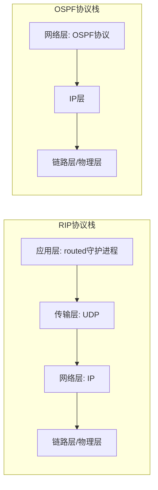

# 5.3 自治系统内部的路由选择 —— RIP 与 OSPF（扩展版）

---

## 一、内部网关协议概述

在一个自治系统（AS）内部运行的路由协议统称为 **内部网关协议**（Interior Gateway Protocol, IGP）。IGP 的目标是在 AS 内所有路由器之间交换路由信息，计算到达各个子网的最佳路径。本章深入讲解两种最经典的 IGP：

- **RIP**（路由信息协议）：基于**距离矢量算法**，实现简单，但功能有限，适用于小型网络。
    
- **OSPF**（开放最短路径优先）：基于**链路状态算法**，功能强大，可扩展性好，是大型企业网络的首选。
    

理解这两种协议的异同，是掌握网络层路由机制的关键。

---

## 二、RIP：距离矢量协议的典型代表

### 1. RIP 基本工作原理

**RIP**（Routing Information Protocol）最早在 1982 年随 BSD UNIX 发行，至今仍在很多小型网络中使用。

- **算法基础**：**距离矢量**（Distance Vector）算法。
    
- **度量标准**：**跳数**（hop count），每条链路代价为 1。
    
- **最大跳数**：15 跳；16 跳表示网络不可达。
    
- **路由更新**：每 **30 秒** 向所有邻居广播完整的路由表。
    
- **通告格式**：每个 RIP 报文最多包含 **25 个** 路由条目（目标 IP 网络 + 跳数）。
    
- **传输协议**：基于 **UDP 端口 520**，RIP 作为应用层守护进程 `routed` 运行。
    

> **示例**：路由器 A 发送的 RIP 通告可能包含：  
> `网络 10.1.1.0/24：跳数 1；网络 10.2.0.0/16：跳数 2；网络 192.168.3.0/24：跳数 3`。

### 2. RIP 路由表的维护与更新

每个 RIP 路由器维护一张路由表，每个条目包括：**目标网络、下一跳路由器、跳数**。当收到邻居的通告时，路由器根据**距离矢量算法**更新自己的路由表：

- 对通告中的每个目标网络，路由器计算新路径代价 = **本路由器到邻居的代价（通常为 1） + 邻居到目标的跳数**。
    
- 如果新代价小于当前路由表中的代价，则用新路径替换，下一跳指向该邻居。
    
- 如果新代价等于当前代价，RIP 通常保留原有路径（只有某些实现支持等价多路径，但 RIP 基本不支持负载均衡）。
    
- 如果新代价更大，则忽略。
    

### 3. RIP 的定时器与链路失效处理

RIP 使用三个主要定时器来维护路由信息的有效性：

|定时器|默认值|作用|
|---|---|---|
|**更新定时器**|30 秒|周期性发送路由更新|
|**失效定时器**|180 秒|若某路由条目在此时间内未收到更新，则标记为无效（跳数设为 16）|
|**刷新定时器**|240 秒|若无效路由在 240 秒内仍无更新，则从路由表中删除|

当一条链路或邻居失效时：

- 路由器等待最多 **180 秒**（6 个更新周期）来检测失效。
    
- 一旦检测到失效，立即将该路由的跳数改为 **16**，并通过**触发更新**（Triggered Update）马上通告给所有邻居，无需等待 30 秒。
    
- 邻居收到跳数 16 的路由后，同样更新自己的路由表，并可能继续传播。为了加速收敛，RIP 还采用**毒性逆转**（Poison Reverse）：当路由器通过某个邻居学到某条路由时，向该邻居通告该路由的跳数为 16，从而避免形成环路。
    

### 4. 环路避免机制详解

除了毒性逆转，RIP 还使用**水平分裂**（Split Horizon）：不将从某个邻居学到的路由再通告回该邻居。水平分裂和毒性逆转结合能有效防止多数环路。

**示例**：假设网络拓扑 `R1 — R2 — R3`，其中 R2 通过 R1 学到网络 A，跳数 2。如果 R2 应用水平分裂，它不会向 R1 通告网络 A（因为是从 R1 学到的），从而避免 R1 误认为可以通过 R2 到达 A。若同时启用毒性逆转，R2 会明确告诉 R1“通过我到 A 的跳数为 16”，更快清除可能的路由环路。

### 5. RIP 版本差异

- **RIPv1**（RFC 1058）：
    
    - 有类别路由协议，不支持子网掩码，不能用于 CIDR。
        
    - 广播更新（255.255.255.255）。
        
    - 无认证机制。
        
- **RIPv2**（RFC 2453）：
    
    - 支持 VLSM 和 CIDR，通告中携带子网掩码。
        
    - 使用组播地址 224.0.0.9 更新。
        
    - 支持明文和 MD5 认证，提高安全性。
        

### 6. RIP 的局限性

- **网络直径限制为 15 跳**，无法用于大型网络。
    
- **收敛速度慢**，尤其是在链路失效时，坏消息传播缓慢（尽管有触发更新，但仍需多轮交换）。
    
- **度量单一**，仅基于跳数，不能反映链路带宽、延迟等实际质量。
    
- **广播开销大**，尤其在有多条路由的大网络中，30 秒的广播会消耗不少带宽。
    

---

## 三、OSPF：链路状态协议的开源标准

### 1. OSPF 核心特性

**OSPF**（Open Shortest Path First）是 IETF 开发的开放标准链路状态路由协议，是目前大中型企业网络的主流 IGP。

- **算法基础**：**链路状态**（LS）算法。
    
- **路由计算**：每个路由器通过**泛洪**获得全网的链路状态数据库，然后独立运行 **Dijkstra 算法**计算到所有目标的最短路径树。
    
- **报文传输**：OSPF 报文直接封装在 **IP 数据报**中，协议号 **89**，不依赖 TCP 或 UDP。
    
- **关键特性**：
    
    - **快速收敛**：拓扑变化立即触发更新，秒级（甚至毫秒级）收敛。
        
    - **无环路由**：链路状态数据库保证所有路由器视图一致，SPF 算法天然无环。
        
    - **支持 CIDR**：完全支持 VLSM 和路由汇总。
        
    - **等价多路径**（ECMP）：可同时使用多条代价相等的路径，实现负载均衡。
        
    - **认证**：支持简单口令和 MD5 认证。
        
    - **分层路由**：通过区域划分减小路由表规模，增强可扩展性。
        

### 2. OSPF 的报文类型与邻居建立

OSPF 使用五种不同类型的报文：

|类型|名称|作用|
|---|---|---|
|1|Hello|发现邻居、维护邻接关系|
|2|Database Description (DD)|描述链路状态数据库的摘要|
|3|Link State Request (LSR)|请求邻居发送指定的完整 LSA|
|4|Link State Update (LSU)|发送 LSA 给邻居|
|5|Link State Ack (LSAck)|确认收到 LSA|

**邻居建立过程**（以广播网络为例）：

1. 路由器通过组播地址 224.0.0.5 发送 **Hello** 报文，其中包含自己的路由器 ID 和已知邻居列表。
    
2. 若两个路由器在同一个网段，且 Hello 包中的参数（如 Hello 间隔、失效间隔、区域 ID 等）匹配，则进入 **2-Way** 状态。
    
3. 在广播网络中，会选举 **指定路由器**（DR）和 **备用指定路由器**（BDR），其他路由器只与 DR/BDR 建立完全的邻接关系，减少邻接数量。
    
4. 选举完成后，路由器与 DR/BDR 进入 **ExStart** 状态，协商主/从关系，然后交换 DD 报文描述数据库摘要。
    
5. 通过 LSR/LSU 交换缺少的 LSA，最终所有路由器数据库同步，达到 **Full** 状态。
    

### 3. 链路状态通告（LSA）类型详解

OSPF 定义了多种 LSA 类型，每种承载不同的路由信息：

|类型|名称|描述|泛洪范围|
|---|---|---|---|
|1|路由器 LSA|描述本路由器的直连链路和邻居|本区域|
|2|网络 LSA|由 DR 生成，描述广播网络上的所有路由器|本区域|
|3|网络汇总 LSA|由 ABR 生成，通告其他区域的路由（默认路由）|整个 AS|
|4|ASBR 汇总 LSA|由 ABR 生成，通告 ASBR 的位置|整个 AS|
|5|AS 外部 LSA|由 ASBR 生成，通告引入的外部路由|整个 AS|
|6|组成员 LSA|MOSPF 使用|本区域|
|7|NSSA 外部 LSA|用于 NSSA 区域通告外部路由|NSSA 区域|

### 4. OSPF 的 Dijkstra 算法计算示例

每个路由器根据 LSDB 运行 Dijkstra 算法，生成以自己为根的最短路径树。算法步骤如下（以路由器 X 为例）：

1. **初始化**：将 X 自己加入最短路径树，距离为 0。所有邻居为候选节点，距离为链路代价。
    
2. **迭代**：从候选节点中选择距离最小的节点 Y，将其加入最短路径树。对于 Y 的每个邻居 Z：
    
    - 若 Z 已在树中，忽略。
        
    - 若 Z 不在树中也不在候选集中，将 Z 加入候选集，距离 = X→Y 距离 + Y→Z 代价，下一跳为 X 到 Y 的下一跳。
        
    - 若 Z 已在候选集中，比较新距离与原候选距离，若新距离更小，则更新候选距离和下一跳信息。
        
3. 重复步骤 2 直到所有节点加入树。
    

最终得到以 X 为根的最短路径树，从而可导出到达每个子网的下一跳。

### 5. OSPF 的区域类型与路由汇总

OSPF 的区域划分为：

- **骨干区域（Area 0）**：所有非骨干区域必须与 Area 0 直接相连，形成星型拓扑。
    
- **标准区域**：普通区域，接收区域内 LSA、汇总 LSA 和外部 LSA。
    
- **末节区域**（Stub Area）：不接收外部 LSA（类型 5），默认使用默认路由访问外部。
    
- **完全末节区域**（Totally Stubby）：不接收类型 3、4、5 LSA，只接收类型 1、2 和一条默认路由。
    
- **非纯末节区域**（NSSA）：允许引入外部路由（用类型 7 表示），但不接收来自其他区域的外部 LSA。
    

ABR（区域边界路由器）可以对区域内的路由进行**汇总**（Summarization），减少路由条目。例如，将 10.1.0.0/16 内的多个子网汇总成一条 10.1.0.0/16 通告给其他区域。

### 6. OSPF 的认证配置示例

OSPF 支持三种认证方式：

- **空认证**：不认证。
    
- **明文密码**：不安全，仅用于测试。
    
- **MD5 认证**：推荐使用。
    

示例（Cisco IOS）：


```cisco

interface GigabitEthernet0/0
 ip ospf authentication message-digest
 ip ospf message-digest-key 1 md5 MySecretKey
!
router ospf 1
 network 192.168.1.0 0.0.0.255 area 0
 area 0 authentication message-digest
```
### 7. OSPFv3 与 IPv6

OSPFv3（RFC 5340）是为 IPv6 设计的版本，运行在链路本地地址上，依然基于链路状态算法，但做了以下改进：

- 移除了协议中的 IP 地址相关语义，LSA 中不再包含 IPv4 地址。
    
- 新增了处理 IPv6 地址的能力。
    
- 认证功能被 IPv6 的 IPSec 替代。
    

---

## 四、RIP 与 OSPF 综合对比

|对比维度|RIP|OSPF|
|---|---|---|
|**算法类型**|距离矢量|链路状态|
|**度量标准**|跳数（最大 15）|代价（基于带宽/延迟/可配置）|
|**收敛速度**|慢（分钟级）|快（秒级，可调至毫秒级）|
|**路由计算**|分布式 Bellman-Ford|全局 Dijkstra|
|**环路避免**|水平分裂、毒性逆转、抑制计时器|算法本身无环（SPF 树）|
|**层次化**|无|支持区域划分（Area 0 + 普通区域）|
|**多路径支持**|不支持（通常单一路径）|支持等价多路径（ECMP）|
|**CIDR 支持**|RIPv1 不支持，RIPv2 支持|完全支持|
|**安全认证**|RIPv2 支持简单/MD5|支持明文/MD5 认证|
|**传输方式**|UDP（应用层进程）|直接封装在 IP（协议号 89）|
|**报文开销**|周期性广播整个路由表|仅变化时泛洪 LSA，周期性 Hello|
|**可扩展性**|差（网络直径 15 跳）|强（支持数千台路由器）|
|**适用网络**|小型网络（家庭/小型办公室）|中大型企业网络、数据中心|

---

## 五、RIP 与 OSPF 的协议栈位置图示

**说明**：

- RIP 作为应用层进程，通过 UDP 传输路由信息，其路由计算仍属网络层功能，但实现位于应用层。
    
- OSPF 直接运行于 IP 之上，作为网络层的一部分，更高效，更贴近网络核心。
    

---

## 六、配置示例（供理解参考）

### RIP（RIPv2）配置（Cisco IOS）

```cisco

router rip
 version 2
 network 10.0.0.0
 network 192.168.1.0
 no auto-summary
```
### OSPF 基本配置

```cisco

router ospf 1
 router-id 1.1.1.1
 network 10.1.1.0 0.0.0.255 area 0
 network 10.2.0.0 0.0.255.255 area 1
```
### 查看路由表

- RIP：`show ip route rip`
    
- OSPF：`show ip route ospf`
    

---

## 七、知识小结（扩展版）

|知识点|核心内容|考试重点/易混淆点|难度|
|---|---|---|---|
|**RIP 基本原理**|DV 算法，跳数 ≤15，30 秒广播，UDP 520|最大跳数 15，16 为无穷大|★★★|
|**RIP 定时器**|更新（30s）、失效（180s）、刷新（240s）|失效后跳数设 16，触发更新|★★★|
|**RIP 防环机制**|水平分裂、毒性逆转、抑制计时器|毒性逆转（跳数 16）快速清除坏路由|★★★★|
|**RIP 版本差异**|v1（有类别，广播），v2（CIDR，组播，认证）|v2 支持子网掩码|★★★|
|**OSPF 基本特性**|LS 算法，Dijkstra，IP 协议 89，ECMP，认证|协议号 89，不基于 TCP/UDP|★★★★|
|**OSPF 报文类型**|Hello、DD、LSR、LSU、LSAck|邻接建立过程|★★★★★|
|**LSA 类型**|1~7 型，各自作用不同|类型 3/4/5 跨区域，类型 7 用于 NSSA|★★★★★|
|**OSPF 区域与路由器角色**|Area 0（骨干）、ABR、ASBR、内部路由器|跨区域必须经过 Area 0|★★★★★|
|**OSPF 特殊区域**|Stub、Totally Stub、NSSA|对外部路由的限制|★★★★★|
|**RIP vs OSPF 对比**|算法、度量、收敛、层次化、可扩展性|详细对比表|★★★★★|

---

## 八、总结与展望

RIP 和 OSPF 代表了两种截然不同的路由设计哲学：

- **RIP**：简单、易配置，但功能有限，适合小型网络。
    
- **OSPF**：复杂、功能强大，通过层次化设计和快速收敛支持大型网络。
    

虽然现代网络中 OSPF 已成为主流，但 RIP 仍在许多老旧系统和简单环境中存在。理解它们的工作原理，不仅有助于网络设计，也为学习更高级的路由协议（如 BGP）打下坚实基础。

未来，随着 SDN 的普及，集中式路由控制可能逐渐取代分布式 IGP，但 OSPF 等协议仍将在很长一段时间内作为底层基础存在。