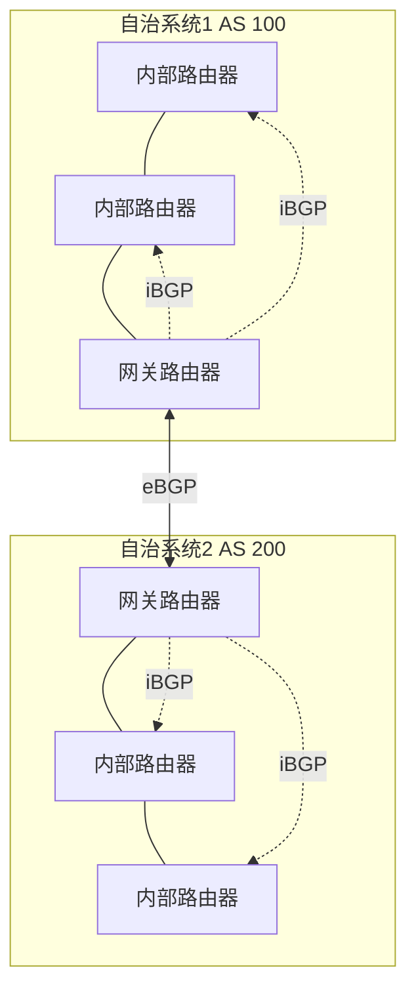
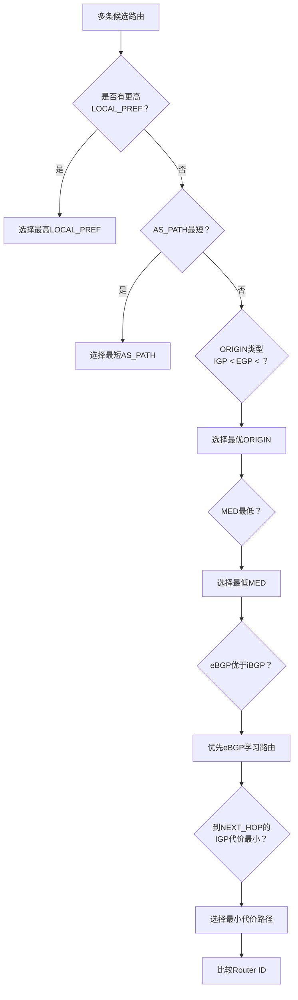
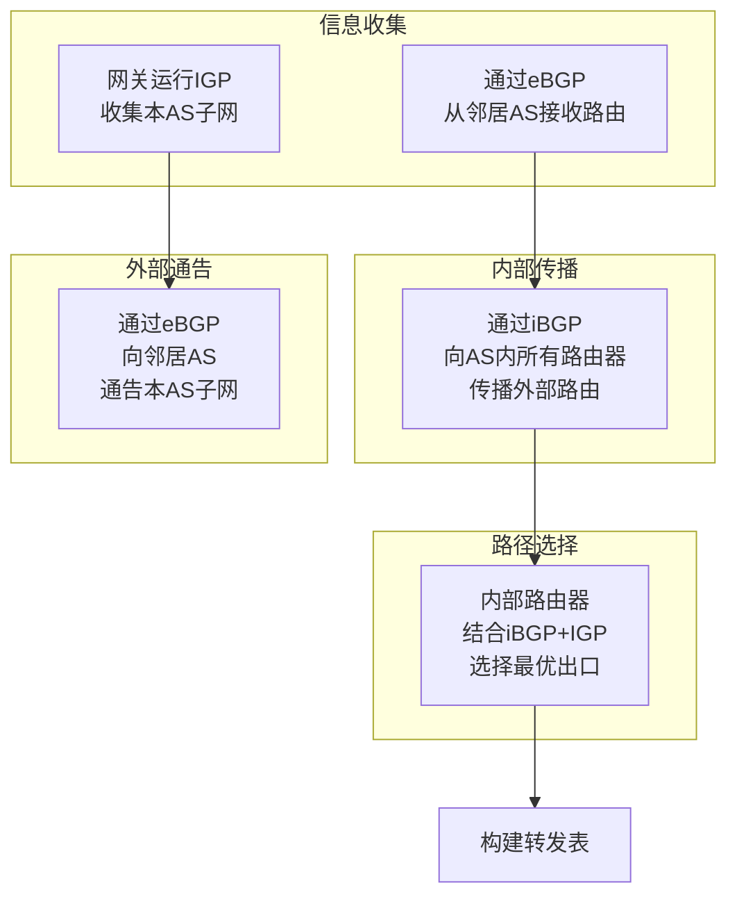

# 5.4 ISP之间的路由选择：BGP —— 互联网的“粘合剂”

---

## 一、为什么需要层次路由？

### 1. 平面路由的致命缺陷

如果所有路由器都运行相同的路由协议，平等地交换信息（平面路由），随着网络规模增长，会出现三大问题：

| 问题       | 描述                 | 后果              |
| -------- | ------------------ | --------------- |
| **计算代价** | n个节点时，LS算法需O(n²)计算 | 百万节点需万亿级计算，无法实现 |
| **传输代价** | DV算法多跳传播，LS算法全网泛洪  | 带宽被路由协议大量消耗     |
| **管理矛盾** | 不同机构希望隐藏内部拓扑       | 平面路由强制暴露所有细节    |
| **收敛难题** | 变化速度超过收敛速度         | 路由永远不稳定         |
| **安全限制** | 内部结构完全暴露           | 易受攻击，无法统一出口     |
| **自主性**  | 无法选择不同协议           | 被强制统一标准         |

> 💡 **核心矛盾**：互联网由数万个独立管理的网络组成，每个网络有自己的运营策略、商业利益和安全要求。平面路由无法满足这种“管理自治”的需求。

### 2. 解决方案：层次路由

将互联网划分为**自治系统**（AS），路由分为两个层次：

- **AS内部路由**：运行内部网关协议（IGP），如RIP、OSPF
    
- **AS之间路由**：运行外部网关协议（EGP），目前只有 **BGP**
    


**自治系统（AS）** 的特点：

- 由单一机构管理
    
- 使用统一的路由策略
    
- 分配唯一的 **AS号**（如中国电信AS4134）
    
- 对外表现为一个整体
    

**层次路由的优势**：

- **规模可控**：AS内部规模有限，AS间将每个AS抽象为一个节点
    
- **渐进扩展**：新增AS只需在邻居添加一条记录
    
- **管理自治**：内部可自由选择协议和策略
    
- **信息隐藏**：对外只暴露必要信息
    

---

## 二、BGP协议概述

### 1. BGP的地位

**BGP**（Border Gateway Protocol）是互联网**事实上的标准**外部网关协议，被称为 **“将各个AS粘在一起的胶水”**。

- **算法基础**：**路径矢量**（Path Vector）算法——距离矢量的增强版
    
- **传输方式**：基于 **TCP**（端口179），保证可靠性
    
- **核心功能**：
    
    - 从相邻AS获取子网可达信息
        
    - 向其他AS通告本AS的子网
        
    - 基于策略选择最佳路径
        

### 2. eBGP 与 iBGP

BGP分为两种会话：

|类型|全称|作用范围|功能|
|---|---|---|---|
|**eBGP**|外部BGP|不同AS之间|交换跨AS路由信息|
|**iBGP**|内部BGP|同一AS内部|将外部路由分发给所有内部路由器|

**网关路由器**同时运行：

- eBGP：与相邻AS的网关建立会话
    
- iBGP：与AS内所有路由器建立会话
    
- IGP（如OSPF）：参与内部路由计算
    

---

## 三、路径矢量算法与AS_PATH

### 1. 从距离矢量到路径矢量

|算法|通告内容|环路避免|
|---|---|---|
|距离矢量|目标网络 + 距离|水平分裂、毒性逆转（仍可能环路）|
|**路径矢量**|目标网络 + 距离 + **完整AS路径**|检查AS_PATH中是否包含自己|

**BGP通告示例**：

```text

网络前缀：192.0.2.0/24
AS_PATH： 64500 64200 64100
NEXT_HOP： 203.0.113.1
```
- **AS_PATH**：记录该路由经过的AS序列（如64500 → 64200 → 64100）
    
- **NEXT_HOP**：到达下一个AS的具体接口IP
    

### 2. AS_PATH的防环原理

当路由器收到BGP更新时：

1. 检查AS_PATH中是否包含自己的AS号
    
2. 如果包含，说明该路由曾经过自己，存在环路 → **拒绝该路由**
    
3. 如果不包含，接受路由，并在转发给其他AS时在AS_PATH**前面追加**自己的AS号
    

> 💡 **类比**：就像快递包裹上的转运记录——如果包裹上已有你的站点编号，说明它绕回来了，直接拒收。

### 3. 路径矢量 vs 距离矢量

|对比|距离矢量|路径矢量|
|---|---|---|
|信息量|仅距离|距离 + 完整路径|
|环路检测|间接（依赖计时器）|直接（检查路径）|
|收敛速度|慢（坏消息）|快（直接拒绝环路）|
|策略支持|弱|强（可根据路径做策略）|

---

## 四、BGP路由属性与路径选择

### 1. 路由 = 前缀 + 属性

BGP路由由两部分组成：

- **前缀**：目标网络（如 192.0.2.0/24）
    
- **属性**：描述路径的特征
    

**常用属性**：

|属性|作用|传递范围|
|---|---|---|
|**AS_PATH**|经过的AS列表，防环+选路|整个AS路径|
|**NEXT_HOP**|下一跳接口IP|仅影响接收路由器|
|**LOCAL_PREF**|本地偏好值（越高越优先）|仅在AS内传递|
|**MED**|多出口区分器（越低越优先）|相邻AS之间|
|**COMMUNITY**|标记路由，用于策略控制|可配置范围|

### 2. BGP路径选择过程

当收到多条到达同一前缀的路由时，BGP按照以下顺序**逐条比较**，直到选出唯一路径：

**决策层次**（简化版）：

1. **最高 LOCAL_PREF**（本地策略优先）
    
2. **最短 AS_PATH**（AS跳数最少）
    
3. **最低 ORIGIN**（IGP < EGP < INCOMPLETE）
    
4. **最低 MED**（影响入站流量）
    
5. **优先 eBGP 学习路由**（优于iBGP）
    
6. **最低 IGP 代价到 NEXT_HOP**（热土豆策略）
    
7. **最低 Router ID**
    

### 3. 热土豆策略

**热土豆策略**（Hot Potato Routing）：

- 当多条路径的前序条件相同时，选择**内部代价最小**的出口
    
- 目标：尽快将数据包“扔出”本AS
    

**示例**：路由器2d到达子网X有两跳路径：

- 通过网关2a：内部代价 201
    
- 通过网关2c：内部代价 263  
    → 选择通过2a（内部代价小）
    

> 💡 **本质**：最小化本AS内的传输成本，哪怕外部路径更长。

---

## 五、策略路由：BGP的灵魂

### 1. 内部路由 vs 外部路由

|对比|内部网关协议（IGP）|外部网关协议（BGP）|
|---|---|---|
|**目标**|寻找**最优路径**（技术导向）|实现**策略控制**（商业导向）|
|**信息**|完全透明，共享所有信息|按需通告，可过滤|
|**决策**|基于单一代价（如带宽）|基于多维策略（商业、政治）|
|**变化**|快速收敛|稳定优先，收敛慢|
|**信任**|完全信任内部路由器|不信任外部，需认证|

### 2. 策略的维度

**商业策略**：

- 只承载付费客户的流量
    
- 优先服务优质客户
    
- 避免成为免费中转网络
    

**政治策略**：

- 数据不经过竞争对手的网络
    
- 遵守国家数据主权要求
    
- 规避敏感地区
    

**安全策略**：

- 过滤恶意前缀
    
- 防止路由劫持
    
- 控制信息暴露范围
    

### 3. 策略的实施点

BGP提供多种策略控制手段：

- **输入策略**：决定是否接受邻居通告的路由
    
- **输出策略**：决定向邻居通告哪些路由
    
- **决策策略**：修改路径选择过程中的优先级
    

**示例**：AMD公司可能配置策略，拒绝所有经过Intel AS的路径，防止技术泄密。

### 4. 策略 vs 性能

> **重要结论**：在BGP中，**策略优先于性能**。

- 即使某条路径跳数更少、延迟更低，如果违反商业策略，也会被拒绝
    
- 互联网的路由选择是**经济行为**，而非纯粹的技术优化
    

---

## 六、BGP报文与工作流程

### 1. BGP报文类型

|报文类型|功能|
|---|---|
|**OPEN**|建立TCP连接后进行认证和参数协商|
|**UPDATE**|通告新路由或撤销旧路由|
|**KEEPALIVE**|维持空闲连接，确认OPEN请求|
|**NOTIFICATION**|报告错误或关闭连接|

### 2. BGP工作流程

### 3. 普通路由器如何知道外部路由？

普通内部路由器（非网关）通过 **iBGP** 获知：

- 本AS的哪些网关可以到达外部子网X
    
- 每个网关对应的NEXT_HOP和AS_PATH
    

同时通过 **IGP**（如OSPF）获知：

- 到达每个网关的最优路径和代价
    

最终决策：**选择总代价最小的路径**（外部代价 + 内部代价）

---

## 七、BGP与OSPF的协同工作

### 1. 信息互补

| 协议       | 提供信息              | 作用      |
| -------- | ----------------- | ------- |
| **BGP**  | 外部子网可达性 + AS_PATH | 知道“去哪里” |
| **OSPF** | 到达本AS内各网关的最优路径    | 知道“怎么去” |

### 2. 转发表构建示例

路由器收到BGP通告：“子网X可通过网关1c到达”

- 通过OSPF查询：到达1c的最优路径是接口1，代价100
    
- 转发表项：`子网X → 接口1 → 下一跳1c`
    

**层次化路由的完美体现**：

- BGP负责**宏观**（跨AS方向）
    
- OSPF负责**微观**（AS内具体路径）
    

---

## 八、知识小结

|知识点|核心内容|考试重点/易混淆点|难度|
|---|---|---|---|
|**层次路由动机**|平面路由的三大问题：规模、管理、策略|为什么不能只用OSPF|★★★★|
|**自治系统AS**|独立管理域，统一策略，ASN标识|AS边界路由器的双重角色|★★★|
|**BGP定位**|AS间路由协议，路径矢量算法|与距离矢量的本质区别|★★★★★|
|**eBGP vs iBGP**|eBGP跨AS，iBGP内部分发|网关同时运行两者|★★★★|
|**AS_PATH**|记录AS序列，防环+选路|转发时在前面追加本AS|★★★★★|
|**NEXT_HOP**|下一跳接口IP|iBGP中需保持可达|★★★★|
|**路径选择**|LOCAL_PREF → AS_PATH → MED → 热土豆|决策顺序是高频考点|★★★★★|
|**热土豆策略**|优先选择内部代价最小的出口|最小化本AS内传输成本|★★★★|
|**策略路由**|基于商业/政治/安全因素决策|策略优先于性能|★★★★★|
|**BGP报文**|OPEN、UPDATE、KEEPALIVE、NOTIFICATION|各报文作用|★★★|
|**IGP vs BGP**|IGP追求最优，BGP追求策略|对比表格|★★★★★|
|**协同工作**|BGP提供方向，IGP提供内部路径|层次化路由实现|★★★★|

---

## 九、总结与思考

BGP是互联网能够将数万个独立管理的网络连接成一个整体的关键。它不仅是技术协议，更是**经济协议**和**政治协议**：

- **技术层面**：路径矢量算法解决了DV的环路问题，AS_PATH提供了环路检测和策略基础
    
- **经济层面**：通过策略配置，运营商实现流量货币化，只承载付费流量
    
- **管理层面**：层次路由让每个AS保持自治，同时又能互联互通
    

**学习BGP的意义**：

- 理解互联网的宏观结构
    
- 掌握策略路由的设计思想
    
- 为网络工程和架构设计打下基础
    

> 💡 **最终启示**：BGP告诉我们，在真实的网络中，**“最好”的路径不一定是技术上最优的，而是最符合商业利益的**。技术永远服务于业务需求。