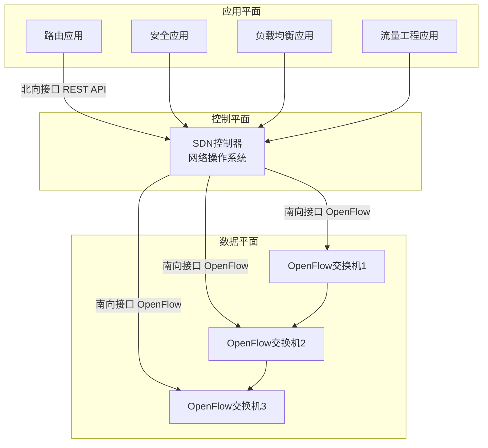
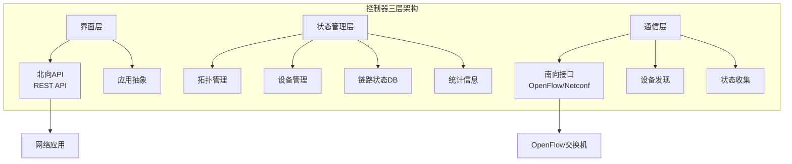
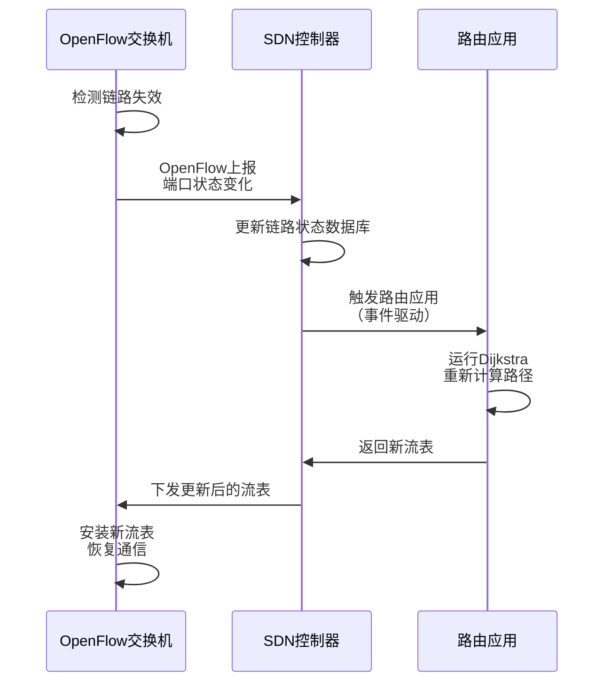

# 5.5 SDN控制平面 —— 可编程网络的革命

---

## 一、从传统网络到SDN的演进

### 1. 传统网络架构的困境

在SDN出现之前，网络设备采用**垂直集成**架构：

- **专用硬件**：每台设备包含专用的交换芯片、转发芯片
    
- **私有操作系统**：运行厂商专用的网络操作系统（如Cisco IOS、Juniper JunOS）
    
- **固化功能**：路由器、防火墙、负载均衡器、NAT等是独立的专用设备（中间盒）
    
- **控制分散**：每台设备独立运行控制平面协议（OSPF、BGP等），分布式决策
    

**问题**：

- 管理复杂：需要逐个设备配置，易出错
    
- 创新缓慢：新功能需等待厂商发布新硬件或固件
    
- 厂商锁定：硬件、软件绑定，无法混合使用
    
- 网络僵化：部署后难以修改，无法快速适应新需求
    

### 2. SDN的诞生背景

2005年前后，学术界和工业界开始重新思考互联网控制平面，核心诉求是让网络变得**可编程**。

**SDN**（Software-Defined Networking）应运而生，其核心理念是：

> **将控制平面与数据平面分离，实现逻辑集中的网络控制**

---

## 二、SDN核心思想与架构

### 1. 控制与转发分离

| 平面       | 角色     | 功能                     |
| -------- | ------ | ---------------------- |
| **数据平面** | 转发设备   | 简单、快速的“匹配+动作”转发，由流表控制  |
| **控制平面** | SDN控制器 | 逻辑集中，掌握全网视图，计算并下发流表    |
| **应用平面** | 网络应用   | 通过北向接口调用控制器功能，实现路由、安全等 |

### 2. 核心特征

|特征|描述|优势|
|---|---|---|
|**控制数据分离**|控制平面集中，数据平面分布|简化设备，集中决策|
|**基于流转发**|通用“匹配+动作”模式（如OpenFlow）|灵活定义转发规则|
|**网络可编程**|通过软件实现各种网络功能|快速创新，动态部署|

---

## 三、SDN的三大组件详解

### 1. 数据平面交换机

- **硬件**：快速、简单的商业化交换设备，不再运行复杂路由协议
    
- **流表**：由控制器计算和安装，包含匹配字段、动作、计数器等
    
- **南向接口**：通过OpenFlow等协议与控制器交互
    
- **上报机制**：将链路状态、流量统计、未匹配分组等上报控制器
    

**OpenFlow流表示例**：

|匹配字段|动作|计数器|优先级|
|---|---|---|---|
|源IP=10.0.1.0/24|转发到端口3|分组数:1024|100|
|目标端口=80|丢弃|分组数:0|200|
|*（通配）|上报控制器|分组数:5|1|

### 2. SDN控制器（网络操作系统）

控制器是SDN的“大脑”，逻辑集中但物理上可分布式部署，以保证性能和可靠性。

**控制器内部架构**：

|层次|功能|关键技术|
|---|---|---|
|**界面层**|为应用提供抽象API|REST API、Python/Java API|
|**状态管理层**|维护网络全局状态|拓扑数据库、设备清单、链路状态|
|**通信层**|与交换机通信|OpenFlow、Netconf、OVSDB|

**典型控制器**：

- **ONOS**：强调分布式核心和高可靠性
    
- **OpenDaylight**：Linux基金会项目，功能丰富
    
- **Ryu**：轻量级Python控制器
    

### 3. 南向接口与北向接口

|接口类型|方向|作用|协议/技术|
|---|---|---|---|
|**南向接口**|控制器 → 交换机|下发流表、配置设备|OpenFlow、Netconf、OVSDB|
|**北向接口**|应用 → 控制器|应用调用网络功能|REST API、gRPC|

**OpenFlow协议**是SDN中最著名的南向接口标准：

- 基于TCP，可选加密
    
- 报文类型：
    
    - 控制器→交换机：查询状态、配置、下发流表
        
    - 交换机→控制器：状态上报、未匹配分组、流移除通知
        
    - 对称报文：Hello、Echo等保活消息
        

---

## 四、SDN的应用价值

### 1. 简化流量工程

**传统方式**：

- 只能通过调整链路代价（OSPF cost）间接控制流量
    
- 难以实现精确的负载均衡和多路径转发
    
- 配置复杂，易出错
    

**SDN方式**：

- 可根据多种字段（源/目标IP、端口、协议类型）定义转发规则
    
- 轻松实现负载均衡：将不同流量分配到不同路径
    
- 流表支持丰富的动作：转发、丢弃、修改字段、上报控制器
    

**示例**：同时使用两条路径

text

匹配：源网段=10.0.1.0/24 → 动作：转发到端口3
匹配：源网段=10.0.2.0/24 → 动作：转发到端口4

### 2. 网络功能虚拟化（NFV）

传统网络需要各种专用中间盒（防火墙、NAT、负载均衡器）。在SDN架构中，这些功能可以作为**应用**运行在控制器之上，通过流表实现：

|功能|流表实现|
|---|---|
|**防火墙**|匹配五元组 + 动作=丢弃|
|**NAT**|匹配源IP:端口 + 动作=修改地址|
|**负载均衡器**|匹配虚拟IP + 动作=转发到不同真实服务器|
|**路由器**|匹配目标IP + 动作=转发到对应端口|

### 3. 快速创新与部署

- **新功能**：只需开发新的控制器应用，无需更换硬件
    
- **部署**：通过控制器下发流表，全网设备同时生效
    
- **试验**：可在生产网络中划分试验区域，逐步验证
    

### 4. 打破厂商锁定

传统网络：硬件、软件、应用来自同一厂商  
SDN网络：不同厂商可提供硬件、控制器、应用，形成开放生态

- 硬件厂商：专注生产标准化OpenFlow交换机
    
- 软件厂商：开发网络操作系统和应用
    
- 用户：自由组合，选择最优方案
    

---

## 五、SDN与传统网络的对比

|对比维度|传统网络|SDN|
|---|---|---|
|**控制方式**|分布式，每台设备独立决策|逻辑集中，控制器全局决策|
|**转发依据**|目标IP地址（最长前缀匹配）|多字段匹配（IP、端口、MAC等）|
|**设备角色**|专用设备（路由器、防火墙等）|通用交换机，流表定义功能|
|**配置方式**|逐台CLI配置，易出错|控制器集中下发，全网一致|
|**新功能部署**|需升级硬件或固件|开发新应用，动态下发|
|**创新速度**|慢（厂商驱动）|快（软件驱动）|
|**厂商锁定**|严重|开放生态，可选择|
|**可靠性**|分布式天然容错|控制器可能成为单点|

---

## 六、SDN面临的挑战

### 1. 可靠性问题

- **单点故障风险**：控制器失效可能导致全网瘫痪
    
- **解决方案**：
    
    - 控制器集群部署（如ONOS的分布式核心）
        
    - 多控制器备份，快速切换
        
    - 交换机本地缓存流表，短暂存活
        

### 2. 性能瓶颈

- **控制器处理能力**：大规模网络中，控制器可能成为瓶颈
    
- **解决方案**：
    
    - 控制器集群水平扩展
        
    - 事件驱动架构，异步处理
        
    - 交换机本地处理常见流量，仅上报异常
        

### 3. 安全性挑战

|风险|描述|防护措施|
|---|---|---|
|**身份伪造**|攻击者伪装成控制器或交换机|双向认证，TLS加密|
|**信息泄露**|流表被窃取|加密通信，访问控制|
|**拒绝服务**|向控制器发送大量伪造请求|流量整形，限流|
|**应用安全**|恶意应用破坏网络|应用沙箱，权限控制|

### 4. 可扩展性

- **控制平面**：逻辑集中是否真能扩展到互联网规模？
    
- **数据平面**：流表容量有限，如何支持海量流？
    
- **解决方案**：
    
    - 流表聚合（如通配符规则）
        
    - 分级控制（域内SDN，域间BGP）
        

### 5. 实时性要求

某些场景（工业控制、自动驾驶）需要毫秒级响应，SDN的集中决策可能引入延迟。解决方案包括：

- 边缘计算：本地控制器处理实时决策
    
- 快速路径：交换机本地处理已知流
    

---

## 七、案例：链路失效的SDN处理

**特点**：

- 事件驱动编程模型
    
- 自动完成路由调整
    
- 无需人工干预
    

---

## 八、类比：从大型机到PC的革命

SDN的变革与计算机产业的演进惊人相似：

|时代|计算机产业|网络产业|
|---|---|---|
|**垂直集成**|大型机：专用硬件+专用OS+专用应用|传统网络：专用设备+私有OS+固化功能|
|**问题**|昂贵、封闭、创新慢|厂商锁定、僵化、创新慢|
|**水平集成**|PC：标准硬件+通用OS+独立应用|SDN：标准交换机+控制器+独立应用|
|**结果**|开放生态、快速创新、规模巨大|网络可编程、灵活部署、生态开放|

> **核心启示**：SDN对网络的意义，就像PC对计算的意义——将封闭的专用系统转变为开放的、可编程的平台。

---

## 九、知识小结

|知识点|核心内容|考试重点/易混淆点|难度|
|---|---|---|---|
|**SDN定义**|控制平面与数据平面分离，逻辑集中控制|与传统网络的本质区别|★★★★|
|**三大特征**|控制数据分离、基于流转发、网络可编程|每个特征的含义|★★★★|
|**三层架构**|应用平面、控制平面、数据平面|各平面职责|★★★★|
|**南向接口**|控制器-交换机通信（OpenFlow）|OpenFlow是标准|★★★|
|**北向接口**|应用-控制器通信（REST API）|仍在标准化中|★★★|
|**流表结构**|匹配字段 + 动作 + 计数器 + 优先级|多字段匹配|★★★★★|
|**流量工程**|灵活定义转发规则，支持多路径|与传统方式的对比|★★★★★|
|**NFV**|网络功能虚拟化，软件实现专用设备|与SDN的关系|★★★★|
|**SDN优势**|集中管理、可编程、开放生态、快速创新|打破厂商锁定|★★★★|
|**SDN挑战**|可靠性、性能、安全、可扩展性|控制器单点故障|★★★★★|
|**类比**|从大型机到PC的革命|理解产业变革|★★★|

---

## 十、总结与展望

SDN不是一种具体的技术，而是一种**网络设计范式**。它将网络的控制权从分散的设备中抽离，集中到可编程的控制器上，使得网络能够像软件一样灵活演进。

**当前应用**：

- 数据中心网络（Google B4、Microsoft Azure）
    
- 广域网流量工程
    
- 网络虚拟化（VMware NSX）
    
- 5G核心网
    

**未来趋势**：

- **意图网络**：用户只需表达“想要什么”，控制器自动实现
    
- **机器学习增强**：智能预测流量，动态优化路径
    
- **内生安全**：安全功能内置于控制平面
    
- **边缘计算**：SDN扩展到边缘，支持低延迟应用
    

> **最终启示**：SDN让我们从“管理设备”转向“定义网络”。正如软件改变了世界，可编程网络正在重塑互联网的未来。