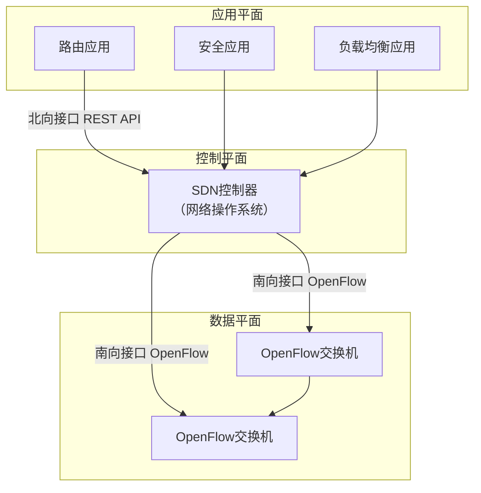

# 网络层控制平面总结 —— 从传统路由到SDN

---

## 一、网络层控制平面概述

网络层控制平面负责**路由决策**和**转发控制**，它决定了数据包从源到目的地所经过的路径。控制平面的实现方式有两种主流范式：

- **传统方式**：每台路由器独立运行控制协议，分布式决策
    
- **SDN方式**：控制逻辑集中到控制器，通过南向接口统一管理转发设备
    

两种方式各有优劣，分别适用于不同场景。

---

## 二、传统控制平面：分布式路由

### 1. 核心功能：路由选择

传统路由器的控制平面主要实现**路由选择**功能，通过运行路由协议，计算出到达各目标网络的最优路径，生成路由表供数据平面使用。

### 2. 路由选择算法

|算法类型|核心思想|代表协议|优点|缺点|
|---|---|---|---|---|
|**链路状态（LS）**|每个路由器泛洪收集全网拓扑，运行Dijkstra算法|OSPF、IS-IS|收敛快，无环，支持层次化|计算复杂度高，需存储全局拓扑|
|**距离矢量（DV）**|邻居交换距离矢量，迭代更新，基于Bellman-Ford方程|RIP、IGRP|实现简单，开销小|收敛慢，可能产生环路，规模受限|

**LS与DV对比**：

|对比维度|链路状态|距离矢量|
|---|---|---|
|信息范围|全网拓扑|仅邻居信息|
|算法类型|全局（集中式计算）|分布式迭代|
|收敛速度|快（秒级）|慢（分钟级，有计数到无穷问题）|
|环路|天然无环|可能产生临时环路，需防环机制|
|扩展性|通过区域划分可扩展|受限（最大跳数限制）|
|典型协议|OSPF|RIP|

### 3. 内部网关协议（IGP）

IGP在同一个自治系统（AS）内运行，常见协议有：

|协议|算法|度量|特点|
|---|---|---|---|
|**RIP**|距离矢量|跳数（≤15）|简单，但收敛慢，仅适合小型网络|
|**OSPF**|链路状态|代价（可配置带宽/延迟等）|支持分层区域，收敛快，广泛使用|
|**EIGRP**|高级距离矢量|复合度量（带宽、延迟等）|思科私有，快速收敛，无环|

**OSPF层次化**：

- 骨干区域（Area 0）连接所有普通区域
    
- 区域边界路由器（ABR）汇总路由，减少LSA泛洪
    
- 支持特殊区域（Stub、NSSA）进一步减少路由表
    

### 4. 外部网关协议（BGP）

BGP是不同AS之间交换路由信息的唯一事实标准协议。

- **算法**：**路径矢量**（Path Vector），在距离矢量基础上增加AS_PATH属性
    
- **传输**：基于TCP（端口179），保证可靠
    
- **功能**：
    
    - **eBGP**：AS之间交换路由
        
    - **iBGP**：AS内部分发外部路由
        
- **核心属性**：
    
    - **AS_PATH**：记录经过的AS序列，用于环路检测和选路
        
    - **NEXT_HOP**：下一跳IP
        
    - **LOCAL_PREF**：本地偏好，控制出站流量
        
    - **MED**：多出口区分器，影响入站流量
        
- **路径选择**：基于策略（商业、政治、安全）而非单纯技术最优，决策顺序复杂（LOCAL_PREF > AS_PATH长度 > MED > 热土豆 > ...）
    

**BGP与IGP对比**：

|对比|IGP|BGP|
|---|---|---|
|范围|同一AS内部|AS之间|
|目标|技术最优路径|策略控制|
|收敛|快|慢（强调稳定性）|
|环路避免|算法保证|AS_PATH检查|
|配置|相对简单|复杂，需考虑策略|

---

## 三、SDN控制平面：集中可编程

### 1. 核心思想

**控制平面与数据平面分离**，将网络智能集中到控制器，转发设备仅执行流表指令。

### 2. SDN架构

|层次|功能|关键技术|
|---|---|---|
|**数据平面**|快速转发，流表匹配+动作|OpenFlow、P4|
|**控制平面**|维护全网视图，计算流表|ONOS、OpenDaylight|
|**应用平面**|网络功能实现|路由、防火墙、负载均衡等应用|

### 3. 流表结构（以OpenFlow为例）

|匹配字段|动作|计数器|优先级|
|---|---|---|---|
|源IP=10.0.0.0/24|output:3|packets=1024|100|
|目标端口=80|drop|packets=0|200|
|*|controller|packets=5|1|

**匹配字段**可包含二层到四层信息：MAC地址、VLAN、IP五元组、TCP标志等。

**动作**包括：转发到端口、丢弃、修改字段、封装发送给控制器等。

### 4. SDN优势

|优势|描述|
|---|---|
|**集中控制**|全局视图，避免分布式误配置|
|**可编程性**|通过软件快速部署新功能|
|**灵活性**|流表支持多字段匹配，实现精细流量工程|
|**开放生态**|打破厂商锁定，硬件、软件可独立选择|
|**简化设备**|交换机仅需硬件转发，无需运行复杂协议|

### 5. SDN挑战

|挑战|说明|对策|
|---|---|---|
|**可靠性**|控制器单点故障|集群部署，快速切换|
|**性能**|控制器可能成为瓶颈|水平扩展，本地处理常见流|
|**安全性**|伪造控制器、信息泄露|认证、加密、访问控制|
|**可扩展性**|能否支持互联网规模|分级控制，与BGP协同|

---

## 四、传统控制平面 vs SDN控制平面

|对比维度|传统|SDN|
|---|---|---|
|**控制方式**|分布式，每台设备独立|逻辑集中，控制器全局决策|
|**决策依据**|路由协议（OSPF、BGP等）|流表规则（可自定义策略）|
|**转发依据**|目标IP（最长前缀匹配）|多字段匹配|
|**新功能部署**|需升级设备或固件|开发新应用，动态下发|
|**网络视图**|局部（每台设备只知道部分拓扑）|全局（控制器掌握全网）|
|**厂商锁定**|严重|开放生态|
|**可靠性**|分布式天然容错|需额外机制保证|
|**典型应用**|企业网、运营商骨干|数据中心、校园网、试验网|

---

## 五、路由协议与算法总结

|协议|算法|范围|特点|
|---|---|---|---|
|**RIP**|距离矢量|内部|简单，跳数限制，收敛慢|
|**OSPF**|链路状态|内部|层次化，收敛快，支持多路径|
|**EIGRP**|高级距离矢量|内部|思科私有，快速，无环|
|**BGP**|路径矢量|外部|策略控制，AS_PATH防环|

---

## 六、知识小结

|知识点|核心内容|考试重点/易混淆点|难度|
|---|---|---|---|
|**控制平面定义**|负责路由决策和转发控制|区别于数据平面|★★★|
|**传统控制平面**|分布式运行路由协议|与SDN对比|★★★|
|**LS算法**|Dijkstra，全局拓扑|与DV对比|★★★★★|
|**DV算法**|Bellman-Ford，邻居交换|无穷计数、水平分裂|★★★★★|
|**IGP**|内部网关协议（RIP、OSPF）|OSPF层次化|★★★★|
|**BGP**|外部网关协议，路径矢量|AS_PATH、策略路由|★★★★★|
|**SDN控制器**|逻辑集中，可编程|OpenFlow流表|★★★★|
|**SDN优势**|集中控制、可编程、开放|打破厂商锁定|★★★|
|**SDN挑战**|可靠性、性能、安全|单点故障|★★★|
|**传统 vs SDN**|分布式 vs 集中|对比表格|★★★★|

---

## 七、总结与展望

网络层控制平面经历了从分布式算法到集中式SDN的演进。传统路由协议（OSPF、BGP）仍然是互联网的基础，而SDN在数据中心、云计算等领域展现出巨大潜力。未来两者将长期共存，并可能走向融合：SDN控制器管理内部网络，通过BGP与外部世界交互，形成混合控制模式。

**核心启示**：控制平面的设计权衡始终在**分布式自主性**与**集中式全局优化**之间展开，技术选择取决于网络规模、管理需求和应用场景。