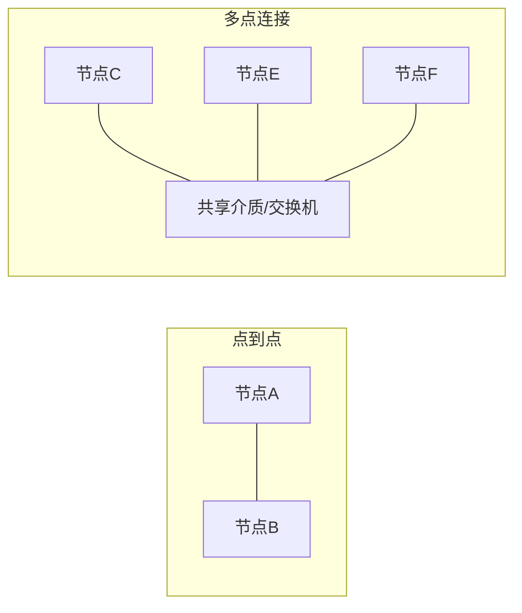
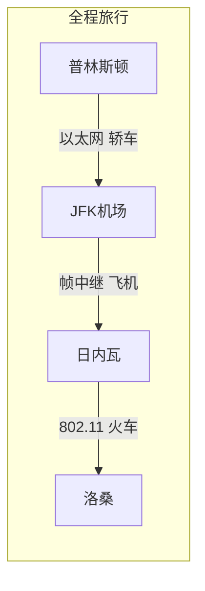
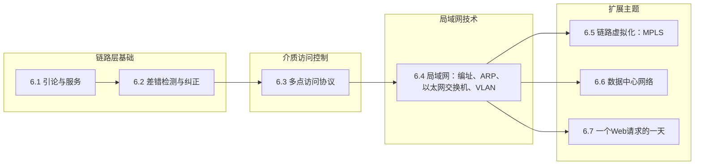

# 6.1 链路层导论与服务 —— 相邻节点的通信桥梁

---

## 一、链路层在协议栈中的定位

### 1. 链路层与网络层的分工

|层次|通信单位|核心任务|典型设备|
|---|---|---|---|
|**网络层**|主机到主机|子网间路由，以子网为单位通告路由|路由器|
|**链路层**|**节点到节点**|子网内相邻节点间的帧传输|交换机、网卡|

**关键理解**：

- 网络层负责规划**全程路线**（如从北京到上海）
    
- 链路层负责每一段**具体行程**（如北京→天津段、天津→济南段）
    

### 2. 链路层的核心功能

|功能|描述|实现方式|
|---|---|---|
|**成帧**|将网络层数据报封装成帧，添加头尾|帧定界符、长度字段|
|**链路接入**|控制节点何时在链路上传输帧|MAC协议（CSMA/CD、CSMA/CA）|
|**可靠交付**|在相邻节点间保证无差错传输|确认+重传（仅无线链路）|
|**流量控制**|匹配发送方和接收方的速率|滑动窗口机制|
|**差错检测**|检测比特错误|CRC校验、校验和|
|**差错纠正**|纠正比特错误（无需重传）|前向纠错（FEC）|
|**寻址**|标识网卡设备|MAC地址（48位）|
|**双工模式**|半双工/全双工通信|物理介质支持|

---

## 二、链路层提供的服务

### 1. 成帧与链路接入

- **成帧**：将网络层分组封装成帧，添加帧头（目标MAC、源MAC、类型）和帧尾（CRC）。
    
- **链路接入**：
    
    - **点对点链路**：无需介质访问控制（MAC），直接发送。
        
    - **多点接入链路**：需MAC协议协调共享介质的访问（如以太网的CSMA/CD、WLAN的CSMA/CA）。
        

### 2. 相邻节点的可靠数据传输

- **实现差异**：
    

|链路类型|出错率|链路层可靠性|原因|
|---|---|---|---|
|有线（以太网）|极低（10−1210−12）|**不可靠**（发完即忘）|出错概率远低于重传开销|
|无线（802.11）|较高（10−510−5）|**可靠**（确认+重传）|本地恢复比传输层重传更高效|

- **设计哲学**：根据出错概率权衡可靠性代价，避免“高射炮打蚊子”。
    

### 3. 流量控制

- **问题**：发送方网卡速率可能超过接收方处理能力，导致接收缓冲区溢出。
    
- **类比**：水管出水速度快于接水桶的容量。
    
- **解决**：通过滑动窗口等机制动态调整发送速率，实现发送方与接收方的**速度匹配**。
    

### 4. 差错检测与纠正

- **检测**：CRC（循环冗余校验）等算法发现错误，通常**丢弃帧**（或请求重传）。
    
- **纠正**：
    
    - **反馈重传**（ARQ）：传统方式，检测到错误后请求重传。
        
    - **前向纠错**（FEC）：添加冗余位，接收方能自动修复部分错误（如卫星通信、Reed-Solomon码）。
        

### 5. 半双工与全双工

|模式|特点|示例|现状|
|---|---|---|---|
|**半双工**|双向通信但不可同时进行|警察对讲机|早期网络常见|
|**全双工**|同时收发，提高信道利用率|现代以太网|已成为主流|

---

## 三、网络节点的连接方式

### 1. 两种基本连接形式

|连接方式|特点|典型应用|链路层复杂度|
|---|---|---|---|
|**点到点**|独占链路，无介质争用|广域网（海底电缆）、ADSL拨号|低（仅需封装解封装）|
|**多点连接**|共享介质，需MAC协议|局域网（以太网、WLAN）|高（寻址+冲突处理）|

### 2. 为什么不能互换？

**局域网如果用点到点**：

- 每新增1个用户需与所有现有用户连线 → 布线复杂，成本高昂。
    

**广域网如果用多点连接**：

- 物理限制：长途线路难以共享（如绕道多国）。
    
- 技术限制：大带宽延迟积导致冲突代价极高（比特已注入链路后才检测到冲突）。
    

> **结论**：广域网用点到点，局域网用多点连接，是**物理限制与技术代价**共同决定的工程选择。

---

## 四、多点访问协议（MAC协议）

### 1. 问题本质

在共享介质的网络中，多个节点如何协调对同一传输介质的访问，避免冲突？

- **MAC**：既指**介质访问控制**，也指**多点访问**，两者含义相同。
    

### 2. 常见MAC协议

|协议|适用网络|工作原理|
|---|---|---|
|**CSMA/CD**|有线以太网|先听后说，边听边说，冲突则退避重发|
|**CSMA/CA**|无线局域网|先听后说，避免冲突（因无法边听边说）|
|**令牌传递**|令牌环网|持有令牌的节点才能发送|

---

## 五、链路层实现位置：网卡

### 1. 网卡的角色

**网络接口卡**（NIC）同时实现**链路层**和**物理层**功能，是硬件、软件和固件的综合体。

- **每个主机上**：至少一块网卡
    
- **每个路由器上**：每个接口对应一块网卡
    
- **每个交换机上**：每个端口对应一块网卡
    

### 2. 网卡的工作流程

**发送方**：

1. 主机通过系统总线将分组送到网卡
    
2. 网卡驱动将分组封装成帧（添加MAC头、CRC尾）
    
3. 物理层将帧转换为比特流发送
    

**接收方**：

1. 物理层将信号还原为比特流
    
2. 网卡识别帧边界，提取分组
    
3. 通过系统总线将分组交付给上层协议（IP、IPX、AppleTalk等）
    

### 3. 网卡的半自治特性

- **上电自动运行**：独立完成链路层和物理层功能
    
- **固化MAC地址**：全球唯一，不可更改
    
- **多协议支持**：通过帧中类型字段区分不同上层协议
    
- **全双工通信**：可同时收发数据
    

---

## 六、链路层与网络层的关系：旅行类比

|类比要素|对应网络概念|
|---|---|
|**旅行者**|IP数据报|
|**交通段**|不同链路协议（以太网、帧中继、802.11）|
|**交通工具**|帧封装形式|
|**换乘点**|路由器（存储转发）|

**路由器存储转发过程**：

1. 接收帧，解封装提取IP分组
    
2. 查路由表确定下一跳
    
3. 按出接口链路协议重新封装
    
4. 发送新帧
    

---

## 七、知识小结

|知识点|核心内容|考试重点/易混淆点|难度|
|---|---|---|---|
|**链路层定位**|相邻节点间帧传输，解决子网内通信|与网络层“端到端”的区别|★★★|
|**核心服务**|成帧、接入控制、可靠传输、流量控制、检错纠错|各服务适用场景|★★★|
|**可靠传输差异**|有线不可靠，无线可靠|原因：出错率与开销权衡|★★★★|
|**连接方式**|点到点（广域网） vs 多点（局域网）|为什么不能互换|★★★★|
|**多点接入问题**|共享介质需MAC协议协调|CSMA/CD vs CSMA/CA|★★★|
|**MAC地址**|48位全球唯一，标识网卡|与IP地址的区别|★★★|
|**网卡实现**|硬件实现链路层+物理层，半自治|发送/接收流程|★★|
|**旅行类比**|不同链路协议对应不同交通工具|路由器存储转发|★★★|
|**半双工/全双工**|半双工双向不同时，全双工可同时|现代以太网全双工为主|★★|
|**差错检测**|CRC检测错误，丢弃或重传|FEC用于高延迟场景|★★★|

---

## 八、本章学习路径图

---

> **核心启示**：链路层是网络协议栈中最贴近硬件的一层。它的设计充分体现了**工程权衡**思想——在有线链路追求简单高效，在无线链路加强可靠性；在局域网采用多点接入简化布线，在广域网采用点到点克服物理限制。理解链路层，就是理解网络如何从“每一段”保障整体通信。