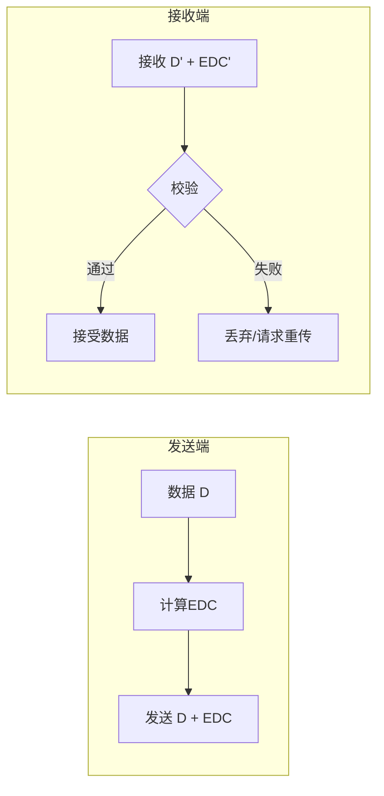
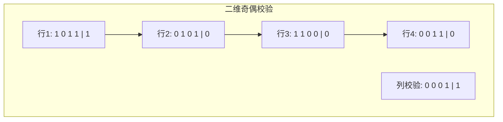
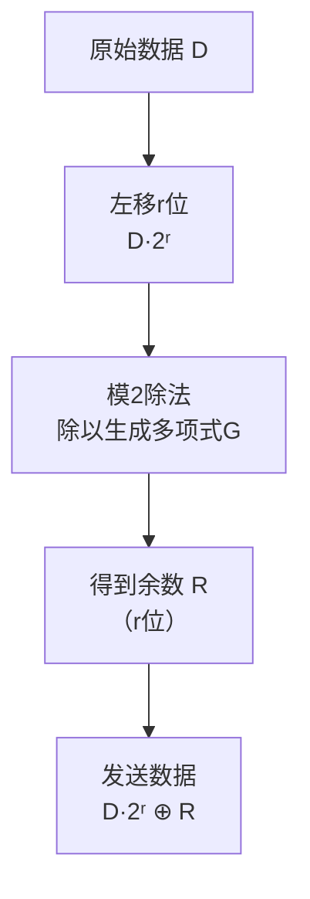

# 6.2 差错检测与纠正 —— 保证数据传输的完整性

---

## 一、为什么需要差错检测？

在物理链路上传输数据时，由于**信号衰减、噪声干扰、电磁串扰**等因素，比特在传输过程中可能发生错误（0变成1，或1变成0）。差错检测机制就是为了发现这些错误，保证数据传输的完整性。

### 1. 基本思想



- **EDC**（差错检测和纠正码）：在数据基础上添加的冗余信息
    
- **发送端**：数据D与EDC一起传输
    
- **接收端**：校验D'和EDC'是否符合约定的编码关系
    

### 2. 关键概念

|概念|描述|
|---|---|
|**检错**|发现错误，通常丢弃或请求重传|
|**纠错**|定位并修复错误，无需重传|
|**漏检率**|错误未被检测出来的概率|
|**残存错误**|校验通过但实际存在错误的极低概率事件|

> 💡 **重要**：任何检错码都不是100%可靠的，但通过增加EDC长度和复杂度，可以将漏检率降到极低。

---

## 二、奇偶校验 —— 最简单的检错码

### 1. 基本原理

|类型|规则|示例（数据 1010）|
|---|---|---|
|**奇校验**|使整个数据（含校验位）中1的个数为奇数|1010 → 1010**1**（已有2个1，补1后为3个）|
|**偶校验**|使整个数据（含校验位）中1的个数为偶数|1010 → 1010**0**（已有2个1，补0后仍为2个）|

### 2. 二维奇偶校验



- **横向校验**：每行添加一个奇偶位
    
- **纵向校验**：每列添加一个奇偶位
    
- **纠错能力**：可以**定位并纠正单个比特错误**（交叉点）
    
- **局限性**：无法检测某些对偶错误（如两个比特同时翻转且变化相反）
    

---

## 三、校验和 —— 常用于协议头部

### 1. 基本原理

- 将数据划分为若干段（通常16位一段）
    
- 将所有段求和（可能用反码求和）
    
- 将和（或反码）作为校验和附加在数据后
    

### 2. 应用场景

|协议|校验和保护范围|
|---|---|
|**UDP**|伪头部 + UDP头部 + 数据|
|**TCP**|伪头部 + TCP头部 + 数据|
|**IP**|仅IP头部（数据部分由上层校验）|

### 3. 优缺点

|优点|缺点|
|---|---|
|实现简单，计算快|检错能力有限|
|软件实现容易|无法纠正错误|
|适合协议头部保护|对突发错误不敏感|

---

## 四、循环冗余校验 —— 链路层的核心

### 1. 模2运算

CRC的核心是**模2运算**，也称为**异或运算**：

- 加法不进位：`1 + 1 = 0`，`1 + 0 = 1`，`0 + 0 = 0`
    
- 减法不借位：与加法完全相同
    
- 本质：**按位异或**（XOR）
    

**示例**：

```text

  1011
+ 1101
------
  0110  （逐位异或）
```

### 2. 位串的两种表示

| 表示法      | 示例         | 说明                    |
| -------- | ---------- | --------------------- |
| **二进制串** | 1011       | 直接表示比特序列              |
| **多项式**  | x³ + x + 1 | 指数对应位序（从右到左），系数为1的项存在 |

**转换关系**：

- 1011 → `1*x³ + 0*x² + 1*x¹ + 1*x⁰ = x³ + x + 1`
    
- x³ + x + 1 → 1011
    

### 3. 生成多项式

通信双方预先约定的一个**r次多项式**，对应一个**r+1位的二进制串**。

| 生成多项式      | 位串                                | 阶次r | 应用  |
| ---------- | --------------------------------- | --- | --- |
| x³ + 1     | 1001                              | 3   | 示例  |
| x³ + x + 1 | 1011                              | 3   | 示例  |
| CRC-32     | 100000100110000010001110110110111 | 32  | 以太网 |

### 4. CRC编码过程



**数学表达**：

- 发送方计算：`R = remainder[(D·2ʳ) / G]`
    
- 发送：`D·2ʳ ⊕ R`
    
- 核心等式：`D·2ʳ = nG ⊕ R`
    

**接收方校验**：

- 用同样的G除以接收到的`<D, R>`
    
- 余数为0 → 无错（或残存错误）
    
- 余数非0 → 有错误
    

### 5. 计算示例

**题目**：

- 数据 `D = 101011`
    
- 生成多项式 `G = 1001`（对应 x³ + 1，r=3）
    

**步骤1：左移r位**

text

101011 → 101011000

**步骤2：模2除法**

```text

       101101   ← 商（不需要）
1001 ) 101011000
       1001
       ----
        0111
        0000
        ----
         1110
         1001
         ----
          1110
          1001
          ----
           1110
           1001
           ----
            111 ← 余数 R = 011（补足3位）
```

**步骤3：发送数据**

```text

101011000 ⊕ 011 = 101011011
```

**步骤4：接收方校验**

- 用1001除以101011011
    
- 余数为0 → 传输正确
    

### 6. CRC的检错能力

|错误类型|检测能力|
|---|---|
|**单比特错误**|100%检出|
|**双比特错误**|100%检出（若G至少有三项）|
|**奇数个错误**|100%检出（若G包含因子x+1）|
|**突发错误长度 ≤ r**|100%检出|
|**突发错误长度 = r+1**|漏检概率 1/2r−11/2r−1|
|**更长突发错误**|漏检概率 1/2r1/2r|

> 💡 **以太网CRC-32**：r=32，漏检概率极低，实际可忽略不计。

---

## 五、三种检错技术对比

|技术|原理|检错能力|实现复杂度|应用场景|
|---|---|---|---|---|
|**奇偶校验**|1的个数奇偶性|可检测奇数个错误|极低|早期串口通信|
|**二维奇偶**|行列双重校验|可定位单比特错误|中等|内存校验|
|**校验和**|分段求和|中等，对突发错误不敏感|低|TCP/UDP/IP头部|
|**CRC**|多项式除法|**极强**，可检测突发错误|硬件高效|链路层（以太网、WiFi）|

---

## 六、知识小结

|知识点|核心内容|考试重点/易混淆点|难度|
|---|---|---|---|
|**检错原理**|发送端添加EDC，接收端校验|残存错误概念|★★★|
|**奇偶校验**|使1的个数为奇/偶数|二维奇偶可定位单比特错|★★|
|**校验和**|分段求和作为EDC|用于TCP/UDP/IP头部|★★★|
|**CRC**|多项式除法求余数|模2运算规则|★★★★★|
|**生成多项式**|双方约定的r次多项式|多项式与位串的转换|★★★|
|**CRC编码**|D左移r位 ÷ G，余数作为EDC|计算步骤|★★★★★|
|**CRC检错能力**|可检出≤r位突发错误|r+1位漏检概率1/2ʳ⁻¹|★★★★|
|**模2运算**|加法不进位，减法不借位|等价于异或|★★★|
|**三种技术对比**|奇偶、校验和、CRC|应用场景|★★★|

---

## 七、总结

差错检测是链路层的基石。从最简单的奇偶校验，到广泛使用的校验和，再到强大的CRC，每一种技术都在**检错能力**与**实现开销**之间做了权衡。

- **奇偶校验**：简单但脆弱
    
- **校验和**：适合软件实现的协议头部
    
- **CRC**：硬件友好，检错能力强，成为链路层事实标准
    

理解CRC的模2运算和多项式除法，不仅是掌握链路层的关键，也为后续学习存储校验、加密算法打下基础。