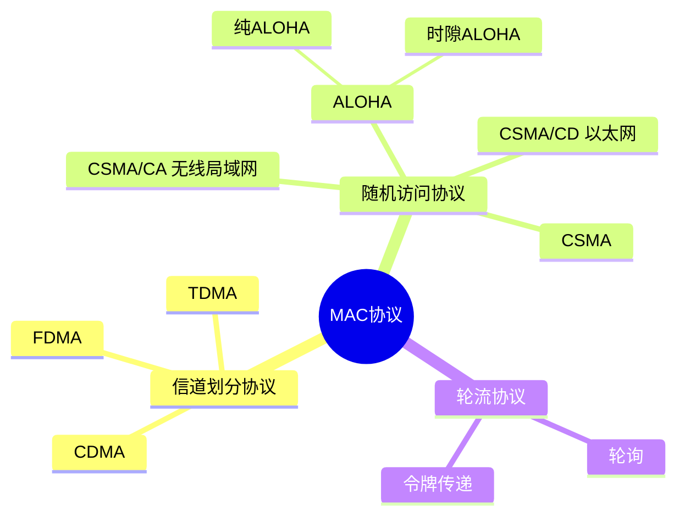
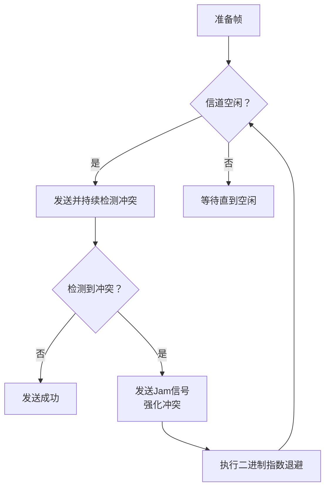
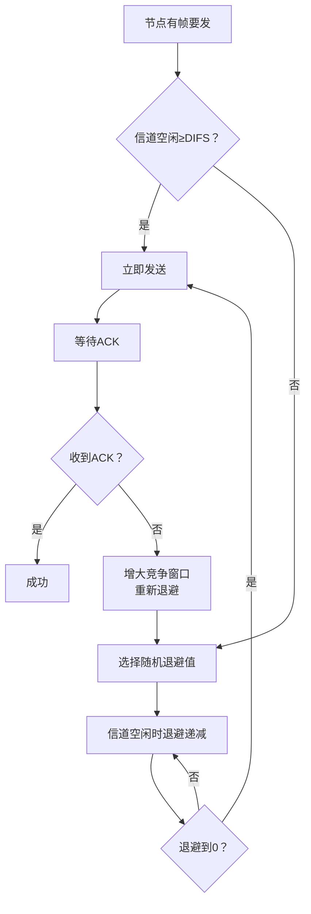
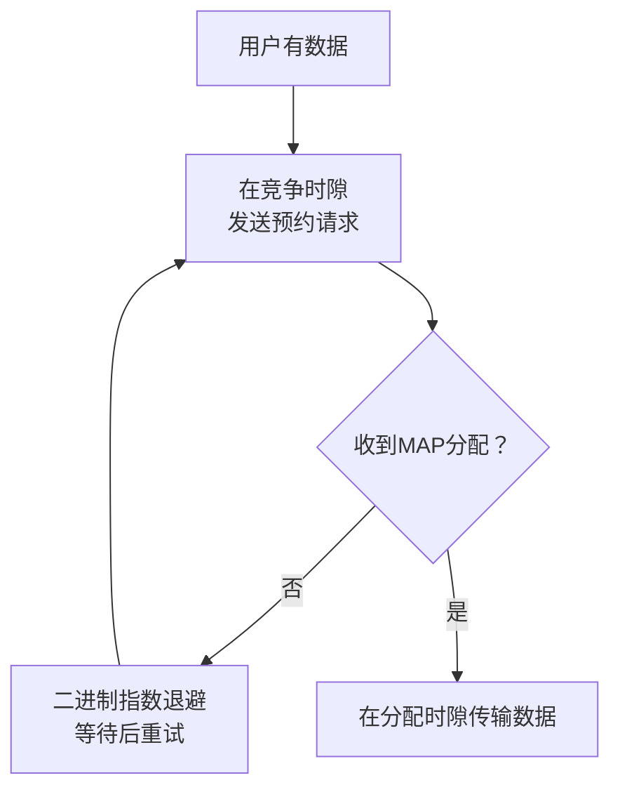

# 6.3 多点访问协议 —— 共享介质的协调之道

---

## 一、引言：两种类型的链路

根据连接方式，网络链路可分为两大类：

|链路类型|特点|典型应用|是否需要MAC协议|
|---|---|---|---|
|**点对点链路**|一对一的直接连接，无共享介质|PPP拨号、以太网交换机与主机之间的连接|❌ 不需要|
|**广播式链路**|多个节点共享同一传输介质|传统以太网（同轴电缆）、HFC上行、802.11无线局域网|✅ **必须**|

### 1. 广播式链路的特性

- **信号可达所有节点**：发送的信号能被物理介质上的所有节点接收。
    
- **地址过滤**：每个节点比较帧的目标MAC地址，仅接收匹配的帧，其余丢弃。
    
- **共享介质类型**：
    
    - 有线共享：如同轴电缆以太网
        
    - 无线射频共享：如WiFi、卫星通信
        
    - 声学共享：类比鸡尾酒会中多人同时讲话
        

### 2. 核心问题：介质访问控制（MAC）

当多个节点同时发送时，信号会在共享介质上**叠加**，导致接收方无法正确解析。因此需要一套**多点访问协议**来协调节点的发送时机，避免冲突。

---

## 二、多路访问协议概述

### 1. 协议的目标

- **冲突管理**：解决多个节点同时发送导致的信号碰撞。
    
- **信道分配**：分布式决定节点何时可以使用共享信道。
    
- **带内控制**：所有协调信息通过共享信道本身传输，无需额外信道。
    

### 2. 理想的MAC协议特性

|特性|描述|
|---|---|
|**全带宽利用**|当只有一个节点发送时，能以信道最大速率 RR bps 传输|
|**公平分配**|当 mm 个节点活跃时，每个节点平均获得 R/mR/m 的带宽|
|**完全分布式**|仅依赖本地信息决策，无需全局协调|
|**实现简单**|协议复杂度低，易于硬件实现|

---

## 三、MAC协议分类

### 1. 信道划分协议

|协议|原理|特点|应用|
|---|---|---|---|
|**FDMA**|将信道频带划分为多个子频段，每个站点独占一个频段|频段空闲时浪费|有线电视|
|**TDMA**|将时间划分为周期性的时隙，每个站点在固定时隙传输|需全网同步|蜂窝网络|
|**CDMA**|采用正交编码区分站点，允许同时传输|抗干扰强|3G移动通信|

**优点**：无冲突，高负载时性能稳定。  
**缺点**：低负载时资源浪费（节点只能获得固定带宽的 1/N）。

### 2. 随机访问协议

#### （1）ALOHA 协议

- **纯ALOHA**：节点有帧立即发送，冲突窗口为 **2倍帧传输时间**，效率仅 **17.5%**。
    
- **时隙ALOHA**：将时间划分为时隙，节点只能在时隙起点发送，冲突窗口减半，效率提升至 **37%**。
    

**效率公式**（时隙ALOHA）：

η=Np(1−p)N−1→N→∞1e≈37%

#### （2）CSMA（载波侦听多路访问）

- **思想**：“先听后说”，发送前监听信道。
    
- **冲突依然存在**：由于传播延迟，两个节点可能同时检测到“空闲”而同时发送。
    

#### （3）CSMA/CD（带冲突检测）—— 以太网的核心

**关键机制**：

- **边说边听**：发送过程中持续检测信号幅度是否异常。
    
- **强化冲突**：检测到冲突后发送 **Jam信号**（32-48 bit），确保所有节点感知冲突。
    
- **二进制指数退避**：
    
    - 第 m 次冲突后，在 [0,2m−1][0,2m−1] 中随机选择 KK。
        
    - 等待 K×512 bit时间（以太网基本时隙）。
        
    - 自适应：低负载时等待短，高负载时等待长。
        

**效率公式**：

$$η=11+5tprop/ttrans$$

- `tprop`​ 越小（距离短），效率越高。
    
- 典型10Mbps以太网效率可达 **90%以上**。
    

#### （4）CSMA/CA（冲突避免）—— 无线局域网（802.11）

**为什么无线不能用CSMA/CD？**

- 自身发送信号远强于接收信号，无法检测远处节点的微弱信号。
    
- 冲突 ≠ 传输失败（存在“捕获效应”）。
    
- 存在 **隐藏终端** 和 **暴露终端** 问题。
    

**CSMA/CA 工作机制**：

- **载波侦听**：发送前侦听信道，若持续空闲 **DIFS** 则直接发送。
    
- **随机退避**：若信道忙，在竞争窗口内随机选择退避值，信道空闲时递减，减到0才发送。
    
- **ACK确认**：接收方成功接收后，在 **SIFS** 间隔后回复ACK（SIFS < DIFS，保证ACK优先）。

**隐藏终端与RTS/CTS**：

- **隐藏终端**：A、C都能与B通信，但彼此不可见，同时发送会导致在B处冲突。
    
- **RTS/CTS握手**：
    
    1. 发送方发 **RTS**（请求发送）短帧。
        
    2. 接收方回复 **CTS**（允许发送）。
        
    3. 周围节点收到CTS后，设置 **NAV**（网络分配向量），延迟发送。
        
- **优点**：用短帧碰撞代替长数据帧碰撞，提高效率。
    

### 3. 轮流协议

|协议|原理|优点|缺点|
|---|---|---|---|
|**轮询**|主节点依次询问从节点|高负载时利用率100%|轮询开销、单点故障|
|**令牌传递**|特殊令牌帧在网络中循环，持有令牌才可发送|无冲突，负载均衡|令牌丢失需复杂恢复|

**典型应用**：蓝牙（轮询）、FDDI/令牌环（令牌传递）。

---

## 四、线缆接入网络（HFC）中的MAC

HFC（混合光纤同轴）网络采用 **上行竞争 + 下行广播** 的非对称设计。

- **下行信道**：CMTS（头端）单点发送，所有用户接收（广播），**无冲突**。
    
- **上行信道**：多个用户共享，采用 **竞争时隙 + 分配时隙** 的混合调度。
    

**上行接入流程**：

1. 用户在 **竞争时隙** 发送预约请求。
    
2. 若冲突，执行 **二进制指数退避** 后重试。
    
3. CMTS通过下行 **MAP** 帧广播分配结果。
    
4. 用户在分配的 **分配时隙** 传输数据，**无冲突**。
    

---

## 五、MAC协议对比与总结

|协议类型|代表协议|优点|缺点|适用场景|
|---|---|---|---|---|
|**信道划分**|TDMA、FDMA、CDMA|无冲突，高负载稳定|低负载资源浪费|蜂窝网络、卫星通信|
|**随机访问**|ALOHA、CSMA/CD、CSMA/CA|低负载时效率高，简单|高负载时冲突严重|以太网、WiFi|
|**轮流协议**|轮询、令牌传递|高负载效率高，公平|实现复杂，有单点故障|工业网络、令牌环|

**设计启示**：没有完美的MAC协议，需根据网络负载、物理介质特性、成本等因素权衡。

---

## 六、知识小结

|知识点|核心内容|考试重点/易混淆点|难度|
|---|---|---|---|
|**点对点 vs 广播链路**|点对点无需MAC，广播必须|区分两种链路|★★|
|**信道划分协议**|TDMA（时分）、FDMA（频分）、CDMA（码分）|各自划分维度|★★★|
|**纯ALOHA**|任意时刻发送，效率17.5%|冲突窗口2倍帧时|★★★|
|**时隙ALOHA**|同步时隙，效率37%|最大效率 1/e1/e|★★★|
|**CSMA**|先听后说，仍有冲突|传播延迟导致|★★★|
|**CSMA/CD**|边说边听，冲突后退避|二进制指数退避、Jam信号|★★★★★|
|**CSMA/CA**|冲突避免，RTS/CTS|与CSMA/CD区别|★★★★★|
|**隐藏终端**|节点不可见导致的冲突|RTS/CTS解决|★★★★|
|**轮询与令牌**|轮流获得发送权|优缺点对比|★★★|
|**HFC接入**|下行广播，上行竞争+预约|CMTS分配MAP|★★★|

---

> **核心启示**：多点访问协议是局域网和无线网络的基础。从ALOHA到CSMA/CD，再到CSMA/CA，每一次演进都针对特定物理介质和负载条件做了精巧的权衡。理解这些协议，就是理解网络如何“让多个声音有序地共享同一个频道”。