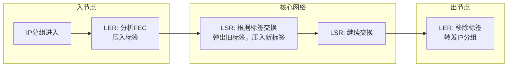

# 6.5 链路虚拟化：MPLS —— 多协议标签交换

---

## 一、MPLS 概述

### 1. 什么是 MPLS？

**MPLS**（Multi-Protocol Label Switching，多协议标签交换）是一种介于传统 IP 路由和二层交换之间的数据转发技术。它在 IP 网络基础上引入了**标签**的概念，通过预先建立的标签路径实现快速转发。

- **多协议**：不仅支持 IP，还支持其他网络层协议（如 IPX、AppleTalk 等）。
    
- **标签交换**：核心机制，类似 ATM 的虚电路，但基于无连接的 IP 网络。
    

### 2. 为什么需要 MPLS？

传统 IP 路由存在以下问题：

|问题|描述|
|---|---|
|**最长前缀匹配**|每台路由器需要查找路由表（软件查找），转发效率低。|
|**流量工程困难**|IP 路由只基于目的地址，难以灵活控制流量路径。|
|**VPN 实现复杂**|传统的 VPN 基于隧道（如 GRE），扩展性差。|

MPLS 的出现解决了这些问题，被广泛应用于运营商骨干网。

---

## 二、MPLS 工作原理

### 1. 基本概念

|术语|含义|
|---|---|
|**标签**|固定长度的短标识符（通常 20 位），用于快速转发。|
|**LER**|标签边缘路由器（Label Edge Router），位于 MPLS 域边界，负责添加/移除标签。|
|**LSR**|标签交换路由器（Label Switching Router），核心路由器，根据标签转发。|
|**LSP**|标签交换路径（Label Switched Path），一条预先建立的标签转发路径。|
|**FEC**|转发等价类（Forwarding Equivalence Class），具有相同转发行为的一组分组。|

### 2. 转发过程



**详细步骤**：

1. **入节点 LER**：当 IP 分组到达 MPLS 域边缘时，LER 根据分组的目的地址确定其属于哪个 **FEC**，然后为该分组**压入**一个标签（标签栈），形成 MPLS 报文，转发给下一跳 LSR。
    
2. **核心 LSR**：LSR 不查看 IP 头，仅根据顶部的标签查找本地**标签转发表**，用新标签替换旧标签，并从指定端口转发出去。
    
3. **出节点 LER**：当分组离开 MPLS 域时，LER **移除**标签，恢复为普通 IP 分组，再按传统 IP 路由转发。
    

### 3. 标签结构

MPLS 标签位于二层帧头和三层 IP 头之间（称为“垫层”），格式如下：

```text

+----------------+------+-----+--------+
| 标签 (20位)    | EXP | S | TTL (8位) |
+----------------+------+-----+--------+
```

- **标签**：20 位，用于本地转发决策。
    
- **EXP**：3 位，实验用，通常用于 QoS（服务等级）。
    
- **S**：1 位，栈底标志，1 表示是最后一个标签（支持多级标签）。
    
- **TTL**：8 位，生存时间，防止环路。
    

---

## 三、MPLS 的优势

### 1. 转发效率高

- 基于固定长度标签的精确匹配，可用硬件快速交换（类似 ATM）。
    
- 避免了 IP 最长前缀匹配的软件查找开销。
    

### 2. 支持流量工程

- 通过建立显式路径（LSP），可以灵活控制流量走向，避免拥塞。
    
- 结合约束路由（如基于带宽、延迟），实现资源优化。
    

### 3. 易于实现 VPN

- **MPLS VPN** 利用标签栈隔离不同用户的流量，扩展性好。
    
- 常见的 L3VPN（如 RFC 4364）和 L2VPN（VPLS）都基于 MPLS。
    

### 4. 多协议支持

- 可以承载 IPv4、IPv6、IPX 等多种网络层协议，甚至以太网帧。
    

---

## 四、MPLS 控制平面与数据平面

|平面|功能|协议/机制|
|---|---|---|
|**控制平面**|建立和维护标签转发表|LDP（标签分发协议）、RSVP-TE、MP-BGP|
|**数据平面**|根据标签转发分组|硬件标签交换|

- **LDP**：自动为 FEC 分配标签，建立 LSP。
    
- **RSVP-TE**：用于流量工程，可以显式指定路径并预留资源。
    
- **MP-BGP**：在 MPLS VPN 中分发 VPN 路由和标签。
    

---

## 五、MPLS 与传统 IP 路由对比

|对比维度|传统 IP 路由|MPLS|
|---|---|---|
|**转发依据**|目的 IP 地址（最长前缀匹配）|固定长度标签|
|**控制平面**|分布式路由协议（OSPF、BGP）|标签分发协议（LDP、RSVP-TE）|
|**路径控制**|只能基于目的地址，难以工程|可显式指定路径，支持流量工程|
|**VPN 支持**|需隧道技术（GRE、IPsec）|原生支持 MPLS VPN|
|**转发性能**|软件查找，较慢|硬件交换，高速|
|**部署位置**|广泛用于企业网、互联网|主要用于运营商骨干网|

---

## 六、MPLS 应用场景

1. **运营商骨干网**：利用 MPLS 提高转发效率，实现流量工程和快速重路由。
    
2. **MPLS VPN**：为企业客户提供虚拟专网服务，安全隔离。
    
3. **流量工程**：优化链路利用率，避免拥塞。
    
4. **多协议承载**：统一承载 IPv4、IPv6 等多种业务。
    
5. **以太网承载**：通过 MPLS 实现 VPLS，扩展二层网络。
    

---

## 七、知识小结

|知识点|核心内容|考试重点/易混淆点|难度|
|---|---|---|---|
|**MPLS 定义**|多协议标签交换，在 IP 网络基础上引入标签转发|与传统 IP 路由的区别|★★★|
|**标签交换**|基于固定长度标签的快速交换|标签栈、压入/弹出操作|★★★★|
|**LSP**|标签交换路径，需控制平面建立|LDP 与 RSVP-TE 的作用|★★★★|
|**FEC**|转发等价类，决定标签分配|与目的地址前缀的关系|★★★|
|**LER/LSR**|边缘/核心标签路由器|不同角色功能|★★★|
|**MPLS 优势**|高速转发、流量工程、VPN、多协议|与 IP 路由对比|★★★|
|**控制平面**|LDP、RSVP-TE、MP-BGP|协议分工|★★★★|
|**数据平面**|硬件标签交换|快速转发的实现|★★★|
|**应用场景**|运营商骨干网、MPLS VPN、流量工程|实际部署|★★★|

---

## 八、总结

MPLS 不是取代 IP，而是对 IP 网络的增强。它通过在网络边缘分析 IP 头、分配标签，在网络核心用标签交换代替 IP 路由，从而实现了**高速转发、灵活路径控制、多业务承载**等能力。MPLS 已成为现代运营商网络的核心技术，为 VPN、流量工程、下一代网络（如 5G 承载）奠定了基础。