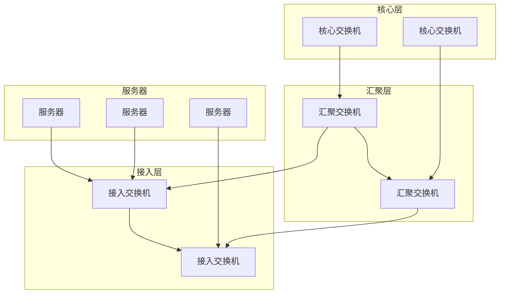
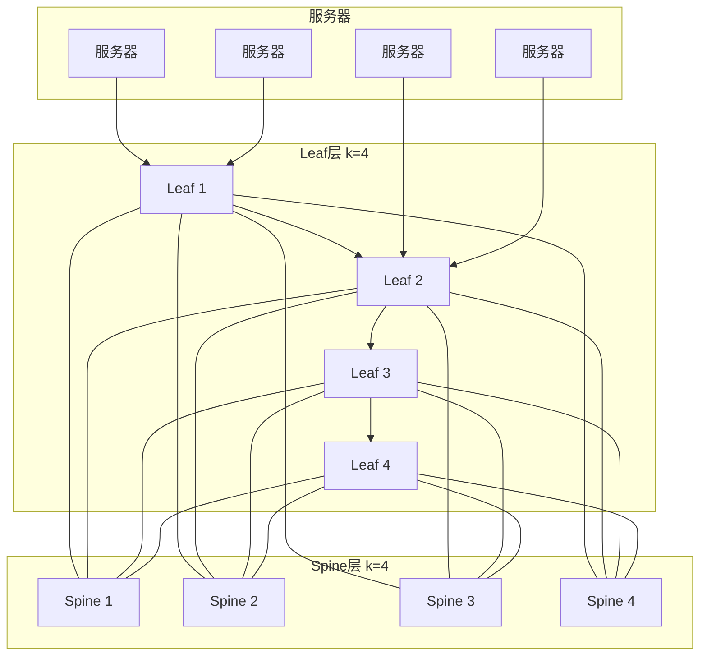

# 6.6 数据中心网络 —— 云时代的“信息枢纽”

---

## 一、数据中心网络概述

### 1. 什么是数据中心网络？

**数据中心网络**（Data Center Network, DCN）是指连接数据中心内部**数万至数十万台**服务器、存储设备和计算资源的网络基础设施。它是云计算、大数据、电子商务等现代互联网服务的物理基石。

|对比维度|普通局域网|数据中心网络|
|---|---|---|
|**规模**|数十至数百台设备|**数万至数十万台**服务器|
|**距离**|楼层/楼宇范围|同一园区/建筑内，密集耦合|
|**通信模式**|客户端-服务器为主|**服务器间东西向流量**为主|
|**性能要求**|百兆/千兆为主|**万兆/25G/100G** 高带宽|
|**可靠性**|较高，可容忍分钟级故障|**极高**，故障自动容错|
|**管理复杂度**|手动或半自动|**全自动化**，零接触配置|

### 2. 典型应用场景

- **电子商务平台**（如 Amazon、淘宝）：处理海量并发交易，需低延迟、高可用。
    
- **内容分发**（如 YouTube、Netflix、Akamai）：存储和分发海量视频内容。
    
- **搜索引擎与数据挖掘**（如 Google、百度）：运行 MapReduce、Spark 等分布式计算框架，服务器间频繁交换中间数据。
    
- **云服务**（如 AWS、Azure、阿里云）：为成千上万的租户提供虚拟化计算和存储资源。
    

### 3. 核心挑战

|挑战|描述|
|---|---|
|**规模扩展**|支持数十万台服务器，网络架构必须可扩展（无单点瓶颈）。|
|**高带宽**|服务器间东西向流量爆炸式增长，需高 radix 交换机和大带宽链路。|
|**低延迟**|分布式应用（如 Hadoop、Spark）对延迟敏感，微秒级差异影响作业完成时间。|
|**可靠性**|任何单点故障不能影响整体服务，需多路径冗余和快速故障切换。|
|**多租户隔离**|云环境中不同租户的网络流量需隔离，同时保证性能。|
|**能源效率**|数据中心耗电巨大，网络设备需考虑功耗优化。|

---

## 二、数据中心网络架构演进

### 1. 传统三层树型架构

|层次|角色|特点|问题|
|---|---|---|---|
|**核心层**|连接多个汇聚层，提供高速IP路由|高可靠性，冗余设计|带宽收敛比高，易成瓶颈|
|**汇聚层**|聚合接入交换机，运行STP/VLAN|提供二层/三层边界|扩展性有限（STP阻塞链路）|
|**接入层**|直接连接服务器（ToR交换机）|通常为1G/10G接入|带宽收敛比高（典型20:1）|

**缺点**：

- **带宽收敛**：上层链路带宽远小于下层总和，导致拥塞。
    
- **STP限制**：生成树协议阻塞冗余链路，浪费带宽。
    
- **扩展困难**：难以支撑万级服务器规模。
    

### 2. 现代数据中心架构：CLOS/Fat-Tree

受电话交换网络启发，现代数据中心采用**CLOS网络架构**（又称**Fat-Tree**），实现**无收敛、高带宽、可扩展**。

|术语|含义|特点|
|---|---|---|
|**Leaf（叶交换机）**|连接服务器的接入交换机|相当于ToR，运行二层或三层|
|**Spine（脊交换机）**|核心交换层，连接所有Leaf|纯转发，不做聚合，高 radix|
|**等成本多路径**|所有 Leaf-Spine 链路等价|可用 ECMP 负载均衡|

**关键特性**：

- **无阻塞**：任意 Leaf 之间至少有 k/2 条等价路径，带宽无收敛。
    
- **可扩展**：增加 Spine 交换机即可线性扩展带宽和端口数。
    
- **容错**：单个 Spine 或链路故障，流量自动切换到其他路径。
    

**规模计算**（k 元 Fat-Tree）：

- 每个 Leaf 连接 k/2 台服务器
    
- 总服务器数 = (k/2)²
    
- 例：k=64，总服务器数 = 1024 台；k=128，总服务器数 = 4096 台。
    

### 3. 新兴架构：叶脊架构

叶脊架构是 Fat-Tree 的商用实现，已成为现代数据中心事实标准：

|优势|说明|
|---|---|
|**扁平化**|所有 Leaf 到 Spine 一跳，延迟可预测。|
|**高带宽**|全网无阻塞，东西向流量性能极大提升。|
|**简化管理**|不再需要复杂的 STP 配置，路由协议（如 BGP）或 SDN 控制。|
|**易于扩展**|横向增加 Spine 或 Leaf 即可扩展容量。|

---

## 三、数据中心网络关键技术

### 1. 服务器接入技术

|接入方式|带宽|特点|
|---|---|---|
|**10Gbase-T**|10G|使用六类/七类双绞线，兼容性好，功耗较高。|
|**SFP+ 直连铜缆**|10G|短距离低成本，常用于机柜内。|
|**25G/50G 以太网**|25G/50G|新一代服务器接入标准，性价比高。|
|**100G/400G**|100G/400G|用于 Spine-Leaf 互联或核心交换机。|

### 2. 网络虚拟化

- **VXLAN**：将二层网络扩展到三层 IP 网络之上，支持多达 1600 万虚拟网络，实现租户隔离。
    
- **NVGRE**：微软提出的类似技术。
    
- **Geneve**：IETF 标准化封装格式。
    

### 3. SDN 与自动化

- **集中控制**：使用 OpenFlow、OVSDB 等南向协议，控制器统一管理全网。
    
- **意图网络**：管理员声明需求（如“租户A 需要 10G 带宽”），控制器自动配置。
    
- **自动运维**：交换机零接触配置，故障自动检测恢复。
    

### 4. 拥塞控制

- **DCQCN**：RoCEv2 网络中用于无损以太网的拥塞控制协议。
    
- **DCTCP**：微软提出的数据中心 TCP，利用 ECN 标记实现低延迟。
    
- **优先级流控**（PFC）：基于优先级的停等机制，防止丢包。
    

### 5. 负载均衡

- **ECMP**：基于哈希的等价多路径转发，简单但可能哈希冲突。
    
- **ConGA**：Google 提出的动态负载均衡，实时感知拥塞。
    
- **Maglev**：Google 的负载均衡器，用于南北向流量。
    

---

## 四、数据中心网络面临的挑战

|挑战|描述|解决方案方向|
|---|---|---|
|**规模扩展**|单集群支持百万容器/虚机|扁平化设计、分布式路由、SDN|
|**多租户性能隔离**|租户间“吵闹邻居”问题|带宽保证、QoS、硬件队列|
|**安全性**|内部流量安全，防攻击|微分段、加密（如 IPSec）、零信任|
|**运维复杂度**|海量设备配置监控|自动化平台、AIOps、意图网络|
|**能源消耗**|网络设备耗电占数据中心 10-20%|低功耗芯片、动态调速、光互连|

---

## 五、知识小结

|知识点|核心内容|考试重点/易混淆点|难度|
|---|---|---|---|
|**数据中心网络定义**|连接数万至数十万服务器的高性能网络|与普通局域网的本质区别|★★★|
|**三层树型架构**|核心-汇聚-接入，STP 限制带宽|收敛比、STP 问题|★★★★|
|**Fat-Tree/CLOS**|无阻塞架构，等成本多路径|k 元 Fat-Tree 规模计算|★★★★★|
|**叶脊架构**|现代数据中心事实标准|Spine 和 Leaf 角色|★★★★|
|**服务器接入**|10G/25G/100G 演进|不同介质特点|★★★|
|**网络虚拟化**|VXLAN、NVGRE|叠加网络技术|★★★★|
|**SDN 自动化**|集中控制、意图网络|与传统网络对比|★★★★|
|**拥塞控制**|DCQCN、DCTCP、PFC|无损以太网技术|★★★★★|
|**负载均衡**|ECMP、ConGA|静态 vs 动态|★★★★|
|**主要挑战**|规模、隔离、安全、能耗|综合理解|★★★|

---

> **核心启示**：数据中心网络是云计算时代的核心基础设施。从传统三层架构到 CLOS/Fat-Tree，再到 SDN 和虚拟化，每一次演进都围绕着**规模、带宽、延迟、自动化**这几个核心目标。理解数据中心网络，就是理解现代互联网服务如何支撑起数十亿用户。