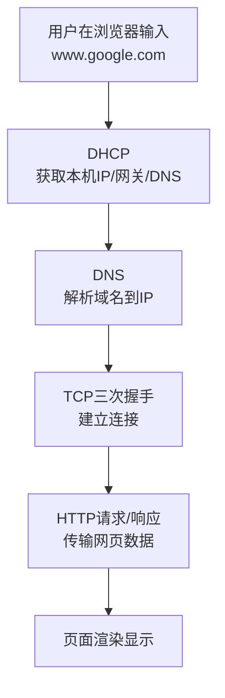
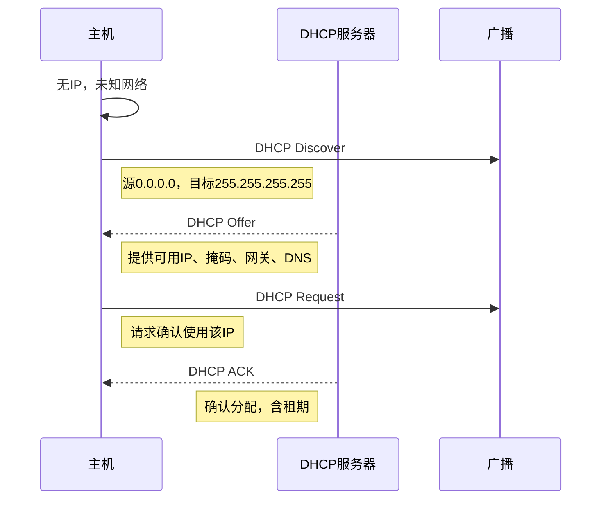
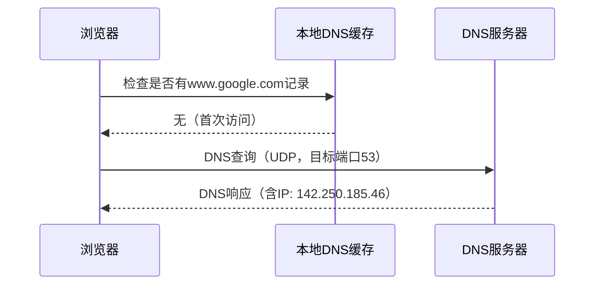
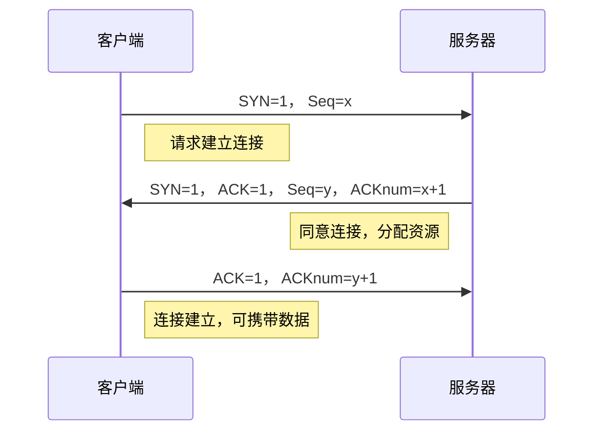
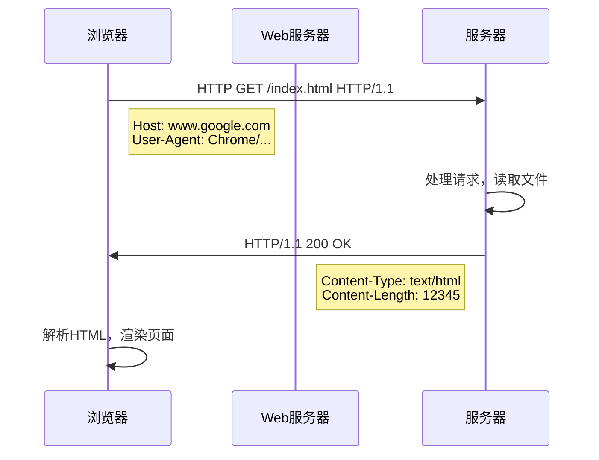
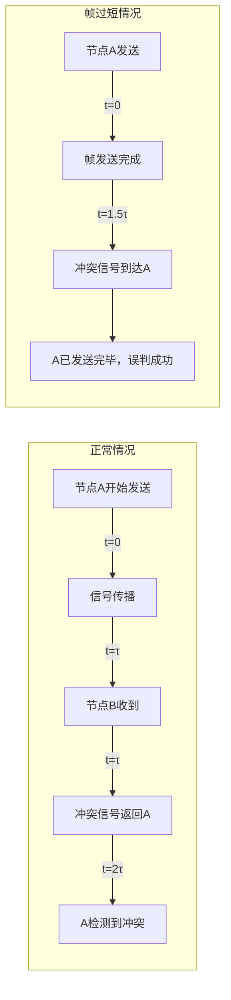

# 6.7 一个 Web 请求的一天 —— 协议栈的完整旅程

---

## 一、引言：从用户在浏览器输入网址说起

当你在浏览器中输入 `www.google.com` 并按下回车，到页面完全显示，背后是一场跨越多个网络设备和协议栈的**精密协作**。本章将以这个经典场景为例，串联起从**应用层到物理层**的所有协议，展示它们如何各司其职，共同完成一次 Web 请求。




---

## 二、关键协议交互时序

### 1. DHCP：网络接入的第一步

当设备首次接入网络（或重启后），它需要先获取自己的网络配置。这一步由 **DHCP**（动态主机配置协议）完成。



**获取的配置**：

- **本机 IP 地址**（如 192.168.1.100）
    
- **子网掩码**（如 255.255.255.0）
    
- **默认网关**（如 192.168.1.1）
    
- **DNS 服务器**（如 8.8.8.8）
    

### 2. DNS：域名到 IP 的解析

有了 DNS 服务器地址，浏览器就可以向 DNS 查询 `www.google.com` 对应的 IP 地址。



**解析方式**：

- **递归查询**：本地 DNS 服务器替客户端完成全部查询。
    
- **迭代查询**：本地 DNS 服务器依次向根、顶级域、权威服务器查询（常用）。
    

### 3. TCP 三次握手：建立可靠连接

获得目标 IP 后，浏览器准备发送 HTTP 请求。在此之前，必须先与服务器建立 **TCP 连接**（三次握手）。



**为什么必须三次？**  
防止旧连接请求的干扰，确保双方都具备收发能力。

### 4. HTTP 请求/响应：真正的数据传输

TCP 连接建立后，浏览器发送 **HTTP GET 请求**，服务器返回网页内容。




---

## 三、以太网冲突检测与最小帧长

在链路层，有一个关键机制保证了共享介质上通信的可靠性——**CSMA/CD**。其中 **最小帧长** 的概念至关重要。

### 1. 为什么需要最小帧长？

- **冲突窗口**：信号在最远两个节点间往返的时间 2τ2τ。
    
- **发送方必须在发送期间检测到冲突**，才能及时停止并退避。
    
- 如果帧持续时间 <2τ<2τ，发送方可能在发送完毕后才知道发生了冲突，导致“虚假成功”。
    



### 2. 最小帧长的物理意义

- 确保发送方在 **2τ 时间内** 始终处于发送状态。
    
- 以太网规定最小帧长为 **64 字节**（从目标 MAC 到 FCS）。
    
- 对于 10Mbps 以太网，64 字节对应 **51.2 μs**，即 2τ 的最大值（对应 2500 米电缆长度）。
    

### 3. 数学关系

$$最小帧长=2×τ×带宽$$

- τ：最远节点间传播延迟。
    
- 带宽越高，最小帧长需相应增加，或限制网络直径。
    

**例题**：若网络直径 2500 米，信号传播速度 2.5×108 m/s，带宽 10Mbps，求最小帧长。

解：

τ=25002.5×108=10μs
2τ=20μs
最小帧长=20μs×10Mbps=200bit=25字节

（实际以太网取 64 字节，留有裕量）

---

## 四、PPP 协议：点对点链路的简约之美

在路由器之间或家庭 ADSL 接入中，常用 **PPP**（点对点协议）替代以太网。

|对比|以太网|PPP|
|---|---|---|
|**连接方式**|多点接入（需MAC）|点对点（无需MAC）|
|**帧结构**|含 MAC 地址、类型等|简化，无地址字段|
|**介质访问控制**|CSMA/CD|不需要|
|**认证**|无|PAP/CHAP 可选|
|**典型应用**|局域网|拨号、光纤直连|

**PPP 帧格式**：

```text

+------+------+------+------+------+------+
| Flag | Addr | Ctrl | Proto| Info | FCS | Flag
| 01111110 | 11111111 | 00000011 | 16bit| ...  | 16/32bit | 01111110
+------+------+------+------+------+------+
```

- **Flag**：帧定界。
    
- **Addr**：广播地址（点对点中无意义，固定）。
    
- **Ctrl**：无编号帧。
    
- **Proto**：上层协议类型（如 IP、IPX）。
    

---

## 五、总结：链路层服务全景图

### 1. 链路层核心功能回顾

|功能|描述|实现技术|
|---|---|---|
|**成帧**|将网络层分组封装成帧|HDLC、PPP、以太网帧|
|**差错控制**|检测/纠正传输错误|CRC、校验和、FEC|
|**多路访问**|协调共享介质的使用|CSMA/CD、CSMA/CA、令牌|
|**链路编址**|唯一标识网卡|MAC 地址（48位）|
|**地址解析**|IP 到 MAC 的映射|ARP|
|**可靠传输**|确认重传（仅无线）|802.11 ACK|

### 2. 典型链路层实例

|技术|类型|特点|
|---|---|---|
|**以太网**|有线局域网|CSMA/CD，已发展为全双工|
|**WLAN**|无线局域网|CSMA/CA，RTS/CTS|
|**PPP**|点对点广域网|简化帧，支持认证|
|**VLAN**|虚拟局域网|802.1Q 标签隔离广播域|
|**MPLS**|标签交换|快速转发，流量工程|

---

## 六、知识小结

|知识点|核心内容|考试重点/易混淆点|难度|
|---|---|---|---|
|**DHCP 流程**|自动获取 IP/网关/DNS|Discover-Offer-Request-ACK|★★★|
|**DNS 解析**|域名 → IP|递归 vs 迭代|★★★|
|**TCP 三次握手**|建立可靠连接|SYN 序号同步|★★★|
|**HTTP 请求**|GET 方法，响应报文|状态码 200/404|★★★|
|**最小帧长**|确保冲突检测|2τ2τ 与帧持续时间|★★★★★|
|**冲突窗口**|最远节点往返时间|以太网 51.2 μs|★★★★|
|**PPP 协议**|点对点简化帧|无 MAC 地址|★★★|
|**CSMA/CD**|载波侦听 + 冲突检测|二进制指数退避|★★★★|
|**分层封装**|应用 → TCP → IP → 帧|每层添加头部|★★★|

---

## 七、结语：一个 Web 请求的不平凡旅程

看似瞬间完成的网页加载，背后是：

- **DHCP** 为你分配“身份证”
    
- **DNS** 帮你找到目的地
    
- **TCP** 为你铺好可靠的“管道”
    
- **HTTP** 承载真正的“货物”
    
- **以太网/PPP** 负责每一段的“运输”
    
- **CSMA/CD** 确保共享道路上“不撞车”
    

每一层协议都恪守职责，又紧密配合。这就是计算机网络分层设计的魅力——将复杂的通信过程分解为清晰可管理的模块，让全球数十亿设备能够无障碍地互联互通。