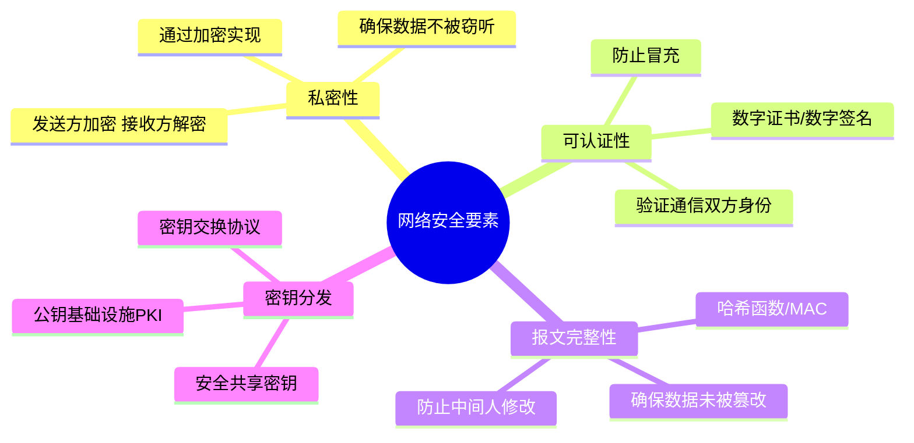
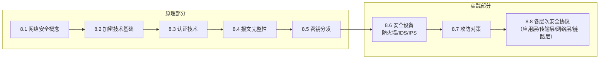

# 第8章 网络安全概述 —— 从概念到框架

---

## 一、引言：为什么网络安全如此重要？

随着互联网成为人类社会的基础设施，网络安全已经从“可选项”变为“必选项”。无论是个人隐私、企业数据，还是国家安全，都依赖于网络安全的保障。本章将帮助读者建立网络安全的基本概念框架，为后续深入学习各类安全协议和技术打下坚实基础。

> 💡 **科大教学特色**：“学得厚重”——注重扎实的基础知识培养，而非浮于表面的技术名词记忆。这种学习方式对长期发展（如从事AI、独角兽企业创新）至关重要。

---

## 二、网络安全的核心要素

网络安全的四大核心要素相互关联，共同构成安全体系的基础：

### 1. 私密性（Confidentiality）

- **定义**：确保信息只被授权方访问，未被授权者无法获取明文内容。
    
- **实现方式**：**加解密技术**
    
    - 发送方使用密钥将明文转换为密文
        
    - 密文在信道上传输
        
    - 接收方使用密钥解密密文恢复明文
        
- **关键点**：即使攻击者截获密文，也无法（或在合理计算时间内无法）解密得到原始信息。
    

### 2. 可认证性（Authentication）

- **定义**：验证通信双方的身份真实性，确保你正在通信的对象确实是其所声称的实体。
    
- **常见手段**：
    
    - **数字证书**（如X.509证书）
        
    - **数字签名**
        
    - **基于密码的认证**（需结合加密传输，否则明文密码易被窃取）
        
- **场景示例**：访问网上银行时，客户端需要认证服务器的真伪（防止钓鱼网站），服务器也需要认证客户的身份。
    

### 3. 报文完整性（Message Integrity）

- **定义**：确保数据在传输过程中未被篡改、插入或删除。
    
- **实现方式**：
    
    - **哈希函数**（如SHA-256）：为报文生成固定长度的摘要，接收方重新计算摘要比对。
        
    - **消息认证码**（MAC）：结合共享密钥的哈希，防止攻击者同时修改报文和摘要。
        
- **与私密性的区别**：完整性保护不一定要加密内容，但能检测内容是否被改动。
    

### 4. 密钥分发（Key Distribution）

- **定义**：如何安全地将加密密钥分发给通信双方，让它们能够建立安全通道。
    
- **挑战**：密钥本身也需要安全传输，形成“先有鸡还是先有蛋”的困境。
    
- **解决方案**：
    
    - **公钥基础设施**（PKI）：使用公钥加密分发对称密钥。
        
    - **密钥交换协议**（如Diffie-Hellman）：双方在不安全的信道上协商出共享密钥。
        
    - **带外分发**：人工配置、物理介质传输（适用于小规模场景）。
        

---

## 三、课程结构与学习路径

本章内容按以下结构组织，前重后轻，原理先行：

|章节|内容|学习要求|
|---|---|---|
|**8.1**|网络安全基本概念|理解四大要素及其关系|
|**8.2-8.5**|核心技术原理（加密、认证、完整性、密钥分发）|**重点掌握**，奠定理论基础|
|**8.6-8.7**|安全设备与攻防对策|了解功能和应用场景|
|**8.8**|各层次安全协议|快速概览，了解协议栈中安全机制的位置|

> 📘 **自学提示**：后半部分涉及的具体协议（如IPsec、SSL/TLS、SSH等）建议结合参考书深入学习，课程中只做框架性介绍。

---

## 四、安全协议在各层次的位置

安全可以贯穿整个协议栈，不同层次解决不同问题：

|协议栈层次|典型安全协议|主要保护对象|特点|
|---|---|---|---|
|**应用层**|HTTPS、SSH、PGP|特定应用数据|与应用紧耦合，灵活|
|**传输层**|TLS/SSL|端到端通信|对应用透明，广泛使用|
|**网络层**|IPsec|所有IP数据报|保护整个IP包，适用于VPN|
|**链路层**|802.1X、WPA2/3|物理链路帧|主要针对无线接入安全|

**安全协议的选择**取决于具体需求：

- 保护Web交易 → 应用层/传输层（HTTPS）
    
- 构建企业VPN → 网络层（IPsec）
    
- 保护无线网络 → 链路层（WPA3）
    

---

## 五、知识小结

|知识点|核心内容|考试重点/易混淆点|难度|
|---|---|---|---|
|**网络安全定义**|保护网络传输的私密性、认证性、完整性、密钥分发|四大要素的**区别与联系**|★★★|
|**私密性**|通过加密实现，信道传输密文|加密 ≠ 全程安全（需结合其他要素）|★★★|
|**可认证性**|验证通信双方身份|与“授权”的区别|★★★|
|**报文完整性**|确保数据未被篡改|哈希 vs MAC 的区别|★★★★|
|**密钥分发**|安全共享密钥的方法|公钥基础设施（PKI）的作用|★★★★|
|**课程结构**|原理重点讲，实践快讲|自学与实践结合|★★|
|**各层安全协议**|TLS、IPsec、WPA等|协议所属层次|★★★|
|**科大教学特色**|“厚重学习”，强调基础扎实|长期价值 vs 短期负担|★★|

---

> **核心启示**：网络安全不是单一技术，而是由**私密性、认证性、完整性、密钥分发**四大支柱共同支撑的体系。理解它们之间的关系，比记忆具体协议细节更为重要。本章将为后续深入学习各类安全技术奠定概念框架。