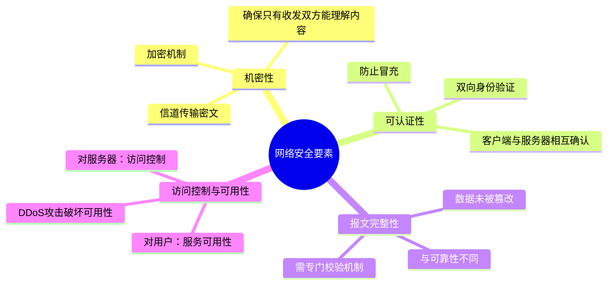
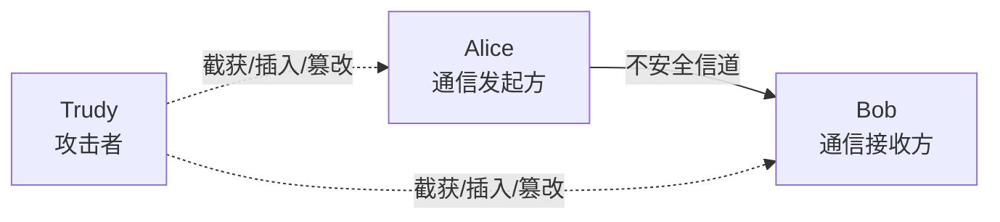

# 8.1 什么是网络安全 —— 核心要素与攻击模型

---

## 一、引言

网络安全是计算机网络中至关重要的一环，它确保在开放的网络环境中，通信双方能够安全地交换信息，即使存在恶意攻击者。本章将介绍网络安全的四大核心要素，并通过经典模型理解攻击者的行为。

---

## 二、网络安全的四大核心要素

网络安全的四大要素相互关联，缺一不可：

### 1. 机密性（Confidentiality）

- **定义**：确保信息在传输过程中**不被未授权方窃取和理解**。
    
- **实现方式**：**加解密机制**。发送方使用密钥将明文转换为密文，接收方使用密钥解密密文。即使攻击者截获密文，也无法（或在合理时间内无法）还原为原始信息。
    
- **同义术语**：也称为**私密性**。
    
- **信道要求**：传输的是**密文**，而非明文。这保证了即使信道被监听，内容依然安全。
    

### 2. 可认证性（Authentication）

- **定义**：通信双方需要**相互确认对方的真实身份**，防止冒充。
    
- **典型场景**：
    
    - **网上银行**：客户端必须确认服务器是真正的银行服务器（防止钓鱼网站），服务器也必须确认客户是合法用户。
        
    - **社交聊天**：确认对方不是冒充者。
        
- **层次性**：各协议层（应用层、传输层、网络层）都需要实现认证机制，例如：
    
    - 应用层：HTTPS 证书验证
        
    - 网络层：OSPF 路由协议认证
        

### 3. 报文完整性（Message Integrity）

- **定义**：接收方能够**确认报文在传输过程中未被篡改、插入或删除**。
    
- **与可靠性区别**：
    
    - **可靠性**（如 TCP 保证）确保数据**按序到达、不丢失**，但不保证内容未被恶意修改。
        
    - **完整性**是**安全特性**，需要专门机制（如哈希函数、消息认证码）来检测篡改。
        
- **严重后果案例**：
    
    - 银行转账金额从 $1M 被篡改为 $10M。
        
    - 社交场景中，伪造的分手信息导致情感纠纷。
        
- **验证机制**：需要在接收方设计校验方法，能够检测到**事中或事后篡改**。
    

### 4. 访问控制与可用性（Access Control & Availability）

- **访问控制**：对服务器而言，确保只有**授权用户**才能访问资源，拒绝非法访问。
    
- **可用性**：对合法用户而言，确保服务**持续可用**，不受攻击影响。
    
- **攻击案例**：**DDoS 攻击**（分布式拒绝服务攻击）通过耗尽资源（带宽、CPU），使正常用户无法访问服务。
    
- **关系**：通过有效的访问控制机制，可以保障服务的可用性。
    

> 💡 **违反任一要素**即构成安全漏洞。完整的安全方案必须覆盖这四个方面。

---

## 三、网络安全著名模型：Alice、Bob 和 Trudy

- **Alice 和 Bob**：通信双方（通常是合法用户）。
    
- **Trudy**：攻击者（取意 "Troublemaker"）。
    
- **安全目标**：在 Trudy 存在的情况下，实现上述四大安全要素。
    

**攻击者可能的行为**：

- **截获**：窃听通信内容，破坏机密性。
    
- **插入**：向信道中注入伪造报文，破坏完整性和认证性。
    
- **篡改**：修改报文内容，破坏完整性。
    
- **伪装**：伪造源地址，冒充他人身份。
    
- **劫持**：在合法用户完成认证后接管会话。
    
- **拒绝服务**：阻止正常服务，破坏可用性。
    

---

## 四、现实世界中的“Bob 和 Alice”

许多现实场景都需要上述安全要素：

|场景|需要保护的要素|
|---|---|
|**电子商务**（浏览器 ↔ Web 服务器）|机密性（如信用卡号）、完整性（订单金额）、认证性（服务器真伪）|
|**网上银行**|机密性、完整性、双向认证|
|**DNS 通信**|完整性（防止 DNS 欺骗）、可用性（防止 DNS 瘫痪）|
|**OSPF 路由协议**|认证性（防止虚假路由通告）|

---

## 五、网络中的“坏蛋”——攻击手段详解

攻击者可以实施多种恶意行为：

|攻击类型|描述|破坏的要素|
|---|---|---|
|**窃听**（Eavesdropping）|截获并读取通信内容|机密性|
|**插入**（Insertion）|在连接中注入伪造报文|完整性、可认证性|
|**伪装**（Spoofing）|伪造源地址，冒充他人身份|可认证性|
|**劫持**（Hijacking）|让合法用户完成认证后，踢出用户并接管连接|可认证性、可用性|
|**拒绝服务**（DoS/DDoS）|通过资源过载，阻止正常用户使用服务|可用性|

### 会话劫持过程

1. 攻击者让合法用户完成认证（例如，用户已登录网银）。
    
2. 建立安全会话后，攻击者**替换**通信方，踢出原用户。
    
3. 利用已认证的会话进行恶意操作（如转账）。
    

---

## 六、知识小结

|知识点|核心内容|考试重点/易混淆点|难度|
|---|---|---|---|
|**网络安全的四大要素**|1. **机密性**（加密传输）   2. **可认证性**（身份验证）   3. **报文完整性**（防篡改）   4. **访问控制与服务可用性**|- 私密性 ≠ 可靠性   - 可认证性需双向验证   - 完整性需区分“篡改”与“传输错误”|★★★★|
|**Alice-Bob-Trudy 模型**|- Alice/Bob：通信双方   - Trudy：攻击者   - 攻击行为：截获、插入、篡改、伪装、劫持、DoS|- 模型中的 Trudy 代表攻击者   - 劫持与伪装的区别|★★★★★|
|**现实场景映射**|- 网银需验证服务器身份（防钓鱼）   - OSPF 需认证路由通告|- 电子商务中完整性缺失的后果（如转账金额被改）|★★★★|
|**攻击手段**|窃听、插入、伪装、劫持、拒绝服务|每种攻击破坏哪些要素|★★★|

---

> **核心启示**：网络安全不是单一技术，而是由**机密性、可认证性、完整性、可用性**四大支柱共同支撑的体系。理解它们之间的区别与联系，是设计安全系统的基础。