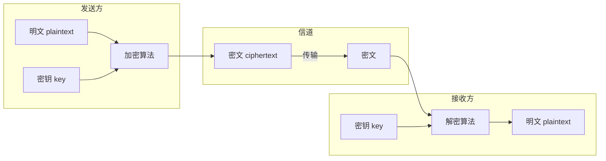
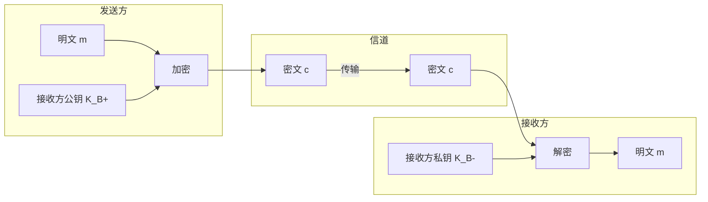
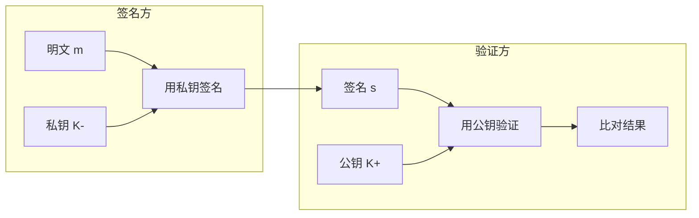
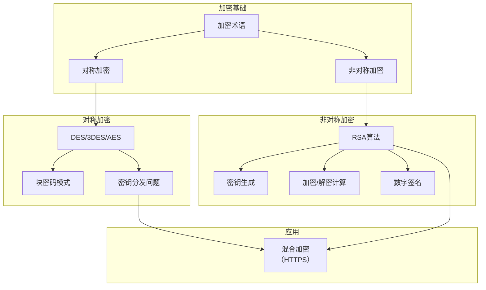

# 8.2 加密原理 —— 网络安全的基石

---

## 一、加密基础概念

### 1. 加密的核心作用

加密是保证通信**私密性**的核心技术，也是实现其他网络安全要素（认证、完整性）的基础。



### 2. 基本术语

|术语|含义|示例|
|---|---|---|
|**明文**（plaintext）|原始可读信息|"bob， i love you"|
|**密文**（ciphertext）|加密后的不可读信息|"nkn， s gktc wky"|
|**加密密钥** KencKenc​|加密所需的参数|56-bit 二进制串|
|**解密密钥** KdecKdec​|解密所需的参数|与加密密钥可能相同或不同|
|**密钥空间**|所有可能密钥的集合|56-bit 密钥空间大小 256256|

> 💡 **关键特性**：信道中传输的是**密文**。只要加密强度足够，即使密文被截获，攻击者也无法（或在合理时间内无法）恢复明文。

### 3. 两种加密体系

| 体系         | 密钥关系                         | 典型算法         | 核心问题       |
| ---------- | ---------------------------- | ------------ | ---------- |
| **对称密钥加密** | Kenc=Kdec​                   | DES、3DES、AES | **密钥分发困难** |
| **公开密钥加密** | Kenc≠KdecKenc​=Kdec​（公钥/私钥） | RSA          | 计算复杂度高     |

**数学表示**：

- 对称加密：m=K(K(m))，同一个密钥 K 既可加密也可解密。
    
- 非对称加密：m=Kdec(Kenc(m))，公钥加密，私钥解密。
    

---

## 二、对称密钥加密

### 1. 替换密码 —— 最简单的对称加密

**原理**：建立字母间的一一映射关系。

```text

明文: a b c d e f g h i j k l m n o p q r s t u v w x y z
密文: m n b v c x z a s d f g h j k l p o i u y t r e w q
```
**加密示例**：


```text

明文: bob, i love you, alice
密文: nkn, s gktc wky, mqsb
```
**安全性分析**：

- **暴力破解**：密钥空间 26! ≈ 4×10264×1026 种，早期无计算机时足够安全。
    
- **启发式破解**：
    
    - **字母频率分析**：英文中 'e' 出现频率最高，可猜测对应关系。
        
    - **模式匹配**：如 "bob" 加密后 "nkn"，模式特征（首尾相同）可辅助破解。
        

> 📌 **结论**：简单的替换密码在现代计算能力下**极易被破译**。

### 2. 现代对称加密算法

#### （1）DES（数据加密标准）

|参数|值|
|---|---|
|密钥长度|56-bit|
|分组大小|64-bit|
|轮数|16 轮 Feistel 网络|
|结构|初始置换 → 16轮迭代 → 最终置换|

**安全性演进**：

- 1997年：首次被公开破解，耗时4个月。
    
- 1999年：在分布式计算帮助下，破解时间缩短至22小时。
    
- 潜在风险：存在对 NSA 后门的疑虑（可能预留万能密钥）。
    

**增强技术**：

- **三重 DES**（3DES）：使用三个独立密钥进行三次加密（加密-解密-加密），有效密钥长度提升至112-bit。
    
- **密文分组链接**（CBC）：每个明文块先与前一个密文块异或再加密，消除相同明文块产生相同密文的特征。
    

#### （2）AES（高级加密标准）

|参数|值|
|---|---|
|密钥长度|128/192/256-bit|
|分组大小|128-bit|
|结构|字节代换 → 行移位 → 列混淆 → 轮密钥加（多轮）|

**安全性对比**：

- 破解 56-bit DES 需 1 秒时，破解 128-bit AES 需 **149 万亿年**。
    
- 目前 AES-256 被认为是**工业标准**，广泛应用于 Wi-Fi 加密（WPA2/3）、文件加密等。
    

### 3. 块密码工作模式

由于需要加密的数据通常超过分组长度，需要定义如何将分组密码应用于长消息。

|模式|原理|特点|
|---|---|---|
|**ECB**（电子密码本）|每个明文块独立加密|相同明文块产生相同密文，不安全|
|**CBC**（密文分组链接）|当前明文块与前一个密文块异或后加密|需初始向量（IV），广泛使用|
|**CTR**（计数器模式）|加密计数器值，再与明文异或|可并行处理，适用于高速场景|

### 4. 对称加密的核心问题：密钥分发

**悖论**：

- 需要安全信道来分发密钥。
    
- 建立安全信道又需要预先共享密钥。
    

**现实解决方案**：

- **物理交接**：如特工面对面交换密钥（网络环境下不可行）。
    
- **混合加密**：先用非对称加密安全传输对称密钥，再用对称加密传输大量数据（如 HTTPS）。
    

---

## 三、公开密钥加密

### 1. 核心思想

- **公钥** K+K+：公开，用于加密。
    
- **私钥** K−K−：保密，用于解密。
    
- 数学保证：即使知道公钥，也无法（在计算上）推导出私钥。
    



### 2. RSA 算法 —— 最著名的公钥加密算法

由 Rivest、Shamir、Adleman 于 1977 年提出，基于**大质数分解**的数学难题。

#### （1）密钥生成步骤

1. 选择两个大质数 p 和 q（例如 1024 位）。
    
2. 计算 n=p×q。
    
3. 计算欧拉函数 ϕ(n)=(p−1)(q−1)。
    
4. 选择 e 满足 1<e<ϕ(n) 且 e 与 ϕ(n)**互质**。
    
5. 计算 d 满足 e×d≡1(modϕ(n))。
    
6. **公钥**：(n,e)，**私钥**：(n,d)。
    

#### （2）加密解密过程

| 操作        | 公式                          | 示例（p=5,q=7）             |
| --------- | --------------------------- | ----------------------- |
| 选择 p, q   |                             | p=5,q=7                 |
| 计算 n      | n=p×q                       | n=35                    |
| 计算 ϕ(n)   | (p−1)(q−1)                  | ϕ(35)=4×6=24            |
| 选择 e      | 与 ϕ(n) 互质                   | e=5                     |
| 计算 d      | e×dmod  ϕ(n)=1              | 5×29=145≡1(mod24)       |
| **公钥/私钥** | 公钥 (n,e)(n,e)，私钥 (n,d)(n,d) | 公钥 (35,5)，私钥 (35,29)    |
| **加密**    | c=m^emod  n                 | 假设 m=12，c=125mod  35=17 |
| **解密**    | m=c^dmod  n                 | m=17^29mod  35=12       |

#### （3）数学原理


![[Pasted image 20260309032634.png]]

#### （4）安全性基础

- 给定 nn，分解为 p×q 在数学上是**困难问题**（目前没有多项式时间算法）。
    
- 当 pp 和 qq 足够大（如 1024 位），即使使用最强大的超级计算机，分解也需要**数十亿年**。
    

#### （5）性能特点

- RSA 加密解密的速度比对称加密（如 AES）**慢 100-1000 倍**。
    
- 实际应用：仅用于加密少量数据（如对称密钥、数字签名），大量数据仍用对称加密。
    

### 3. 数字签名 —— RSA 的反向应用




- **签名**：用私钥加密（或哈希后加密）——“只有我能产生这个签名”。
    
- **验证**：用公钥解密，比对结果——“任何人都能验证签名的真实性”。
    
- **同时实现**：
    
    - **可认证性**：确认签名者身份。
        
    - **报文完整性**：任何对明文的篡改都会导致验证失败。
        

---

## 四、加密攻击类型

|攻击类型|攻击者知道|示例|
|---|---|---|
|**唯密文攻击**|密文|截获通信内容，试图破译|
|**已知明文攻击**|部分密文及对应的明文|已知固定协议头内容|
|**选择明文攻击**|可任意选择明文并获取对应密文|二战中盟军缴获 Enigma 加密机|
|**选择密文攻击**|可选择密文并获取对应明文|针对 RSA 的某些攻击|

**历史案例**：

- 二战期间，英国数学家（包括图灵）通过缴获的 Enigma 加密机，实施**选择明文攻击**，成功破译大量德军情报，对战争进程产生重大影响。
    

---

## 五、对称加密 vs 非对称加密对比

|对比维度|对称加密|非对称加密|
|---|---|---|
|**密钥关系**|加密密钥 = 解密密钥|公钥 ≠ 私钥|
|**典型算法**|DES、3DES、AES|RSA、ECC|
|**密钥长度**|128-256 位|2048-4096 位|
|**加密速度**|快（硬件加速）|慢（100-1000 倍）|
|**密钥分发**|困难（需安全信道）|容易（公钥公开）|
|**主要用途**|大数据量加密|密钥交换、数字签名|
|**安全性基础**|混淆与扩散|数学难题（大数分解、离散对数）|

---

## 六、知识小结

|知识点|核心内容|考试重点/易混淆点|难度|
|---|---|---|---|
|**加密基础**|明文 → 密文，密钥保证私密性|区分明文与密文|★★★|
|**对称加密**|加密密钥=解密密钥，DES/AES|密钥分发问题|★★★|
|**DES**|56-bit 密钥，64-bit 分组|已被破解，3DES 增强|★★★|
|**AES**|128/256-bit 密钥，128-bit 分组|目前安全，工业标准|★★★★|
|**块密码模式**|ECB、CBC、CTR|CBC 需初始向量|★★★|
|**非对称加密**|公钥加密，私钥解密|与对称加密的**速度对比**|★★★★|
|**RSA**|基于大质数分解，n=p×q|密钥生成步骤、加密/解密计算|★★★★★|
|**数字签名**|私钥签名，公钥验证|反向 RSA 应用|★★★★|
|**攻击类型**|唯密文/已知明文/选择明文|Enigma 案例|★★★|
|**密钥长度与安全**|对称 128 位 ≈ RSA 2048 位|安全强度对比|★★★|

---

## 七、学习路径图



---

> **核心启示**：加密是网络安全的基石。对称加密（如 AES）速度快，适合大数据量加密，但存在密钥分发难题；非对称加密（如 RSA）解决了密钥分发问题，但速度慢。现代安全协议（如 TLS/SSL）采用**混合加密**：用非对称加密安全传输对称密钥，再用对称加密保护大量数据。理解这两种加密体系的优劣与配合，是掌握网络安全的基础。