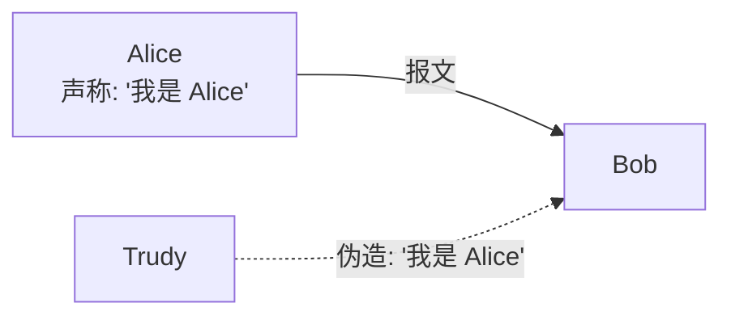
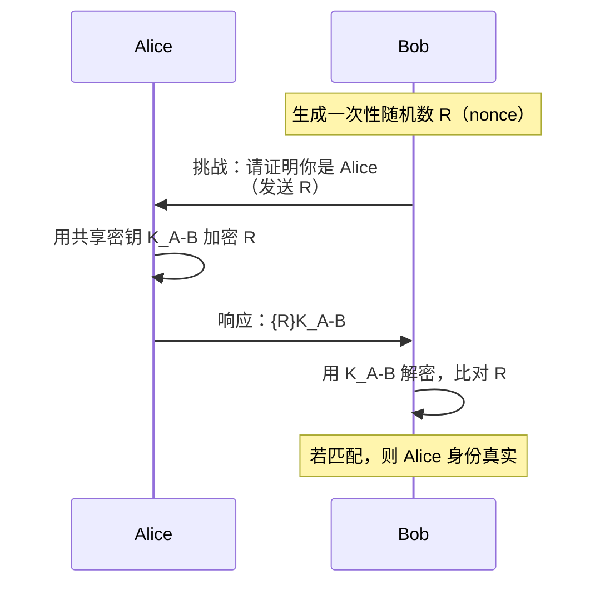
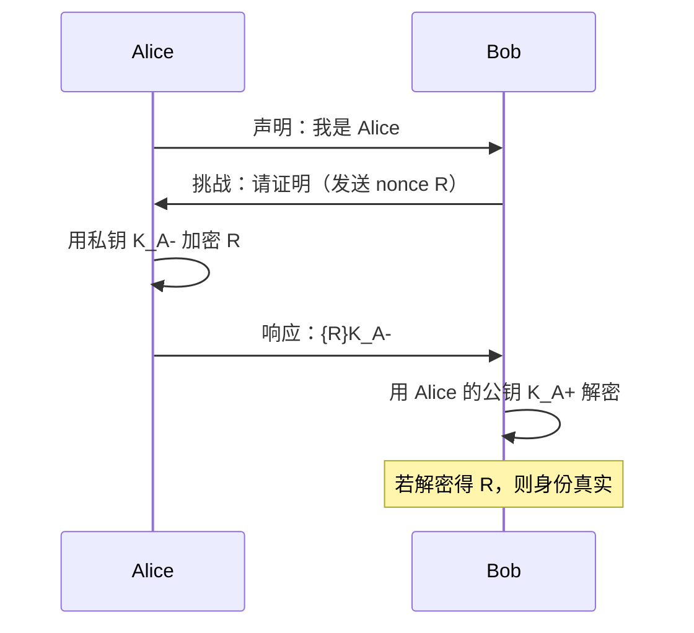
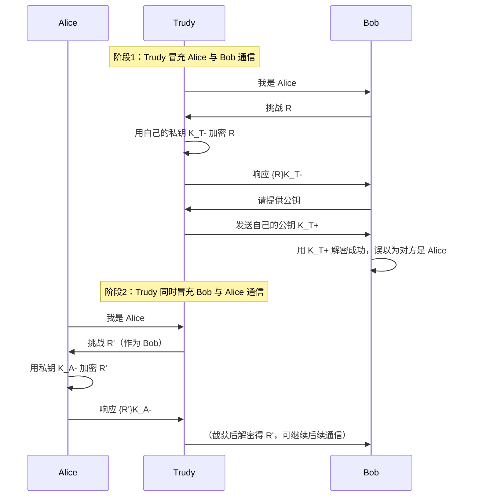
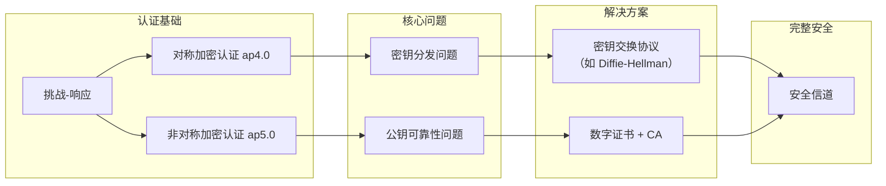

# 8.3 认证 —— 确认“你是你”的密码学基石

---

## 一、认证的目的与挑战

### 1. 什么是认证？

**认证**（Authentication）是网络安全的第一道防线，其核心目标是：**在通信开始前，确保对方确实是他所声称的身份**。

- **双向特性**：虽然本节以“Bob 认证 Alice”为例，但实际应用中需要**双向认证**（mutual authentication）。
    
- **典型场景**：
    
    - 网上银行：客户端需要认证服务器（防钓鱼），服务器也需要认证客户。
        
    - 路由协议：OSPF 路由器之间互相认证，防止虚假路由通告。
        

### 2. 为什么不能简单声明？

- **仅身份声明**（如“我是 Alice”）**不可靠**：攻击者可伪造 IP 地址（IP Spoofing）或直接篡改报文。
    
- **明文密码**也不安全：密码可能被窃听，即使加密传输，攻击者仍可实施**重放攻击**（Playback Attack）——截获加密后的密码，稍后重放即可冒充登录。
    

---

## 二、基于对称加密的认证（ap4.0）

### 1. 挑战-响应机制

为了解决重放攻击，引入**挑战-响应**（Challenge-Response）机制：

### 2. 协议要素（ap4.0）

|要素|作用|
|---|---|
|**一次性随机数 nonce R**|保证每次挑战唯一，防止重放攻击|
|**共享密钥 KA−BKA−B​**|只有 Alice 和 Bob 知道的秘密|
|**加密响应**|证明 Alice 确实掌握密钥，且是实时响应|

**安全原理**：

- 攻击者若截获了某次会话的 `{R}K`，由于下次挑战使用不同的 `R'`，重放旧响应会因 `R ≠ R'` 而被识破。
    
- 密钥的独占性确保了只有真正的 Alice 能生成正确的加密响应。
    

### 3. 遗留问题：密钥分发

> 💡 ap4.0 的**前提条件**是 Alice 和 Bob 已经安全共享了密钥 KA−BKA−B​。但在现实网络中，这个密钥如何安全地分发给双方，本身就是一个难题——这正是 **密钥分发** 要解决的问题（将在后续章节展开）。

---

## 三、基于非对称加密的认证（ap5.0）

### 1. 协议流程

利用公钥密码学的私钥唯一性，可以实现更简洁的认证：

### 2. 安全逻辑

- **私钥独占性**：只有 Alice 持有私钥 KA−KA−​，能生成可被其公钥 KA+KA+​ 正确解密的密文。
    
- **无需预先共享密钥**：Bob 可以直接使用 Alice 的公钥验证。
    

### 3. 隐藏的前提：公钥的可靠性

> ⚠️ ap5.0 依赖于一个关键假设：**Bob 拿到的公钥确实属于 Alice**。如果攻击者能够替换公钥，整个认证体系瞬间崩塌——这正是 **中间人攻击**（Man-in-the-Middle， MITM）的切入点。

---

## 四、安全漏洞：中间人攻击

### 1. 攻击过程详解

### 2. 攻击本质

|环节|漏洞|
|---|---|
|**公钥传输**|Bob 无法验证收到的公钥是否真正属于 Alice|
|**会话独立性**|Trudy 同时建立两个独立会话，在中间转发/篡改消息|

**严重后果**：

- **完全监听**：所有 Alice 与 Bob 的通信内容都被 Trudy 获取。
    
- **长期潜伏**：双方可能数周都不察觉（事后回忆对话内容时仍以为安全）。
    

### 3. 核心问题

> **“如何可靠地获取对方的公钥？”**  
> 这是公钥密码学在实际应用中必须解决的根本问题，引出了 **公钥基础设施**（PKI）和 **数字证书** 机制。

---

## 五、认证协议演进对比

|协议|基础|优点|缺陷|
|---|---|---|---|
|**仅声明**|无|简单|易伪造（IP 欺骗）|
|**明文密码**|密码|比声明略好|密码可窃听、重放|
|**ap4.0**（对称加密+挑战）|共享密钥|抗重放|需预先安全分发密钥|
|**ap5.0**（非对称加密+挑战）|公私钥|无需预先共享密钥|公钥分发易被中间人攻击|

---

## 六、知识小结

|知识点|核心内容|考试重点/易混淆点|难度|
|---|---|---|---|
|**认证的目的**|通信前验证对方身份，防止伪造|单向 vs 双向认证|★★★|
|**简单声明的漏洞**|仅声明身份或携带 IP 不可靠|IP 欺骗|★★|
|**重放攻击**|截获并回放合法认证报文|挑战-响应机制可防御|★★★|
|**ap4.0**|对称加密 + 一次性随机数 nonce|需预先共享密钥|★★★★|
|**ap5.0**|非对称加密 + nonce|依赖公钥可靠性|★★★★|
|**中间人攻击**|攻击者截获并替换公钥，双向欺骗|公钥分发是根本问题|★★★★★|
|**nonce 的作用**|确保挑战唯一，防止重放|每次会话必须不同|★★★|
|**密钥分发问题**|对称加密的密钥如何安全共享？|后续 PKI 解决|★★★★|
|**公钥可靠性问题**|如何确保拿到的公钥真的属于对方？|数字证书的作用|★★★★★|

---

## 七、从认证到完整安全体系

认证只是网络安全的一个环节，要构建完整的防护体系，还需要：

- **密钥分发**：安全共享对称密钥或可靠获取公钥。
    
- **报文完整性**：确保数据在传输中未被篡改。
    
- **数字签名**：实现不可否认性（non-repudiation）。
    
- **证书与 PKI**：通过可信第三方绑定身份与公钥。
    

---

> **核心启示**：认证是网络安全的第一道防线，但仅靠认证本身无法解决所有问题。对称加密认证（ap4.0）需要解决密钥分发，非对称加密认证（ap5.0）需要解决公钥可信。这些问题的答案，将引出 **公钥基础设施**（PKI）、**数字证书**和 **密钥交换协议**，共同构成现代网络安全的基石。