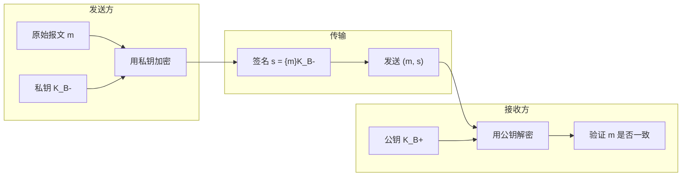
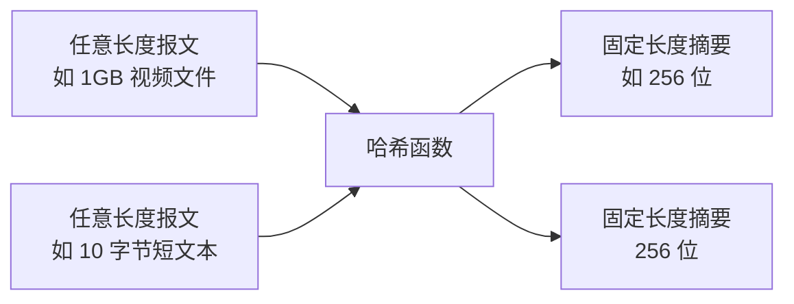
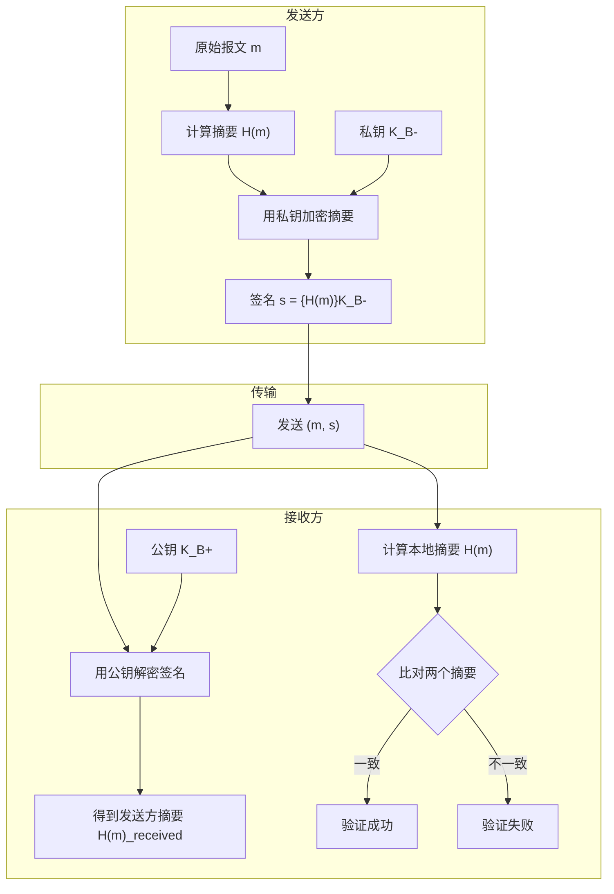
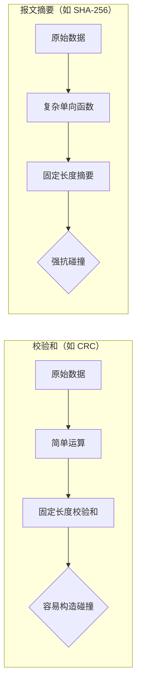

# 8.4 报文完整性 —— 数字签名与哈希函数

---

## 一、什么是报文完整性？

### 1. 现实生活中的签名

在现实生活中，我们通过**手工签名**来确保文件的真实性。手工签名具有三个核心特性：

|特性|含义|现实示例|
|---|---|---|
|**可验证性**|接收方可以验证签署人身份|银行柜员比对取款单上的签名笔迹|
|**不可伪造性**|仿冒签名代价高昂，难以做到完美|仿冒他人签名需极高的模仿技巧|
|**不可抵赖性**|签署人无法否认签署事实|房产交易中双方持合同在摄像头前合影存证|

### 2. 数字签名的目标

在数字世界中，我们需要一种机制实现与手工签名等效的安全特性：

- **可验证**：接收方能确认发送方身份。
    
- **不可伪造**：只有真正的发送方才能产生有效签名。
    
- **不可抵赖**：发送方事后不能否认自己发过该消息。
    

---

## 二、数字签名原理

### 1. 基本构造

**数学表达**：

- 签名生成：s=KB−(m)s=KB−​(m)（用发送方私钥加密报文）
    
- 验证过程：m=KB+(s)m=KB+​(s)（用发送方公钥解密）
    

### 2. 为什么能实现三个特性？

|特性|实现原理|
|---|---|
|**可验证性**|公钥能正确解密的签名，必然是由对应私钥生成|
|**不可伪造性**|攻击者无法获取私钥，无法伪造可被公钥验证的签名|
|**不可抵赖性**|第三方可使用发送方公钥验证签名，确认签署事实|

---

## 三、报文摘要（哈希函数）

### 1. 直接加密全文的问题

如果对**整个报文**进行签名（私钥加密），会面临严重问题：

- **效率极低**：加密1GB文件需要巨大的计算开销。
    
- **冗余处理**：报文本身可能很长，但签名只需验证身份。
    

### 2. 哈希函数的作用

**哈希函数** H(m)H(m) 将任意长度的输入映射为**固定长度**的输出（称为**报文摘要**）。

### 3. 哈希函数的核心要求

|要求|含义|类比|
|---|---|---|
|**多对一映射**|任意长度输入 → 固定长度输出|多人可能有相同指纹？不可能，但哈希允许碰撞|
|**计算单向性**|给定 h=H(m)h=H(m)，难以反推 mm|从指纹无法还原出原始人脸|
|**强抗碰撞性**|难以找到 m′≠mm′=m 使 H(m′)=H(m)H(m′)=H(m)|两个不同人不能有完全相同指纹|

### 4. 常见哈希算法对比

|算法|摘要长度|安全性状态|应用建议|
|---|---|---|---|
|**MD5**|128位|**已攻破**（可构造碰撞）|禁用|
|**SHA-1**|160位|**安全性减弱**（已发现理论攻击）|逐步淘汰|
|**SHA-256**|256位|**当前安全**|推荐使用|

---

## 四、数字签名的优化实现

### 1. 签名流程（实际应用）

### 2. 效率优势

- 对1GB文件，只需加密**256位摘要**，而不是整个文件。
    
- 速度提升约 **百万倍**（106106 倍）。
    

### 3. 安全性分析

|攻击向量|能否成功？|原因|
|---|---|---|
|伪造签名|❌ 不能|攻击者无私钥|
|篡改报文|❌ 不能|报文改变 → 摘要改变 → 验证失败|
|碰撞攻击|⚠️ 可能（若哈希算法弱）|找到相同摘要的不同报文，可替换内容|

---

## 五、常见误区与遗留问题

### 1. 校验和 ≠ 报文摘要

**反例**：通过交换字节位置，可以轻松构造出相同CRC的不同数据。校验和**不满足强抗碰撞性**，不能用于安全目的。

### 2. 私钥保护的重要性

- 如果私钥泄露，攻击者可以**伪造任意签名**，但这**不属于技术漏洞**，而是密钥管理问题。
    
- 数字签名只能证明“持有私钥的人签署了消息”，不能证明“某个人”签署了消息——需要结合**身份认证**。
    

### 3. 公钥可靠性问题

> 💡 数字签名的验证依赖于**可靠地获取对方的公钥**。如果攻击者替换了公钥，就可以冒充任何人的签名。这正是 **公钥基础设施**（PKI）和**数字证书**要解决的核心问题。

---

## 六、知识小结

|知识点|核心内容|考试重点/易混淆点|难度|
|---|---|---|---|
|**报文完整性目标**|确保数据未被篡改，验证发送方身份|与机密性的区别|★★★|
|**手工签名类比**|可验证性、不可伪造性、不可抵赖性|生物特征绑定|★★|
|**数字签名原理**|用私钥加密（摘要）|为什么加密摘要而非全文|★★★★|
|**哈希函数要求**|固定长度、单向性、强抗碰撞|MD5/SHA-1 已不安全|★★★★★|
|**常见哈希算法**|MD5（128位，不安全）、SHA-1（160位，弱）、SHA-256（256位，安全）|算法选择|★★★|
|**签名验证流程**|计算摘要 → 解密签名 → 比对|公钥可靠性是前提|★★★★|
|**校验和 vs 摘要**|校验和易构造碰撞，不能用于安全|CRC 不是哈希|★★★|
|**私钥保护**|私钥泄露可伪造签名|属于密钥管理问题|★★★|
|**公钥可靠性问题**|如何确保拿到的公钥属于对方？|引出 PKI 和证书|★★★★★|

---

## 七、总结

报文完整性通过**数字签名**和**哈希函数**的组合，实现了与手工签名等效的安全特性：

1. **哈希函数**解决效率问题：将任意长报文浓缩为固定长度摘要。
    
2. **私钥加密**解决身份问题：只有真正的发送方才能生成可被公钥解密的签名。
    
3. **公钥验证**解决可信问题：任何人都能验证签名真实性。
    

然而，数字签名依赖两个前提：

- **私钥安全**：密钥管理是用户责任。
    
- **公钥可靠**：需要 PKI 和数字证书来绑定身份与公钥。