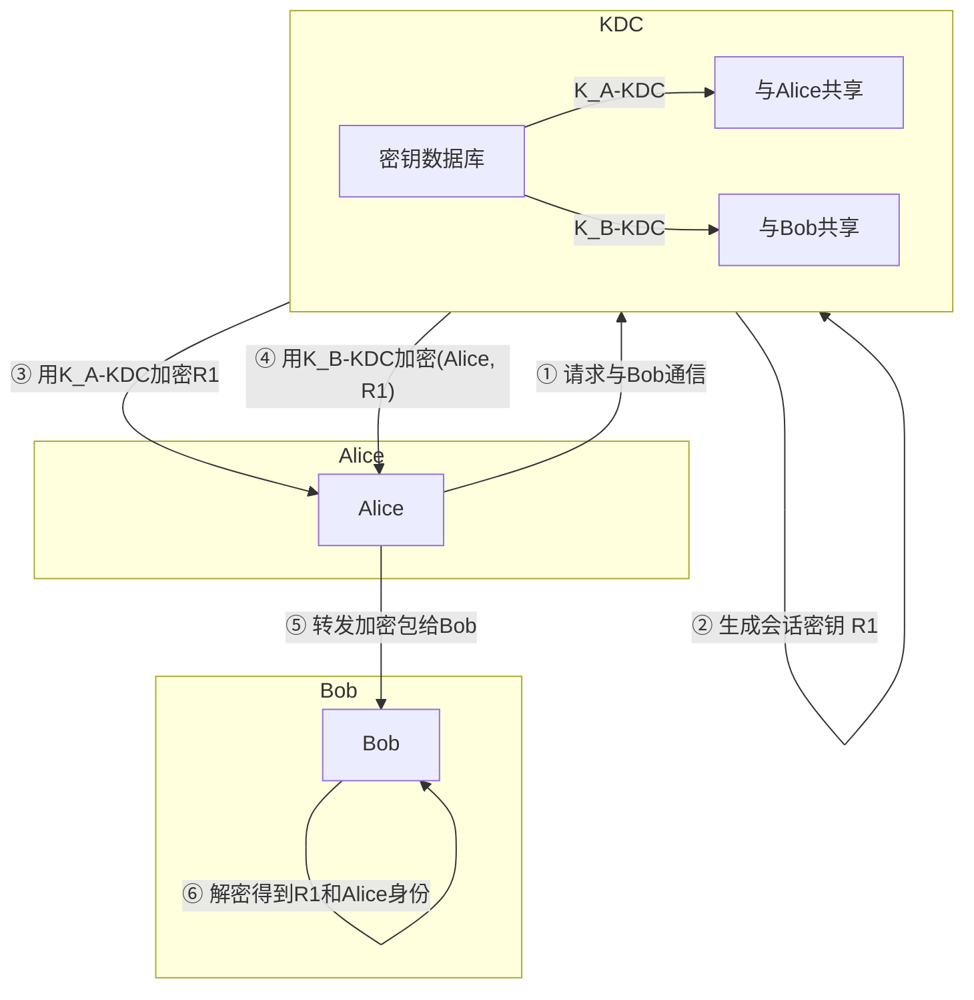
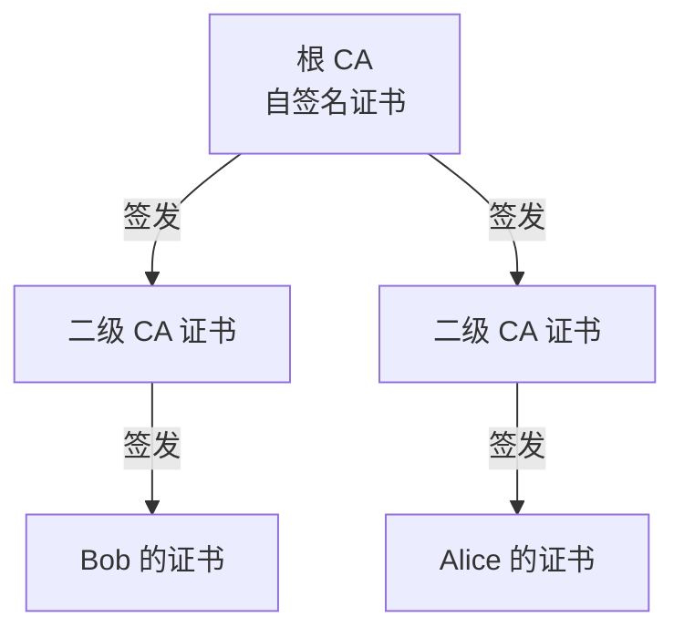

# 8.5 密钥分发和证书 —— 建立信任的基石

---

## 一、引言：数字签名的遗留问题

在上一节中，我们学习了**数字签名**如何保证报文的完整性和来源真实性。数字签名依赖于发送方的私钥和接收方能获取正确的发送方公钥。但这里存在一个关键问题：

> **如何确保接收方获得的公钥确实属于声称的发送方？**

同样，在对称加密体系中，通信双方需要共享一个密钥，但如何安全地分发这个共享密钥？这两个问题都需要一个**可信的第三方**来协助解决。

- **对称加密** → 引入**密钥分发中心**（KDC）
    
- **非对称加密** → 引入**认证中心**（CA）和**数字证书**
    

---

## 二、对称加密中的密钥分发中心

### 1. 为什么需要 KDC？

对称加密算法（如 AES）加密速度快，但通信双方必须拥有相同的密钥。如果直接通过网络传输密钥，密钥本身就可能被窃取，形成死循环。

**解决方案**：引入一个所有用户都信任的第三方——**密钥分发中心**，它与每个注册用户预先共享一个唯一的对称密钥（通过“带外”方式建立，如物理接触）。

### 2. KDC 工作原理




**详细步骤**：

1. **Alice 向 KDC 发起请求**：Alice 告诉 KDC 她想与 Bob 通信。
    
2. **KDC 生成会话密钥**：KDC 随机生成一个一次性会话密钥 R1R1​。
    
3. **KDC 用 Alice 的密钥加密 R1R1​**：KDC 使用与 Alice 共享的密钥 KA−KDCKA−KDC​ 加密 R1R1​，得到 {R1}KA−KDC{R1​}KA−KDC​​，发送给 Alice。
    
4. **KDC 同时用 Bob 的密钥加密“Alice + R1R1​”**：KDC 使用与 Bob 共享的密钥 KB−KDCKB−KDC​ 加密 (Alice,R1)(Alice,R1​)，得到 {Alice,R1}KB−KDC{Alice,R1​}KB−KDC​​，也发送给 Alice。
    
5. **Alice 转发给 Bob**：Alice 解密得到 R1R1​，并将加密包 {Alice,R1}KB−KDC{Alice,R1​}KB−KDC​​ 发送给 Bob。
    
6. **Bob 解密获取密钥和对方身份**：Bob 用自己的密钥解密，获得会话密钥 R1R1​，并确认对方是 Alice（因为 KDC 用 Bob 的密钥加密了 Alice 的身份）。
    

此后，Alice 和 Bob 可以使用 R1R1​ 作为共享密钥进行对称加密通信。

### 3. 安全性分析

- **一次性会话密钥**：每次通信使用不同的 R1R1​，即使一次通信被破解，也不影响其他通信。
    
- **信任根**：KDC 与每个用户预先共享的密钥（如 KA−KDCKA−KDC​）是安全的基础，这些必须通过“带外”方式建立（例如：管理员手工配置）。
    
- **中间人无法攻破**：攻击者无法解密 KDC 发出的加密包，因为没有共享密钥。
    

---

## 三、公钥加密中的认证中心

### 1. 公钥分发问题

在公钥加密体系中，Alice 需要 Bob 的公钥来加密消息或验证 Bob 的签名。但如果 Trudy 将自己的公钥冒充为 Bob 的公钥发送给 Alice，Trudy 就能实施**中间人攻击**。

**解决方案**：引入一个所有用户都信任的第三方——**认证中心**，它负责将实体的身份与其公钥绑定在一起，生成**数字证书**。

### 2. 数字证书

#### （1）证书是什么？

> 数字证书是一个电子文档，它将一个实体的**身份信息**（如姓名、组织、域名）与该实体的**公钥**绑定在一起，并由 CA 进行数字签名。

**证书内容示例**（X.509 证书）：

|字段|说明|
|---|---|
|**版本号**|证书格式版本（如 V3）|
|**序列号**|CA 签发的唯一标识|
|**签名算法**|CA 签名所使用的算法（如 SHA-256 with RSA）|
|**颁发者**|签发该证书的 CA 名称|
|**有效期**|证书有效起止时间|
|**主体**|证书拥有者的名称（如域名、人名）|
|**主体公钥信息**|拥有者的公钥算法和公钥值|
|**CA 的数字签名**|对上述所有字段的签名，用于防篡改|

#### （2）CA 签发证书流程

```mermaid
flowchart LR
    subgraph 实体（Bob）
        A[Bob 生成密钥对] --> B[向 CA 提供身份证明和公钥]
    end
    subgraph CA
        B --> C[CA 验证 Bob 身份]
        C --> D[CA 创建证书]
        D --> E[CA 用私钥签署证书]
    end
    E --> F[Bob 获得数字证书]
```


#### （3）证书验证流程

当 Alice 收到 Bob 的证书时，她需要验证证书的有效性：

1. 获取 **CA 的公钥**（通常操作系统或浏览器预装“根证书”）。
    
2. 使用 CA 的公钥解密证书上的签名，得到证书摘要的“标准值”。
    
3. 自己计算证书内容的摘要。
    
4. 比对两者，若一致则证书未被篡改，且确实由该 CA 签发。
    
5. 检查证书是否在有效期内、是否被撤销等。
    

### 3. 信任链与根证书

现实世界中，CA 也分层次。一个 CA 可以给下级 CA 签发证书，形成**信任链**。



- **根证书**：是信任链的起点，由根 CA 自己给自己签发（**自签名证书**）。根证书必须通过“带外”方式安全地分发（例如：操作系统、浏览器厂商预装）。
    
- **证书验证过程**：验证 Bob 的证书时，需要逐级向上验证，直到信任的根证书。
    

### 4. 现实案例

- **HTTPS 网站证书**：浏览器内置了多家根 CA 的证书，访问网站时服务器提供自己的证书，浏览器自动验证链。
    
- **12306 铁路客服中心**：由于铁路系统使用自己的根证书，并未被主流浏览器预装，所以访问时需要用户手动下载安装根证书。
    

---

## 四、KDC 与 CA 对比

|对比项|密钥分发中心（KDC）|认证中心（CA）|
|---|---|---|
|**适用加密体系**|对称加密|非对称加密|
|**核心功能**|为通信双方生成并分发会话密钥|将实体身份与公钥绑定，签发证书|
|**信任基础**|与每个用户预共享密钥（带外）|根证书（带外）|
|**通信过程**|在线实时参与|离线（证书预先签发）|
|**典型应用**|Kerberos 协议|SSL/TLS（HTTPS）|

---

## 五、知识小结

|知识点|核心内容|考试重点/易混淆点|难度|
|---|---|---|---|
|**密钥分发中心（KDC）**|对称加密中，可信第三方为通信双方生成并分发会话密钥|KDC 与用户预共享密钥的必要性|★★★★|
|**KDC 工作流程**|①请求 ②生成会话密钥 ③双重加密返回 ④转发 ⑤解密建立安全信道|时序与加密关系|★★★★★|
|**会话密钥**|一次性使用，保护具体通信内容|与长期共享密钥的区别|★★★|
|**认证中心（CA）**|非对称加密中，可信第三方绑定实体身份与公钥，签发数字证书|CA 是“信任锚”|★★★★|
|**数字证书**|包含身份信息、公钥、CA 签名等，用于安全分发公钥|证书内容字段|★★★|
|**证书验证**|用 CA 公钥解密签名，比对摘要，检查有效期和撤销状态|验证链|★★★★★|
|**信任链**|根 CA → 二级 CA → 实体证书，逐级信任|根证书的“带外”分发|★★★★|
|**根证书**|自签名证书，是信任的起点|预装在操作系统/浏览器|★★★|
|**KDC vs CA**|对称 vs 非对称；在线分发密钥 vs 离线签发证书|适用场景区别|★★★★|
|**数字签名遗留问题**|公钥可信性依赖 CA|衔接本节|★★★|

---

## 六、总结

密钥分发和证书机制是网络安全中**建立信任关系**的核心。无论是对称加密中的 KDC，还是非对称加密中的 CA，都扮演着可信第三方的角色，解决了通信双方在没有预先共享秘密的情况下如何安全地建立共享秘密或获取对方公钥的问题。

- **KDC**：适用于内部网络，如企业域环境（Kerberos）。
    
- **CA**：适用于互联网，如 HTTPS 的 SSL/TLS 证书。
    

两者都依赖于一个初始的“带外”信任（预共享密钥或根证书），这是安全体系的基础假设。理解这些机制，有助于深入理解现代网络安全协议的实现原理。