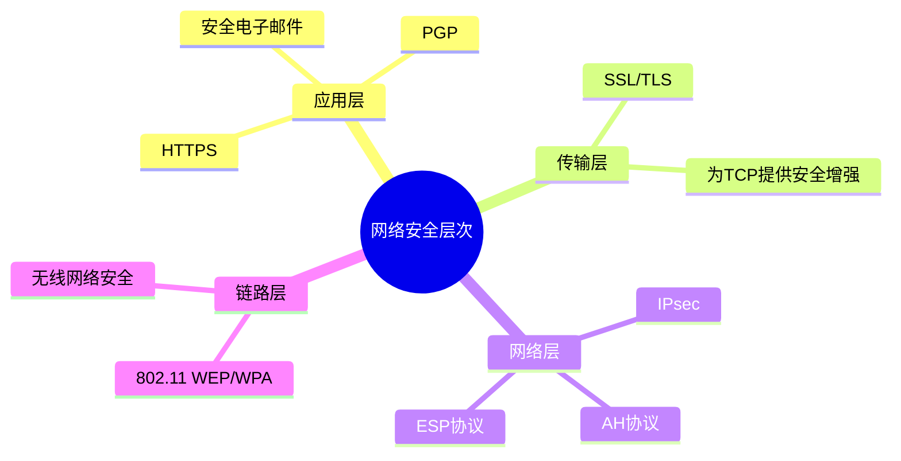
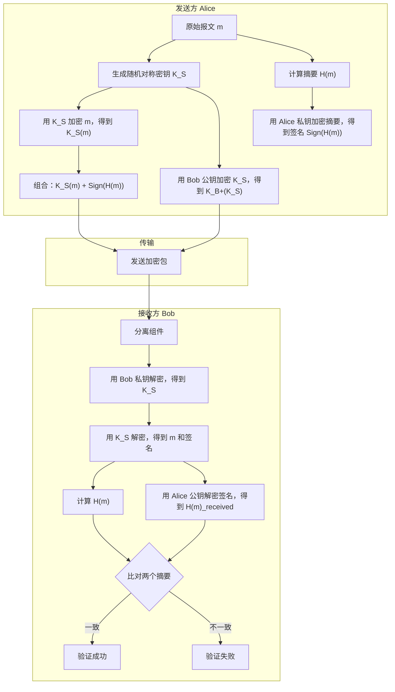
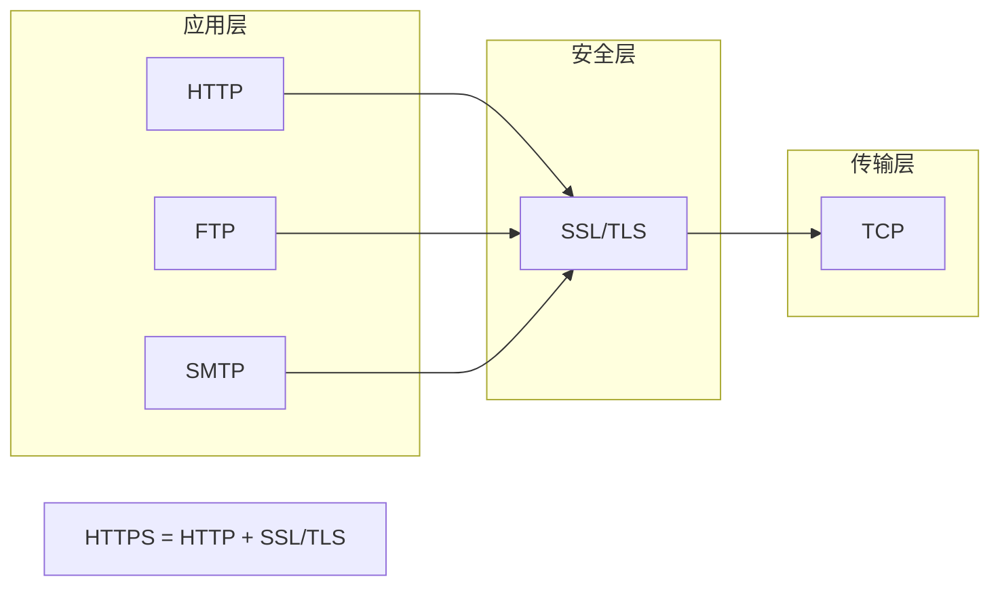
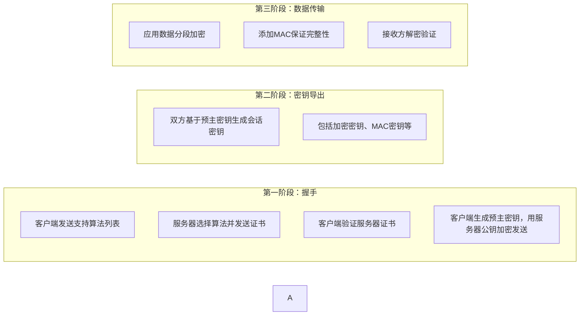
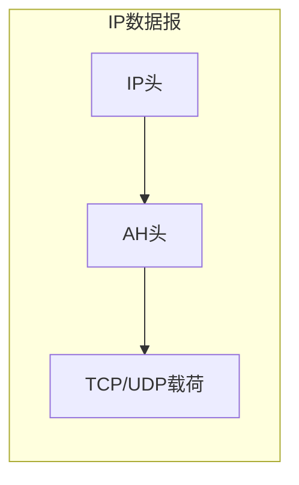
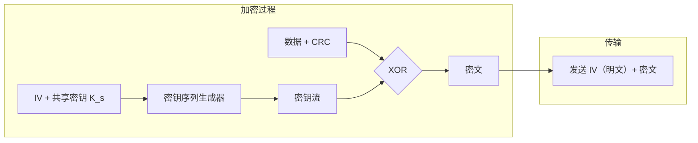

# 8.6 各个层次的安全性 —— 从应用到链路的全面防护

---

## 一、引言：网络安全体系的综合应用

前面几节我们学习了网络安全的四大核心要素（机密性、可认证性、完整性、可用性）以及实现这些要素的基础技术（加密、认证、数字签名、密钥分发）。本章将综合运用这些技术，展示它们如何在网络的不同层次落地，构建全方位的安全防护体系。

---

## 二、安全电子邮件 —— 应用层安全

### 1. 混合加密机制

电子邮件需要同时保证**机密性**、**可认证性**和**完整性**。单一加密技术无法同时满足这些需求，因此采用**混合加密**：

### 2. 安全特性分析

|安全目标|实现机制|说明|
|---|---|---|
|**机密性**|对称密钥 KSKS​ 加密报文|对称加密效率高，适合长报文|
|**密钥安全分发**|用接收方公钥加密 KSKS​|非对称加密解决密钥分发问题|
|**可认证性**|发送方私钥签名|能用发送方公钥验证，证明身份|
|**完整性**|报文摘要比对|篡改会导致摘要不匹配|

### 3. PGP 协议

**PGP**（Pretty Good Privacy）是安全电子邮件的**事实标准**，它整合了：

- 对称加密（如 AES、3DES）
    
- 非对称加密（如 RSA）
    
- 哈希算法（如 SHA-256）
    
- 数字签名
    

> 📌 **历史趣闻**：PGP 的开发者曾因其加密强度过高被美国海关列为“军火走私”调查对象，侧面印证了其安全性。

---

## 三、SSL/TLS —— 传输层安全

### 1. TCP 的安全缺陷

TCP 提供**可靠**的字节流服务（保证不重复、不失序、不丢失），但它存在两个致命缺陷：

- **明文传输**：所有内容均可被窃听
    
- **无认证机制**：无法确认对方身份
    

### 2. SSL 的定位

**SSL**（Secure Sockets Layer）及其后继者 **TLS**（Transport Layer Security）位于 TCP 之上、应用层之下，为应用层提供安全服务。

### 3. SSL 提供的安全服务

|服务|是否必选|说明|
|---|---|---|
|**服务器可认证性**|必选|客户端验证服务器身份（防止钓鱼）|
|**客户端可认证性**|可选|服务器验证客户端身份（如网上银行）|
|**数据加密**|必选|保证通信机密性|
|**报文完整性**|必选|防止数据被篡改|

### 4. SSL 工作三阶段

### 5. 实际应用

- **HTTPS**：HTTP over SSL/TLS，浏览器地址栏显示 `https://`
    
- **安全电子邮件**：SMTP over TLS
    
- **VPN**：基于 TLS 的 OpenVPN
    

> 💡 **历史背景**：SSL 由网景公司早期电子商务团队开发，解决了网上信用卡信息明文传输的安全问题。

---

## 四、IPsec —— 网络层安全

### 1. IPsec 概述

**IPsec**（IP Security）为网络层提供安全服务，保护所有 IP 数据报，对上层协议（TCP、UDP、ICMP 等）透明。

### 2. 安全关联

**安全关联**（SA，Security Association）是 IPsec 的核心概念，它是一个**单向逻辑通道**，由三元组唯一标识：

|字段|作用|
|---|---|
|**安全协议类型**|AH 或 ESP|
|**源 IP 地址**|SA 的发起方|
|**32位连接 ID**|唯一标识符|

由于 SA 是单向的，双向通信需要**两个 SA**。

### 3. 两种安全协议

#### （1）AH 协议（认证头部）

- **协议号**：51
    
- **提供**：数据完整性、源认证
    
- **不提供**：机密性（明文传输）
    
- **AH头包含**：连接 ID、认证数据（签名）
    

#### （2）ESP 协议（封装安全载荷）

- **提供**：机密性（加密）、完整性、源认证
    
- **两种模式**：
    
    - **传输模式**：只加密载荷（原 IP 头不变）
        
    - **隧道模式**：加密整个 IP 数据报，封装新 IP 头（用于 VPN）
        

---

## 五、802.11 WEP —— 链路层安全

### 1. WEP 加密原理

**WEP**（Wired Equivalent Privacy）是早期 802.11 无线网络的安全协议，其工作原理如下：

- **IV**（Initialization Vector）：24 位初始向量，每帧不同
    
- **共享密钥 KsKs​**：40 位，预配置
    
- **加密**：数据与密钥流 XOR
    

### 2. WEP 的致命缺陷

|缺陷|后果|
|---|---|
|**IV 空间过小**|24 位 IV 约 1600 万种组合，繁忙网络中几小时即重复|
|**IV 明文传输**|攻击者可轻松检测 IV 是否重复|
|**RC4 密钥流重用**|重复 IV 导致相同密钥流，可 XOR 攻击破解|

### 3. 攻击方法

1. 诱使发送方加密**已知明文** d1d1​，得到密文 c1=d1⊕kIVc1​=d1​⊕kIV​
    
2. 推导出密钥流 kIV=c1⊕d1kIV​=c1​⊕d1​
    
3. 当 IV 重复时，用该密钥流解密其他密文
    

> 📌 **教训**：WEP 的设计缺陷导致其**完全不安全**，现代无线网络已改用 **WPA2/WPA3**（基于 AES-CCMP）。

---

## 六、各层次安全协议对比

|层次|典型协议|保护对象|主要安全服务|特点|
|---|---|---|---|---|
|**应用层**|PGP、S/MIME|特定应用数据|机密性、认证、完整性|与应用紧耦合，灵活|
|**传输层**|SSL/TLS|端到端通信|机密性、认证、完整性|对应用透明，广泛使用|
|**网络层**|IPsec|所有 IP 数据报|机密性、认证、完整性|对上层透明，适合 VPN|
|**链路层**|WPA2/3|无线链路帧|机密性、认证|针对无线介质设计|

---

## 七、知识小结

|知识点|核心内容|考试重点/易混淆点|难度|
|---|---|---|---|
|**安全电子邮件**|对称加密报文 + 非对称加密密钥 + 数字签名|混合加密的**效率与安全平衡**|★★★★|
|**PGP 协议**|安全邮件标准，整合多种加密技术|法律争议（加密强度）|★★★|
|**SSL/TLS**|位于 TCP 之上，提供加密、认证、完整性|握手阶段 vs 数据传输阶段|★★★★★|
|**HTTPS**|HTTP over SSL/TLS|浏览器地址栏识别|★★|
|**IPsec**|网络层安全，AH（认证）和 ESP（加密）|SA 的**单向性**|★★★★|
|**安全关联**|三元组标识：协议+源IP+ID|双向通信需两个 SA|★★★|
|**WEP 加密**|链路层安全，IV + 共享密钥生成密钥流|**IV 重用漏洞**|★★★★|
|**WEP 攻击**|诱使发送已知明文，推导密钥流|XOR 攻击原理|★★★★|
|**各层次对比**|应用层、传输层、网络层、链路层安全协议|各层次**保护对象**|★★★|

---

## 八、总结：纵深防御体系

网络安全不是单一层次的工作，而是需要在**所有层次**构建防护：

- **链路层**：防止同一物理网络内的窃听（如 Wi-Fi 加密）
    
- **网络层**：保护端到端 IP 通信（如 VPN）
    
- **传输层**：为应用提供安全通道（如 HTTPS）
    
- **应用层**：实现特定应用的端到端安全（如安全电子邮件）
    

这种**纵深防御**思想，确保即使某一层被攻破，其他层次仍能提供保护。理解各层次的安全机制及其相互关系，是设计安全网络系统的基础。