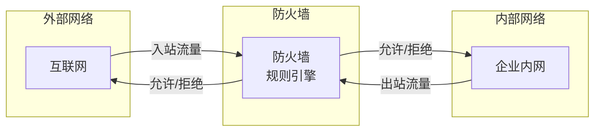
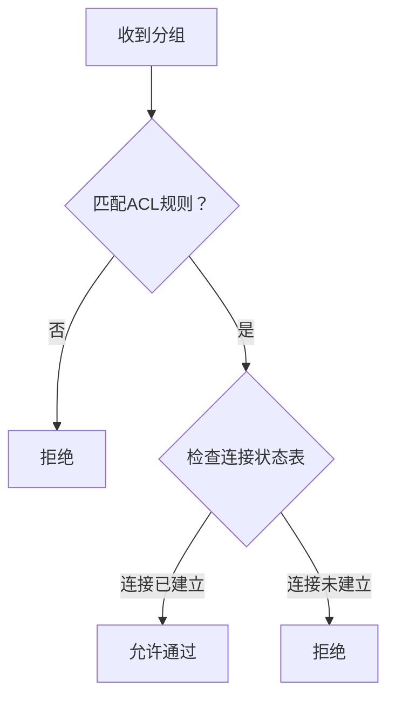
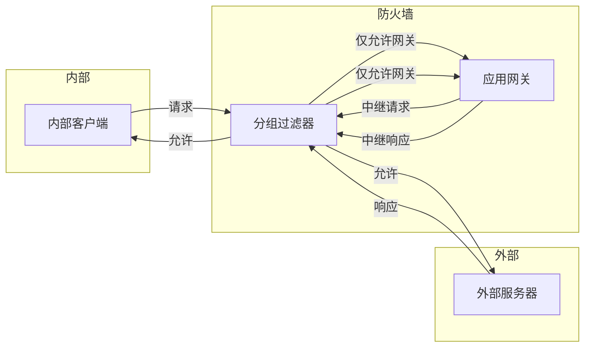
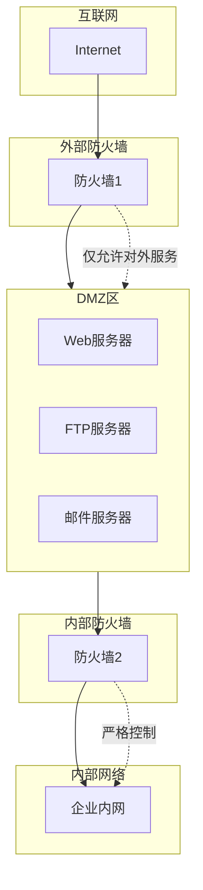

# 8.7 防火墙 —— 网络边界的安全卫士

---

## 一、防火墙概述

### 1. 什么是防火墙？

**防火墙**是部署在组织内部网络与外部互联网之间的**安全隔离系统**，它根据预定义的规则，对进出网络的每一个数据分组执行**放行**或**阻塞**操作。

- **基本动作**：仅支持两种——`允许`（放行）或`拒绝`（阻塞）
    
- **配置方式**：网络安全管理员制定规则模板，根据机构需求动态增删改
    

### 2. 防火墙的主要防护目标

|威胁类型|描述|示例|
|---|---|---|
|**拒绝服务攻击**|耗尽服务器资源，使正常用户无法访问|SYN Flood、DDoS|
|**非法访问/篡改**|非授权用户访问内部系统或篡改内容|CIA主页被黑|
|**资源滥用**|内部资源被未经认证的用户/主机使用|仅允许认证用户访问文件服务器|

---

## 二、防火墙技术实现

### 1. 无状态分组过滤

**无状态过滤**是最基础的防火墙技术，它基于单个分组的头部信息独立做出决策，**不维护任何连接状态**。

#### （1）过滤依据

|检查项|说明|
|---|---|
|**源/目标IP地址**|匹配IP头部|
|**源/目标端口**|匹配TCP/UDP头部|
|**协议类型**|如 TCP(6)、UDP(17)、ICMP(1)|
|**ICMP报文类型**|如 Echo Request、TTL超时|
|**TCP标志位**|如 SYN、ACK、FIN 等|

#### （2）访问控制列表

**ACL**（Access Control List）是无状态过滤的核心规则表，每条规则包含：

|字段|取值示例|说明|
|---|---|---|
|**Action**|`allow` / `deny`|允许或拒绝|
|**Src IP**|`192.168.1.0/24`|源IP范围|
|**Dst IP**|`any`|目标IP|
|**Protocol**|`tcp`|协议类型|
|**Src Port**|`>1023`|源端口条件|
|**Dst Port**|`80`|目标端口|
|**Flags**|`SYN=1, ACK=0`|TCP标志位组合|

**规则匹配原则**：

- **顺序匹配**：从第一条规则开始，执行**首个匹配**的规则
    
- **默认规则**：通常最后一条设置为 `deny all`，作为“兜底”规则
    

#### （3）典型规则示例

|序号|动作|源IP|目标IP|协议|源端口|目标端口|标志|说明|
|---|---|---|---|---|---|---|---|---|
|1|`deny`|any|any|udp|any|any|-|阻断所有UDP|
|2|`deny`|any|any|tcp|any|23|any|禁止Telnet|
|3|`deny`|any|内网|tcp|any|any|SYN=1, ACK=0|阻止外部主动连接|
|4|`allow`|any|130.207.244.203|tcp|any|80|any|仅允许访问指定Web|
|5|`deny`|any|any|any|any|any|-|默认拒绝所有|

---

### 2. 有状态分组过滤

**有状态过滤**在无状态基础上，增加了**连接状态跟踪**能力。

#### （1）核心机制

- **维护连接状态表**：记录所有通过防火墙的TCP连接状态（如 `SYN_SENT`、`ESTABLISHED`）
    
- **双重验证**：
    
    1. 匹配ACL规则（如目标端口=80）
        
    2. 检查连接状态表中是否存在已建立的对应连接
        

#### （2）应用场景

- **允许外部响应内网请求**：内网主机访问外网Web后，允许外网服务器返回80端口流量（因连接已建立）
    
- **阻止外部主动扫描**：外部直接发起的80端口连接（无对应内网请求）会被拒绝
    

#### （3）规则增强

在传统ACL基础上，有状态过滤的规则可隐含状态检查，例如：

|动作|源IP|目标IP|协议|源端口|目标端口|状态要求|
|---|---|---|---|---|---|---|
|allow|外网|内网|tcp|any|80|**连接已建立**|
|allow|内网|外网|tcp|>1023|80|无|

---

### 3. 应用程序网关

**应用程序网关**（又称**代理防火墙**）工作在**应用层**，为特定应用协议提供深度检测和中继服务。

#### （1）工作原理（以Telnet为例）

1. **强制代理**：所有内部用户必须通过网关进行Telnet连接
    
2. **认证与中继**：网关认证用户身份后，代表用户与目标服务器建立Telnet连接
    
3. **深度过滤**：网关可检查应用数据内容（如命令、传输文件）
    
4. **策略控制**：防火墙配置规则，**只允许网关发起的Telnet流量**进出内网
    

#### （2）应用扩展

|网关类型|应用协议|可检测内容|
|---|---|---|
|**Web网关**|HTTP/HTTPS|URL、Cookie、恶意脚本|
|**邮件网关**|SMTP/POP3|邮件正文、附件病毒|
|**文件网关**|FTP|文件名、文件内容特征|

#### （3）优缺点

|优点|缺点|
|---|---|
|可检测应用层内容（病毒、敏感词）|每种应用需独立网关，管理复杂|
|实现用户级认证|客户端需配置代理，影响用户体验|
|隐藏内部网络结构|处理延迟增加，可能成为瓶颈|

---

## 三、防火墙的局限性

### 1. 无法防御IP欺骗

- **问题**：防火墙依赖分组头部字段（IP地址、端口）做决策，攻击者可伪造这些字段
    
- **IP Spoofing**：伪造源IP地址，使防火墙误认为流量来自可信来源
    
- **对策**：需结合其他技术（如认证、加密）弥补
    

### 2. 应用程序网关的复杂性

- **多应用支持**：每个应用（HTTP、FTP、SMTP）都需要独立的网关
    
- **客户端配置**：用户必须手动配置代理设置，增加技术支持成本
    
- **性能瓶颈**：应用层处理比分组过滤慢得多
    

### 3. UDP处理的困境

UDP是无连接的，防火墙无法像TCP那样跟踪连接状态，面临两难：

|策略|后果|
|---|---|
|**全放行UDP**|易受DNS放大攻击、NTP反射攻击|
|**全阻断UDP**|影响实时应用（视频会议、VoIP、游戏）|
|**妥协**|迫使实时应用改用TCP，牺牲效率|

### 4. 安全与便利的矛盾

|极端策略|结果|
|---|---|
|**默认允许一切**|形同虚设，安全风险高|
|**默认拒绝一切**|绝对安全，但业务无法开展|
|**动态调整**|最佳实践：根据安全态势持续优化规则|

---

## 四、企业网络架构：DMZ区

**DMZ**（非军事区）是一种典型的防火墙部署架构，用于隔离对外服务器与内部网络。

- **DMZ服务器**：放置需要对外提供服务的设备（Web、FTP、邮件）
    
- **双层防火墙**：
    
    - 外部防火墙：保护DMZ，允许外部访问指定服务
        
    - 内部防火墙：保护内网，严格控制DMZ→内网的访问
        
- **安全原则**：即使DMZ被攻破，攻击者也难以进入内网
    

---

## 五、知识小结

|知识点|核心内容|考试重点/易混淆点|难度|
|---|---|---|---|
|**防火墙定义**|网络边界隔离设备，根据规则放行/阻止分组|无状态 vs 有状态|★★★|
|**无状态过滤**|基于单个分组头部字段（五元组+标志）独立决策|规则顺序影响结果|★★★|
|**ACL规则**|动作+匹配字段，顺序匹配，默认规则兜底|通配符使用|★★★|
|**有状态过滤**|维护连接状态表，联合ACL和状态双重验证|TCP三次握手跟踪|★★★★|
|**应用程序网关**|应用层代理，深度检测内容，需独立网关|代理配置与性能损耗|★★★★|
|**DMZ架构**|双层防火墙隔离对外服务器与内网|外部防火墙 vs 内部防火墙|★★★|
|**DoS/DDoS**|资源耗尽攻击，防火墙可限制SYN速率|单点DoS vs 分布式DDoS|★★★|
|**IP欺骗**|伪造源IP绕过防火墙|防火墙无法防御|★★★|
|**UDP处理困境**|无连接特性导致难以安全高效处理|实时应用与安全的权衡|★★★★|
|**安全与便利平衡**|规则过严影响业务，过松带来风险|动态调整最佳实践|★★★|

---

## 六、总结

防火墙是网络安全的第一道防线，从简单的**无状态分组过滤**，到智能的**有状态跟踪**，再到深度的**应用层代理**，每一代技术都在安全性与性能之间做出权衡。然而，防火墙并非万能，它无法防御所有攻击（如IP欺骗），也面临UDP处理等固有问题。构建安全网络需要**纵深防御**——防火墙与入侵检测、加密认证、安全策略等协同工作。