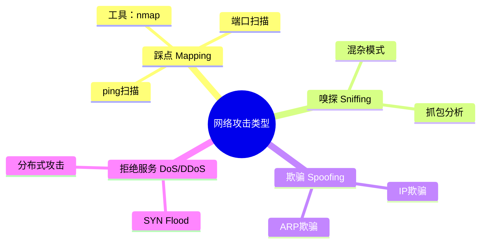
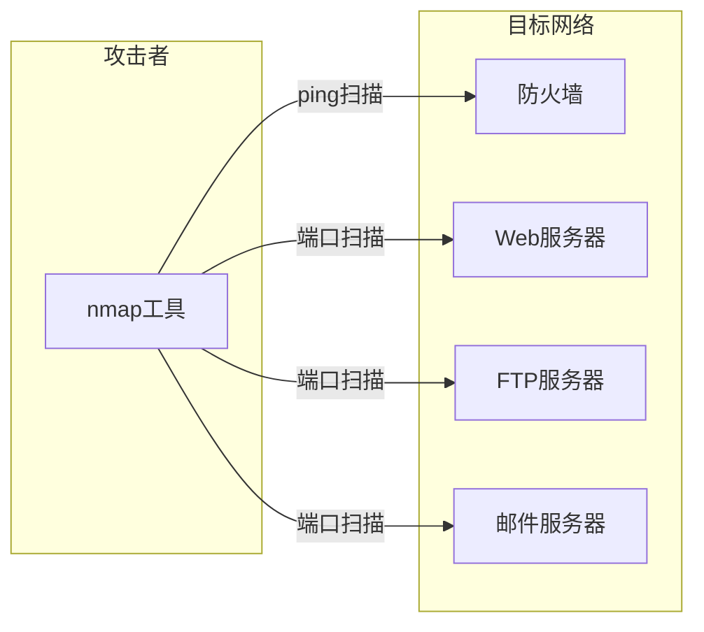
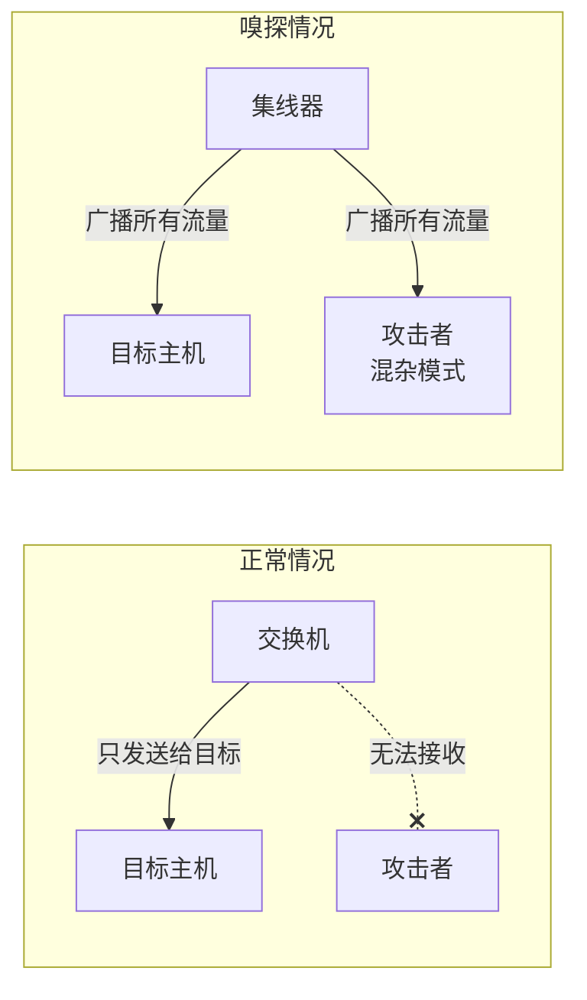
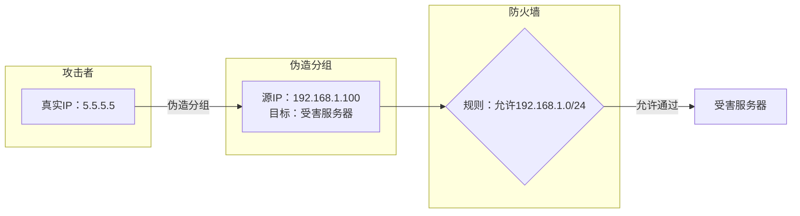
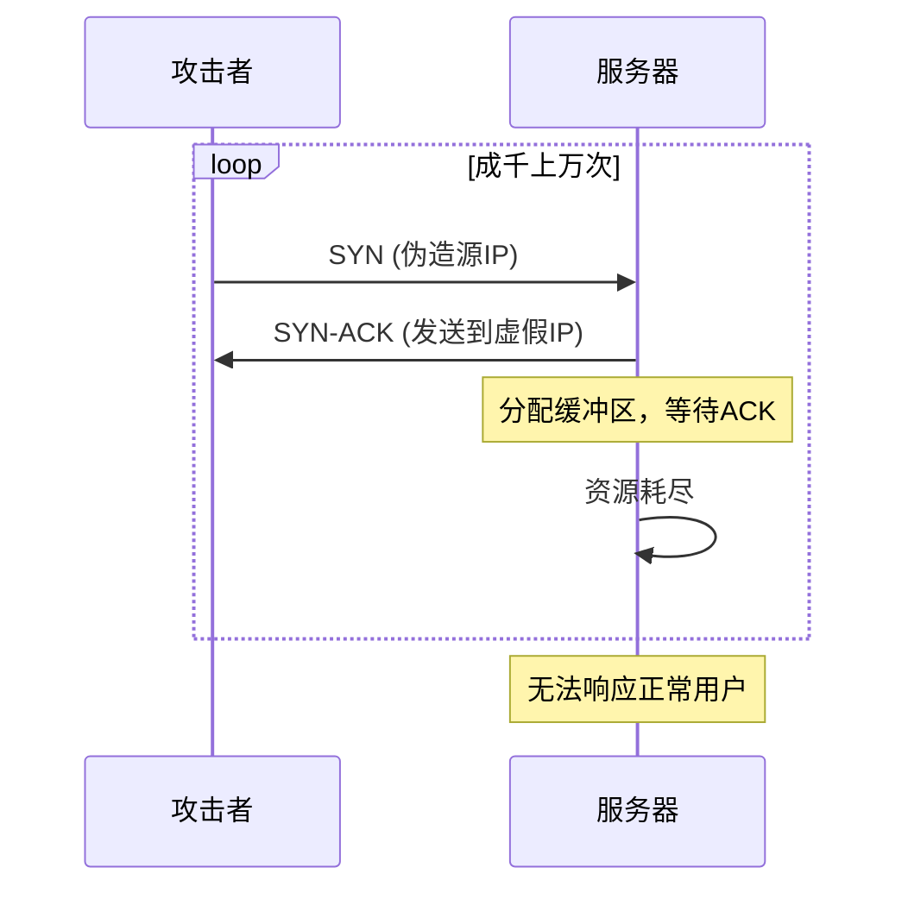
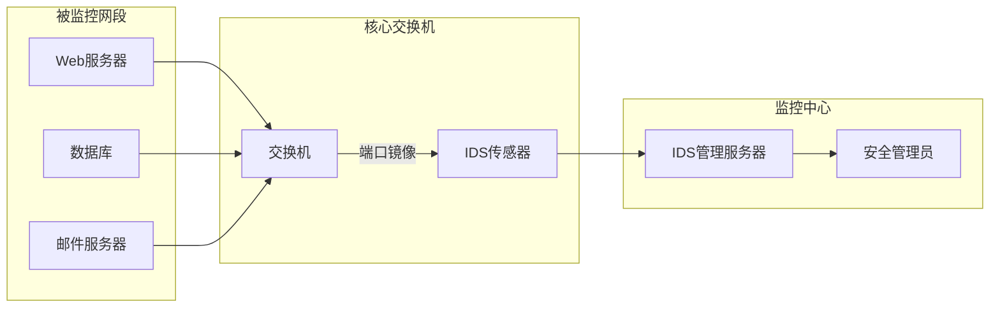

# 8.8 攻击与对策 —— 网络安全的动态博弈

---

## 一、引言：攻击与防御的永恒对抗

在学习了防火墙、入侵检测系统等防御技术后，我们必须认识到：**网络安全是一场动态的博弈**。攻击者在不断寻找新的漏洞和绕过方式，防御者则需要持续更新策略。本节将介绍几种典型的网络攻击手段及其对应的防御措施。

---

## 二、防火墙与应用程序网关的局限性回顾

在深入攻击手段之前，我们需要先理解防御工具的固有局限：

|局限性|描述|
|---|---|
|**IP欺骗**|防火墙无法验证数据报的源IP真实性，攻击者可伪造源地址|
|**UDP处理缺陷**|防火墙对UDP只能“全放行”或“全拦截”，缺乏精细控制|
|**安全与便利矛盾**|规则过严影响业务，过松带来风险|
|**网关扩展性问题**|每个应用需要独立网关，管理复杂|
|**客户端配置依赖**|应用程序网关需客户端手动配置代理，影响用户体验|

这些局限为攻击者提供了可乘之机。

---

## 三、典型攻击手段及对策

### 1. 映射（踩点）

**攻击原理**：攻击者在正式攻击前，先对目标网络进行侦察，了解网络拓扑和开放服务。

|扫描类型|方法|目的|
|---|---|---|
|**ping扫描**|发送ICMP Echo请求|确定活跃主机IP地址|
|**端口扫描**|尝试TCP连接（如21、23、80）|识别开放的服务端口|
|**典型工具**|nmap|网络探测和安全审计|

**防御措施**：

- **防火墙规则**：限制外部对内部网络的探测
    
- **入侵检测系统**：监测扫描行为模式，发现异常
    
- **主机安全软件**：如360，监控本地扫描行为
    

### 2. 分组嗅探

**攻击原理**：攻击者将网卡设置为**混杂模式**，捕获网络中所有广播分组，获取未加密的敏感信息（如明文密码）。

- **集线器**：所有端口共享介质，天然可嗅探
    
- **交换机**：本应隔离流量，但可被ARP欺骗等攻破
    

**防御措施**：

|措施|说明|
|---|---|
|**使用交换机替代集线器**|减少广播域|
|**加密通信**|即使被嗅探，也无法解密内容（如HTTPS、SSH）|
|**ARP检测**|监测ARP响应异常（混杂模式网卡会对所有ARP查询响应）|
|**专用软件**|定期检查网卡模式是否异常|

### 3. IP欺骗

**攻击特征**：攻击者伪造分组的源IP地址，通常与真实网络段不符，用于隐藏真实位置或绕过基于IP的认证。

**防御机制**：**入口过滤**

- 路由器验证外发分组的源IP地址是否属于本网段
    
- 丢弃源IP非本网段的分组
    

**局限性**：无法在全网范围强制部署，依赖各网络管理员的自觉实施。

### 4. 拒绝服务攻击

#### （1）DoS（单点拒绝服务）

**原理**：攻击者通过单一源IP发起大量虚假TCP连接请求（SYN Flood），耗尽服务器资源。

#### （2）DDoS（分布式拒绝服务）

**原理**：使用多台主机（通常为僵尸网络）协同攻击，更难防御。

**防御对策**：

|措施|说明|
|---|---|
|**IDS报警**|检测异常连接模式|
|**防火墙阻断**|动态阻断攻击源IP|
|**回溯追踪**|但攻击IP多为伪造，实际无效|
|**SYN Cookie**|服务器端技术，不分配资源直到三次握手完成|
|**流量清洗**|专业DDoS防护服务（如Cloudflare）|

---

## 四、攻击与防御对照表

|攻击类型|攻击手段|防御措施|难度|
|---|---|---|---|
|**踩点**|ping扫描、端口扫描|防火墙、IDS、主机防火墙|★★★|
|**嗅探**|混杂模式抓包|交换机、加密、ARP检测|★★★|
|**IP欺骗**|伪造源IP|入口过滤|★★★★|
|**DoS**|SYN Flood|SYN Cookie、防火墙|★★★★|
|**DDoS**|分布式攻击|流量清洗、专业防护|★★★★★|

---

## 五、网络安全动态对抗

网络安全不是一劳永逸的配置，而是一个持续演进的过程：

1. **攻击技术升级**：攻击者不断发现新的漏洞和绕过方式
    
2. **防御技术跟进**：漏洞修复、特征库更新、新防御机制
    
3. **企业防护需求**：无防护设备直接暴露互联网会遭高频扫描/攻击
    
4. **专业防护必要**：企业需部署防火墙+IDS组合，并持续监控
    

> 💡 **典型案例**：一台没有任何防护的新服务器接入互联网，通常在24小时内就会被扫描工具发现，并遭受各种自动化攻击尝试。

---

## 六、入侵检测系统

### 1. IDS vs 防火墙

|对比|防火墙|入侵检测系统|
|---|---|---|
|**检查深度**|仅TCP/IP头部字段|**深度内容分析**（特征匹配、行为分析）|
|**会话关联**|不分析会话关联性|分析分组序列的异常模式|
|**响应方式**|直接阻断流量|**仅报警**，由管理员决策|
|**部署方式**|串联在网络路径上|**旁路监听**，通过端口镜像|

### 2. IDS部署架构

- **传感器**：部署在每个网段，通过**端口镜像**监听所有流量
    
- **检测维度**：
    
    - **内容检测**：匹配病毒特征码、攻击签名
        
    - **行为分析**：识别端口扫描、异常连接模式
        
- **响应机制**：发现威胁时产生报警，由管理员决策处理
    

---

## 七、知识小结

|知识点|核心内容|考试重点/易混淆点|难度|
|---|---|---|---|
|**踩点攻击**|ping扫描+端口扫描，识别活跃主机和服务|nmap工具|★★★|
|**嗅探攻击**|网卡混杂模式抓包，获取明文信息|与ARP欺骗区别|★★★|
|**IP欺骗**|伪造源IP地址，隐藏真实身份|入口过滤防御|★★★★|
|**DoS/DDoS**|资源耗尽攻击，SYN Flood最典型|单点 vs 分布式|★★★★|
|**IDS功能**|深度内容分析+行为检测，旁路报警|与防火墙互补|★★★★|
|**IDS部署**|传感器+端口镜像，监控各网段|不影响主链路|★★★|
|**网络安全动态**|攻防技术持续升级|企业需专业防护|★★★|
|**防火墙局限**|无法防IP欺骗，UDP处理两难|安全与便利平衡|★★★|
|**应用程序网关局限**|多应用需独立网关，客户端需配置|管理复杂度|★★★|

---

## 八、总结：构建纵深防御体系

单一防御措施无法应对所有攻击，必须构建**纵深防御**体系：

- **边界防御**：防火墙控制网络入口
    
- **内部检测**：IDS监控异常行为
    
- **主机防护**：主机防火墙、杀毒软件
    
- **加密通信**：防止嗅探和中间人攻击
    
- **安全策略**：定期更新规则、修补漏洞
    
- **应急响应**：制定预案，快速处置
    

网络安全不是产品，而是**过程**。理解攻击手段与防御对策的动态关系，是构建安全网络的基础。