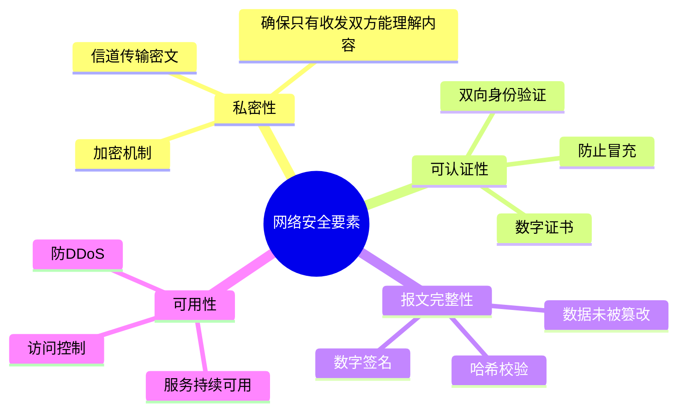
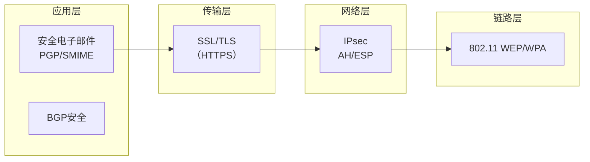
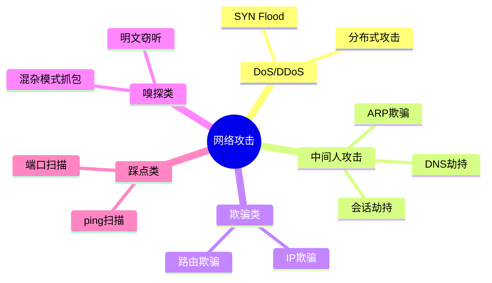
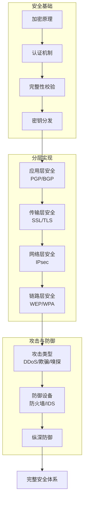
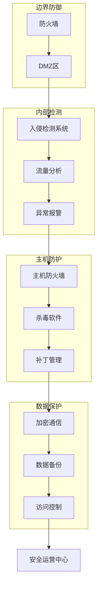

# 第8章 网络安全总结 —— 原理、技术与纵深防御

---

## 一、网络安全的基本原理

### 1. 四大核心要素回顾

网络安全的基础建立在四个相互关联的核心要素之上：

| 要素        | 实现技术                 | 作用      |
| --------- | -------------------- | ------- |
| **私密性**   | 对称加密（AES）、非对称加密（RSA） | 防止窃听    |
| **可认证性**  | 数字证书、数字签名            | 验证身份真实性 |
| **报文完整性** | 哈希函数（SHA-256）、消息认证码  | 检测篡改    |
| **可用性**   | 防火墙、入侵检测、负载均衡        | 保障服务连续  |
|           |                      |         |

### 2. 密钥分发与信任模型

|加密体系|密钥分发方式|信任中介|
|---|---|---|
|**对称加密**|密钥分发中心（KDC）|与KDC预共享密钥|
|**非对称加密**|数字证书（CA签发）|根证书（带外分发）|

**核心结论**：所有安全体系都依赖于一个初始的**信任锚点**（KDC预共享密钥或根证书），这是通过“带外”方式建立的。

---

## 二、分层安全实现

### 1. 各层次安全协议概览

|层次|典型协议|核心机制|保护对象|
|---|---|---|---|
|**应用层**|PGP、S/MIME、BGP安全|端到端加密+数字签名|特定应用数据|
|**传输层**|SSL/TLS|会话密钥协商+记录协议加密|端到端通信|
|**网络层**|IPsec（AH/ESP）|数据包加密+认证|所有IP数据报|
|**链路层**|WEP/WPA2/WPA3|无线链路加密|物理链路帧|

### 2. 技术共性

所有层次的安全实现都基于**加密、认证、完整性校验**等基础技术的组合应用，但不同层次有不同的实现方式和侧重点：

|技术|应用层体现|传输层体现|网络层体现|链路层体现|
|---|---|---|---|---|
|**加密**|PGP用接收方公钥加密会话密钥|SSL握手协商会话密钥|ESP加密IP载荷|WEP用RC4流加密|
|**认证**|数字签名验证发送方|证书验证服务器身份|AH认证数据源|WPA2 4次握手|
|**完整性**|报文摘要比对|MAC（消息认证码）|AH/ESP的ICV|CCMP完整性校验|

---

## 三、网络安全中的攻击行为

### 1. 常见攻击类型

|攻击类型|攻击手段|主要危害|防御措施|
|---|---|---|---|
|**拒绝服务**|SYN Flood、UDP放大|服务不可用|SYN Cookie、流量清洗|
|**中间人攻击**|ARP欺骗、DNS劫持|窃听、篡改|加密通信、双向认证|
|**IP欺骗**|伪造源IP|绕过访问控制|入口过滤|
|**嗅探**|混杂模式抓包|信息泄露|交换机、加密|
|**踩点**|端口扫描|信息收集|防火墙、IDS|

### 2. 防护设备

|设备|工作层次|主要功能|部署方式|
|---|---|---|---|
|**防火墙**|网络层/传输层|包过滤、状态检测|串联在网络边界|
|**入侵检测系统**|应用层|特征匹配、行为分析|旁路监听（端口镜像）|
|**入侵防御系统**|应用层|检测并阻断|串联部署|

---

## 四、网络安全知识体系全景图

### 1. 知识体系层次

|层次|内容|学习重点|
|---|---|---|
|**原理层**|加密、认证、完整性、密钥分发|四大要素的关系与区别|
|**技术层**|各层次安全协议的具体实现|协议工作机制与适用场景|
|**攻击层**|常见攻击手段与特征|攻击原理与识别方法|
|**防御层**|防火墙、IDS等防护设备|设备功能与部署方式|
|**综合层**|纵深防御体系构建|多技术协同防护|

### 2. 关键技术关联

- **加密技术**支撑所有层次的私密性
    
- **数字签名**实现认证与完整性绑定
    
- **证书体系**解决公钥可信问题
    
- **防火墙+IDS**形成边界与内部协同防御
    

---

## 五、纵深防御体系

单一安全措施无法应对所有威胁，必须构建**多层次、全方位**的防御体系：

|防御层次|技术手段|防护目标|
|---|---|---|
|**边界防御**|防火墙、DMZ|阻断外部直接攻击|
|**内部检测**|IDS、流量分析|发现已渗透威胁|
|**主机防护**|主机防火墙、杀毒软件|防止单点沦陷|
|**数据保护**|加密、备份、访问控制|保障数据安全|
|**安全管理**|策略、审计、应急响应|持续改进|

---

## 六、知识小结

|知识点|核心内容|考试重点/易混淆点|难度|
|---|---|---|---|
|**四大安全要素**|私密性、认证、完整性、可用性|要素间的区别与联系|★★★|
|**密钥分发**|KDC（对称） vs CA（非对称）|信任锚点建立方式|★★★★|
|**应用层安全**|PGP、BGP安全|端到端加密+签名|★★★|
|**传输层安全**|SSL/TLS|握手协议、会话密钥|★★★★★|
|**网络层安全**|IPsec（AH/ESP）|传输模式 vs 隧道模式|★★★★|
|**链路层安全**|WEP/WPA|WEP缺陷、WPA2改进|★★★|
|**攻击类型**|DoS、DDoS、中间人、欺骗、嗅探|攻击特征与防御|★★★★|
|**防护设备**|防火墙（包过滤/状态检测）、IDS|部署方式与功能差异|★★★|
|**纵深防御**|多层次协同防护|各层次关系|★★★★|

---

## 七、总结

网络安全不是单一技术的堆砌，而是由**原理、技术、攻击、防御**构成的完整知识体系：

1. **原理是基础**：加密、认证、完整性、密钥分发是所有安全机制的基石。
    
2. **技术是落地**：相同原理在不同网络层次有不同的实现方式（SSL/TLS、IPsec、WPA）。
    
3. **攻击是挑战**：从踩点、嗅探到DDoS，攻击手段不断演进。
    
4. **防御是应对**：防火墙、IDS、纵深防御体系构成多层防线。
    
5. **动态是常态**：安全是持续的过程，需要不断更新策略和技术。
    

> **核心启示**：网络安全的本质是**风险控制**。没有绝对的安全，只有不断逼近风险的防御。理解原理、掌握技术、熟悉攻击、构建体系，是应对网络安全挑战的正确路径。