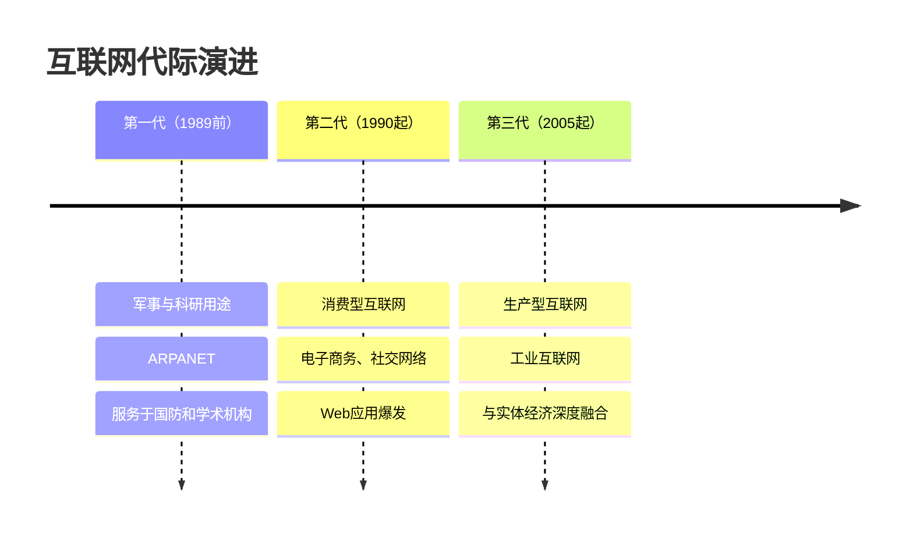
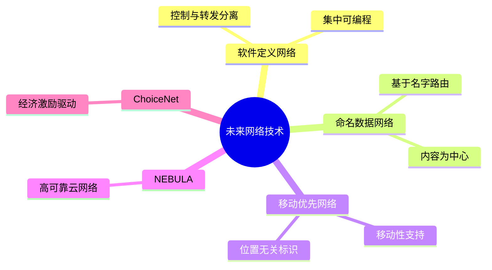
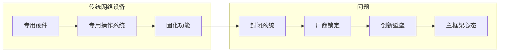
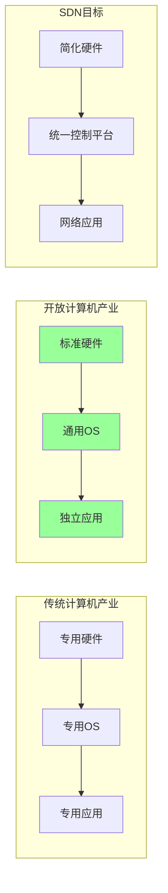
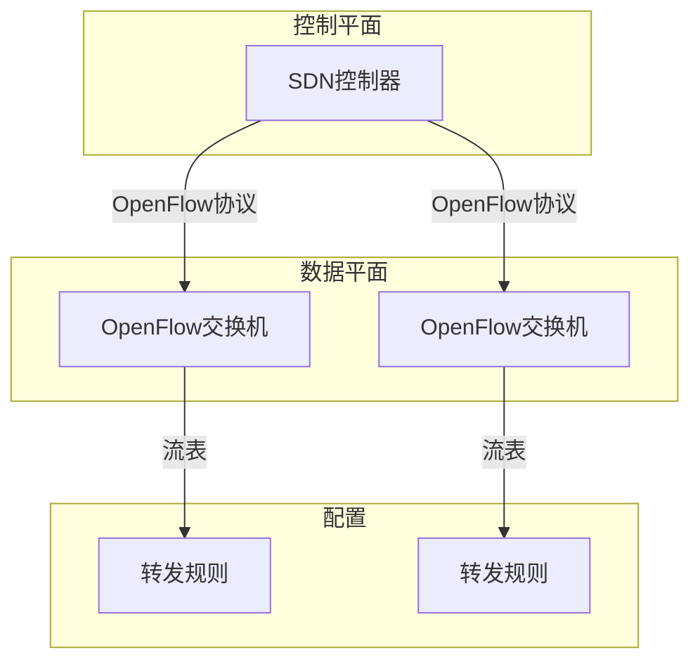
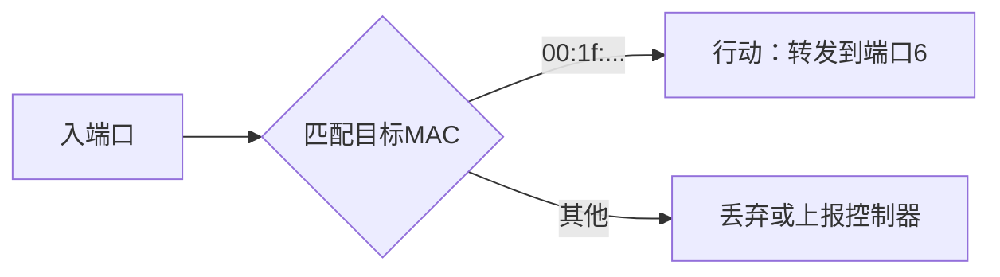
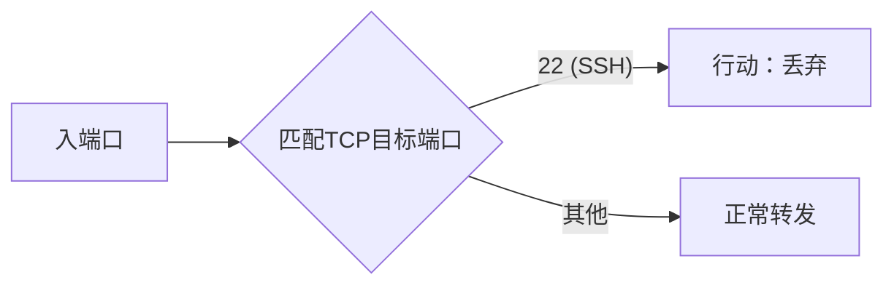

# 9.1 软件定义网络 —— 重构网络架构的革命

---

## 一、引言：互联网的演进与挑战

### 1. 互联网的发展历程

经过50年的发展，互联网已成为人类社会的重要基础设施，其角色经历了三次重大转变：

当前，互联网正从支撑电子商务、社交网络的**消费型**基础设施，向与实体经济深度融合的**生产型**基础设施转变，承担着升级改造传统行业、支持“中国制造2025”等国家战略的重任。

### 2. 互联网面临的主要挑战

|挑战|描述|
|---|---|
|**可扩展性问题**|现有架构难以支撑物联网、工业互联网的海量连接|
|**可控性问题**|网络行为难以精确控制和调整|
|**安全性问题**|攻击面扩大，传统边界防御失效|
|**实时性问题**|工业控制等场景需要确定性延迟|
|**能耗问题**|网络设备能耗随规模急剧增长|

---

## 二、未来网络的研究布局

### 1. 国际研究计划

面对上述挑战，各国纷纷启动未来网络研究计划：

|国家/地区|研究计划|时间|
|---|---|---|
|**美国**|FIND计划 → FIA计划 → FIA-NP计划|2005→2010→2014|
|**欧盟**|FIRE计划|2008|
|**中国**|CENI（中国未来网络基础设施）|持续建设|
|**日本**|JGN2plus|持续建设|
|**澳大利亚**|NICTA|持续建设|

### 2. 实验设施的重要性

现有网络难以验证新机制，需要专用实验设施：

| 国家  | 实验设施 | 作用         |
| --- | ---- | ---------- |
| 美国  | GENI | 支持未来网络架构验证 |
| 欧盟  | FIRE | 联合实验平台     |
| 中国  | CENI | 国家未来网络试验设施 |
|     |      |            |

### 3. 代表性未来网络技术

目前这些技术处于“战国时期”的探索阶段，各有侧重：

| 技术            | 核心思想       | 特点         |
| ------------- | ---------- | ---------- |
| **软件定义网络**    | 控制与转发分离    | 集中控制、可编程   |
| **命名数据网络**    | 以内容为中心的路由  | 基于名字而非IP地址 |
| **移动优先网络**    | 原生支持移动性    | 标识与位置分离    |
| **NEBULA**    | 高可靠云数据中心网络 | 面向云计算      |
| **ChoiceNet** | 经济激励驱动     | 用户可选择服务路径  |

---

## 三、软件定义网络

### 1. 为什么需要SDN？

#### （1）现有网络的僵化

| 问题       | 表现                |
| -------- | ----------------- |
| **封闭系统** | 专用硬件+专用操作系统，功能固化  |
| **复杂度高** | 软件数百万行代码，硬件数十亿门电路 |
| **创新壁垒** | 厂商不愿改变，形成封闭生态     |

#### （2）SDN的解决思路

借鉴计算机行业的开放性，重构网络架构：

**SDN三要素**：

1. **开放转发硬件接口**：统一硬件转发行为
    
2. **统一操作系统平台**：如ONOS、OpenDaylight
    
3. **良好应用开发接口**：北向API支持网络应用创新
    

---

### 2. OpenFlow：SDN的一种实现

#### （1）OpenFlow架构

- **数据平面**：硬件报文转发，仅执行流表指令
    
- **控制平面**：软件路由学习与配置，统一下发规则
    
- **通信协议**：OpenFlow作为南向接口标准
    

#### （2）流表结构

每个流表项包含三个核心部分：

|组件|作用|示例|
|---|---|---|
|**规则**|匹配条件|目标IP = 5.6.7.8|
|**行动**|处理方式|转发到端口1|
|**统计**|流量计数|报文数、字节数|

**匹配字段**支持多维度组合：

- 交换机端口
    
- VLAN ID
    
- MAC地址
    
- IP地址（源/目标）
    
- 协议类型（TCP/UDP/ICMP）
    
- TCP/UDP端口号
    

#### （3）应用案例

**例1：OpenFlow交换功能**

- **原理**：仅匹配目标MAC地址，简化规则
    
- **优势**：硬件转发效率高
    

**例2：OpenFlow防火墙**

- **原理**：匹配TCP端口22，配置丢弃动作
    
- **扩展性**：可组合多条规则实现复杂防火墙策略
    

---

## 四、SDN与传统网络对比

|对比维度|传统网络|软件定义网络|
|---|---|---|
|**控制方式**|分布式，每台设备独立|**集中式**，控制器全局调度|
|**转发依据**|目标IP（最长前缀匹配）|**多字段匹配**（流表）|
|**可编程性**|固化行为，难以更改|**动态下发流表**，快速创新|
|**硬件角色**|专用设备，软硬件绑定|**简化硬件**，仅负责转发|
|**升级方式**|需替换硬件或升级固件|**仅修改控制器应用**|
|**生态模式**|厂商锁定，垂直集成|**开放生态**，水平集成|

---

## 五、知识小结

|知识点|核心内容|考试重点/易混淆点|难度|
|---|---|---|---|
|**互联网代际演进**|军事科研→消费型→生产型|转型驱动因素|★★★|
|**未来网络挑战**|扩展性、可控性、安全、实时、能耗|与传统互联网问题的区别|★★★|
|**国际研究计划**|美国FIND/FIA、欧盟FIRE、中国CENI|各国实验设施|★★|
|**未来网络技术**|SDN、NDN、Mobility First等|技术核心思想对比|★★★|
|**SDN核心思想**|控制与转发分离，集中可编程|**三要素**：开放硬件、统一平台、应用接口|★★★★|
|**OpenFlow流表**|规则+行动+统计|多字段匹配|★★★★|
|**OpenFlow应用**|交换功能（MAC匹配）、防火墙（端口过滤）|行动类型（转发/丢弃）|★★★|
|**SDN vs 传统**|集中控制 vs 分布式，可编程 vs 固化|**本质区别**|★★★★★|

---

## 六、总结

软件定义网络是未来网络最具代表性的技术之一，它通过**控制与转发分离**，将网络从封闭的专用系统转变为开放的、可编程的平台：

- **对运营商**：简化管理，快速部署新业务
    
- **对设备商**：专注硬件优化，开放竞争
    
- **对开发者**：通过北向API创新网络应用
    

SDN不是终点，而是网络架构演进的重要里程碑。它与NDN、Mobility First等技术共同探索着未来网络的无限可能。