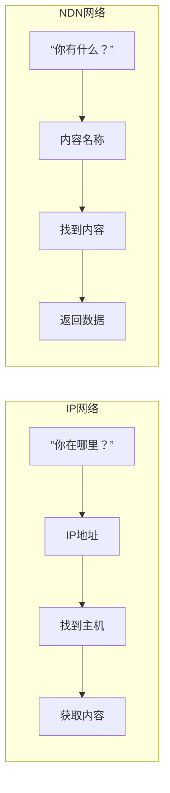
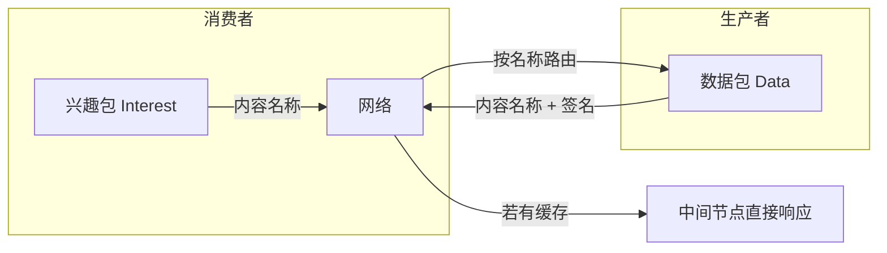
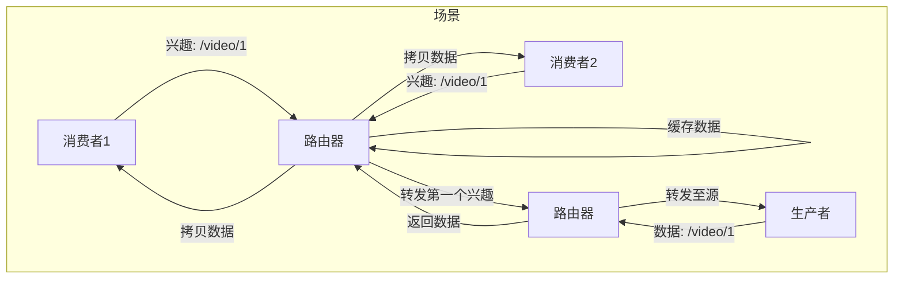

# 9.2 命名数据网络（上） —— 以内容为中心的未来网络架构

---

## 一、引言：从“你在哪里”到“你有什么”

今天的互联网是**以主机为中心**的架构：通信双方必须知道对方的IP地址，才能建立连接、交换数据。然而，互联网的主要用途已经从“主机间通信”转变为**内容分发**——用户关心的是“我想看什么视频”，而不是“这个视频在哪台服务器上”。

**命名数据网络**（Named Data Networking, NDN）正是针对这一根本性变化提出的全新网络架构。它将**内容名称**作为网络层的核心标识，让网络“感知”内容，从而实现更高效、更安全的内容分发。

---

## 二、NDN 与 IP 的核心对比

### 1. 设计理念的根本差异


|对比维度|IP网络|NDN网络|
|---|---|---|
|**核心标识**|IP地址（主机位置）|内容名称（数据本身）|
|**通信模式**|端到端，面向连接|拉取模式，请求-响应|
|**路由依据**|目标IP地址前缀|内容名称前缀|
|**中间节点角色**|无状态转发|**有状态**，可缓存内容|
|**安全绑定**|传输层（TLS/SSL）|**网络层内建**，数据自带签名|

### 2. IP网络的固有缺陷

|问题|表现|根本原因|
|---|---|---|
|**重复流量**|80%用户访问20%内容，相同内容重复传输|IP地址与内容无关，网络层不感知内容|
|**缓解手段**|CDN、P2P在应用层弥补|架构层面未解决，只能打补丁|
|**端到端依赖**|必须与源服务器建立连接|即使附近有缓存，也无法利用|

---

## 三、NDN 核心机制

### 1. 两种报文类型


| 报文类型    | 方向        | 作用     | 关键字段       |
| ------- | --------- | ------ | ---------- |
| **兴趣包** | 消费者 → 网络  | 请求特定内容 | 内容名称       |
| **数据包** | 生产者 → 消费者 | 返回请求内容 | 内容名称、数据、签名 |

### 2. 转发与缓存机制

- **有状态转发**：路由器记录每个兴趣包的**来源接口**，确保数据包能沿原路返回。
    
- **网内缓存**：每个NDN节点可以缓存经过的数据包，后续相同名称的兴趣包可直接从缓存响应。
    
- **请求聚合**：多个消费者请求相同内容时，第一个兴趣包被转发至源，后续兴趣包在第一个数据包返回前可在中间节点**聚合等待**，避免重复转发。
    


### 3. 路由与转发

- **基于名称的路由**：使用内容名称前缀（如 `/ustc/videos/`）构建路由表，类似IP前缀聚合。
    
- **最长前缀匹配**：兴趣包中的名称与路由表项进行最长前缀匹配，确定转发接口。
    
- **多路径转发**：可同时向多个接口转发兴趣包，实现负载均衡和容错。
    

---

## 四、NDN 命名格式

### 1. 分级命名结构

```text

/ustc/videos/demo.mpg/1/3
```

|层级|含义|类比|
|---|---|---|
|`/ustc`|组织/域名|IP网络号|
|`/videos`|内容类型|子网号|
|`/demo.mpg`|文件名称|主机号|
|`/1`|版本号|文件版本|
|`/3`|数据块号|分片编号|

### 2. 命名优势

|优势|说明|
|---|---|
|**语义丰富**|名称可表达内容场景、版本、分片等信息|
|**路由聚合**|支持前缀聚合（如 `/ustc`），降低路由表规模|
|**灵活扩展**|类似IP前缀掩码机制，但应用于内容命名空间|

---

## 五、NDN 的安全内建

### 1. 数据包签名

每个NDN数据包**自带数字签名**，包含：

- 内容名称
    
- 内容数据
    
- 发布者公钥信息
    
- 签名值
    

### 2. 安全特性

|特性|实现方式|优势|
|---|---|---|
|**内容来源认证**|验证签名可确认发布者身份|无需依赖传输层安全|
|**内容完整性**|签名保证数据未被篡改|即使从缓存获取也能验证|
|**粒度安全**|每个数据包独立签名|支持细粒度的访问控制|
|**网络层内建**|安全机制在NDN层实现|对应用透明，降低复杂性|

---

## 六、NDN 与 IP 架构对比总结

|对比维度|IP网络|NDN网络|
|---|---|---|
|**核心标识**|IP地址（主机位置）|内容名称|
|**通信模式**|端到端，面向连接|拉取模式，请求-响应|
|**路由器状态**|**无状态**|**有状态**（记录兴趣路径）|
|**缓存能力**|无|**泛在缓存**|
|**安全机制**|传输层（TLS/SSL）|**网络层内建签名**|
|**重复流量处理**|应用层补丁（CDN/P2P）|**网络层原生解决**|
|**命名空间**|32/128位地址|**分级可变长名称**|
|**路由聚合**|IP前缀|**名称前缀**|

---

## 七、知识小结

|知识点|核心内容|考试重点/易混淆点|难度|
|---|---|---|---|
|**NDN核心思想**|以内容为中心，基于名称路由|与IP网络的**根本区别**|★★★|
|**兴趣包/数据包**|消费者发Interest，生产者回Data|数据包沿兴趣包路径返回|★★★★|
|**有状态转发**|路由器记录兴趣来源|与IP无状态转发的对比|★★★★|
|**网内缓存**|中间节点可缓存内容|解决重复流量的关键机制|★★★★|
|**命名格式**|分级名称，支持语义和聚合|与IP地址结构的类比|★★★|
|**安全内建**|数据包自带签名|无需传输层安全协议|★★★★|
|**请求聚合**|相同兴趣可合并等待|减少上游流量|★★★★|
|**应用场景**|视频分发、物联网、内容分发|替代CDN/P2P的架构级方案|★★★|

---

## 八、NDN 的挑战与展望

虽然NDN在理论上解决了IP网络的诸多问题，但实际部署仍面临挑战：

|挑战|说明|
|---|---|
|**全网部署**|需要替换现有路由设备，成本高昂|
|**命名空间管理**|全球唯一名称需要类似DNS的解析系统|
|**性能开销**|名称查找比定长IP查找更复杂|
|**缓存策略**|需要智能的缓存替换算法|
|**隐私问题**|名称可能泄露用户兴趣|

尽管如此，NDN作为未来网络架构的重要候选，其设计理念已经深刻影响了信息中心网络（ICN）领域的发展。它代表了一种**从“连接主义”到“内容主义”**的范式转变。