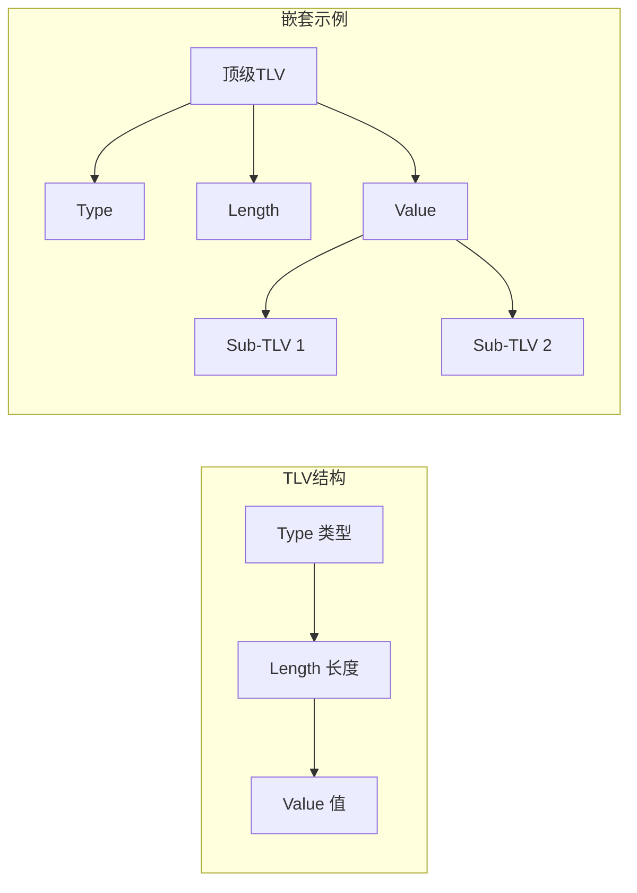
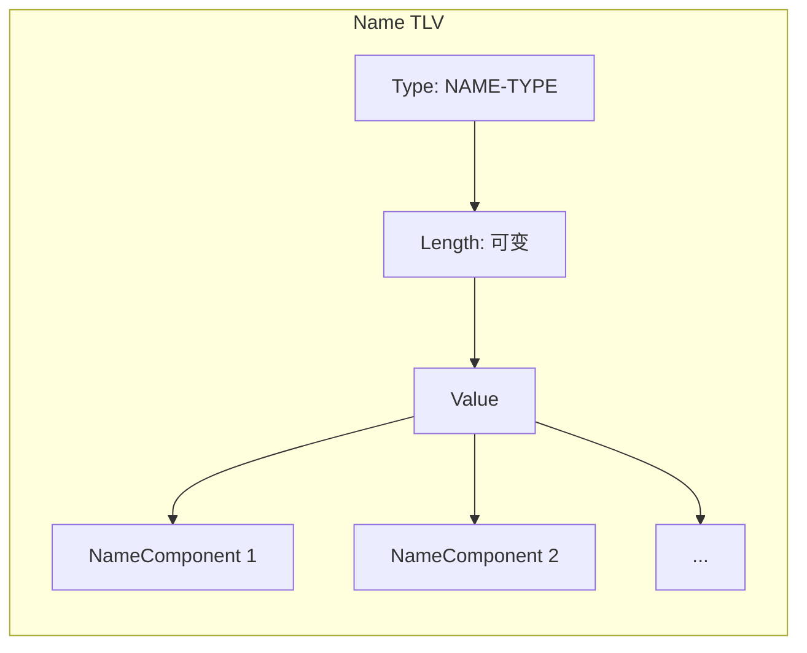
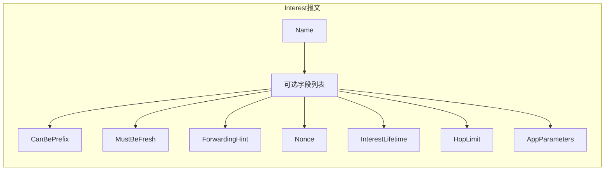
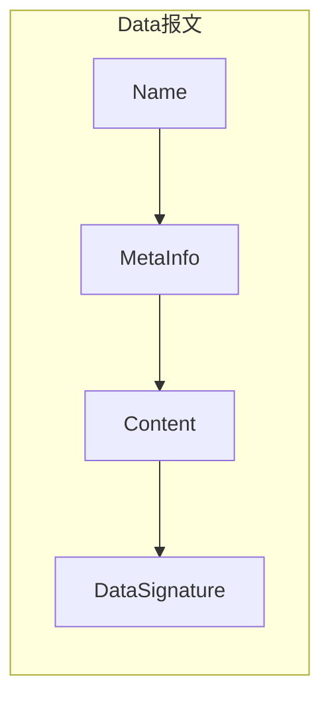
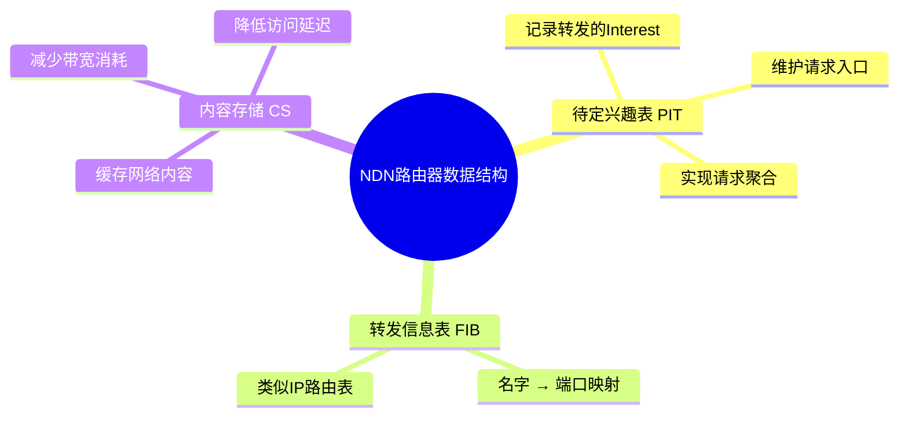
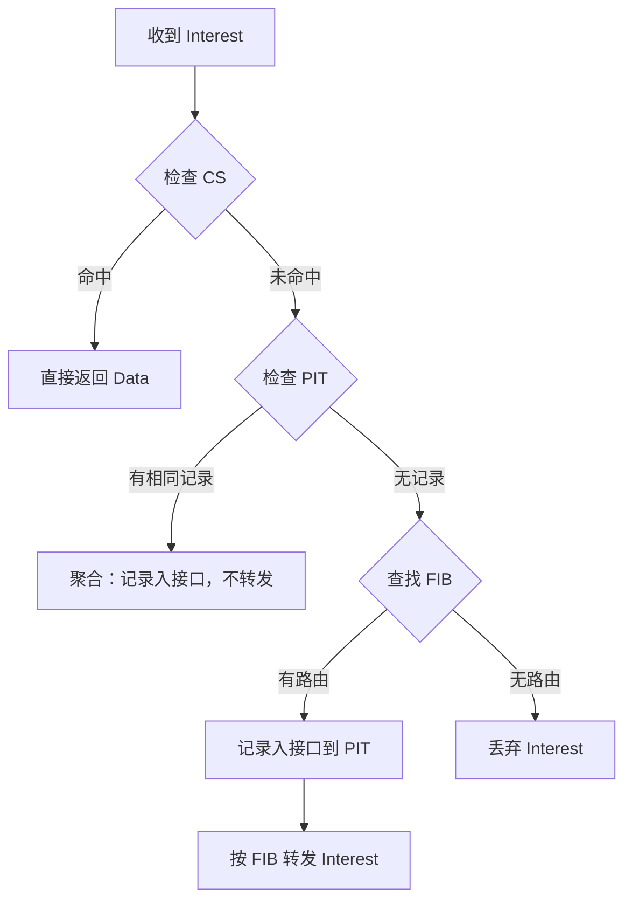
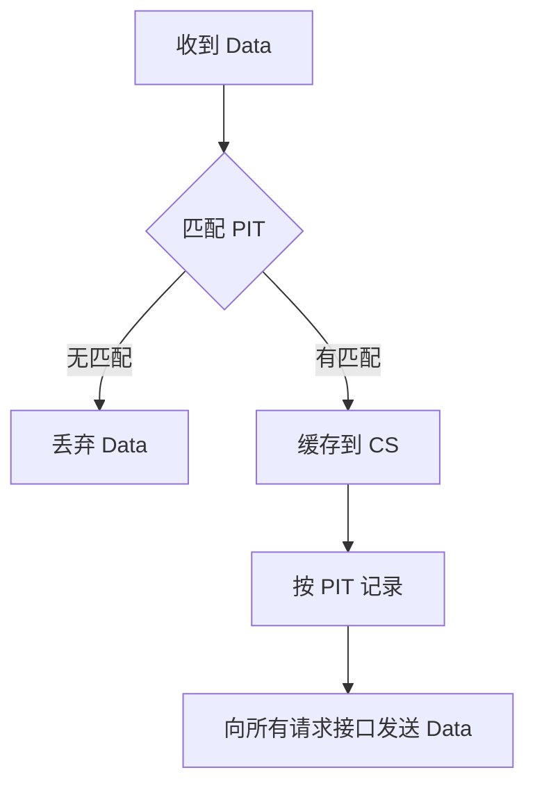

# 9.3 命名数据网络（下） —— 报文格式与转发机制

---

## 一、NDN 报文编码：TLV 格式

NDN 所有报文（Interest 和 Data）均采用 **TLV（Type-Length-Value）** 格式进行编码。这是一种自描述、可扩展的二进制编码方式。

### 1. TLV 基本格式

|字段|作用|特点|
|---|---|---|
|**Type**|标识 Value 字段的语义含义|可变长度编码|
|**Length**|表示 Value 字段的字节长度|可变长度编码|
|**Value**|实际承载的数据内容|可包含子 TLV（嵌套）|

### 2. 可变长度编码规则

TLV 的 Type 和 Length 字段采用**可变长度编码**以节省空间。编码规则如下：

|首字节范围|编码方式|有效长度|
|---|---|---|
|`0x00` – `0xFC` (≤252)|单字节直接编码|1 字节|
|`0xFD` (253)|后跟 2 字节表示长度|3 字节|
|`0xFE` (254)|后跟 4 字节表示长度|5 字节|
|`0xFF` (255)|后跟 8 字节表示长度|9 字节|

**示例**：

- 若 Length = 200，则直接编码为 `0xC8`。
    
- 若 Length = 1000，则编码为 `0xFD 0x03 0xE8`（253 + 2 字节值）。
    

### 3. Name 的 TLV 封装

NDN 的名称（Name）是一个分层的 TLV 结构，由多个 **NameComponent** 组成。

|组件类型|说明|长度|
|---|---|---|
|**GENERIC-NAME-COMPONENT**|通用名字部分，无内容限制|可变|
|**隐式摘要**|存储整个数据报文摘要|固定 32 字节|
|**参数摘要**|存储 Interest 报文参数摘要|固定 32 字节|
|**其他类型**|预留扩展字段|可变|

### 4. Interest 报文的 TLV 封装

Interest 报文用于请求内容，其 TLV 结构如下：

| 字段                   | 必选/可选  | 作用        |
| -------------------- | ------ | --------- |
| **Name**             | **必选** | 请求的内容名称   |
| **CanBePrefix**      | 可选     | 是否允许前缀匹配  |
| **MustBeFresh**      | 可选     | 是否只接受新鲜数据 |
| **ForwardingHint**   | 可选     | 指定转发路径    |
| **Nonce**            | 可选     | 随机数，防止环路  |
| **InterestLifetime** | 可选     | 报文生存时间    |
| **HopLimit**         | 可选     | 最大跳数限制    |
| **AppParameters**    | 可选     | 应用参数      |

### 5. Data 报文的 TLV 封装

Data 报文是 Interest 的响应，其 TLV 结构包含：

| 字段                | 必选/可选  | 作用               |
| ----------------- | ------ | ---------------- |
| **Name**          | **必选** | 数据的内容名称          |
| **MetaInfo**      | 可选     | 元数据信息（如内容类型、新鲜度） |
| **Content**       | **必选** | 实际数据内容           |
| **DataSignature** | **必选** | 数字签名，验证完整性       |

---

## 二、NDN 路由器的三个关键数据结构

NDN 路由器与传统 IP 路由器不同，它需要维护状态以支持网内缓存和请求聚合。三个核心数据结构如下：

### 1. 待定兴趣表（PIT）

|功能|描述|
|---|---|
|**记录入口**|记录每个转发的 Interest 从哪个接口进入|
|**请求聚合**|相同名称的 Interest 到达时，只转发第一个，其余在 PIT 中记录等待，避免重复转发|
|**按原路返回**|Data 报文到达时，根据 PIT 记录将数据发回所有请求者|

### 2. 转发信息表（FIB）

|功能|描述|
|---|---|
|**名字 → 端口映射**|类似 IP 路由表，将内容名称前缀映射到输出端口|
|**最长前缀匹配**|根据 Interest 中的名称查找最匹配的 FIB 条目|
|**多路径转发**|可同时向多个接口转发 Interest，实现负载均衡|

### 3. 内容存储（CS）

|功能|描述|
|---|---|
|**缓存内容**|存储经过本节点的 Data 报文|
|**减少带宽消耗**|后续相同 Interest 可直接从缓存响应|
|**降低访问延迟**|用户可从就近缓存获取内容|
|**高效查询**|需要快速名称查找算法|

---

## 三、NDN 路由器转发处理流程

### 1. Interest 报文转发流程

**步骤说明**：

1. **查 CS**：若本地缓存已有内容，直接返回 Data。
    
2. **查 PIT**：若已有相同名称的 Interest 在等待，则只记录当前入接口（聚合），不重复转发。
    
3. **查 FIB**：若无 PIT 记录，查找 FIB 确定转发端口，并创建新的 PIT 条目。
    
4. **无路由**：若 FIB 无匹配，丢弃 Interest。
    

### 2. Data 报文转发流程

**步骤说明**：

1. **匹配 PIT**：检查是否有等待该名称的 Interest 记录。
    
2. **无匹配**：说明无人请求，丢弃 Data（可能是过期或恶意数据）。
    
3. **有匹配**：将 Data 存入 CS，并按 PIT 记录的所有入接口发送 Data。
    
4. **多播传输**：一个 Data 可同时响应多个请求者，提高效率。
    

---

## 四、NDN 与 IP 转发对比

|对比维度|IP 转发|NDN 转发|
|---|---|---|
|**转发依据**|目标 IP 地址|内容名称|
|**路由器状态**|**无状态**|**有状态**（PIT）|
|**缓存能力**|无|**有**（CS）|
|**重复请求处理**|重复转发|**请求聚合**|
|**数据返回路径**|由路由协议决定|**按 PIT 原路返回**|
|**多播支持**|需专门协议|**天然支持**（PIT 多接口）|

---

## 五、知识小结

|知识点|核心内容|考试重点/易混淆点|难度|
|---|---|---|---|
|**TLV 编码**|Type-Length-Value 嵌套结构，支持可变长编码|首字节≤252 为单字节，253/254/255 分别标记后 2/4/8 字节|★★★|
|**Name TLV**|包含通用名、隐式摘要（32B）、参数摘要（32B）等组件|摘要字段固定长度，用于完整性验证|★★★|
|**Interest 报文**|必含 Name，可选字段丰富（Nonce、Lifetime 等）|Nonce 防环路，HopLimit 防无限转发|★★★|
|**Data 报文**|必含 Name、Content、签名，可选 MetaInfo|签名保证内容完整性和来源认证|★★★|
|**PIT**|待定兴趣表，记录请求入口，实现聚合和原路返回|聚合机制避免重复转发|★★★★|
|**FIB**|名称到端口的映射，类似 IP 路由表|最长前缀匹配|★★★|
|**CS**|内容缓存，减少带宽和延迟|需要高效查找算法|★★★|
|**Interest 转发流程**|CS → PIT → FIB|命中 CS 直接返回，PIT 聚合，FIB 路由|★★★★★|
|**Data 转发流程**|PIT 匹配 → 缓存 → 多播返回|无 PIT 匹配则丢弃|★★★★|

---

## 六、总结

NDN 通过 **TLV 编码** 实现灵活的自描述报文，通过 **PIT、FIB、CS** 三个核心数据结构实现了有状态的转发、请求聚合和网内缓存。与 IP 网络的“无状态转发”相比，NDN 在内容分发效率、安全性、多播支持等方面具有天然优势，但也对路由器性能和命名空间管理提出了更高要求。

理解 NDN 的报文格式和转发机制，是掌握信息中心网络（ICN）架构的关键一步。