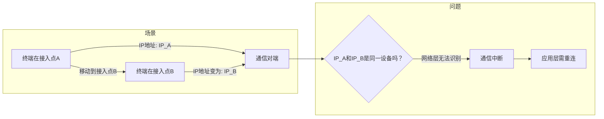
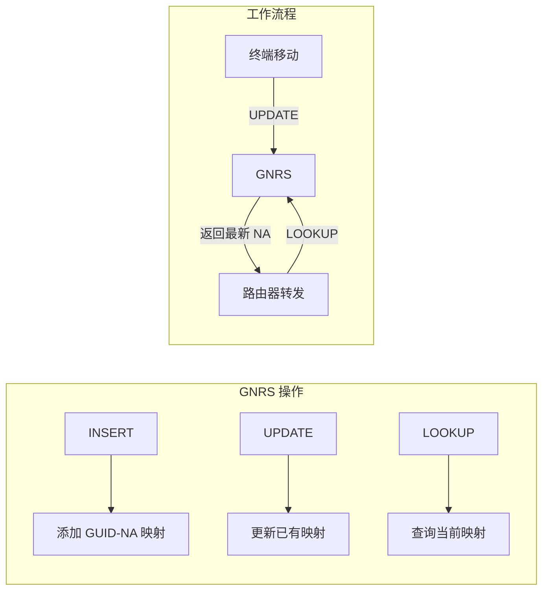
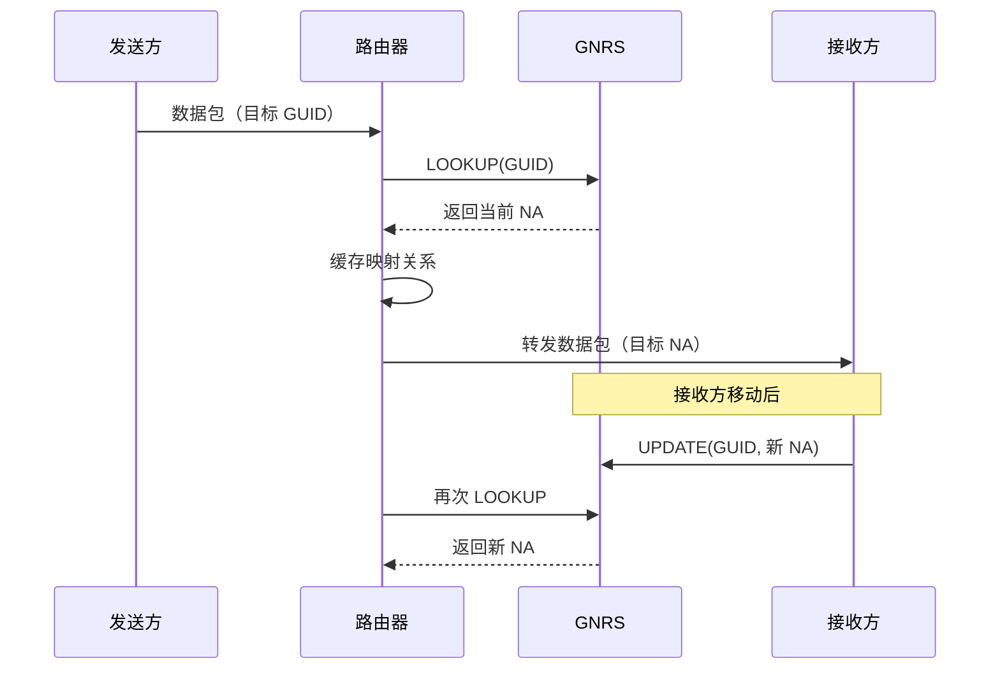
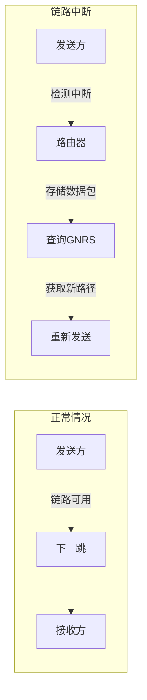
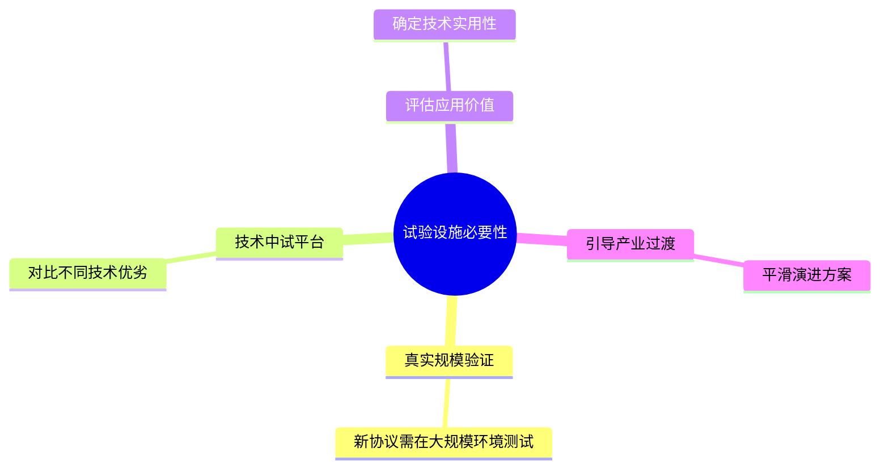
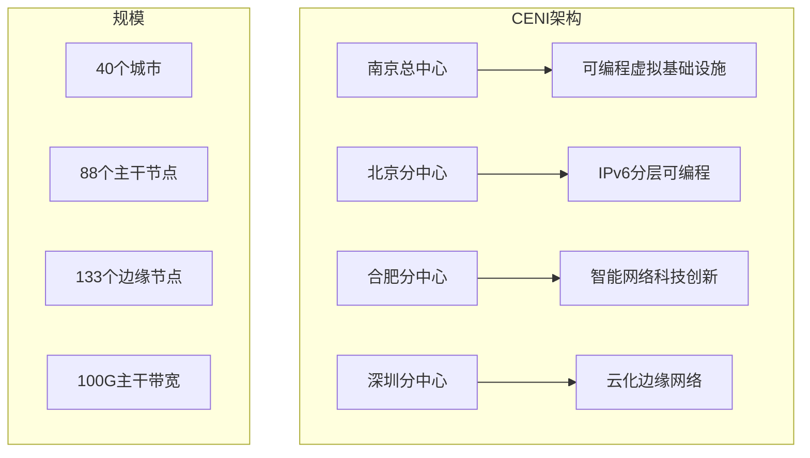

# 9.4 移动优先网络与网络试验设施 —— 面向移动时代的未来网络架构

---

## 一、移动优先网络

### 1. 现有互联网的移动性困境

#### （1）IP地址的双重身份问题

当前互联网的核心协议IP在设计时，将**身份标识**和**位置标识**双重功能绑定在同一个IP地址上：

| 功能       | 描述                 |
| -------- | ------------------ |
| **身份标识** | 唯一标识一个网络接口（你是谁）    |
| **位置标识** | 指示该接口在网络中的位置（你在哪里） |
|          |                    |

这种设计在固定网络时代运行良好，但在移动互联网时代暴露出严重缺陷：


**根本问题**：当移动终端从接入点A切换到接入点B时，IP地址从 `IP_A` 变为 `IP_B`，网络层无法将新旧地址关联到同一用户，导致：

- **网络层问题**：通信中断，上层连接断开
    
- **应用层问题**：需要频繁进行重连和状态恢复，在移动场景下效率极低
    

### 2. MobilityFirst 核心思想

**MobilityFirst**（移动优先网络）的核心设计理念是：**将名字（身份标识）与地址（位置标识）分离**。


#### （1）命名分层结构

|层次|标识符|作用|示例|
|---|---|---|---|
|**应用层**|用户级描述符|人类可读的名称|"Joe's car"|
|**网络层**|**GUID**|全局唯一标识符（基于公钥等）|128/256位随机数|
|**路由层**|**NA**|可路由的网络地址|类似IP地址|

#### （2）动态映射服务：GNRS

**GNRS**（Global Name Resolution Service，全局名字解析服务）维护 GUID 与 NA 的动态映射关系，类似DNS但：

- **更通用的命名空间**：不仅限于域名
    
- **更动态的映射**：支持实时更新（移动场景下频繁变化）
    


### 3. MobilityFirst 协议栈

#### （1）逐跳块传输协议

|特性|描述|优势|
|---|---|---|
|**逐跳确认**|每个数据包在每跳独立确认|提高可靠性，快速重传|
|**存储感知路由**|路由器可临时存储无法立即转发的数据|应对链路中断|
|**混合路由**|可基于 GUID 或 NA 路由|灵活适应不同场景|

#### （2）报文结构

```text

+----------------+----------------+----------------+----------------+
|     SID        |     GUID       |      NA        |    Payload     |
|  (服务标识)     | (全局名字标识)  |  (网络地址)     |   (有效载荷)   |
+----------------+----------------+----------------+----------------+
```

- **SID**：服务标识（单播/组播）
    
- **GUID**：全局唯一标识符
    
- **NA**：当前网络地址
    
- **Payload**：实际数据
    

#### （3）动态解析流程


### 4. 存储感知抗毁路由

MobilityFirst 的核心创新之一是**利用网内存储应对链路中断和拓扑变化**：


|机制|作用|
|---|---|
|**网内存储**|路由器临时缓存无法立即转发的数据包|
|**动态重路由**|检测到链路中断时，查询GNRS获取新路由|
|**无缝切换**|在蜂窝网络和WiFi等不同接入技术间自适应|

**优势**：

- 无需应用层重传
    
- 适应移动场景下的频繁拓扑变化
    
- 显著提高传输可靠性
    

---

## 二、网络试验设施

### 1. 为什么需要未来网络试验设施？


|需求|说明|
|---|---|
|**真实规模环境**|仿真或小规模实验无法暴露所有问题|
|**协议创新支持**|允许部署全新协议栈（如NDN、MF）|
|**开放实验环境**|多用户并行实验，互不干扰|
|**独立于商用网**|不影响现有业务，自由探索|

### 2. 我国未来网络试验设施：CENI

**CENI**（China Environment for Network Innovations）是国家十二五规划16项重大科技基础设施之一，建设周期2019-2023。


|分中心|特色方向|主要功能|
|---|---|---|
|**南京总中心**|可编程虚拟基础设施|核心管控、资源调度|
|**北京分中心**|IPv6分层可编程|下一代互联网协议验证|
|**合肥分中心**|智能网络科技创新|SDN、NDN、MF等新型架构|
|**深圳分中心**|云化边缘网络|边缘计算、5G融合|

### 3. CENI-HeFei 网络创新试验服务门户

合肥分中心由中国科学技术大学牵头建设，提供在线试验服务：

- **访问地址**：[http://ceni.ustc.edu.cn/](http://ceni.ustc.edu.cn/)
    
- **主要功能**：
    
    - 用户注册和实验创建
        
    - 公共实验模板
        
    - 自定义网络节点配置
        
    - 支持SDN、NDN、MF等新型网络架构实验
        

---

## 三、未来网络技术对比

|技术|核心机制|适用场景|关键创新|
|---|---|---|---|
|**NDN**|名字路由 + 网内缓存|内容分发|以内容为中心|
|**MobilityFirst**|GUID-NA分离 + 动态映射|移动通信|名字与地址分离|
|**SDN**|控制与数据平面分离|网络可编程|集中控制|

**共同点**：

- 均采用名字机制（NDN的内容名、MF的GUID）
    
- 均依赖网内存储/缓存（NDN的CS、MF的存储感知路由）
    

**差异点**：

- NDN聚焦内容分发效率
    
- MF聚焦移动性支持
    
- SDN聚焦控制灵活性和可编程性
    

---

## 四、知识小结

|知识点|核心内容|考试重点/易混淆点|难度|
|---|---|---|---|
|**IP移动性问题**|IP地址双重身份（定位+标识）导致移动时通信中断|地址变更对上层连接的影响|★★★|
|**MobilityFirst核心思想**|名字（GUID）与地址（NA）分离，通过GNRS动态映射|类似DNS但更动态、更底层|★★★★|
|**GNRS三种操作**|INSERT（添加）、UPDATE（更新）、LOOKUP（查询）|分布式设计避免单点故障|★★★|
|**逐跳块传输**|每跳确认 + 存储感知路由|与传统端到端重传对比|★★★★|
|**抗毁路由**|利用网内存储和动态重路由应对链路中断|蜂窝/WiFi无缝切换|★★★★★|
|**CENI设施**|覆盖40城市，支持SDN/NDN/MF实验|各分中心特色方向|★★★|
|**合肥分中心**|智能网络科技创新，提供在线试验平台|[cenihf.ustc.edu.cn](https://cenihf.ustc.edu.cn/)|★★|
|**NDN vs MF vs SDN**|名字与缓存（NDN/MF）vs 控制分离（SDN）|适用场景差异|★★★★★|

---

## 五、总结

移动优先网络（MobilityFirst）通过**名字与地址分离**的核心设计，从根本上解决了IP协议对移动性支持不足的问题。GNRS动态映射、逐跳确认、存储感知路由等机制共同构成了一个面向移动时代的全新网络架构。

同时，CENI等未来网络试验设施的建成，为这些创新架构提供了真实规模的验证平台，推动网络技术从理论走向实践。无论是NDN的内容分发、MF的移动性支持，还是SDN的灵活控制，都将在CENI上得到充分验证和比较。

> **核心启示**：未来网络的演进不是单一技术的胜利，而是多种架构的共存与融合。理解每种技术的核心设计思想及其适用场景，比掌握具体实现更为重要。