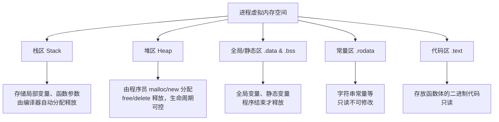
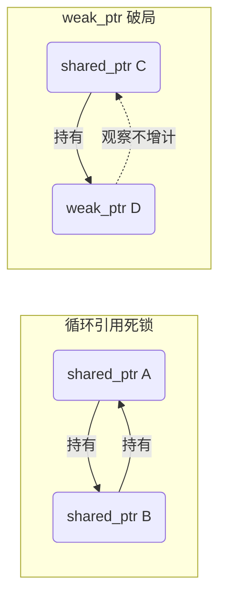
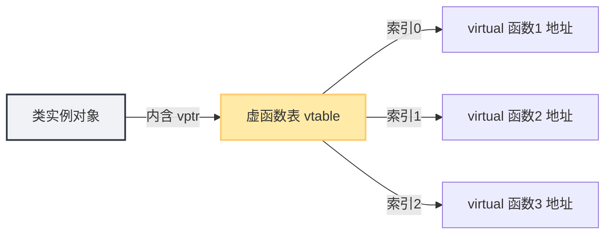
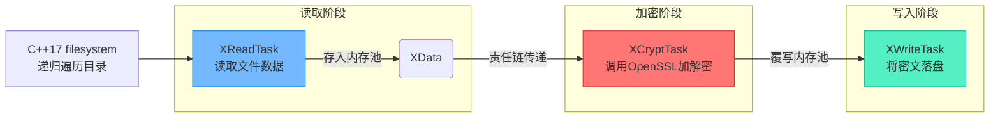

# C++内存管理深度解析：从底层原理到现代特性实践

> [!abstract] 课程核心导言
> C++的指针与内存管理一直是开发者进阶路上的“拦路虎”。很多人能写出编译通过的代码，却常常在运行时陷入内存泄漏、野指针的泥沼。本笔记基于《C++内存管理》课程，系统梳理从底层指针原理到C++20现代内存特性的核心知识，助你彻底攻克C++内存难关！

---

## 一、课程全景概览

### 1. 为什么要深入学习C++内存？
- **痛点破局**：C++指针是最难且最重要的部分，常见的困境是“能写但一出问题就查不出”，根本原因在于对内存操作原理缺乏底层认知。
- **调试救星**：C++程序大部分Debug时间都耗在内存问题上。哪怕只有1字节的内存泄漏，在长期运行的服务器程序中也会被无限放大，最终导致OOM（Out of Memory）崩溃。
- **拥抱现代特性**：C++11起引入的智能指针已非常成熟，搭配内存池技术，能在保持C++极致运行效率的同时，大幅提升开发效率。但切记：**必须先懂底层原理，再用高层抽象**，否则极易误用。

### 2. 适合人群
- **攻坚者**：学C++指针屡屡受挫，想彻底搞懂内存运作原理的开发者。
- **实践者**：工作中需要应用智能指针、内存池技术，或做底层技术储备的工程师。
- **追新者**：渴望系统掌握C++11/14/17/20内存相关新特性的开发者。
- **实战派**：需要多线程并发、读写分离、文件加解密等复杂模块交互项目经验的同学。

### 3. 高效学习指南
> [!tip] 学习方法论
> - **节奏把控**：每天固定时长消化，切忌贪多嚼不烂。
> - **三步法**：整体观看明逻辑 → 重点实践敲代码 → 源码对比找差异。
> - **避坑指南**：遇到Bug优先用官方源码Diff排查，别把时间浪费在拼写错误上！

### 4. 课程特色与环境
- **可视化**：用内存示意图把抽象的指针具象化。
- **渐进式**：代码逐行敲写，展示完整的思考推演过程。
- **实战化**：包含面向对象设计的复杂项目，整合智能指针与内存池。
- **环境说明**：推荐使用 VS2019（支持C++11~20）；核心代码跨平台，实战项目使用 OpenCV 与 OpenSSL 的跨平台接口（无需精通，配置已备好）。

---

## 二、C++内存与指针：底层基石

### 1. 进程内存空间分析
程序运行时，操作系统会为其分配虚拟内存空间。理解内存分区，是定位非法访问、栈溢出等问题的前提。

### 2. 易混淆概念大起底
对于初学者，指针的常量属性极其容易搞混，请牢记以下判断法则：

> [!info] 核心法则
> **`*` 在 `const` 前，代表指针本身不可变；`*` 在 `const` 后，代表所指内容不可变。**

| 声明形式 | 名称 | 含义解读 | 记忆口诀 |
| :--- | :--- | :--- | :--- |
| `const int* p` | 常量指针 | `*p` 不可改，`p` 可改 | **所指**是常量，指哪打哪不能改内容 |
| `int* const p` | 指针常量 [1](@context-ref?id=0)| `*p` 可改，`p` 不可改 | **本身**是常量，死盯一个地方不能换人 |
| `const int* const p` | 复合常量 | `*p` 不可改，`p` 不可改 | 两者皆锁死 |

---

## 三、现代C++智能指针与函数传参

### 1. 三大智能指针详解
C++11摒弃了裸指针的裸奔时代，通过RAII（资源获取即初始化）机制自动管理内存。

- **`unique_ptr`**：独占式。禁止拷贝，只能移动。适用于单一所有权场景。支持数组重载、自定义删除器。
- **`shared_ptr`**：共享式。内部维持引用计数，计数归零自动释放。注意多线程下引用计数的原子操作开销。
- **`weak_ptr`**：旁观者。不增加引用计数，专为打破 `shared_ptr` 的循环引用而生。[1](@context-ref?id=1)

### 2. 循环引用陷阱与破解
当两个类互相持有对方的 `shared_ptr` 时，引用计数永远无法归零，导致内存泄漏。

> [!warning] 函数参数传递建议
> - **裸指针传参**：如果函数只是使用对象而不涉及生命周期管理，传 `*` 或 `&` 即可。
> - **智能指针传参**：若要转移所有权，传 `std::unique_ptr`（按值传递需 `std::move`）；若要共享所有权，传 `const std::shared_ptr&` 避免无谓的引用计数增减。

---

## 四、分配器与 new/delete 重载

### 1. 核心机制
C++允许我们将对象的**内存分配**与**对象构造**剥离开来。通过重载 `operator new / delete`，我们能像上帝一样掌控每一块内存的去留。

- **定制创建**：全局或类成员级别的 `new/delete` 重载，常用于统计内存使用量、检测内存泄漏。
- **Placement New**：在已分配的指定内存地址上构造对象，是内存池技术的底层基石。
- **数组注意**：重载时别忘了 `new[]` 和 `delete[]`，它们与单个对象的内存分配路径不同。

### 2. C++17/20 现代分配器
- `allocator_traits` 提供了标准化的分配器接口规范。
- `uninitialized_copy` 实现未初始化空间的批量拷贝。
- `construct_at` 与 `destroy` 函数接管对象的生命周期管理。[1](@context-ref?id=2)

---

## 五、指针与面向对象：深挖内存模型

### 1. 对象创建控制
如何强制对象只能在堆上创建？将析构函数设为 `private` 或 `protected`，这样栈上的对象在作用域结束时无法自动调用析构，从而迫使你使用 `new` 创建并用专门的 `destroy()` 方法销毁。[1](@context-ref?id=3)

### 2. 多继承与虚基类的内存代价
多继承不仅带来二义性（菱形继承），更带来复杂的内存布局。虚基类通过引入**虚基类表**来解决二义性，但这会带来额外的指针开销和寻址偏移。[1](@context-ref?id=4)

### 3. 虚函数表剖析
多态的灵魂在于虚函数表。每个含有虚函数的类都有一个 `vtable`，其对象实例中藏着一个 `vptr` 指向它。

> [!example] 扩展实验
> 通过指针强转，我们可以直接在内存中读取 `vptr` 并调用对应的函数指针，这是理解C++底层多态的黑魔法！

---

## 六、C++17 内存池技术

频繁的系统级 `malloc/free` 会产生内存碎片并引发上下文切换。C++17 从 Boost 移植了标准的内存池资源，适用于高频小对象的分配。[1](@context-ref?id=5)

- **`synchronized_pool_resource`**：线程安全版本，内部有互斥锁保护，适用于多线程环境。[1](@context-ref?id=6)
- **`unsynchronized_pool_resource`**：非线程安全版本，去掉了锁开销，单线程下性能榨干到极致。[1](@context-ref?id=7)

**底层原理**：基于 `memory_resource` 抽象基类，`allocate` 时从预先申请的大块内存中切分，`deallocate` 时不立即归还系统，而是回收到空闲链表中备用。

---

## 七、实战项目：多线程文件加解密工具

> [!success] 学以致用
> 将理论落地，该项目采用“多线程 + 责任链 + 内存池”架构，实现对目录下海量文件的批量加解密。[1](@context-ref?id=8)

### 项目架构流转图

**核心技术点**：所有数据流转（明文/密文缓冲区）完全依托自定义的 `XData` 内存池管理，彻底杜绝泄漏风险。通过 C++17 的 `<filesystem>` 库优雅实现目录遍历。

---

## 八、知识全景小结

| 知识维度 | 核心要点 | 易混淆/考点 | 难度 |
| :--- | :--- | :--- | :--- |
| **C++指针原理** | 进程内存五区划分、指针寻址、内存泄露排查 | 数组退化为指针、常量指针 vs 指针常量 [1](@context-ref?id=9)| ⭐⭐⭐⭐ |
| **智能指针** | 三大指针语义、RAII机制、函数传参规范 | shared_ptr 循环引用、多线程下引用计数安全 | ⭐⭐⭐⭐ |
| **内存分配器** | 对象构造与内存分配解耦、全局/类 new 重载 | `allocator_traits` 接口规范与自定义实现 [1](@context-ref?id=10)| ⭐⭐⭐ |
| **面向对象内存模型** | 虚函数表机制、多继承内存分布、对象创建限制 [1](@context-ref?id=11)| vptr 直接访问、虚基类内存开销分析 | ⭐⭐⭐⭐⭐ |
| **内存池技术** | 同步/异步内存池源码、Boost 移植方案 | 多模块高并发下的内存池优化策略 | ⭐⭐⭐⭐⭐ |
| **实战：加解密工具** | 责任链模式、多线程读写分离、第三方库轻量集成 | 跨模块生命周期托管、加解密算法的内存效率 | ⭐⭐⭐⭐⭐ |

> [!quote] 结语
> 内存管理是C++程序员的内功心法。从基础的栈堆原理到进阶的智能指针，再到高性能的内存池定制，每一步都需要扎实打磨。不要畏惧Bug，每一次内存崩溃的排查，都是在帮你构建更严密的计算机体系思维！
