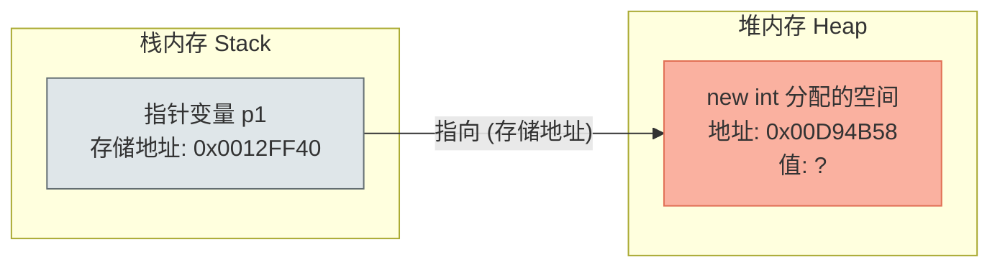
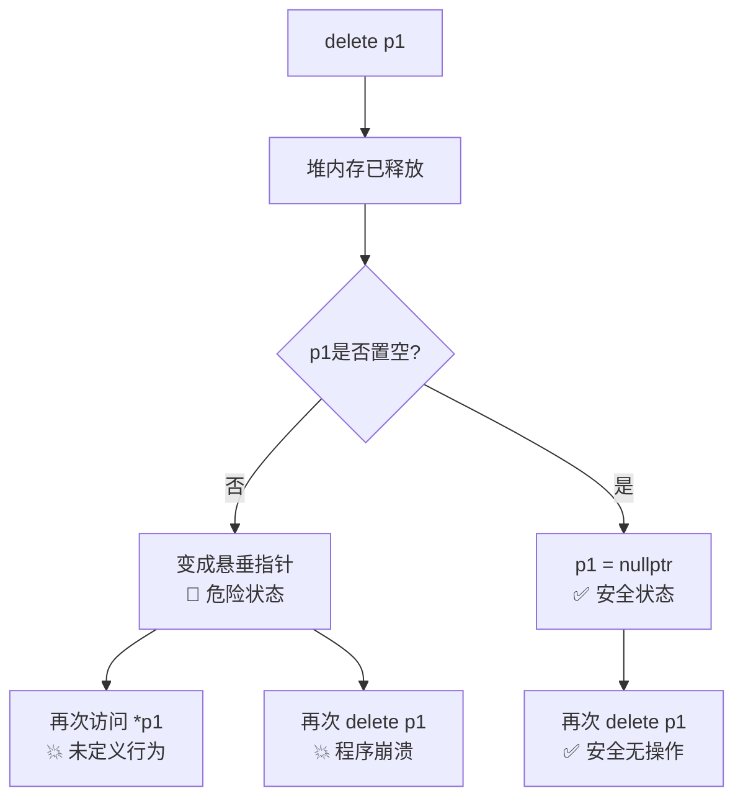

# 第一个指针程序 - C++内存管理入门实战

> [!abstract] 核心导言
> 指针是C++通往底层硬件的钥匙，也是内存管理的核心。本节通过第一个指针程序，深入剖析指针变量的存储位置、堆栈内存的区别、指针操作符的使用以及至关重要的内存回收机制。

---

## 一、指针的定义与内存申请

### 1. 指针变量的本质
指针不仅仅是一个地址，它是一个**变量**。
- **定义方式**：`int* p1;`
- **存储位置**：指针变量 `p1` 本身是一个局部变量，存储在<span style="color:#2ed573;">**栈区**</span>。当它超出作用域（如函数结束）时，变量 `p1` 占用的栈空间会自动释放。
- **类型约束**：`int*` 声明了这是一个“指向int类型”的指针。指针的类型决定了它对内存空间的“视角”和操作步长。

### 2. 动态内存申请
通过 `new` 关键字，我们在<span style="color:#ff4757;">**堆区**</span>开辟了一块新的内存空间。
```cpp
int* p1 = new int; // 在堆中申请4字节空间，并将首地址赋给p1
```
- **地址赋值**：`p1` 的值是堆中那块内存的首地址。
- **生命周期**：堆内存不会自动释放，必须手动管理。

### 3. 内存布局图解
理解指针与内存的关系，关键是区分“指针变量本身”和“指向的空间”。



---

## 二、指针操作符详解：`*` 与 `&`

### 1. 解引用操作符 `*`
`*` 在C++中有两种含义，初学者极易混淆：
1.  **定义时**：表示声明一个指针类型（如 `int* p`）。
2.  **使用时**：表示<span style="color:#ff4757;">**解引用**</span>，即访问指针指向的内存空间。

```cpp
*p1 = 101; // 将101写入p1指向的内存地址
```
> [!tip] 理解技巧
> 把 `*p1` 看作一个普通的 `int` 变量来操作即可。`*p1` 等同于那个“隐形的int变量”。

### 2. 取地址操作符 `&`
`&` 用于获取变量在内存中的实际位置。
```cpp
int i = 10;
int* p2 = &i; // p2现在指向栈变量i的地址
*p2 = 102;    // 通过指针修改栈变量i的值
```
- **效果**：此时 `i` 的值变为 `102`。指针提供了一种“绕过变量名直接操作内存”的能力。[1](@context-ref?id=0)[](@image-ref?id=0)

---

## 三、指针的大小与寻址能力

使用 `sizeof` 测量指针时，结果与指向的数据类型无关，而与操作系统架构有关。

| 测试代码 | 32位系统 (x86) | 64位系统 (x64) | 含义 |
| :--- | :--- | :--- | :--- |
| `sizeof(p1)` | <span style="color:#ff4757;">4 字节</span> | <span style="color:#ff4757;">8 字节</span> | 指针变量本身大小（地址总线宽度） |
| `sizeof(*p1)` | <span style="color:#2ed573;">4 字节</span> | <span style="color:#2ed573;">4 字节</span> | 指向空间的数据大小 |

> [!info] 原理扩展
> 指针的大小反映了CPU的寻址能力。32位系统的地址空间是 $2^{32}$，正好需要4字节来存储；64位系统则需8字节。[1](@context-ref?id=1)

---

## 四、内存释放与悬垂指针

### 1. `delete` 的正确使用
堆内存没有名字，只能通过指针“按图索骥”来释放。
```cpp
delete p1; // 释放p1指向的堆内存
```
- **危险操作**：`delete` 后，堆内存归还给系统，但指针变量 `p1` 仍然在栈中，且依然保存着那块内存的地址。

### 2. 悬垂指针
释放后未置空的指针称为<span style="color:#ff4757;">悬垂指针</span>。
- **风险**：再次访问 `*p1` 可能导致程序崩溃或读取到脏数据。
- **重复释放**：对同一地址执行两次 `delete` 必定导致崩溃。



---

## 五、空指针与安全编程规范

### 1. 空指针初始化
为了防止误操作，释放内存后应立即将指针置空。
```cpp
delete p1;
p1 = nullptr; // C++11标准写法
```

### 2. `nullptr` 的优势
在C++11之前，常使用 `NULL` 或 `0`。
- **`NULL`**：本质是宏定义 `0`，在某些函数重载场景下可能与整型 `0` 混淆。
- **`nullptr`**：专门表示空指针的字面量，具有明确的类型（`std::nullptr_t`），类型安全。

### 3. 防御性编程习惯
良好的编码习惯是在使用指针前进行检查：
```cpp
if (p1 != nullptr) {
    *p1 = 20; // 只有指针有效才进行操作
}
```
> [!warning] 工程实践铁律
> **谁申请，谁释放**。如果代码逻辑复杂，建议配合智能指针自动管理生命周期。

---

## 六、知识全景小结

| 知识维度 | 核心内容 | ⚠️ 易混淆/考点 | 难度 |
| :--- | :--- | :--- | :--- |
| **指针定义** | `int* p` 定义指针，变量本身在栈中 [1](@context-ref?id=2)| <span style="color:#ff4757;">指针变量 vs 指向空间</span> | ⭐⭐ |
| **内存申请** | `new` 在堆中分配，返回首地址 | 堆内存需手动释放，栈内存自动释放 | ⭐⭐⭐ |
| **操作符** | `*` 解引用，`&` 取地址 | `*` 在定义时与使用时的含义区别 | ⭐⭐⭐ |
| **指针大小** | 32位系统4字节，64位系统8字节 | 指针大小与指向类型无关（如 `char*` 也是8字节） | ⭐⭐ |
| **内存释放** | `delete` 释放堆内存 | <span style="color:#ff4757;">重复释放导致崩溃</span>，释放后需置空 | ⭐⭐⭐⭐ |
| **空指针** | `nullptr` (C++11) | `nullptr` 比 `NULL` 类型更安全 | ⭐⭐⭐ |
