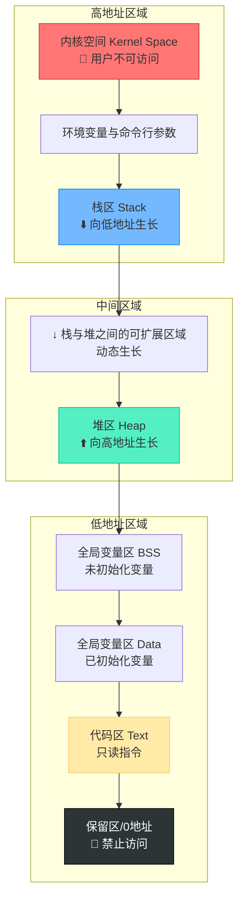

# 进程内存空间划分与底层原理深度解析

> [!abstract] 核心导言
> 理解进程的内存空间划分是掌握 C++ 内存管理的基石。程序并非杂乱无章地占用内存，而是被严格划分成代码区、数据区、堆区、栈区等不同区域。本节将深入剖析各区域的边界、增长方向及管理机制，助你建立严谨的内存空间模型。

---

## 一、进程内存全景图解

进程运行时，操作系统会为其分配独立的虚拟内存空间。虽然不同操作系统的具体布局略有差异，但核心区域相对固定。

### 1. 内存地址划分模型



### 2. 区域划分核心原则
- **固定性**：无论 32 位还是 64 位系统，核心区域（代码、数据、堆、栈）的职能固定不变。[1](@context-ref?id=0)
- **简化模型**：理解内存布局时，应忽略次要细节，聚焦于各区域的功能定位与生长方向。

---

## 二、核心内存区域详解

### 1. 内核空间
位于内存的最高地址区域，是操作系统的“禁地”。

| 特性 | 详细说明 |
| :--- | :--- |
| **权限** | <span style="color:#ff4757;">**用户程序不可访问**</span>，仅内核态可操作。 |
| **空间配额** | **Windows 32位**：内核占用 2GB，用户可用 2GB。<br>**Linux 32位**：内核占用 1GB，用户可用 3GB。 [1](@context-ref?id=1)|
| **扩展性** | 64 位系统下用户空间大幅扩展，几乎不再受 4GB 限制束缚。 |

> [!warning] 虚拟地址特性
> 我们在代码中看到的指针地址均为<span style="color:#ff4757;">**虚拟地址**</span>，需经操作系统通过 MMU（内存管理单元）映射到物理内存。这保证了进程间的内存隔离与安全。

### 2. 栈区
存放函数局部变量、函数参数的区域，具有“自动管理”特性。

- **生长方向**：<span style="color:#2ed573;">**由高地址向低地址生长**</span>（与堆相反）。
- **生命周期**：遵循 LIFO（后进先出）原则，变量出作用域（`}`）后自动清理。
- **典型场景**：
    ```cpp
    void func() {
        int a = 10; // 变量 a 存储在栈区
    } // 函数结束，a 自动释放
    ```

### 3. 堆区
动态分配内存的区域，是内存管理的“主战场”。

- **生长方向**：<span style="color:#2ed573;">**由低地址向高地址生长**</span>。
- **管理方式**：需程序员手动管理（`new`/`delete` 或 `malloc`/`free`）。
- **释放机制**：
    - `delete` 操作仅标记空间为“可用”，<span style="color:#ff4757;">**不会擦除原有数据**</span>（这也是野指针能读到脏数据的原因）。
    - 进程退出时，操作系统会回收所有映射关系，资源彻底归还系统。

> [!tip] 现代系统优化
> Win10 等新系统可能对堆栈区进行分块管理，以优化内存分配效率，但宏观逻辑模型不变。[1](@context-ref?id=2)

### 4. 全局变量区
存储全局变量与静态变量，根据初始化状态分为两段。

| 段名称 | 存储内容 | 特点 |
| :--- | :--- | :--- |
| **.data** | 已初始化且**非零**的全局/静态变量 | 占用磁盘空间，程序加载时直接加载。 |
| **.bss** | 未初始化或初始化为**零**的全局/静态变量 | 不占磁盘空间，加载时由内核清零。 |

> [!example] 实验验证
> 定义 `int g_a = 10;` (data段) 和 `int g_b;` (bss段)，打印地址可观察到它们位于相邻区域，但分属不同段。

### 5. 代码区
- **存储内容**：函数体的二进制机器码（包括类成员函数）。
- **只读属性**：只读不可修改，防止程序意外篡改指令。
- **执行逻辑**：CPU 从代码区按顺序取指令执行。

---

## 三、命令行参数与环境变量

- **位置**：位于栈区之上，紧邻内核空间。
- **加载时机**：进程启动时一次性加载。[1](@context-ref?id=3)
- **注意**：运行期间修改外部环境变量，<span style="color:#ff4757;">**不会影响**</span>已加载进进程内存空间的值，因为进程拥有独立的副本。[1](@context-ref?id=4)

---

## 四、知识全景小结

| 知识维度 | 核心内容 | ⚠️ 易混淆/考点 | 重要性 |
| :--- | :--- | :--- | :--- |
| **内存划分逻辑** | 32/64位布局有差，但核心区域固定 [1](@context-ref?id=5)| Windows 32位用户空间仅 2GB，Linux 有 3GB | ⭐⭐⭐⭐⭐ |
| **堆 vs 栈** | 堆向高生长(手动管)，栈向低生长(自动管) | <span style="color:#ff4757;">栈溢出</span>通常因递归太深或局部大对象导致 | ⭐⭐⭐⭐⭐ |
| **数据存储分区** | `.data` 存已初始化，`.bss` 存未初始化 | 未初始化全局变量自动赋零值，非随机值 | ⭐⭐⭐⭐ |
| **虚拟地址** | 指针指向虚拟地址，由 OS 映射物理内存 [1](@context-ref?id=6)| 多进程共享物理内存，但各自虚拟空间独立隔离 | ⭐⭐⭐⭐ |
| **释放机制** | `delete` 仅标记可用，不擦除数据 | 进程崩溃或退出时，OS 会自动回收所有资源 | ⭐⭐⭐⭐ |

> [!quote] 结语
> 内存地址划分不仅是理论概念，更是调试“栈溢出”、“野指针访问”等错误的地图。熟练掌握各区域的生长方向与权限属性，能让你在面对内存错误时，通过地址数值迅速定位问题区域！
