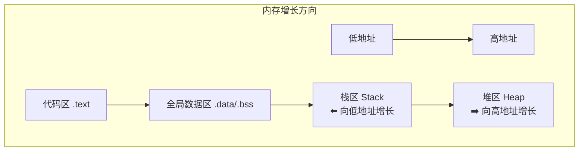

# 内存地址代码演示：实战验证五大内存区域

> [!abstract] 核心导言
> 纸上得来终觉浅，绝知此事要躬行。本节将通过实际的 C++ 代码，逐一打印并验证进程内存空间中各个关键区域的地址，直观揭示代码区、全局变量区、堆区和栈区的分布规律与增长方向，将抽象的理论转化为可视化的内存地图。

---

## 一、实验准备与代码框架

### 1. 基础代码结构
本次实验的核心是通过 `cout` 打印各类变量和函数的地址，观察其在内存空间中的分布。

```cpp
#include <iostream>
using namespace std;

// 全局变量声明区（将在下文展开）
// ...

int main(int argc, char* argv[]) {
    cout << "memory address! cppds.com" << endl;
    
    // 1. 打印代码区地址
    cout << "代码区 main = " << main << endl;
    
    // 2. 打印全局变量地址
    // ...
    
    // 3. 打印堆空间地址
    // ...
    
    // 4. 打印栈空间地址
    // ...
    
    return 0;
}
```

> [!tip] 实验目标
> 通过地址数值的高低，判断变量所属的内存区域，并验证堆栈的生长方向。

---

## 二、代码区：程序的起点

### 1. 获取代码区地址
代码区（`.text` 段）存放着函数体的二进制指令。获取其地址的方法非常简单：直接打印函数名。
```cpp
cout << "代码区 main = " << main << endl;
```
- **输出示例**：`00AF1339`
- **解读**：这个十六进制地址就是 `main` 函数在代码区的起始位置。它是整个程序执行的入口点。

### 2. 代码区特性
- **只读属性**：该区域内存页被标记为只读，任何写入操作都会引发段错误（Segmentation Fault）。
- **地址低位**：代码区通常位于进程内存空间的**低地址**区域。

---

## 三、全局/静态变量区：数据的家园

全局变量根据其初始化状态，被编译器安排到不同的子区域。

### 1. 未初始化的全局变量 (`.bss` 段)
```cpp
int g1; // 未初始化
int g2 = 0; // 初始化为0
```
- **打印地址**：
    ```cpp
    cout << "未初始化 g1 = " << &g1 << endl; // 示例：012BC148
    cout << "初始化为0 g2 = " << &g2 << endl; // 示例：012BC14C
    ```
- **核心发现**：
    1.  `g1` 和 `g2` 的地址**连续递增**（`148` -> `14C`，相差4字节，正是一个 `int` 的大小）。[1](@context-ref?id=0)
    2.  它们同属于 **`.bss` 段**，该段在程序加载时由系统统一初始化为零。

### 2. 已初始化的全局变量 (`.data` 段)
```cpp
int g3 = 1; // 初始化为非零值
int g4 = 2;
```
- **打印地址**：
    ```cpp
    cout << "初始化为1 g3 = " << &g3 << endl; // 示例：012BC008
    cout << "初始化为2 g4 = " << &g4 << endl; // 示例：012BC00C
    ```
- **核心发现**：
    1.  `g3` 和 `g4` 的地址也连续递增（`008` -> `00C`）。
    2.  但它们的地址（`012BC008`）与 `.bss` 段的变量（`012BC148`）**不连续**，中间存在明显间隔。这证明了 `.data` 段和 `.bss` 段是内存中两个独立的区域。

### 3. 静态变量
静态变量（无论是全局静态还是局部静态）的生命周期贯穿整个程序，其存储位置与全局变量类似。
```cpp
static int sg1 = 3; // 静态全局变量
void func() {
    static int s1 = 5; // 静态局部变量
    cout << "静态局部 s1 = " << &s1 << endl;
}
```
- **打印地址**：
    ```cpp
    cout << "静态全局 sg1 = " << &sg1 << endl; // 示例：0093C03C
    // 在func()中打印s1地址
    ```
- **核心发现**：
    静态全局变量 `sg1` 的地址与普通全局变量 `g3`、`g4` 的地址**连续或邻近**，表明它们被分配在同一片全局数据区域。[1](@context-ref?id=1)[](@image-ref?id=1)

---

## 四、堆区与栈区：动态与自动的博弈

### 1. 堆区：手动管理的王国
堆区用于动态内存分配，地址向**高地址**方向增长。[1](@context-ref?id=2)
```cpp
int* p1 = new int;
int* p2 = new int;
cout << "堆空间地址 p1 = " << p1 << endl; // 示例：00825108
cout << "堆空间地址 p2 = " << p2 << endl; // 示例：00825168
```
- **核心发现**：
    1.  `p2` 的地址 (`00825168`) 高于 `p1` 的地址 (`00825108`)，验证了堆的**向上增长**。[1](@context-ref?id=3)
    2.  `p1` 和 `p2` 是指针**变量**，它们本身存储在栈区。`&p1` 才是它们在栈中的地址。[1](@context-ref?id=4)

### 2. 栈区：自动管理的领地
栈区用于局部变量，地址向**低地址**方向增长。
```cpp
int i1 = 100;
int i2 = 101;
cout << "栈空间地址 i1 = " << &i1 << endl; // 示例：004FF884
cout << "栈空间地址 i2 = " << &i2 << endl; // 示例：004FF878
```
- **核心发现**：
    1.  `i2` 的地址 (`004FF878`) 低于 `i1` 的地址 (`004FF884`)，验证了栈的**向下增长**。
    2.  指针变量 `p1`, `p2` 本身也在栈中，因此 `&p1` 的地址也会符合栈的增长规律。



---

## 五、知识全景小结

| 知识点 | 核心内容 | ⚠️ 易混淆/考点 | 难度 |
| :--- | :--- | :--- | :--- |
| **代码区** | 打印函数名(`main`)获地址，位于低地址，只读 | 函数指针与函数调用符`()`的区别 | ⭐⭐ |
| **全局变量区** | 分`.data`(已初始化)和`.bss`(未初始化/零初始化)段 | <span style="color:#ff4757;">`int g;` 默认值为0，属`.bss`段</span> | ⭐⭐⭐ |
| **静态变量** | 静态全局/局部变量存储位置与全局变量相同 | 静态局部变量地址在首次调用后固定，非每次函数调用都变 | ⭐⭐⭐ |
| **堆区** | `new`分配，地址递增，需手动`delete` | <span style="color:#ff4757;">`p`是指向堆的地址，`&p`是指针变量在栈中的地址</span> | ⭐⭐⭐⭐ |
| **栈区** | 局部变量，地址递减，自动管理 | 栈帧结构与函数调用链对地址的影响 | ⭐⭐⭐⭐ |
| **指针双重身份** | 指针既是栈变量(有`&p`)，又持有堆地址(值`p`) | 深刻理解这一层是掌握指针内存模型的关键 | ⭐⭐⭐⭐⭐ |

> [!success] 实验启示
> 运行上述代码，你的屏幕上将呈现一幅生动的“内存地图”。请仔细观察：
> 1.  代码区地址是否最低？
> 2.  全局变量地址是否集中在中部？
> 3.  堆地址是否普遍高于栈地址？（由于ASLR等因素，每次运行可能不同，但堆栈的相对增长方向不变）
> 亲手实践并分析结果，是巩固内存布局知识最有效的方式。
