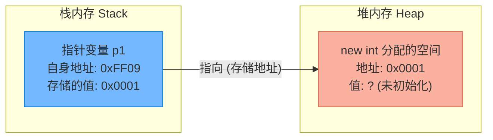
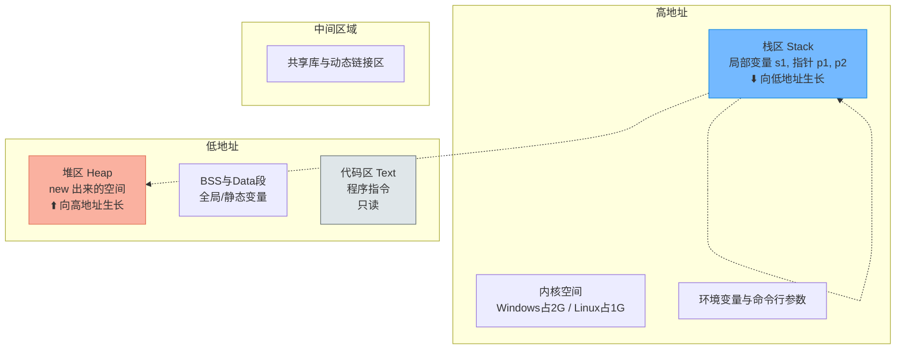

# 图解堆栈空间分配与指针代码实战

> [!abstract] 核心导言
> 指针不仅是地址，更是连接不同内存区域（堆与栈）的桥梁。本节通过图解与代码的对照，深度剖析指针变量本身的存储、指针指向的空间分配，以及通过指针跨越堆栈修改数据的底层逻辑，帮助初学者建立清晰、立体的内存模型。

---

## 一、内存空间的指针映射

理解指针的第一步，是明确“指针变量”与“指向的空间”在物理内存上是分离的。

### 1. 堆区分配与栈区指针
以最基础的动态分配为例：
```cpp
int* p1 = new int; // 在堆区申请4字节空间
```

这条短短的代码，实际上在内存中完成了两个动作：
1. **堆区开辟**：`new int` 在堆区中找到了一块 4 字节的空闲内存（假设地址为 `0x0001`）。
2. **栈区存储**：指针变量 `p1` 本身是一个局部变量，存储在栈区（假设地址为 `0xFF09`，占用 8 字节），它的**值**就是那块堆内存的地址 `0x0001`。[1](@context-ref?id=0)[](@image-ref?id=0)



> [!danger] 危险操作：未初始化的解引用
> 堆内存分配后，如果不进行赋值就直接读取（如 `cout << *p1`），得到的是<span style="color:#ff4757;">**未定义的脏数据**</span>（上次程序遗留的残值）。这往往是难以追踪的Bug源头，务必做到`new`后即赋值。

---

## 二、数据的三大核心属性

在C++中，理解任何一个数据，都必须建立三维视角：

| 属性 | 含义 | 代码体现 | 示例解析 |
| :--- | :--- | :--- | :--- |
| **存储位置** | 数据存放在内存的哪个区域？ | 取地址 `&` | `&p1` 得到栈地址，`p1` 得到堆地址 |
| **值是多少** | 该内存空间里实际装的是什么？ | 直接读取或解引用 | `p1` 的值是 `0x0001`，`*p1` 的值是数据本身 |
| **数据类型** | 如何解释这块二进制数据？ | 类型声明 | `int*` 决定了 `*p1` 按4字节整数解释 |

---

## 三、指针赋值与解引用机制

### 1. 修改堆区数据
通过解引用操作符 `*`，我们可以越过变量名，直接对内存地址写入数据：
```cpp
*p1 = 10; // 将10写入 p1 所指向的堆区地址 (0x0001)
```
此时，堆区 `0x0001` 处的值从 `?` 变成了 `10`。[1](@context-ref?id=1)

### 2. 类型匹配的威力
指针的类型不仅决定了步长，更决定了解引用时的**内存解释方式**。[1](@context-ref?id=2)
- 如果是 `int*`，解引用时读取 4 字节并按补码整数解释。
- 如果是 `float*`，同样读取 4 字节，却按 IEEE 754 浮点标准解释。
<span style="color:#ff4757;">**类型不匹配的强转解引用，是极其危险的未定义行为！**</span>

---

## 四、指针关联栈变量：跨界操作

指针不仅能指向堆区，更能指向栈区的变量。这是理解指针通用性的关键。

### 1. 栈变量声明
```cpp
int s1 = 11; // 直接在栈区开辟4字节，地址假设为 0xFF05，初始值为11
```

### 2. 指针关联与间接修改
```cpp
int* p2 = &s1; // p2 存储了 s1 的栈地址 (0xFF05)
*p2 = 12;      // 通过解引用，修改栈变量 s1 的值
```

执行 `*p2 = 12` 后，`s1` 的值变成了 12。我们通过指针 `p2`，实现了对栈变量的“越权”修改。[1](@context-ref?id=3)

```mermaid
graph LR
    subgraph 栈内存 Stack
        A["指针变量 p2<br/>自身地址: 0xFF01<br/>存储的值: 0xFF05"]
        B["局部变量 s1<br/>自身地址: 0xFF05<br/>初始值: 11 ➡️ 变为 12"]
    end
    
    A -- "&s1 取地址" --> B
    A -- "*p2 解引用写入" -.-> B
    
    style A fill:#74b9ff,stroke:#0984e3
    style B fill:#55efc4,stroke:#00b894
```

> [!warning] 作用域生命周期的雷区
> 虽然指针可以指向栈变量，但如果函数结束导致栈变量 `s1` 被系统回收，此时指针 `p2` 就变成了<span style="color:#ff4757;">**悬垂指针**</span>。再次通过 `p2` 访问该地址，属于严重的未定义行为！

---

## 五、内存布局全景回顾

结合之前的内存空间划分，我们来看看代码、堆、栈的宏观分布：



**核心差异总结**：
- **堆区**：随机游走，需手动 `new/delete`，生命周期跨越函数。[1](@context-ref?id=4)
- **栈区**：后进先出，自动分配释放，生命周期局限于作用域。

---

## 六、知识全景小结

| 知识点 | 核心内容 | ⚠️ 关键操作/易考点 | 内存管理重点 |
| :--- | :--- | :--- | :--- |
| **堆栈分配** | `int* p1 = new int` | 指针在栈，指向在堆 | <span style="color:#ff4757;">未初始化的堆内存值不确定</span> |
| **指针赋值** | `*p1 = 10` | 通过解引用修改堆区地址的值 | 必须确保指针有效指向合法内存 |
| **栈变量声明** | `int s1 = 11` | 在栈区直接分配4字节存储整数 | 由系统自动管理内存的分配与释放 |
| **指针引用栈** | `int* p2 = &s1` | 指针 `p2` 存储栈变量 `s1` 的地址 [1](@context-ref?id=5)| 通过指针修改栈变量，需警惕作用域过期 |
| **数据三属性** | 位置、值、类型 | 类型决定了解释二进制的方式 | 类型不匹配的强转极其危险 |

> [!quote] 结语
> 指针是 C++ 赋予开发者的上帝之手，它无视变量名的壁垒，直接在内存地址上进行读写。但随之而来的是极高的风险。深刻理解堆栈的分离、指针的跨界，以及初始化的重要性，是你迈向高阶 C++ 开发者的必经之路。
