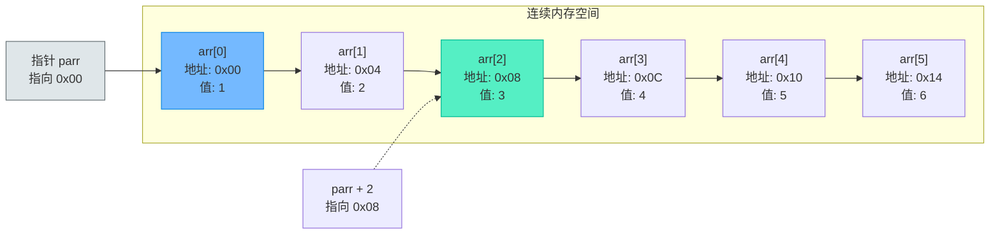
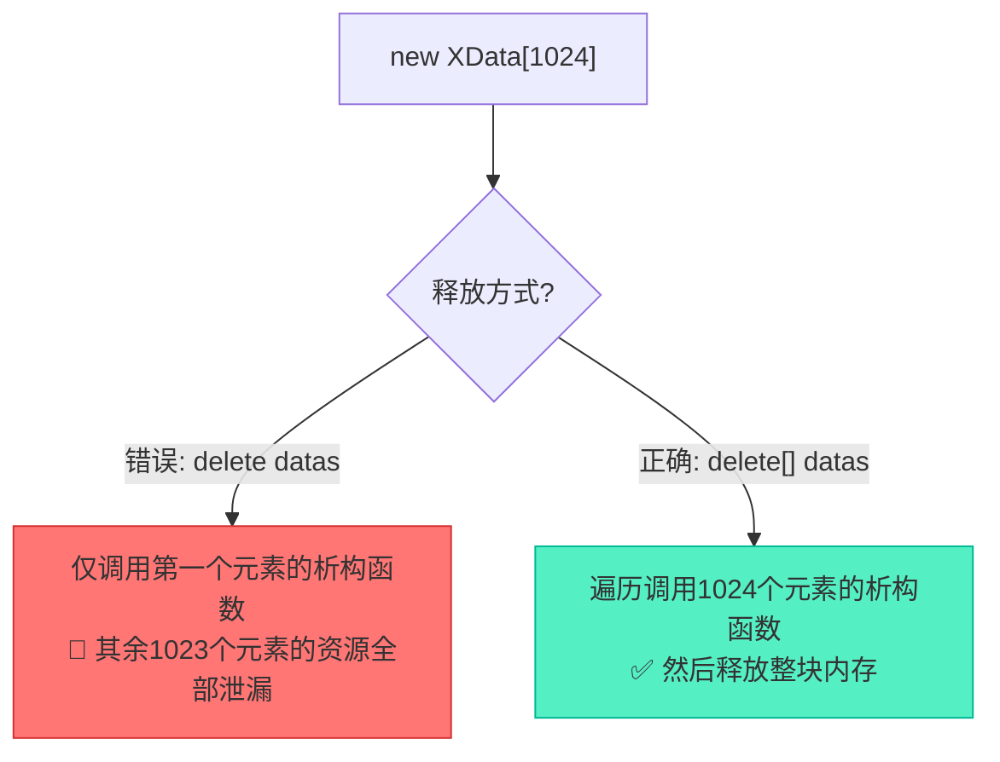
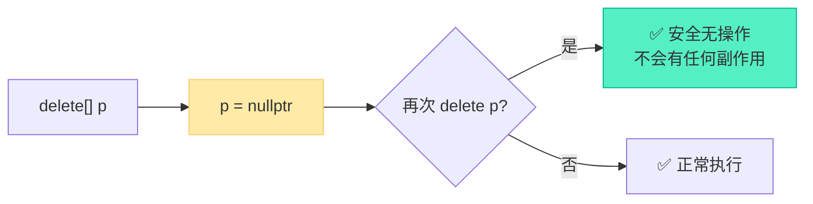

# 数组的堆栈空间初始化与C++11范围for遍历

> [!abstract] 核心导言
> 数组是C++中最基础且使用频率极高的数据结构，其核心特性在于内存的连续性与类型的同一性。本节将深入对比栈数组与堆数组在生命周期、初始化方式、容量获取上的根本差异，剖析指针运算的底层逻辑，并着重强调动态数组的释放规范与防御性编程技巧。

---

## 一、数组的本质与内存模型

### 1. 核心定义
数组是具有**顺序关系**的若干**相同类型变量**的集合体。
- **类型严格**：C++数组只能存储相同类型的数据，这与Python等动态语言有本质区别。
- **内存连续**：数组在内存中占据一片连续的空间，这是指针算术运算的基础。

### 2. 指针关联与退化
数组名在大多数表达式中会**隐式退化**为指向首元素的指针。
```cpp
int arr[6] = {1, 2, 3, 4, 5, 6};
int* parr = arr; // arr 退化为 &arr
```

### 3. 内存布局与指针运算图解
指针的加法并非简单的地址数值相加，而是基于所指类型的**步长**偏移。



> [!info] 步长计算
> `parr + 2` 实际跨越的字节数 = `2 * sizeof(int)` = 8字节。因此 `*(parr + 2)` 等价于 `arr[2]`。

---

## 二、栈数组的初始化规范

栈数组的大小必须在**编译期**确定，其生命周期受作用域限制，出作用域自动析构。

### 1. 各种初始化方式对比

| 初始化方式 | 代码示例 | 核心说明 | 安全性 |
| :--- | :--- | :--- | :--- |
| **未初始化** | `int arr[10];` | 内容是栈帧残留的<span style="color:#ff4757;">脏数据</span>，极不安全 | ❌ 危险 |
| **手动置零** | `memset(arr, 0, sizeof(arr));` | 使用 `<cstring>` 库按字节清零 | ✅ 安全 |
| **完整初始化** | `int arr[5] = {1,2,3,4,5};` | 逐一赋值 | ✅ 安全 |
| **部分初始化** | `int arr[32] = {1,2,3};` | 未指定部分<span style="color:#2ed573;">自动补零</span> | ✅ 安全 |
| **全零初始化** | `int arr[1024] = {0};` | 简洁的全零写法，推荐 | ✅ 安全 |
| **自动推导** | `int arr[] = {1,2,3,4};` | 编译器根据列表推导数组大小为4 | ✅ 安全 |

### 2. 字符串数组的隐藏陷阱
字符数组使用字符串常量初始化时，会在末尾自动追加 `\0`。
```cpp
char str1[] = "test001"; 
cout << sizeof(str1) << endl; // 输出 8，而非 7！
```
> [!warning] 计算偏移需注意
> `sizeof(str1)` 包含了不可见的结束符 `\0`，在进行内存拷贝或指针偏移时需预留此空间。

---

## 三、堆数组的动态分配与致命陷阱

堆数组的大小可在**运行时**确定，生命周期由程序员全权掌控。

### 1. 动态分配与类型选择
```cpp
int size = 2048;
int* parr1 = new int[1024];                    // 固定大小分配
auto parr2 = new unsigned char[size];           // 运行时大小，推荐用auto推导
```
- **二进制数据处理**：处理网络包、图像原始数据时，强烈建议使用 `unsigned char`，避免有符号字符的符号位扩展干扰。[1](@context-ref?id=0)

### 2. 堆数组的初始化
```cpp
// 方法1：memset 置零
memset(parr2, 0, size);                      // 按字节清零
memset(parr3, 0, size * sizeof(int));        // 注意要乘以元素类型大小！

// 方法2：C++11 列表初始化
int* parr4 = new int[3]{1, 2, 3};            // 分配并初始化
int* parr5 = new int[10]{};                  // C++11 全零初始化语法
```

### 3. 致命陷阱：`sizeof` 失效
这是初学者最常犯的错误：<span style="color:#ff4757;">**对堆数组指针使用 `sizeof` 无法获取数组总大小！**</span>
```cpp
int* parr3 = new int[2048];
cout << sizeof(parr3) << endl; // 输出 8 (64位系统下指针本身的大小)
```
> [!danger] 核心法则
> `sizeof(指针)` 只能返回指针变量本身的尺寸（4或8字节）。堆数组的大小必须由程序员**额外使用变量记录**（如 `size`）。[1](@context-ref?id=1)

---

## 四、数组访问与C++11范围for

### 1. 访问方式等价性
下标访问与指针算术访问在底层是等价的：
```cpp
cout << parr5[2] << endl;      // 下标访问
cout << *(parr5 + 3) << endl;  // 指针算术访问
```

### 2. C++11 范围for的限制
范围 `for` 循环（`for (auto s : container)`）带来了极大的便利，但存在严格的适用边界：
- **✅ 栈数组支持**：编译器已知数组大小，能正确生成 `std::begin` 和 `std::end`。
- **✅ STL容器支持**：如 `std::vector`，内部封装了迭代器。
- **❌ 堆数组不支持**：仅有一个指针，编译器无法推断数组的结束边界。

```cpp
for (auto s : str1) { /* OK */ }      // 栈数组可用
// for (auto s : parr2) { /* 错误! */ } // 堆数组不可用
```

---

## 五、堆数组释放与防御性编程铁律

堆内存的释放是C++内存管理的重灾区，必须严格遵守规范。

### 1. `delete[]` 语法的不可妥协
释放堆数组必须使用 `delete[]`，绝不能用 `delete`。[1](@context-ref?id=2)



> [!warning] 侥幸心理要不得
> 对于基本类型（如 `int`），某些编译器下用 `delete` 释放数组可能不会立刻崩溃，因为没有复杂的析构函数。但这属于**未定义行为**，且对于自定义类类型必将引发严重的内存泄漏。必须养成一律使用 `delete[]` 的肌肉记忆！

### 2. 指针置空：双重保障
释放内存后，必须立即将指针置空，这是防御性编程的基石。

```cpp
delete[] parr1;
parr1 = nullptr; // C++11 推荐使用 nullptr 代替 NULL 或 0

delete[] parr2;
parr2 = nullptr;
```

**置空的两大意义**：
1. **防止悬垂指针误用**：释放后若再次访问 `*parr1`，nullptr 会引发明确的段错误，而不是读取难以追踪的脏数据。
2. **防止重复释放崩溃**：`delete` 或 `delete[]` 一个 `nullptr` 是合法的空操作，绝对安全。



---

## 六、知识全景小结

| 知识点            | 核心内容                                               | ⚠️ 考试重点/易混淆点                                                    | 难度系数  |
| :------------- | :------------------------------------------------- | :-------------------------------------------------------------- | :---- |
| **数组基础**       | 连续内存、同类元素、顺序存储                                     | 数组名退化为首元素指针的机制                                                  | ⭐⭐    |
| **栈数组初始化**     | `{}`初始化、部分初始化自动补零                                  | <span style="color:#ff4757;">未初始化栈数组的值是未定义的脏数据</span>           | ⭐⭐⭐   |
| **堆数组分配**      | 运行时动态大小、`auto`推导                                   | <span style="color:#ff4757;">`sizeof(堆指针)` 只返回指针大小，非数组大小</span> | ⭐⭐⭐⭐  |
| **指针操作**       | `*(p+n)` 按类型步长偏移                                   | 二进制数据必须用 `unsigned char`                                        | ⭐⭐⭐   |
| **C++11范围for** | 依赖 `begin/end`，仅支持栈数组/STL                          | <span style="color:#ff4757;">堆数组无法直接使用范围for</span>              | ⭐⭐⭐   |
| **内存释放规范**     | `delete[]` 释放、立即置 `nullptr` [1](@context-ref?id=3) | 类对象数组不加 `[]` 导致析构不全泄漏 [1](@context-ref?id=4)                    | ⭐⭐⭐⭐⭐ |
| **字符串特例**      | `char[] = "..."` 包含 `\0`                           | `sizeof` 计算比可见字符多1字节                                            | ⭐⭐⭐   |

> [!quote] 结语
> 数组与指针的纠缠是C++的精髓所在。牢记“栈管大小自动清，堆记尺寸手动收；释放必加方括号，指针置空保平安”，便能在内存管理的泥沼中游刃有余。
