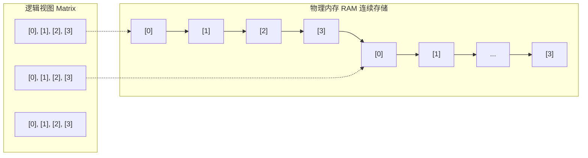

# 图解栈中二维数组的初始化与遍历深度解析

> [!abstract] 核心导言
> 多维数组是C++处理矩阵运算、图像像素和加密算法常量的基石。初学者常困惑于其逻辑上的二维形态与物理上的一维内存映射之间的矛盾。本节将图解二维数组的内存连续性（行优先机制），详解各种初始化陷阱、维度计算公式，以及现代C++的遍历与格式化输出技巧。

---

## 一、逻辑与物理：二维数组的内存真相

### 1. 逻辑定义与矩阵表示
二维数组在逻辑上表现为矩阵（表格）：
- **第一个维度**：表示高度（行数）
- **第二个维度**：表示宽度（列数）

```cpp
unsigned char arr[4]; // 3行4列的矩阵
```

### 2. 物理内存的连续性（行优先）
关键认知：<span style="color:#ff4757;">**C++的多维数组在物理内存中绝对是连续存储的，不存在真正的“二维”空间。**</span>
元素按照**行优先**顺序紧密排列：先存完第0行的所有列，再紧接着存第1行。



> [!info] 寻址公式
> `arr[i][j]` 的物理地址等价于 `*(&arr[0] + i * 列数 + j)`。这就是为什么定义二维数组时，**列数（第二维度）绝不能省略**——编译器需要列数来计算偏移步长！[1](@context-ref?id=1)[](@image-ref?id=1)

---

## 二、初始化规范与避坑指南

### 1. 嵌套大括号初始化（最直观）
```cpp
unsigned char arr[4] = {
    {1, 2, 3, 4},     // 第0行
    {11, 22, 33, 44}, // 第1行
    {5, 6, 7, 8}      // 第2行
};
```

### 2. 栈数组的未初始化陷阱
与一维数组一样，未初始化的栈二维数组充满脏数据。
```cpp
int arr1[10]; // 危险！内容不确定
memset(arr1, 0, sizeof(arr1)); // 推荐做法：整体清零
```

### 3. 部分初始化与自动补零
如果提供的初始值不足，剩余部分<span style="color:#2ed573;">自动补零</span>。
```cpp
int arr2[4] = {
    {1, 2},       // 等价于 {1, 2, 0, 0}
    {11},         // 等价于 {11, 0, 0, 0}
    {5, 6, 7}     // 等价于 {5, 6, 7, 0}
};
```

### 4. 省略第一维（自动推导行数）
编译器可以根据初始值列表自动推导行数，但<span style="color:#ff4757;">**只有第一维可以省略**</span>。
```cpp
int arr3[][4] = {{1,2,3,4}, {5,6,7,8}}; // 编译器推导为 2行4列
// int arr4[] = {...}; // 错误！第二维度绝不可省略
```

> [!warning] 三维数组声明规则
> 对于更高维度（如 `int arr4[][4]`），同样只有第一维可省略，后面的维度必须显式给出，以确保寻址公式完整。[1](@context-ref?id=2)

---

## 三、sizeof 与维度计算公式

利用 `sizeof` 可以在编译期精确计算数组的各种维度大小，这是实现灵活遍历的基础。

### 1. 计算总字节数
`sizeof` 返回整个数组占用的连续内存字节数。
```cpp
unsigned char arr2[3] = {...};
cout << sizeof(arr2); // 输出：9 (3 * 3 * 1字节)
```

### 2. 动态计算行列数（万能公式）
在编写通用函数时，常常需要根据总大小反推行列数：

| 目标 | 公式 | 原理 |
| :--- | :--- | :--- |
| **总元素数** | `sizeof(arr) / sizeof(arr[0](@ref)` | 总字节 / 单个元素字节 |
| **列数** | `sizeof(arr[0](@ref) / sizeof(arr[0](@ref)` | 一行总字节 / 单个元素字节 |
| **行数** | `sizeof(arr) / sizeof(arr[0](@ref)` | 总字节 / 一行总字节 |

> [!tip] 类型安全提示
> 对于 `int` 或自定义类型数组，切勿手动硬编码除以 `4` 或 `8`，务必使用 `sizeof(类型)` 或 `sizeof(元素)`，以保证跨平台和可维护性。

---

## 四、遍历的艺术：从传统到现代

### 1. C++11 范围 for 循环（推荐用于只读或整体修改）
语法简洁，无需手动计算边界。
```cpp
for (auto& row : arr2) {          // 外层获取每一行（必须用引用，防退化）
    for (auto val : row) {        // 内层遍历行内元素
        cout << static_cast<int>(val) << " ";
    }
    cout << endl;
}
```
> [!danger] 退化陷阱
> 外层循环**必须使用引用 `&`**（如 `auto& row`）。如果写成 `for (auto row : arr2)`，数组行会退化为指针，导致内层循环无法编译！

### 2. 下标直接访问（适用于需索引逻辑的场景）
当需要知道当前具体的 `i, j` 坐标时（如矩阵转置、图像卷积），传统双重循环依然是首选。
```cpp
#define COL_SIZE 4 // 常量表达式确保类型安全

int height = sizeof(arr2) / (COL_SIZE * sizeof(unsigned char));
int width = COL_SIZE;

for (int i = 0; i < height; i++) {
    for (int j = 0; j < width; j++) {
        arr2[i][j]++; // 直接通过坐标修改值
        cout << static_cast<int>(arr2[i][j]) << " " << flush;
    }
    cout << endl;
}
```

---

## 五、格式化输出的关键细节

在处理 `unsigned char` 或 `char` 类型的数值数组时，直接输出会遇到大坑。

### 1. 为什么要用 `static_cast<int>`？
`cout` 默认将 `char` 族变量当作**字符**输出，而非数字。
```cpp
unsigned char val = 65;
cout << val;              // 输出字母 'A'，而非 65
cout << static_cast<int>(val); // 输出数字 65 ✅
```

### 2. `flush` 的作用
`flush` 强制清空输出缓冲区，立即将内容显示到屏幕上。在密集循环输出或实时监控进度时非常有用，防止程序崩溃时丢失最后的输出信息。

---

## 六、知识全景小结

| 知识点 | 核心内容 | ⚠️ 易混淆/考点 | 难度系数 |
| :--- | :--- | :--- | :--- |
| **内存模型** | 逻辑二维，物理一维连续，行优先 | <span style="color:#ff4757;">`arr[i][j]` 等价于 `*(base + i*cols + j)`</span> [1](@context-ref?id=3)| ⭐⭐⭐⭐ |
| **初始化** | 嵌套 `{}`，部分初始化补零 | 只有第一维可省略，后续维度必须声明 [1](@context-ref?id=4)| ⭐⭐⭐ |
| **sizeof计算** | 编译期确定总大小，绝不退化为指针 | <span style="color:#ff4757;">行数 = `sizeof(arr)/sizeof(arr[0](@ref)`</span> | ⭐⭐⭐⭐ |
| **范围for遍历** | 外层必须用引用 `auto&` 防退化 | 内层范围遍历基于外层推导出的行视图 | ⭐⭐⭐ |
| **下标遍历** | 配合宏或 `constexpr` 确保宽度安全 | 适用于需要坐标逻辑（如邻域操作）的场景 | ⭐⭐⭐ |
| **char型输出** | 必须强转 `static_cast<in
