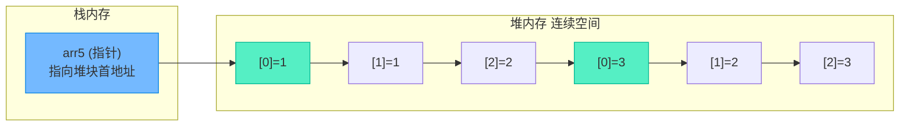
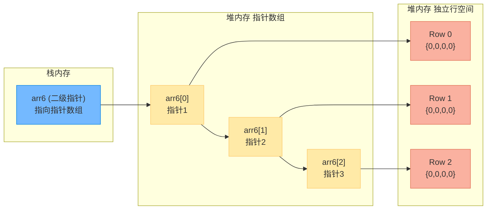
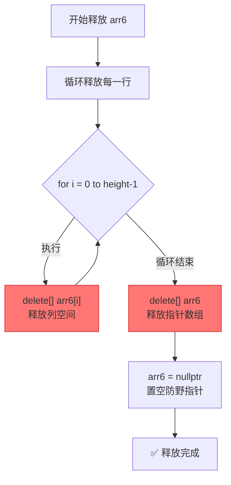

# 图解堆中二维数组的两种空间分配与清理机制

> [!abstract] 核心导言
> 在堆区动态创建二维数组是C++内存管理的进阶难点。与栈数组不同，堆二维数组存在两种截然不同的物理实现：**连续空间分配**与**不连续空间（指针数组）分配**。两者在语法声明、内存布局、缓存性能及释放逻辑上差异巨大。本节将图解这两种模型的底层映射，助你彻底避开二维数组动态管理的深坑。

---

## 一、前置回顾：栈中二维数组的连续性

在深入堆区之前，先明确栈中二维数组的物理形态：
```cpp
unsigned char arr[4] = {{1,2,3,4},{11,22,33,44},{5,6,7,8}};
```
- **逻辑视角**：3行4列的矩阵。
- **物理视角**：<span style="color:#2ed573;">绝对连续</span>的一维内存块，按行优先依次排列。
- **访问机制**：`arr[0]` 的寻址等价于 `*(基地址 + 1*4 + 0)`，完全依靠指针算术移位完成，无需中途解引用寻址。

---

## 二、堆中连续空间分配：纯正的原生数组

这种方式在堆上分配一块完整的连续内存，物理结构与栈二维数组完全一致。

### 1. 语法声明与深度解析
```cpp
int size = 2; // 行数可以是运行时变量
// 注意：列数 3 必须是编译期常量！
int(*arr5)[3] = new int[size][3]{{1,1,2}, {3,2,3}}; 
```

> [!warning] 易混淆声明辨析
> - `int(*arr)[3]`：**数组指针**。指明 `arr` 是一个指针，指向一个含3个 `int` 的数组。这是正确的二维数组声明方式。
> - `int* arr[3]`：**指针数组**。指明 `arr` 是一个数组，里面装了3个 `int*` 指针。这是不连续空间分配的第一步！

### 2. 内存布局模型
由于内存连续，它具备极好的<span style="color:#2ed573;">缓存友好性</span>（CPU Cache命中率高）。



### 3. 空间清理（单一释放）
由于是一块连续内存，只需一次 `delete[]` 即可彻底回收：
```cpp
delete[] arr5;
arr5 = nullptr; // 防御性置空
```

---

## 三、堆中不连续空间分配：指针数组模型

当行列数都需要在运行时动态确定，或需要实现“锯齿数组”（每行列数不同）时，必须采用此模型。

### 1. 分配步骤（两步走）
**第一步：创建行指针数组（搭骨架）**
```cpp
int height = 3;
int** arr6 = new int*[height]{0}; // 申请存放指针的数组
```

**第二步：为每行独立分配列空间（填血肉）**
```cpp
int width = 4;
for(int i = 0; i < height; i++) {
    arr6[i] = new int[width]{0}; // 每行独立申请，地址不一定连续！
}
```

### 2. 内存布局模型
内存不再连续，`arr6[1]` 的地址未必紧挨着 `arr6[0]`。访问 `arr6[i][j]` 需要两次解引用。



### 3. 空间清理（极其重要！）
这是内存泄漏的重灾区。必须<span style="color:#ff4757;">**逆向释放**</span>：先释放每一行的列空间（血肉），再释放行指针数组（骨架）。



> [!danger] 致命错误示范
> 如果直接执行 `delete[] arr6`，指针数组被销毁，但其指向的每一行列空间将永远无法找回，造成**严重的内存泄漏**！[1](@context-ref?id=0)

---

## 四、两种模型深度对比

| 对比维度 | 连续空间 `int(*arr)[N]` | 不连续空间 `int** arr` |
| :--- | :--- | :--- |
| **内存物理结构** | <span style="color:#2ed573;">一整块连续内存</span> | 碎片化，行与行分散 |
| **维度限制** | 列数 `N` 必须编译期常量 | 行列数均可是运行时变量 |
| **锯齿数组支持** | ❌ 不支持（每行必须等宽） | ✅ 支持（每行可分配不同宽度） |
| **缓存命中率** | 极高（缓存友好，顺序访问快） | 较低（指针跳跃，缓存易失效） |
| **释放复杂度** | 极低（一次 `delete[]`） | <span style="color:#ff4757;">极高（需双层循环逆向释放）</span> |
| **访问性能** | 单次乘加运算寻址 | 两次内存读取（读指针+读数据） |

---

## 五、知识全景小结

| 知识点 | 核心内容 | ⚠️ 考试重点/易混淆点 | 难度 |
| :--- | :--- | :--- | :--- |
| **连续空间声明** | `int(*arr)[N] = new int[M][N]` | <span style="color:#ff4757;">`int(*arr)[N]` 与 `int* arr[N]` 的本质区别</span> | ⭐⭐⭐⭐ |
| **连续空间特性** | 内存连续，缓存友好，一次释放 | 第二维度 `N` 必须在编译期确定 | ⭐⭐⭐ |
| **不连续空间步骤** | 先 `new int*[M]`，再循环 `new int[N]` | 支持“锯齿数组”，灵活但碎片化 | ⭐⭐⭐⭐ |
| **不连续空间释放** | 必须先循环 `delete[] arr[i]`，再 `delete[] arr` | <span style="color:#ff4757;">顺序反必泄漏</span>，遗漏子数组必泄漏 | ⭐⭐⭐⭐⭐ |
| **寻址差异** | 连续型靠指针算术移位 | 非连续型靠两次解引用寻址 | ⭐⭐⭐⭐ |
| **应用场景** | 图像矩阵、固定维度算法 | 动态稀疏矩阵、不等长字符串数组 | ⭐⭐⭐ |

> [!quote] 结语
> 动态二维数组是C++内存管理的试金石。连续分配像严密的军队方阵，高效但死板；非连续分配像游击小队，灵活但难以调度。理解内存的物理映射，掌握“先子后父”的释放铁律，你便真正掌握了堆二维数组的灵魂。
