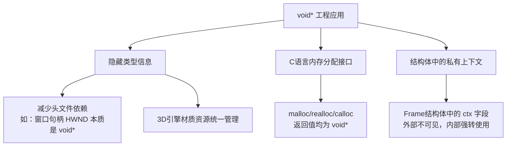
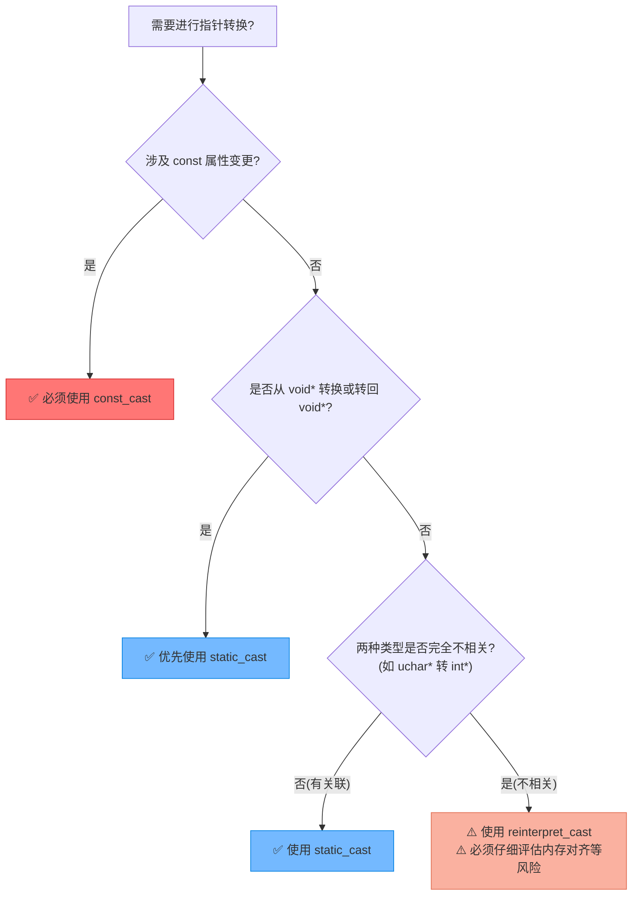

# void指针与C++11指针类型转换深度解析

> [!abstract] 核心导言
> `void*` 指针是C/C++中的“万能容器”，但它的无类型特性也带来了访问的不安全性。C++11引入了更严格的类型转换操作符，取代了粗暴的C风格强制转换。本节将深入剖析 `void*` 的工程应用场景，并重点讲解 `static_cast`、`const_cast` 和 `reinterpret_cast` 的核心机制与选择策略，助你写出类型安全、意图明确的现代C++代码。

---

## 一、void指针：万能的“无类型”桥梁

### 1. 本质与特性
`void*` 是一种无格式指针，可以接受任意数据类型的指针赋值，相当于C语言中的“不确定类型”指针。
- **可容纳**：`int*`、`char*`、甚至自定义类指针均可隐式转换为 `void*`。
- **不可直接访问**：<span style="color:#ff4757;">**严禁直接解引用 `void*`**</span>！必须先将其转换回具体的类型指针，编译器才知道该读取多少字节以及如何解释数据。

### 2. 工程应用场景
在大型工程中，`void*` 常用于实现类型擦除，隐藏底层实现细节。



**代码示例：结构体隐藏成员**
```cpp
struct Frame {
    void* ctx; // 不希望外部知道ctx的具体类型(可能是解码器上下文)
};
```

---

## 二、C++11现代类型转换：告别野蛮转换

C语言的强制转换 `((int*)ptr)` 简单粗暴，没有任何安全检查，极易引发崩溃。C++引入了三个具有明确语义和检查机制的转换操作符。

### 1. `static_cast`：安全与合规的守门员
用于具有逻辑关联的类型转换，在<span style="color:#2ed573;">**编译期**</span>进行类型安全检查。

**核心特性**：
- ✅ **支持**：`void*` 与具体类型指针的互相转换。
- ❌ **拒绝**：剥离 `const` 修饰符（破坏常量安全）。
- ❌ **拒绝**：不相关类型指针的转换（如 `unsigned char*` 转 `int*`）。

```cpp
int num = 1;
void* ptr = &num;

// 1. void* 转回 int* (安全，推荐)
int* ptr2 = static_cast<int*>(ptr); 

// 2. 尝试去掉 const (编译报错！)
const int* cptr1 = new int[1024];
// int* ptr4 = static_cast<int*>(cptr1); // ❌ 错误：无法去掉const

// 3. 尝试跨类型转换 (编译报错！)
unsigned char* ucptr = new unsigned char[1024];
// int* ptr5 = static_cast<int*>(ucptr); // ❌ 错误：类型不相关
```

### 2. `const_cast`：专破const的锁匠
<span style="color:#ff4757;">**唯一**</span>能够添加或移除 `const` 限定符的转换操作符。

**核心特性**：
- 专用于管理 `const` 属性，让程序员的意图非常明确。
- 如果原对象原本就是非 `const` 的，去除 `const` 后修改是安全的。
- 如果原对象本身就是 `const` 的，去除 `const` 后修改会导致<span style="color:#ff4757;">**未定义行为**</span>。

```cpp
const int* cptr1 = new int[1024];

// C风格强行剥离：(int*)(cptr1) - 无检查，极其危险
// C++专用剥离：
int* ptr6 = const_cast<int*>(cptr1); // ✅ 合法移除const限定符
```

> [!warning] 去const的风险
> `const_cast` 主要用于对接那些参数设计不合理（本该加 `const` 却没加）的老旧C接口。在自有代码中应避免使用，因为修改常量对象是严重的逻辑错误。

### 3. `reinterpret_cast`：重新解释的黑魔法
用于完全不相关类型指针间的底层位模式重新解释。[1](@context-ref?id=0)

**核心特性**：
- 最危险、最暴力的转换，直接对内存二进制进行重新解释。
- 典型应用：`unsigned char*` 转 `int*`、函数指针类型转换。[1](@context-ref?id=1)[](@image-ref?id=1)
- 几乎不做任何安全检查，<span style="color:#ff4757;">**极易引发未定义行为**</span>，需极其谨慎。

```cpp
unsigned char* ucptr = new unsigned char[1024];

// 不相关类型的转换，开发者自行承担对齐和大小端风险
auto ptr7 = reinterpret_cast<int*>(ucptr); // ✅ 类型重解释
```

---

## 三、类型转换选择决策树

遇到指针类型转换时，遵循以下决策树，可确保选用最安全、最明确的操作符：



---

## 四、内存管理的安全红线

类型转换仅仅是改变了“看待内存的视角”，<span style="color:#ff4757;">**绝对不会改变内存本身的分配方式**</span>。

> [!danger] 铁律：转换不影响释放
> 无论你对指针施加了多少层转换，在释放内存时，**必须保证 `delete` 的类型与最初 `new` 的类型严格匹配**！

```cpp
unsigned char* ucptr = new unsigned char[1024];
int* ptr7 = reinterpret_cast<int*>(ucptr);

// ❌ 致命错误：不能用 delete[] ptr7！
// 因为当初 new 的是 unsigned char 数组，而不是 int 数组
// delete[] ptr7 会导致未定义行为或堆损坏

// ✅ 正确做法：用原始类型指针释放，或转回原始类型释放
delete[] ucptr; 
```

---

## 五、知识全景小结

| 知识点 | 核心内容 | ⚠️ 考试重点/易混淆点 | 难度 |
| :--- | :--- | :--- | :--- |
| **void指针** | 无类型指针，可存任意地址，不可直接解引用 | <span style="color:#ff4757;">解引用前必须转换回原始具体类型</span> | ⭐⭐ |
| **C vs C++转换** | C风格 `() `无检查；C++风格有严格编译期校验 | C++风格转换能将错误提前暴露在编译期 | ⭐⭐⭐ |
| **static_cast** | 处理相关类型转换，支持 `void*`，拒绝去const | <span style="color:#ff4757;">不能跨类型(如uchar*转int*)，不能去const</span> | ⭐⭐⭐ |
| **const_cast** | 专门增删 `const` 限定符 | 移除真正的常量对象的const后修改属未定义行为 | ⭐⭐⭐⭐ |
| **reinterpret_cast** | 底层位模式重解释，用于不相关类型 [1](@context-ref?id=2)| 极其危险，需确保内存对齐与大端小端一致 | ⭐⭐⭐⭐⭐ |
| **转换与释放** | 转换不改变堆内存的分配本质 | <span style="color:#ff4757;">delete 必须匹配最初 new 的类型，与当前指针类型无关</span> | ⭐⭐⭐⭐⭐ |

> [!quote] 结语
> 指针类型转换是C++中极易引发内存撕裂的雷区。摒弃C风格的野蛮强转，拥抱现代C++的显式转换操作符，不仅能让编译器成为你的安全卫士，更能向代码阅读者清晰传达你的设计意图。记住：安全与明确，永远优于简短与粗暴。
