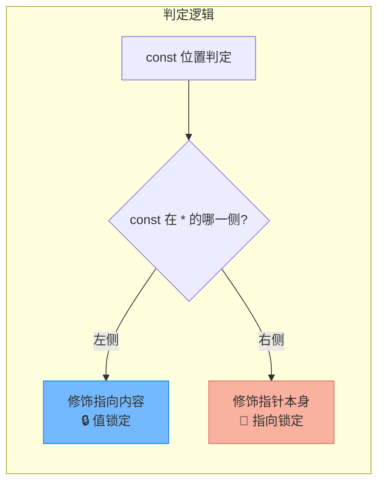
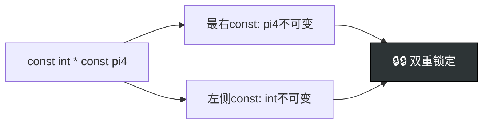

# 常量指针与指针常量深度解析

> [!abstract] 核心导言
> `const` 修饰指针是 C++ 类型安全的灵魂所在，也是初学者最容易混淆的语法难点。区分“常量指针”与“指针常量”的关键在于 `const` 与 `*` 的相对位置。本节将揭示“左定值，右定向”的黄金法则，助你彻底锁定指针的权限边界。

---

## 一、核心法则：`const` 的位置博弈

在指针声明中，`const` 出现的位置决定了它修饰的目标。
- **`const` 在 `*` 左侧**：修饰指向的内容，**值不可变**。
- **`const` 在 `*` 右侧**：修饰指针变量本身，**指向不可变**。



---

## 二、指向常量的指针

### 1. 语法形式
`const` 位于 `*` 左侧，以下两种写法完全等价：
```cpp
const int* pi1 = &i1; // 写法1：const在前（推荐，更直观）
int const* pi2 = &i1; // 写法2：const在后（本质一致）
```

### 2. 核心特性
- **权限受限**：无法通过该指针修改其所指内存的值。
    ```cpp
    // *pi1 = 200; // ❌ 编译错误：只读位置不可写
    ```
- **指向灵活**：指针变量本身是普通的变量，可以改变指向。
    ```cpp
    pi1 = &i2; // ✅ 合法：可以指向另一个地址
    ```

### 3. 应用场景
**函数参数保护**：这是最重要的工程应用。当函数只读数组或大对象时，使用 `const Type*` 参数可防止函数内部意外修改数据。
```cpp
// 设计意图：只打印数组内容，不修改
void printArray(const int* arr, int size) {
    // arr[0] = 10; // ❌ 编译报错，强制保护数据安全
    for(int i=0; i<size; i++) cout << arr[i];
}
```
> [!tip] 替代注释
> `const` 是编译器强制执行的契约，比“// 请不要修改此参数”的注释可靠一万倍。

---

## 三、指针常量

### 1. 语法形式
`const` 位于 `*` 右侧：
```cpp
int* const pi3 = new int(100);
```

### 2. 核心特性
- **指向锁定**：指针一旦初始化，终身绑定该地址，不可更改。
    ```cpp
    // pi3 = new int; // ❌ 编译错误：指针本身是常量
    ```
- **值可修改**：虽然方向锁死，但目标内存是可读写的。
    ```cpp
    *pi3 = 200; // ✅ 合法：修改所指内存的值
    ```

### 3. 内存管理陷阱
若指针常量指向堆内存，必须保证在指针生命周期结束前释放内存，因为后续无法再指向该地址。
```cpp
int* const pi3 = new int;
*pi3 = 200;
delete pi3; // ⚠️ 必须手动释放
// pi3 = nullptr; // ❌ 错误：指针常量不可重新赋值
```
> [!warning] 置空的两难
> 对于指向堆内存的指针常量，`delete` 后通常无法置空（`pi3 = nullptr` 会报错）。这要求设计者必须严格控制指针的生命周期，防止出现悬垂指针被误用。

---

## 四、指向常量的指针常量

### 1. 语法形式
`const` 同时出现在 `*` 两侧，形成双重锁定：
```cpp
const int* const pi4 = &i1;
```

### 2. 核心特性
这是权限最小的指针，兼具前两者的限制：
- **❌ 值不可改**：`*pi4 = 300` 报错。[1](@context-ref?id=1)
- **❌ 指向不可改**：`pi4 = &i2` 报错。

### 3. 阅读技巧：右左法则
如何快速阅读复杂的声明？从变量名开始，先右后左读：
- `int* const pi3`：`pi3` 是一个 `const` 指针，指向 `int`。[1](@context-ref?id=2)[](@image-ref?id=2)
- `const int* const pi4`：`pi4` 是一个 `const` 指针，指向 `const int`。[1](@context-ref?id=3)



---

## 五、权限传导与编译器视角

### 1. 赋值兼容原则
指针的赋值遵循“权限收缩”原则：
- **非const指针** → **const指针**：✅ 安全（权限缩小）。
- **const指针** → **非const指针**：❌ 禁止（权限放大，需 `const_cast` 强转）。

```cpp
int a = 10;
int* p1 = &a;
const int* p2 = p1; // ✅ 安全：普通指针给const指针

// int* p3 = p2;     // ❌ 错误：const指针不能直接给普通指针
```

### 2. 编译器检查机制
`const` 的保护发生在**编译期**。编译器会检查所有通过该指针的写操作，一旦发现违规立即报错。这没有任何运行时开销，是零成本的抽象。

---

## 六、知识全景小结

| 知识点 | 语法形式 | 核心特性 | 记忆口诀 | 难度 |
| :--- | :--- | :--- | :--- | :--- |
| **指向常量的指针** [1](@context-ref?id=4)| `const int* p`<br>`int const* p` | ❌ 值不可改<br/>✅ 指向可改 | <span style="color:#2ed573;">**左定值**</span>（const在*左修饰值） | ⭐⭐ |
| **指针常量** [1](@context-ref?id=5)| `int* const p` | ✅ 值可改<br/>❌ 指向不可改 | <span style="color:#ff4757;">**右定向**</span>（const在*右修饰指针） | ⭐⭐⭐ |
| **双重限制指针** | `const int* const p` | ❌ 值不可改<br/>❌ 指向不可改 | **双const双锁** [1](@context-ref?id=6)| ⭐⭐⭐⭐ |
| **工程应用** | 函数参数 `const T*` | 防止函数内部误修改外部数据 | **权限最小化原则** | ⭐⭐⭐⭐⭐ |
| **初始化要求** | `int* const p` | 定义时必须初始化 | 类似引用 `&`，一旦绑定终身不换 | ⭐⭐⭐ |

> [!quote] 黄金法则总结
> 只要记住 **“左定值，右定向”** 这六字真言，面对任何复杂的 `const` 指针声明都能瞬间破局。[1](@context-ref?id=7)
> - 看 `*` 左边：限制的是 `*p`（内容）。
> - 看 `*` 右边：限制的是 `p`（指针本身）。
